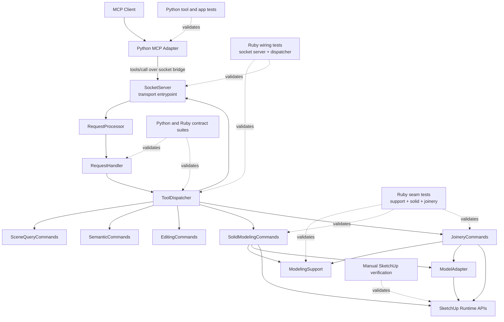

# Technical Plan: PLAT-11 Decompose Remaining Ruby Modeling Command Hotspot
**Task ID**: `PLAT-11`
**Title**: `Decompose Remaining Ruby Modeling Command Hotspot`
**Status**: `finalized`
**Date**: `2026-04-16`

## Source Task

- [Decompose Remaining Ruby Modeling Command Hotspot](./task.md)

## Problem Summary

`PLAT-08` removed the simpler edit/export/material ownership from [src/su_mcp/socket_server.rb](src/su_mcp/socket_server.rb), but the remaining advanced modeling hotspot is still concentrated there. The transport entrypoint still directly owns boolean operations, edge treatment, and joinery flows along with their low-level helpers. That leaves the current Ruby runtime structurally inconsistent with the platform HLD and creates poor reuse conditions for both the current bridge path and the Ruby-native runtime work happening in parallel under `PLAT-09`.

## Goals

- Extract the remaining advanced modeling ownership out of [src/su_mcp/socket_server.rb](src/su_mcp/socket_server.rb) into reusable Ruby command seams.
- Preserve the current public Python tool names and bridge-facing request or response behavior for the affected modeling flows.
- Add at least one real shared support seam so the extraction materially narrows responsibility instead of relocating one hotspot into another file.
- Keep the extracted Ruby seams usable from both the current socket-bridge path and the future Ruby-native runtime path without absorbing `PLAT-09` scope.

## Non-Goals

- Introduce new modeling or joinery capabilities.
- Change Python MCP tool names, request argument shapes, or bridge contract semantics.
- Take ownership of packaging, vendoring, loader, facade, bootstrap, or Ruby-native MCP registration work reserved for `PLAT-09` and `PLAT-10`.
- Extract `eval_ruby` as part of this task.
- Turn the modeling hotspot into per-operation class sprawl or a speculative framework.

## Related Context

- [PLAT-11 Task](./task.md)
- [Platform Architecture and Repo Structure](specifications/hlds/hld-platform-architecture-and-repo-structure.md)
- [Platform Tasks README](specifications/tasks/platform/README.md)
- [PLAT-01 Technical Plan](specifications/tasks/platform/PLAT-01-decompose-ruby-runtime-boundaries/plan.md)
- [PLAT-02 Technical Plan](specifications/tasks/platform/PLAT-02-extract-ruby-sketchup-adapters-and-serializers/plan.md)
- [PLAT-05 Technical Plan](specifications/tasks/platform/PLAT-05-add-python-ruby-contract-coverage/plan.md)
- [PLAT-08 Technical Plan](specifications/tasks/platform/PLAT-08-align-ruby-runtime-with-coding-guidelines/plan.md)
- [PLAT-09 Task](specifications/tasks/platform/PLAT-09-build-ruby-native-mcp-packaging-and-runtime-foundations/task.md)
- Current hotspot and runtime seams:
  - [src/su_mcp/socket_server.rb](src/su_mcp/socket_server.rb)
  - [src/su_mcp/tool_dispatcher.rb](src/su_mcp/tool_dispatcher.rb)
  - [src/su_mcp/editing_commands.rb](src/su_mcp/editing_commands.rb)
  - [src/su_mcp/adapters/model_adapter.rb](src/su_mcp/adapters/model_adapter.rb)
- Current Python modeling tool surface:
  - [python/src/sketchup_mcp_server/tools/modeling.py](python/src/sketchup_mcp_server/tools/modeling.py)
- Current regression surfaces:
  - [test/socket_server_test.rb](test/socket_server_test.rb)
  - [test/socket_server_adapter_test.rb](test/socket_server_adapter_test.rb)
  - [test/tool_dispatcher_test.rb](test/tool_dispatcher_test.rb)
  - [python/tests/test_tools.py](python/tests/test_tools.py)
  - [python/tests/test_app.py](python/tests/test_app.py)

## Research Summary

- `PLAT-01`, `PLAT-02`, `PLAT-05`, and `PLAT-08` are already implemented and define the baseline planning style: grouped concern-oriented owners, minimal dispatcher churn, explicit seam tests, and separate contract validation when boundary-owned behavior is touched.
- The remaining modeling tools are still part of the active Python MCP surface today, so `PLAT-11` is bridge-sensitive cleanup rather than purely internal refactoring.
- The current `ToolDispatcher` mappings for `boolean_operation`, `chamfer_edges`, `fillet_edges`, `create_mortise_tenon`, `create_dovetail`, and `create_finger_joint` still point to methods on `SocketServer`.
- The fake SketchUp test harness is strong enough for seam-level wiring, helper, and parameter-flow tests, but not obviously strong enough to prove full geometry correctness for boolean, fillet, chamfer, and joinery behavior without explicit manual host verification.
- A conservative grouped-owner-only extraction would likely recreate the hotspot in another file. A per-operation class split would create unnecessary abstraction churn. The best fit is two public grouped owners plus one real shared support seam.
- `PLAT-09` is already in flight. `PLAT-11` should produce reusable Ruby command seams that `PLAT-09` and later `PLAT-10` can consume, but it must not own runtime-foundation work.

## Technical Decisions

### Data Model

- Preserve the current bridge-visible data model:
  - tool arguments remain plain Ruby hashes
  - results remain JSON-serializable hashes, arrays, strings, numbers, booleans, and `nil`
- Do not introduce a new request object model or public response envelope model for this task.
- Preserve current public field names for success and error behavior unless a compatibility-preserving cleanup falls out naturally.

### API and Interface Design

- Keep [src/su_mcp/socket_server.rb](src/su_mcp/socket_server.rb) as the current runtime entrypoint, but reduce it further toward lifecycle, IO, and command-surface construction.
- Add two public grouped command owners:
  - `SU_MCP::SolidModelingCommands`
  - `SU_MCP::JoineryCommands`
- Add one shared support seam:
  - `SU_MCP::ModelingSupport`
- `SolidModelingCommands` should own:
  - `boolean_operation`
  - `chamfer_edges`
  - `fillet_edges`
  - boolean-specific helpers such as `perform_union`, `perform_difference`, and `perform_intersection`
- `JoineryCommands` should own:
  - `create_mortise_tenon`
  - `create_dovetail`
  - `create_finger_joint`
  - joinery-local helpers such as face selection, position calculation, mortise or tenon creation, dovetail geometry, and finger-slot creation
- `ModelingSupport` should own only truly shared low-level mechanics, such as:
  - group-or-component checks
  - instance-entity resolution
  - edge-index extraction and filtering
  - shared copy or temp-group helpers used by solid-modeling flows
- Keep entity lookup wording owner-local where that is needed to preserve specific public error messages such as `"Entity not found: target, tool"` or `"Entity not found: mortise board"`.
- Keep `ToolDispatcher` structure unchanged. Rewire `SocketServer#tool_dispatcher` to include the new command targets rather than redesigning dispatch.
- Keep `eval_ruby` on `SocketServer` and out of scope.

### Error Handling

- Preserve current public failure behavior for:
  - invalid boolean operation names
  - missing entity IDs
  - wrong entity types for boolean, edge-treatment, and joinery operations
- Do not introduce a new exception taxonomy.
- Keep public error messages stable where existing tests or callers might depend on them.
- Preserve existing cleanup behavior on operation failure, including result-group cleanup in edge-treatment flows where that behavior currently exists.
- Keep bridge-level error-envelope shaping in the existing request and response path rather than inside the new command owners.

### State Management

- Keep `SolidModelingCommands`, `JoineryCommands`, and `ModelingSupport` lightweight and effectively stateless across calls.
- Prefer explicit dependency injection similar to [src/su_mcp/editing_commands.rb](src/su_mcp/editing_commands.rb):
  - `model_adapter:`
  - `logger:`
  - `active_model_provider:`
  - `support:` where needed
- Do not introduce registries, caches, or lifecycle-heavy containers.

### Integration Points

- The current Python MCP adapter remains the public caller for these tools through [python/src/sketchup_mcp_server/tools/modeling.py](python/src/sketchup_mcp_server/tools/modeling.py).
- The current Ruby dispatch chain remains:
  - [src/su_mcp/request_processor.rb](src/su_mcp/request_processor.rb)
  - [src/su_mcp/request_handler.rb](src/su_mcp/request_handler.rb)
  - [src/su_mcp/tool_dispatcher.rb](src/su_mcp/tool_dispatcher.rb)
  - extracted modeling command owners
- The new command owners must also be reusable from future Ruby-native runtime consumers without assuming `SocketServer` ownership or socket-specific behavior.
- This task should not change:
  - [src/su_mcp.rb](src/su_mcp.rb)
  - [src/su_mcp/main.rb](src/su_mcp/main.rb)
  - [src/su_mcp/extension.rb](src/su_mcp/extension.rb)
  - [src/su_mcp/extension.json](src/su_mcp/extension.json)
  unless packaging-safe requires or support-tree wiring need minimal updates for newly added files.

### Configuration

- Reuse existing runtime and bridge configuration.
- Do not introduce new environment variables or config files.
- Reuse current validation entrypoints:
  - `bundle exec rake ruby:test`
  - `bundle exec rake ruby:contract`
  - `bundle exec rake ruby:lint`
  - `bundle exec rake python:test`
  - `bundle exec rake python:contract`
  - `bundle exec rake package:verify`
- Shared contract artifacts should not change unless the public boundary intentionally changes. Contract suites still run as regression validation because this task rewires boundary-owned command targets.

## Architecture Context

## Key Relationships

- `SocketServer` remains the transport and runtime entrypoint, but it should stop being the default owner of advanced modeling behavior.
- `ToolDispatcher` remains the stable public tool-name router; the task changes command-target ownership, not dispatch design.
- `SolidModelingCommands` and `JoineryCommands` are Ruby-owned capability seams that should be consumable from both current bridge dispatch and future Ruby-native runtime callers.
- `ModelingSupport` is intentionally narrow. It must own only shared low-level mechanics that genuinely reduce duplication across the two grouped owners.
- Python remains a thin public tool-registration and invocation layer. No business logic should move into Python.
- Manual SketchUp verification remains necessary because local fakes cannot prove all live geometry and host-operation behavior.

## Acceptance Criteria

- `SocketServer` no longer directly owns `boolean_operation`, `chamfer_edges`, `fillet_edges`, `create_mortise_tenon`, `create_dovetail`, or `create_finger_joint`.
- The extracted Ruby modeling ownership is split into two concern-oriented public command seams plus one shared low-level support seam rather than one replacement hotspot.
- `ToolDispatcher` continues to resolve the same public tool names for the affected modeling flows without changing Python MCP registration or bridge request shapes.
- Public success and failure behavior for representative boolean, edge-treatment, and joinery flows remains behaviorally compatible unless an intentional contract change is separately scoped.
- The extracted seams are reviewable and testable independently of `SocketServer` lifecycle code.
- Contract regression suites continue to pass without requiring shared contract artifact changes unless a public boundary change is explicitly made.
- Packaging and extension loader behavior remains valid after any new Ruby support files are added.
- Remaining runtime-only verification gaps are explicit, not implied.

## Test Strategy

### TDD Approach

- Add seam tests for `ModelingSupport` first so the shared low-level helpers are defined before grouped-owner rewiring begins.
- Extract `SolidModelingCommands` next with failing seam tests and keep the current socket-server and dispatcher tests as regression guards while rewiring.
- Extract `JoineryCommands` after the solid-modeling extraction pattern is proven and guarded.
- Run contract suites as regression checks because this task changes boundary-owned command routing, even though the public bridge contract should remain stable.
- Treat manual SketchUp-hosted verification as an exit condition for implementation completion, not as an optional postscript, because the local harness cannot prove full geometry correctness for the extracted flows.

### Required Test Coverage

- New Ruby seam tests for `ModelingSupport` covering:
  - group-or-component checks
  - instance-entity resolution
  - edge-index extraction and filtering
  - shared temp-group or copy mechanics where deterministic
- New Ruby seam tests for `SolidModelingCommands` covering:
  - invalid boolean operation rejection
  - missing target or tool entity handling
  - wrong entity type rejection
  - representative boolean flow wiring through shared helpers
  - representative edge-treatment flow wiring, selected-edge handling, and cleanup behavior on failure where deterministic
- New Ruby seam tests for `JoineryCommands` covering:
  - missing entity handling
  - wrong entity type rejection
  - face-direction selection
  - representative mortise-tenon, dovetail, and finger-joint parameter flow and result shaping
- Existing Ruby regression coverage:
  - [test/socket_server_test.rb](test/socket_server_test.rb)
  - [test/socket_server_adapter_test.rb](test/socket_server_adapter_test.rb)
  - [test/tool_dispatcher_test.rb](test/tool_dispatcher_test.rb)
- Existing Python regression coverage:
  - [python/tests/test_tools.py](python/tests/test_tools.py)
  - [python/tests/test_app.py](python/tests/test_app.py)
- Contract validation:
  - `bundle exec rake ruby:contract`
  - `bundle exec rake python:contract`
- Quality gates:
  - `bundle exec rake ruby:test`
  - `bundle exec rake ruby:lint`
  - `bundle exec rake python:test`
  - `bundle exec rake package:verify`
- Manual SketchUp verification:
  - one boolean operation on overlapping groups or component instances
  - one chamfer or fillet flow with explicit selected edges
  - one mortise-tenon flow
  - one dovetail or finger-joint flow
  - one representative failure path for missing entity or invalid entity type

## Instrumentation and Operational Signals

- No new platform-wide instrumentation is required for this task.
- Preserve and reuse existing runtime logging hooks so extracted command owners can still emit useful operation-level messages through the current logger.
- Treat the following as required operational signals during implementation:
  - seam tests proving extracted owners are called instead of `SocketServer`
  - contract suites remaining green without shared artifact changes
  - explicit manual verification notes for every geometry-sensitive flow that remains under host-only confidence

## Implementation Phases

1. Add `ModelingSupport` with failing seam tests, then move the genuinely shared low-level helpers out of `SocketServer`.
2. Add `SolidModelingCommands` with failing seam tests, rewire `SocketServer` and `ToolDispatcher`, and remove the moved solid-modeling methods from `SocketServer`.
3. Add `JoineryCommands` with failing seam tests, rewire `SocketServer` and `ToolDispatcher`, and remove the moved joinery methods from `SocketServer`.
4. Run full Ruby, Python, contract, lint, and packaging validation, then perform and document the required manual SketchUp-hosted checks.

## Rollout Approach

- Treat the extraction as internal ownership cleanup with stable public behavior.
- Land the work in the phased order above so each slice can be validated and reverted independently if needed.
- Avoid cross-task coupling with `PLAT-09` by keeping the new modeling seams plain Ruby command objects that can later be reused without changing runtime-foundation code in this task.
- Coordinate actively with `PLAT-09` before merge if that task touches [src/su_mcp/socket_server.rb](src/su_mcp/socket_server.rb), [src/su_mcp/tool_dispatcher.rb](src/su_mcp/tool_dispatcher.rb), or packaging-sensitive support-tree wiring so the modeling extraction does not reintroduce runtime-foundation churn.
- Do not update shared contract artifacts unless a public bridge change is intentional and validated.

## Risks and Controls

- **Recreating the hotspot in a new file**: force one shared support seam and keep grouped owners concern-oriented; reject helper moves that do not clarify ownership.
- **Breaking public behavior while assuming the change is “internal”**: run Python, Ruby, and contract regression suites even when shared artifacts stay unchanged.
- **Over-extracting into per-operation abstraction churn**: keep only two public grouped owners and one shared support seam in scope.
- **Weak confidence in geometry correctness from local fakes**: require explicit manual SketchUp verification for representative boolean, edge-treatment, and joinery flows.
- **Scope bleed into `PLAT-09` runtime-foundation work**: keep packaging, vendoring, loader, facade, bootstrap, and Ruby-native tool registration out of scope.
- **Losing context-specific error wording**: keep entity-lookup wording in the owner classes when shared support would flatten meaningful public error context.
- **Parallel-change conflict with `PLAT-09`**: coordinate merge order and rebase strategy if both tasks touch `SocketServer`, dispatcher wiring, or support-tree requires.
- **False confidence from ownership-only cleanup**: treat the task as structurally successful only when the extracted seams pass automated regression gates and explicit manual SketchUp verification, not when files merely become smaller.

## Dependencies

- Implemented runtime seams from [PLAT-01](specifications/tasks/platform/PLAT-01-decompose-ruby-runtime-boundaries/task.md)
- Implemented adapter extraction from [PLAT-02](specifications/tasks/platform/PLAT-02-extract-ruby-sketchup-adapters-and-serializers/task.md)
- Implemented contract validation foundations from [PLAT-05](specifications/tasks/platform/PLAT-05-add-python-ruby-contract-coverage/task.md)
- Implemented first-pass Ruby hotspot extraction from [PLAT-08](specifications/tasks/platform/PLAT-08-align-ruby-runtime-with-coding-guidelines/task.md)
- In-flight Ruby-native foundation work in [PLAT-09](specifications/tasks/platform/PLAT-09-build-ruby-native-mcp-packaging-and-runtime-foundations/task.md)
- Platform ownership rules in [specifications/hlds/hld-platform-architecture-and-repo-structure.md](specifications/hlds/hld-platform-architecture-and-repo-structure.md)
- Existing runtime entrypoints and packaging validation in:
  - [src/su_mcp.rb](src/su_mcp.rb)
  - [src/su_mcp/main.rb](src/su_mcp/main.rb)
  - [src/su_mcp/extension.rb](src/su_mcp/extension.rb)
  - [src/su_mcp/extension.json](src/su_mcp/extension.json)
  - [Rakefile](Rakefile)
  - [rakelib/ruby.rake](rakelib/ruby.rake)
  - [rakelib/python.rake](rakelib/python.rake)
- A live SketchUp runtime for final host verification

## Premortem

### Intended Goal Under Test

Reduce the remaining advanced modeling hotspot in `SocketServer` enough that Ruby modeling ownership is materially clearer, reusable in future runtime work, and still behaviorally stable for current MCP clients.

### Failure Paths and Mitigations

- **Base assumptions that could lead us astray**
  - Business-plan mismatch: the task needs material ownership reduction, but the implementation only optimizes for moving lines out of `SocketServer`
  - Root-cause failure path: we extract methods into one or two files without creating a real shared support seam or clearer concern boundaries
  - Why this misses the goal: the new files become replacement hotspots and the repo gains churn without better maintainability
  - Likely cognitive bias: line-count bias and refactor-completion bias
  - Classification: Validate before implementation
  - Mitigation now: require exactly two public grouped owners plus one shared low-level support seam, and reject helper moves that do not clarify reasons to change
  - Required validation: seam-level review against the acceptance criteria plus targeted tests for the new public owners and support seam
- **Shortcuts that could weaken the outcome**
  - Business-plan mismatch: the task needs real confidence in stable public behavior, but the implementation optimizes for fast Ruby-only refactoring
  - Root-cause failure path: we skip Python and contract regression validation because the contract was “not supposed to change”
  - Why this misses the goal: routing or result-shape regressions could escape even if Ruby seam tests pass
  - Likely cognitive bias: locality bias and internal-change fallacy
  - Classification: Validate before implementation
  - Mitigation now: make `python:test`, `ruby:contract`, and `python:contract` required validation, not optional follow-up checks
  - Required validation: green Python and contract suites with no shared artifact changes unless a public boundary change is intentional
- **Areas that could be weakly implemented**
  - Business-plan mismatch: the task needs reusable Ruby seams, but the implementation could still bind them to `SocketServer` assumptions
  - Root-cause failure path: new command owners rely on `SocketServer`-specific state or logging conventions that future Ruby-native callers cannot reuse cleanly
  - Why this misses the goal: `PLAT-10` would still need cleanup or duplication rather than reusing the extracted seams
  - Likely cognitive bias: present-path anchoring
  - Classification: Validate before implementation
  - Mitigation now: require plain injected collaborators and prohibit socket-specific behavior inside the new command owners
  - Required validation: constructor and usage review plus tests that instantiate the owners independently of `SocketServer`
- **Tests and evaluations needed to stay on track**
  - Business-plan mismatch: the task needs confidence in geometry-sensitive behavior, but the implementation could over-trust local fakes
  - Root-cause failure path: boolean, chamfer, fillet, or joinery regressions slip through because the local harness cannot prove live SketchUp behavior
  - Why this misses the goal: the cleanup ships with structural improvements but breaks the actual host runtime experience
  - Likely cognitive bias: automation overconfidence
  - Classification: Requires implementation-time instrumentation or acceptance testing
  - Mitigation now: make manual SketchUp verification part of the required validation and specify the exact representative flows to exercise
  - Required validation: explicit host-side check results for the listed modeling flows and one representative failure path
- **What must be true for the task to succeed**
  - Business-plan mismatch: the task needs bounded aggressive cleanup, but success depends on not absorbing adjacent platform work
  - Root-cause failure path: `PLAT-11` starts solving `PLAT-09` runtime-foundation problems or broad `SocketServer` debt unrelated to modeling
  - Why this misses the goal: the work becomes slower, less reviewable, and harder to sequence with the already in-flight platform path
  - Likely cognitive bias: scope-creep rationalization
  - Classification: Validate before implementation
  - Mitigation now: keep packaging, loader, facade, bootstrap, and Ruby-native registration explicitly out of scope and preserve current public tool ownership lines
  - Required validation: change review against the non-goals and touched-file scope
- **Second-order and third-order effects**
  - Business-plan mismatch: the task needs to improve future maintainability, but the implementation could silently harden today’s imperfect modeling behavior as an implied contract
  - Root-cause failure path: the plan treats all current internal quirks as untouchable because behavior stability is over-applied
  - Why this misses the goal: future platform work inherits accidental complexity and avoids fixing obvious ownership problems
  - Likely cognitive bias: status-quo bias
  - Classification: Validate before implementation
  - Mitigation now: preserve public behavior, but allow compatibility-preserving internal cleanup and support extraction where that materially narrows responsibility
  - Required validation: review of changed helper ownership and public regression coverage rather than file-preservation thinking

## Quality Checks

- [x] All required inputs validated
- [x] Problem statement documented
- [x] Goals and non-goals documented
- [x] Research summary documented
- [x] Technical decisions included
- [x] Architecture context included
- [x] Acceptance criteria included
- [x] Test requirements specified
- [x] Instrumentation and operational signals defined when needed
- [x] Risks and dependencies documented
- [x] Rollout approach documented when needed
- [x] Small reversible phases defined
- [x] Premortem completed with falsifiable failure paths and mitigations
