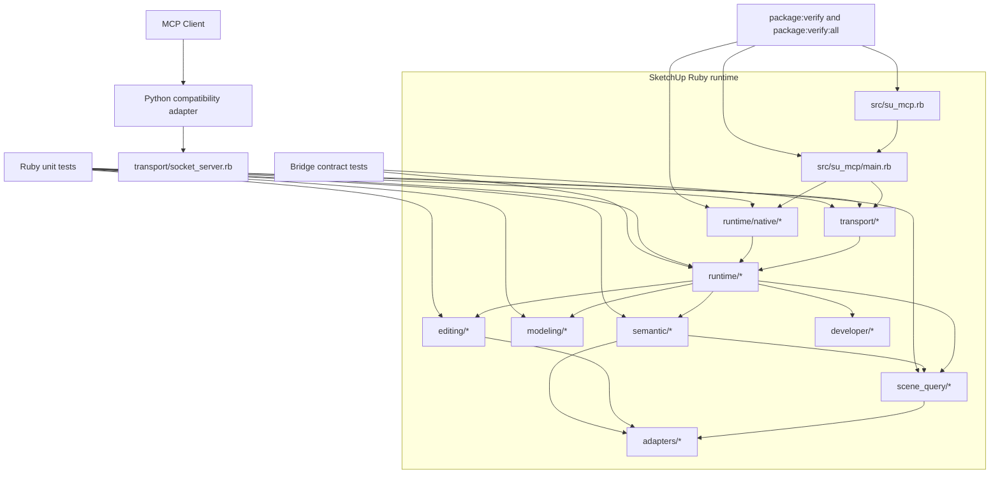

# Technical Plan: PLAT-12 Organize Ruby Support Tree Around Runtime Layers
**Task ID**: `PLAT-12`
**Title**: `Organize Ruby Support Tree Around Runtime Layers`
**Status**: `finalized`
**Date**: `2026-04-16`

## Source Task

- [Organize Ruby Support Tree Around Runtime Layers](./task.md)

## Problem Summary

The Ruby runtime now has clearer ownership seams after [PLAT-08](specifications/tasks/platform/PLAT-08-align-ruby-runtime-with-coding-guidelines/task.md), [PLAT-09](specifications/tasks/platform/PLAT-09-build-ruby-native-mcp-packaging-and-runtime-foundations/task.md), [PLAT-10](specifications/tasks/platform/PLAT-10-migrate-current-tool-surface-to-ruby-native-mcp-and-retire-spike/task.md), and [PLAT-11](specifications/tasks/platform/PLAT-11-decompose-remaining-ruby-modeling-command-hotspot/task.md), but most Ruby support files still sit as top-level peers under [src/su_mcp](src/su_mcp). That flat shape under-expresses the HLD runtime layers, makes ownership harder to scan, and encourages unrelated files to keep landing in the top-level namespace.

## Goals

- Express the current Ruby runtime boundaries in the support-tree layout without changing public behavior.
- Shrink the top-level `src/su_mcp/` surface so it primarily reflects boot, metadata, and intentionally root-level runtime entrypoints.
- Group cohesive capability files and runtime files into explicit subtrees that match current ownership seams.
- Preserve SketchUp loader behavior, RBZ packaging shape, and current Ruby-native MCP and socket-bridge behavior.

## Non-Goals

- Migrating or redesigning the current public MCP tool surface.
- Changing tool names, bridge contracts, response shapes, or Python adapter behavior beyond mechanical path alignment.
- Reopening the Ruby-native MCP adoption decisions already settled by `PLAT-09` and `PLAT-10`.
- Performing unrelated command refactors beyond file and folder moves needed to express the existing structure.

## Related Context

- [Platform Architecture and Repo Structure](specifications/hlds/hld-platform-architecture-and-repo-structure.md)
- [Platform task set](specifications/tasks/platform/README.md)
- [PLAT-08 Align Ruby Runtime With Coding Guidelines](specifications/tasks/platform/PLAT-08-align-ruby-runtime-with-coding-guidelines/task.md)
- [PLAT-09 Build Ruby-Native MCP Packaging And Runtime Foundations](specifications/tasks/platform/PLAT-09-build-ruby-native-mcp-packaging-and-runtime-foundations/task.md)
- [PLAT-10 Migrate Current Tool Surface To Ruby-Native MCP And Retire Spike](specifications/tasks/platform/PLAT-10-migrate-current-tool-surface-to-ruby-native-mcp-and-retire-spike/task.md)
- [PLAT-11 Decompose Remaining Ruby Modeling Command Hotspot](specifications/tasks/platform/PLAT-11-decompose-remaining-ruby-modeling-command-hotspot/task.md)
- [src/su_mcp/main.rb](src/su_mcp/main.rb)
- [src/su_mcp/socket_server.rb](src/su_mcp/socket_server.rb)
- [src/su_mcp/runtime_command_factory.rb](src/su_mcp/runtime_command_factory.rb)

## Research Summary

- The HLD defines Ruby boundaries for boot/registration, runtime bootstrap, transport and request routing, command or use-case execution, shared runtime infrastructure, and SketchUp adapters. It does not mandate a fixed directory count or shallow layout.
- `PLAT-12` is explicitly a post-migration structure task, not a migration task. The implementation should express the current ownership model in the filesystem rather than reopen runtime-boundary decisions.
- Packaging and loader constraints are real. [src/su_mcp.rb](src/su_mcp.rb) must remain the root registration file, [src/su_mcp/main.rb](src/su_mcp/main.rb) remains the SketchUp bootstrap entrypoint, and [rakelib/package.rake](rakelib/package.rake) still verifies the RBZ archive shape as `su_mcp.rb` plus `su_mcp/`.
- The current repo already contains cohesive file clusters that justify dedicated subtrees:
  - scene-query files around [scene_query_commands.rb](src/su_mcp/scene_query_commands.rb)
  - editing files around [editing_commands.rb](src/su_mcp/editing_commands.rb)
  - modeling files around [solid_modeling_commands.rb](src/su_mcp/solid_modeling_commands.rb) and [joinery_commands.rb](src/su_mcp/joinery_commands.rb)
  - native runtime files around [mcp_runtime_loader.rb](src/su_mcp/mcp_runtime_loader.rb)
- A generic `support/` folder would likely recreate the same default-home pressure this task is meant to reduce.

## Technical Decisions

### Data Model

- No public data model changes are planned.
- The primary artifact change is filesystem ownership:
  - root-level files remain only where they are entrypoints or package metadata
  - transport files move under `transport/`
  - shared runtime wiring moves under `runtime/`
  - Ruby-native MCP runtime files move under `runtime/native/`
  - capability-owned files move under dedicated capability subtrees
- Ruby constants and public command names remain unchanged. Only file paths and `require_relative` relationships change.
- Root-retention rule:
  - keep a file at `src/su_mcp/` only if it is part of bootstrap, extension metadata support, or version metadata
  - otherwise move it into an explicit runtime-layer or capability-owned subtree

### API and Interface Design

- `src/su_mcp.rb` remains the SketchUp registration entrypoint and still loads `su_mcp/main`.
- `src/su_mcp/main.rb` remains the Ruby bootstrap entrypoint and keeps its current public role.
- The socket bridge interface, Ruby-native MCP tool catalog, and command method names stay unchanged.
- Internal interfaces continue to use `require_relative`; the work is mechanical path rewiring rather than new loading abstractions.

### Error Handling

- No new runtime error behavior is introduced intentionally.
- The main implementation risk is load-time failure from missed file moves or stale `require_relative` paths.
- Detection relies on focused Ruby tests, contract tests, and package verification rather than new error-mapping logic.
- If a move causes a runtime or package failure, the implementation phases are small enough to revert or correct the affected slice without backing out the whole reorganization.

### State Management

- No persistent state ownership changes are planned.
- Runtime state remains where it is today:
  - bootstrap lifecycle in `Main`
  - socket lifecycle in `SocketServer`
  - native runtime lifecycle in `McpRuntimeServer`
  - command wiring in `RuntimeCommandFactory`
- The filesystem moves must not change these state boundaries.

### Integration Points

- SketchUp boot integration:
  - `src/su_mcp.rb` -> `src/su_mcp/main.rb`
- Bridge runtime integration:
  - `Main` -> `transport/bridge.rb` and `transport/socket_server.rb`
  - `SocketServer` -> transport request helpers -> `runtime/runtime_command_factory.rb` -> capability command targets
- Native runtime integration:
  - `Main` -> `runtime/native/*`
  - `McpRuntimeFacade` -> `runtime/runtime_command_factory.rb` and `runtime/tool_dispatcher.rb`
- Semantic integration:
  - `semantic/target_resolver.rb` and `semantic/serializer.rb` continue to depend on scene-query serialization/query helpers after those files move into `scene_query/`
- Packaging integration:
  - `package:verify` and `package:verify:all` must continue to produce a valid RBZ layout with the new internal tree

### Configuration

- Existing environment-driven configuration remains unchanged:
  - bridge host/port in `Bridge`
  - native runtime configuration in `McpRuntimeConfig`
- No new configuration inputs are introduced.

### Target Support-Tree Layout

- Root:
  - `main.rb`
  - `extension.rb`
  - `extension.json`
  - `version.rb`
- `transport/`
  - `bridge.rb`
  - `socket_server.rb`
  - `request_handler.rb`
  - `request_processor.rb`
  - `response_helpers.rb`
- `runtime/`
  - `runtime_command_factory.rb`
  - `tool_dispatcher.rb`
  - `runtime_logger.rb`
- `runtime/native/`
  - `mcp_runtime_config.rb`
  - `mcp_runtime_facade.rb`
  - `mcp_runtime_http_backend.rb`
  - `mcp_runtime_loader.rb`
  - `mcp_runtime_server.rb`
- `scene_query/`
  - `scene_query_commands.rb`
  - `scene_query_serializer.rb`
  - `sample_surface_query.rb`
  - `sample_surface_support.rb`
  - `targeting_query.rb`
- `editing/`
  - `editing_commands.rb`
  - `component_geometry_builder.rb`
  - `material_resolver.rb`
- `modeling/`
  - `solid_modeling_commands.rb`
  - `joinery_commands.rb`
  - `modeling_support.rb`
- `developer/`
  - `developer_commands.rb`
- `semantic/`
  - existing semantic files
  - `semantic_commands.rb`
- `adapters/`
  - unchanged

## Architecture Context

## Key Relationships

- The root loader and `Main` bootstrap remain the stable entrypoints; this task only changes internal support-tree ownership beneath them.
- `transport/socket_server.rb` and `runtime/native/mcp_runtime_facade.rb` continue sharing command wiring through `runtime/runtime_command_factory.rb` and `runtime/tool_dispatcher.rb`.
- `semantic/` remains a capability subtree but still depends on scene-query serialization and targeting helpers, so those files must move as a cohesive `scene_query/` slice.
- `editing/`, `modeling/`, `developer/`, and `scene_query/` are capability-owned directories, while `transport/` and `runtime/` remain platform-owned layer directories.
- Packaging and staged native-runtime validation remain cross-cutting controls and must still work after all file moves.

## Acceptance Criteria

- The top-level `src/su_mcp/` tree is reduced so that most transport, runtime, and capability files no longer live as unrelated peers at the root.
- The resulting support tree makes these ownership areas immediately visible during review: transport, shared runtime wiring, native runtime, scene query, editing, modeling, developer commands, semantic behavior, and adapters.
- `src/su_mcp.rb` remains a registration entrypoint and `src/su_mcp/main.rb` remains the SketchUp bootstrap entrypoint after the reorganization.
- The Ruby socket bridge still starts, routes requests, and builds responses through the same public command names and bridge payload shapes as before.
- The Ruby-native MCP runtime still boots through the same staged runtime path and exposes the same tool catalog and command behavior as before.
- Existing semantic flows that depend on scene-query serialization and target resolution still load and run correctly after scene-query files move into their own subtree.
- RBZ packaging verification still passes with the reorganized support tree, including staged Ruby-native package verification.
- A SketchUp-hosted smoke check confirms the reorganized extension still loads, installs its menu, and reports expected bridge and native-runtime status after packaging or local loading.
- App-owned Ruby tests under `test/` are reorganized to follow the moved `src/su_mcp/` structure where practical, with explicit exceptions for `test/contracts/`, `test/support/`, and packaging/runtime task tests that are not 1:1 mirrors of app files.
- The reorganization is reviewable as structural cleanup: file moves and path rewrites dominate the diff, and any incidental behavior edits are either absent or explicitly justified.

## Test Strategy

### TDD Approach

- Execute the reorganization as move-and-rewire slices rather than one repository-wide rename burst.
- For each slice:
  - move the cohesive files
  - move the matching app-owned test files so the test tree follows the new `src/su_mcp/` structure where practical
  - update `require_relative` call sites
  - update direct test requires
  - run the smallest focused Ruby tests that cover the moved slice before proceeding
- Use the broader suite only after the full tree settles.
- Test-tree alignment rule:
  - when an app file moves into a new subtree, move its direct Ruby test alongside the equivalent subtree under `test/` when that test is an app-owned file-level or slice-level test
  - keep `test/contracts/` and `test/support/` in place unless there is a separate reason to restructure them
  - keep packaging/runtime task tests in place when they are organized around task domains rather than app-file paths

### Required Test Coverage

- Scene-query slice:
  - `test/scene_query_commands_test.rb`
  - `test/scene_query_commands_adapter_test.rb`
  - `test/find_entities_scene_query_commands_test.rb`
  - `test/sample_surface_z_scene_query_commands_test.rb`
  - `test/sample_surface_support_test.rb`
  - semantic tests affected by moved scene-query helpers
- Editing slice:
  - `test/editing_commands_test.rb`
- Modeling slice:
  - `test/modeling_support_test.rb`
  - `test/solid_modeling_commands_test.rb`
  - `test/joinery_commands_test.rb`
- Transport slice:
  - `test/request_handler_test.rb`
  - `test/request_processor_test.rb`
  - `test/response_helpers_test.rb`
  - `test/socket_server_test.rb`
  - `test/socket_server_adapter_test.rb`
  - `test/contracts/bridge_contract_invariants_test.rb`
- Runtime and native-runtime slice:
  - `test/tool_dispatcher_test.rb`
  - `test/runtime_logger_test.rb`
  - `test/mcp_runtime_config_test.rb`
  - `test/mcp_runtime_loader_test.rb`
  - `test/mcp_runtime_http_backend_test.rb`
  - `test/mcp_runtime_facade_test.rb`
  - `test/mcp_runtime_server_test.rb`
  - `test/mcp_runtime_main_integration_test.rb`
  - `test/mcp_runtime_native_contract_test.rb`
- Final validation:
  - `bundle exec rake ruby:test`
  - `bundle exec rake ruby:lint`
  - `bundle exec rake ruby:contract`
  - `bundle exec rake python:contract`
  - `bundle exec rake package:verify:all`
  - SketchUp-hosted smoke verification of extension load, bridge status, and native runtime status

## Instrumentation and Operational Signals

- No new runtime instrumentation is required.
- The main operational signals for this task are validation signals:
  - focused Ruby slice tests stay green after each move
  - bridge contract tests continue to pass
  - native runtime tests continue to pass
  - `package:verify:all` confirms the packaged tree still loads and archives correctly
  - SketchUp-hosted smoke verification confirms the extension still boots from the reorganized support tree

## Implementation Phases

1. Move the capability-owned scene-query, editing, modeling, and developer files into dedicated subtrees, move the matching app-owned tests into mirrored `test/` subtrees where practical, and update the direct requires plus focused tests for those slices.
2. Move `semantic_commands.rb` into `semantic/`, move the matching semantic command tests into the mirrored semantic subtree where practical, and update runtime wiring plus semantic test paths that depend on scene-query and semantic load relationships.
3. Move bridge-facing files into `transport/`, move the matching app-owned transport tests into mirrored transport subtrees where practical, and update socket, contract, and request/response test paths.
4. Move shared runtime wiring into `runtime/` and native runtime files into `runtime/native/`, then move the matching app-owned runtime tests into mirrored runtime subtrees where practical and update bootstrap and native-runtime tests.
5. Run the broad Ruby, contract, and packaging verification suite, then perform a SketchUp-hosted smoke check and fix any remaining path or archive regressions.

## Rollout Approach

- Deliver the change as one bounded structural cleanup task, but implement it in small reversible slices inside the branch.
- Preserve public behavior and avoid mixing unrelated refactors into the same change.
- If a slice introduces widespread require breakage, stop and stabilize that slice before moving more files.

## Risks and Controls

- Missed `require_relative` update causes load failure: move files in cohesive slices, update all direct imports immediately, and run focused tests after each slice.
- Semantic files retain stale references to top-level scene-query paths: explicitly update `semantic/serializer.rb` and `semantic/target_resolver.rb` during the scene-query move.
- Bootstrap or native runtime paths break after moving runtime files: keep `main.rb` stable, update only internal paths, and run native-runtime tests plus `test/mcp_runtime_main_integration_test.rb`.
- RBZ or staged package layout breaks after internal moves: finish with `bundle exec rake package:verify:all`.
- Repo tests pass but SketchUp host loading still breaks due to a missed runtime path assumption: keep the root-entrypoint posture fixed and require a SketchUp-hosted smoke verification before considering the task done.
- Structural cleanup turns into behavioral churn: keep the diff dominated by moves and path rewrites; defer unrelated refactors.
- Existing tests fail due to path-sensitive requires rather than logic regressions: treat those as expected mechanical fallout, but require all updated tests to pass before finalizing.
- The app tree becomes clearer but the Ruby test tree stays flat and drifts away from the new structure: treat test-file moves as part of each slice, and require the final review to compare `src/su_mcp/` subtree moves against the corresponding app-owned `test/` locations.

## Dependencies

- Upstream completed tasks:
  - `PLAT-08`
  - `PLAT-09`
  - `PLAT-10`
  - `PLAT-11`
- Architectural source:
  - [Platform Architecture and Repo Structure](specifications/hlds/hld-platform-architecture-and-repo-structure.md)
- Packaging and validation tooling:
  - [Rakefile](Rakefile)
  - [rakelib/package.rake](rakelib/package.rake)
  - [rakelib/release_support.rb](rakelib/release_support.rb)
- Runtime entrypoints and current seams:
  - [src/su_mcp.rb](src/su_mcp.rb)
  - [src/su_mcp/main.rb](src/su_mcp/main.rb)
  - [src/su_mcp/socket_server.rb](src/su_mcp/socket_server.rb)
  - [src/su_mcp/runtime_command_factory.rb](src/su_mcp/runtime_command_factory.rb)

## Premortem

### Intended Goal Under Test

Make the Ruby support tree materially clearer and more maintainable without breaking loader behavior, package validity, or the current bridge and native-runtime behavior.

### Failure Paths and Mitigations

- **Base assumptions that could lead us astray**
  - Business-plan mismatch: the task needs clearer long-term ownership boundaries, but the plan could still optimize for an aesthetically nicer tree rather than explicit ownership rules.
  - Root-cause failure path: implementers leave ambiguous files at the root or create new vague landing zones because the root-retention rule is not explicit enough.
  - Why this misses the goal: the cleanup ships, but the top-level namespace still behaves like a catch-all and the reviewability benefit is weak.
  - Likely cognitive bias: ambiguity tolerance and local-optimization bias.
  - Classification: `can be validated before implementation`
  - Mitigation now: keep the root-retention rule explicit and require each moved file to map to either a runtime layer or a capability-owned subtree.
  - Required validation: review the final file map against the target tree before implementation starts and again in the final diff review.
- **Shortcuts that could weaken the outcome**
  - Business-plan mismatch: the task needs bounded structural cleanup, but implementation could shortcut by mixing opportunistic refactors into the same change.
  - Root-cause failure path: file moves get bundled with method rewrites or command redesign because the touched files feel convenient to clean up at the same time.
  - Why this misses the goal: reviewers cannot distinguish structural progress from incidental behavior churn, so the task becomes harder to trust and harder to verify.
  - Likely cognitive bias: sunk-cost fallacy and cleanup opportunism.
  - Classification: `can be validated before implementation`
  - Mitigation now: state that file moves and path rewrites must dominate the diff and defer unrelated refactors unless they are required to preserve loading.
  - Required validation: review the final diff for unexpected behavior edits and require explicit justification for any non-mechanical change.
- **Areas that could be weakly implemented**
  - Business-plan mismatch: the task needs the current behavior to stay stable, but the most fragile part of the plan is path rewiring across Ruby, semantic dependencies, and native runtime boot.
  - Root-cause failure path: one or more `require_relative` sites remain stale, especially around `semantic/serializer.rb`, `semantic/target_resolver.rb`, `main.rb`, or runtime/native files.
  - Why this misses the goal: the structure looks correct in the tree, but the runtime no longer loads or boots reliably.
  - Likely cognitive bias: false sense of mechanical safety.
  - Classification: `requires implementation-time instrumentation or acceptance testing`
  - Mitigation now: keep the move order slice-based, update direct imports immediately inside each slice, and preserve `main.rb` as a stable bootstrap file.
  - Required validation: focused slice tests, full Ruby and contract suites, and final packaging verification.
- **Tests and evaluations needed to stay on track**
  - Business-plan mismatch: the task needs proof that the reorganized support tree still works in the real host, but the draft plan could rely too heavily on repo-local tests and archive verification.
  - Root-cause failure path: the repo suite passes while SketchUp host loading still fails because no smoke verification was required.
  - Why this misses the goal: the task appears complete on paper but regresses real extension startup or menu wiring.
  - Likely cognitive bias: test-surface substitution.
  - Classification: `requires implementation-time instrumentation or acceptance testing`
  - Mitigation now: add an explicit SketchUp-hosted smoke verification requirement after package and Ruby validation.
  - Required validation: verify extension load plus bridge/native runtime status in SketchUp after the reorganization.
- **What must be true for the task to succeed**
  - Business-plan mismatch: the task needs the filesystem to express settled ownership, but that only works if the chosen folders correspond to current seams rather than invented abstractions.
  - Root-cause failure path: the tree introduces directories that are not justified by current coupling, forcing implementers to guess ownership later.
  - Why this misses the goal: the tree becomes more nested but not more understandable.
  - Likely cognitive bias: architecture astronautics.
  - Classification: `can be validated before implementation`
  - Mitigation now: keep every proposed subtree tied to an already-cohesive file cluster or HLD runtime layer.
  - Required validation: review each subtree against current file dependencies and reject folders that do not have a clear ownership rationale.
- **Second-order and third-order effects**
  - Business-plan mismatch: the task needs a maintainable structure for future work, but the implementation could stop at moving app files and forget path-sensitive tests, contract references, or package checks.
  - Root-cause failure path: secondary files and validation entrypoints keep pointing at old locations, so future contributors inherit hidden maintenance debt.
  - Why this misses the goal: the cleanup reduces top-level clutter but leaves the repo’s verification surface inconsistent and brittle.
  - Likely cognitive bias: near-field focus.
  - Classification: `can be validated before implementation`
  - Mitigation now: treat direct test requires and app-owned test-file moves as first-class move targets, while keeping contracts/support/package-task tests as explicit exceptions rather than accidental leftovers.
  - Required validation: include test-path rewrites in each slice, review mirrored `src/` and `test/` subtree alignment for app-owned files, and require `bundle exec rake ruby:contract`, `bundle exec rake python:contract`, and `bundle exec rake package:verify:all` before final completion.

## Quality Checks

- [x] All required inputs validated
- [x] Problem statement documented
- [x] Goals and non-goals documented
- [x] Research summary documented
- [x] Technical decisions included
- [x] Architecture context included
- [x] Acceptance criteria included
- [x] Test requirements specified
- [x] Instrumentation and operational signals defined when needed
- [x] Risks and dependencies documented
- [x] Rollout approach documented when needed
- [x] Small reversible phases defined
- [x] Premortem completed with falsifiable failure paths and mitigations
