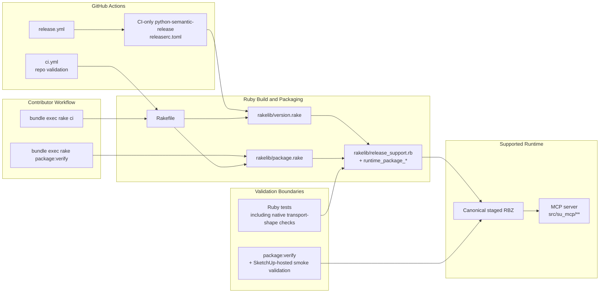

# Technical Plan: PLAT-13 Retire Python Bridge And Remove Compatibility Runtime
**Task ID**: `PLAT-13`
**Title**: `Retire Python Bridge And Remove Compatibility Runtime`
**Status**: `completed`
**Date**: `2026-04-16`

## Source Task

- [Retire Python Bridge And Remove Compatibility Runtime](./task.md)

## Problem Summary

`PLAT-10` made the SketchUp-hosted MCP server the canonical tool host and the supported client set has now been validated against that path. The repository still carries the retired transition architecture in code, packaging, release configuration, CI jobs, bridge contract artifacts, tests, and current-facing docs. `PLAT-13` must remove that compatibility runtime cleanly so contributors, automation, and documentation all converge on one supported runtime.

## Goals

- remove the Python MCP adapter, Python-to-Ruby socket bridge, and repo-owned Python project shape
- keep `python-semantic-release` only as CI-owned release tooling rather than a contributor-facing repo dependency
- collapse packaging and validation onto one canonical staged Ruby-native RBZ path
- rewrite current-facing docs and guidance so they describe only the supported Ruby-native architecture

## Non-Goals

- redoing the runtime migration already completed in `PLAT-10`
- preserving Python as an optional long-term compatibility shim
- broad Ruby runtime redesign unrelated to bridge retirement
- removing, downgrading, or destabilizing the supported native MCP runtime while cleaning up bridge-era scaffolding
- editing completed historical task artifacts solely to erase history

## Related Context

- [Platform Architecture and Repo Structure](specifications/hlds/hld-platform-architecture-and-repo-structure.md)
- [ADR: Prefer Ruby-Native MCP as the Target Runtime Architecture](specifications/adrs/2026-04-16-ruby-native-mcp-target-runtime.md)
- [PLAT-09 Build Ruby-Native MCP Packaging And Runtime Foundations](specifications/tasks/platform/PLAT-09-build-ruby-native-mcp-packaging-and-runtime-foundations/task.md)
- [PLAT-10 Migrate Current Tool Surface To Ruby-Native MCP And Retire Spike](specifications/tasks/platform/PLAT-10-migrate-current-tool-surface-to-ruby-native-mcp-and-retire-spike/task.md)
- [README.md](README.md)
- [AGENTS.md](AGENTS.md)
- current source-of-truth docs
- [src/su_mcp/main.rb](src/su_mcp/main.rb)
- [src/su_mcp.rb](src/su_mcp.rb)
- [src/su_mcp/extension.rb](src/su_mcp/extension.rb)
- [src/su_mcp/bridge.rb](src/su_mcp/bridge.rb)
- [src/su_mcp/socket_server.rb](src/su_mcp/socket_server.rb)
- [src/su_mcp/request_handler.rb](src/su_mcp/request_handler.rb)
- [src/su_mcp/request_processor.rb](src/su_mcp/request_processor.rb)
- [src/su_mcp/response_helpers.rb](src/su_mcp/response_helpers.rb)
- [src/su_mcp/runtime_logger.rb](src/su_mcp/runtime_logger.rb)
- [Rakefile](Rakefile)
- [rakelib/package.rake](rakelib/package.rake)
- [rakelib/release_support.rb](rakelib/release_support.rb)
- [rakelib/version.rake](rakelib/version.rake)
- [.github/workflows/ci.yml](.github/workflows/ci.yml)
- [.github/workflows/release.yml](.github/workflows/release.yml)

## Research Summary

- The repo still operationally depends on the compatibility runtime today: `python/`, `pyproject.toml`, Python rake tasks, Python CI jobs, bridge contract artifacts, and current-facing docs all still treat Python as a live platform surface.
- `PLAT-09` already delivered the staged packaging foundation, so this task should simplify the canonical package path rather than invent a new one.
- `PLAT-10` already made Python compatibility-only; `PLAT-13` is cleanup and normalization work, not another capability migration.
- `python-semantic-release` can run from a standalone TOML or JSON config via `--config`, so CI can retain PSR without preserving `pyproject.toml` or a repo-local Python project.
- The bridge contract artifact should be deleted with the bridge. The small amount of remaining native transport-shape protection should move into ordinary Ruby tests rather than a renamed contract system.

## Technical Decisions

### Data Model

- Version-bearing files after cleanup are limited to:
  - `VERSION`
  - [src/su_mcp/version.rb](src/su_mcp/version.rb)
  - [src/su_mcp/extension.json](src/su_mcp/extension.json)
- Native MCP runtime surfaces remain supported state and are explicitly not cleanup targets except for mechanical bridge-decoupling edits:
  - [src/su_mcp/mcp_runtime_loader.rb](src/su_mcp/mcp_runtime_loader.rb)
  - [src/su_mcp/mcp_runtime_facade.rb](src/su_mcp/mcp_runtime_facade.rb)
  - [src/su_mcp/mcp_runtime_server.rb](src/su_mcp/mcp_runtime_server.rb)
  - [src/su_mcp/mcp_runtime_http_backend.rb](src/su_mcp/mcp_runtime_http_backend.rb)
  - native runtime menu/status controls in [src/su_mcp/main.rb](src/su_mcp/main.rb)
- Release configuration moves out of `pyproject.toml` into a standalone repo file such as `releaserc.toml`, owned only by CI release automation.
- The canonical packaged artifact becomes the staged Ruby-native RBZ produced by the existing Ruby packaging foundation; the compatibility-era split between standard and `ruby_native` artifacts is removed.
- Ruby bridge runtime surfaces become deleted state, not dormant support files:
  - [src/su_mcp.rb](src/su_mcp.rb) and [src/su_mcp/extension.rb](src/su_mcp/extension.rb) must be pruned so they no longer indirectly register or require deleted bridge surfaces
  - [src/su_mcp/bridge.rb](src/su_mcp/bridge.rb)
  - [src/su_mcp/socket_server.rb](src/su_mcp/socket_server.rb)
  - [src/su_mcp/request_handler.rb](src/su_mcp/request_handler.rb)
  - [src/su_mcp/request_processor.rb](src/su_mcp/request_processor.rb)
  - [src/su_mcp/response_helpers.rb](src/su_mcp/response_helpers.rb)
  - bridge-specific methods in [src/su_mcp/runtime_logger.rb](src/su_mcp/runtime_logger.rb)
- Bridge-era artifacts become deleted state, not archived live surfaces:
  - `python/`
  - `pyproject.toml`
  - `contracts/bridge/bridge_contract.json`
  - `python/tests/contracts/`
  - `test/contracts/`
- Completed tasks, plans, and summaries remain historical records unless they are still presented as current architecture guidance.

### API and Interface Design

- Local contributor entrypoints become:
  - `bundle exec rake ci`
  - `bundle exec rake package:rbz`
  - `bundle exec rake package:verify`
- `package:rbz` builds the canonical staged native RBZ and writes the standard artifact name `dist/su_mcp-<version>.rbz`.
- `package:verify` verifies that canonical RBZ. Compatibility aliases such as `package:verify:all` and `package:verify:ruby_native` are removed.
- `version:sync` and `version:assert` operate only on the three version-bearing files.
- `release:prepare` becomes packaging work only and must not call `uv lock` or depend on `PACKAGE_NAME`.
- The GitHub release workflow invokes PSR with standalone config in CI only, using a workflow-local command such as `uvx --with python-semantic-release semantic-release -c releaserc.toml`, and must not require repo-local Python packaging metadata.
- [src/su_mcp/main.rb](src/su_mcp/main.rb) stops auto-starting the retired socket bridge and removes bridge-specific menu controls such as `Status`, `Start Bridge`, `Restart Bridge`, and `Stop Bridge`.
- SketchUp-facing menu affordances remain only for the MCP server and general developer utilities such as the Ruby console.
- Extension registration and metadata stop describing the extension as a socket bridge and instead describe the supported MCP server.

### Error Handling

- Version drift remains a hard failure surfaced by `version:assert` before packaging.
- Release workflow misconfiguration remains a hard CI failure. Missing standalone PSR config, missing token configuration, or stale version target definitions should fail the release job before tagging.
- Canonical package verification remains a hard build failure if the staged archive shape or staged runtime contents are wrong.
- Documentation cleanup is enforced through review and required file updates in the task plan rather than runtime checks; stale current-facing architecture docs are treated as task failure, not follow-up polish.

### State Management

- Runtime ownership is single-source Ruby ownership after cleanup:
  - SketchUp behavior and MCP hosting remain in Ruby
  - release Python exists only ephemerally inside the CI release workflow
- Release version state is synchronized from `VERSION` into the Ruby constant and extension metadata only.
- Historical artifact status remains unchanged for completed items; current-facing documents are rewritten to the new steady state.

### Integration Points

- [Rakefile](Rakefile), [rakelib/version.rake](rakelib/version.rake), [rakelib/package.rake](rakelib/package.rake), and [rakelib/release_support.rb](rakelib/release_support.rb) become the sole repo-owned packaging and validation surface.
- [.github/workflows/ci.yml](.github/workflows/ci.yml) becomes repository validation for the extension and packaging surface.
- [.github/workflows/release.yml](.github/workflows/release.yml) remains the only place where Python tooling is installed, and only to run PSR.
- [src/su_mcp.rb](src/su_mcp.rb), [src/su_mcp/extension.rb](src/su_mcp/extension.rb), and [src/su_mcp/main.rb](src/su_mcp/main.rb) must load cleanly after bridge file deletion and must not retain stale requires for deleted bridge classes.
- [src/su_mcp/main.rb](src/su_mcp/main.rb) becomes native-runtime-only bootstrap and menu wiring instead of a dual bootstrap for both the bridge and native runtime.
- Native runtime response-shape checks stay in Ruby tests, centered on [test/mcp_runtime_native_contract_test.rb](test/mcp_runtime_native_contract_test.rb) after it is rewritten away from bridge contract fixtures.
- Current-facing docs and guidance must be updated in the same change as code and workflow cleanup so the supported architecture story changes atomically.

### Configuration

- Add standalone PSR config at repo root, preferably `releaserc.toml`.
- Install PSR only inside the release workflow through a workflow-local tool invocation such as `uvx --with python-semantic-release`.
- Configure PSR to stamp:
  - `VERSION:*`
  - `src/su_mcp/version.rb:VERSION`
  - `src/su_mcp/extension.json:version`
- Keep release authentication in workflow environment variables such as `GH_TOKEN`; do not move secrets into repo files.
- Remove contributor-facing Python bootstrap and transport environment documentation tied only to the compatibility runtime.

## Architecture Context

## Key Relationships

- The staged native packaging path built in `PLAT-09` becomes the only supported package path; this task removes compatibility-era duplication around it.
- Release version stamping stays repo-owned through Ruby files and `VERSION`, even though PSR remains a CI-only implementation detail.
- CI and local validation intentionally diverge after cleanup: local validation stays on the repo validation surface, while the release workflow alone provisions PSR.
- Bridge contract artifacts are removed entirely, but representative native transport-shape checks stay in Ruby tests so the remaining MCP surface still has end-to-end envelope coverage.
- Current-facing docs must change in the same PR as the code and workflow removal so the repository does not enter a half-cleaned state.
- Current-facing docs explicitly in scope are `README.md`, `AGENTS.md`, current source-of-truth docs, the platform HLD, and current task index or README surfaces that still describe the supported architecture.

## Acceptance Criteria

- The repository no longer contains a supported Python MCP runtime, Python-to-Ruby bridge client surface, or repo-owned Python package metadata.
- The socket bridge bootstrap and bridge-specific menu controls are removed, and the SketchUp extension boots only the supported server surfaces.
- No remaining Ruby loader, request, response, or logger files reference the retired socket bridge path.
- Native runtime files, native runtime menu/status controls, and the staged native RBZ path remain present and behaviorally intact after cleanup.
- Local contributor validation and packaging entrypoints no longer require Python, `uv sync`, `uv.lock`, or `pyproject.toml`.
- Version sync and release stamping update only `VERSION`, `src/su_mcp/version.rb`, and `src/su_mcp/extension.json`.
- The canonical package output is a single staged Ruby-native RBZ exposed through `package:rbz` and `package:verify`, with no remaining dual-package interface.
- Bridge contract artifacts and contract suites are removed, and representative native MCP response-shape checks remain covered by ordinary Ruby tests.
- Current-facing docs and guidance describe the supported architecture as the MCP server inside SketchUp with no required Python compatibility runtime.
- The canonical RBZ produced after cleanup is verified both by automated package checks and by SketchUp-hosted smoke validation before the task is considered complete.
- Completed historical artifacts remain intact and are not rewritten as part of cleanup unless they are incorrectly presented as current supported guidance.
- CI validation remains green with repo checks, and the release workflow can still compute, stamp, package, and publish a release using CI-only PSR configuration.

## Test Strategy

### TDD Approach

Start by changing Ruby tests around version sync, release support, and package tasks before deleting Python-owned logic. Rewrite native transport-shape tests so they no longer depend on the bridge contract artifact. Only after replacement Ruby coverage exists should the compatibility runtime code, bridge contracts, Python tests, and Python workflow jobs be removed.

### Required Test Coverage

- Unit tests for Ruby release/version helpers:
  - [test/version_test.rb](test/version_test.rb)
  - release support tests under [test/](test)
- Package-task tests proving canonical native packaging ownership and task names:
  - [test/runtime_package_tasks_test.rb](test/runtime_package_tasks_test.rb)
  - staged runtime package tests under [test/](test)
- SketchUp bootstrap and menu tests proving the retired bridge controls are gone and server controls remain:
  - [test/mcp_runtime_main_integration_test.rb](test/mcp_runtime_main_integration_test.rb)
- Bridge retirement tests and rewrites:
  - delete [test/socket_server_test.rb](test/socket_server_test.rb)
  - delete [test/socket_server_adapter_test.rb](test/socket_server_adapter_test.rb)
  - rewrite bridge-related cases in [test/runtime_logger_test.rb](test/runtime_logger_test.rb)
- Native runtime integration-style tests proving representative success and refusal response shapes without bridge fixtures:
  - [test/mcp_runtime_native_contract_test.rb](test/mcp_runtime_native_contract_test.rb)
  - existing native runtime tests such as [test/mcp_runtime_server_test.rb](test/mcp_runtime_server_test.rb), [test/mcp_runtime_http_backend_test.rb](test/mcp_runtime_http_backend_test.rb), and [test/mcp_runtime_loader_test.rb](test/mcp_runtime_loader_test.rb) continue passing unchanged except for mechanical bridge-reference cleanup
- Workflow validation:
  - local `bundle exec rake ci`
  - local `bundle exec rake package:verify`
  - release-workflow dry run or no-op semantic-release execution in CI via standalone config
  - grep-style verification that current-facing docs and Ruby sources no longer contain supported-architecture references to `socket bridge`, `FastMCP`, or the retired Python runtime except in clearly historical completed artifacts
- Manual acceptance validation:
  - install or verify the canonical RBZ in SketchUp
  - confirm the native runtime still boots and answers representative MCP requests

## Instrumentation and Operational Signals

- CI output proves that the repository validation workflow no longer provisions or runs Python jobs outside the release workflow.
- Release workflow output proves PSR is invoked from standalone config rather than `pyproject.toml`.
- Package verification output proves the canonical RBZ still contains the expected staged native runtime layout.
- SketchUp-hosted smoke validation proves the packaged native runtime still installs and boots after packaging cleanup.

## Implementation Phases

1. Recenter release and version ownership on the repo version files and CI-only standalone PSR configuration.
2. Simplify canonical packaging and local validation interfaces to the single staged native RBZ path.
3. Remove Ruby bridge bootstrap, loader dependencies, logger methods, and menu affordances; rewrite native transport-shape tests; then delete Python compatibility code, bridge contracts, and bridge-specific test suites.
4. Rewrite current-facing docs and architecture guidance, then run full validation and SketchUp smoke checks.

## Implementation Updates

- The release workflow was implemented with standalone `releaserc.toml` plus workflow-local installation of `python-semantic-release==10.5.3`, rather than `uv`-managed repo dependencies.
- The canonical package path now reuses `package:rbz` and `package:verify` directly; the compatibility-era `ruby_native` task namespace and `package:verify:all` were removed.
- Runtime response-shape coverage was preserved through fixture files in `test/support/native_runtime_contract_cases.json` and `test/support/semantic_contract_cases.json` instead of the retired bridge contract artifact.
- The vendor stager was updated to prefer pinned local `.gem` archives in the repo root before attempting any remote fetch, which keeps `package:verify` usable in restricted environments and CI.
- Current-facing documentation cleanup extended beyond the root README to `AGENTS.md`, the platform HLD, capability HLD references to MCP exposure, platform task index notes, and VS Code workspace tasks/settings.

## Validation Results

- Passed `bundle exec rake version:assert`
- Passed `bundle exec rake ruby:lint`
- Passed `bundle exec rake ruby:test`
- Passed `bundle exec rake package:verify`
- Passed `bundle exec rake ci`
- Manual SketchUp-hosted RBZ smoke validation remains required outside this environment.

## Rollout Approach

- Treat this as a bounded hard cleanup rather than a coexistence migration.
- Merge only once code, workflows, package tasks, and docs all reflect the same Ruby-native steady state.
- Use release-workflow dry-run validation before merge so the first post-cleanup release does not rediscover missing PSR assumptions.
- Treat SketchUp-hosted RBZ installation and native runtime smoke validation as a merge gate, not optional follow-up verification.
- Fallback is repository revert, not retaining dormant compatibility scaffolding in the merged state.

## Risks and Controls

- Hidden release coupling to `pyproject.toml` or `PACKAGE_NAME`: move PSR to standalone config, remove `uv lock` from `release:prepare`, and dry-run release automation before merge.
- Canonical package simplification could break artifact naming or staged layout: update package-task tests first, keep `package:verify` mandatory, and run SketchUp-hosted smoke validation on the produced RBZ.
- Removing contract artifacts could accidentally drop useful transport coverage: rewrite representative native response-shape checks before deleting bridge fixtures.
- Current docs could continue teaching the retired architecture: update `README.md`, `AGENTS.md`, current source-of-truth docs, the platform HLD, and related current-facing guidance in the same change and review them against a checklist.
- The bridge could be removed in code but remain visible in SketchUp UX or extension metadata: update [src/su_mcp/main.rb](src/su_mcp/main.rb), [src/su_mcp/extension.json](src/su_mcp/extension.json), and related tests so UI and metadata no longer mention the socket bridge.
- The bridge could be removed in code while stale requires still survive in the loader path: review [src/su_mcp.rb](src/su_mcp.rb), [src/su_mcp/extension.rb](src/su_mcp/extension.rb), and [src/su_mcp/main.rb](src/su_mcp/main.rb) together and verify extension load succeeds without deleted bridge files.
- Cleanup could overreach into the native runtime because files currently sit near bridge-era seams: treat `mcp_runtime_*` files and native runtime menu/status behavior as protected surfaces and require their existing tests plus SketchUp smoke validation to stay green.
- Cleanup could accidentally modify historical records beyond scope: leave completed artifacts untouched unless they are still acting as current-state guidance.

## Premortem

### Intended Goal Under Test

Leave the repository in a coherent post-transition state where the MCP server inside SketchUp is the only supported runtime, contributor workflows no longer require a repo-local Python project, release automation still functions through CI-only PSR, and current-facing docs no longer teach the retired bridge architecture.

### Failure Paths and Mitigations

- **Base assumptions that could lead us astray**
  - Business-plan mismatch: the business goal requires a clean post-transition release story, but the plan could still assume PSR works unchanged after deleting `pyproject.toml`.
  - Root-cause failure path: the release workflow still implicitly depends on `pyproject.toml`, `PACKAGE_NAME`, or repo-local Python metadata even after the cleanup removes them.
  - Why this misses the goal: the first release after merge fails, proving the repo is not actually coherent after Python removal.
  - Likely cognitive bias: assumption carryover from the current workflow because the release path is exercised less often than local CI.
  - Classification: `can be validated before implementation`
  - Mitigation now: make standalone PSR config and workflow-local invocation explicit in the plan and require release dry-run validation before merge.
  - Required validation: CI no-op or dry-run semantic-release execution using `releaserc.toml` and no repo-local Python project files.
- **Shortcuts that could weaken the outcome**
  - Business-plan mismatch: the business goal requires confidence in the surviving native runtime while bridge scaffolding is removed, but a cleanup shortcut could delete tests before replacement coverage exists.
  - Root-cause failure path: Python tests and bridge contract suites are removed before Ruby-native package and response-shape tests are updated, leaving regressions undiscovered.
  - Why this misses the goal: the cleanup appears complete but silently lowers assurance on the only remaining supported runtime.
  - Likely cognitive bias: cleanup bias that treats deletion as progress even when it removes the last checks covering a boundary.
  - Classification: `can be validated before implementation`
  - Mitigation now: preserve the implementation phase order that rewrites Ruby tests first and deletes Python and bridge artifacts second.
  - Required validation: updated Ruby tests pass before Python and bridge files are removed in the implementation sequence.
- **Areas that could be weakly implemented**
  - Business-plan mismatch: the business goal requires one canonical package path, but implementation could simplify task names without proving the new artifact still installs and boots in SketchUp.
  - Root-cause failure path: `package:rbz` is rewired to the staged native package, yet artifact naming or staged contents regress in a way archive-shape verification alone does not catch.
  - Why this misses the goal: contributors see a cleaner packaging surface, but the shipped RBZ is not a reliable supported artifact.
  - Likely cognitive bias: overconfidence in archive-shape verification as a substitute for host-process validation.
  - Classification: `requires implementation-time instrumentation or acceptance testing`
  - Mitigation now: require SketchUp-hosted smoke validation of the canonical RBZ as part of completion criteria.
  - Required validation: install the produced RBZ in SketchUp and exercise representative native MCP requests successfully.
- **Tests and evaluations needed to keep native runtime behavior intact**
  - Business-plan mismatch: the business goal requires retiring only the compatibility path, but implementation could remove or weaken native runtime behavior while deleting adjacent bridge-era files.
  - Root-cause failure path: bridge cleanup reaches into `mcp_runtime_*` files or native menu wiring without preserving existing behavior and tests.
  - Why this misses the goal: the repo looks cleaner, but the supported runtime is less reliable than before the cleanup.
  - Likely cognitive bias: adjacency bias where nearby files are treated as one cleanup unit even though only part of that unit is actually deprecated.
  - Classification: `can be validated before implementation`
  - Mitigation now: mark native runtime files and native runtime menu/status controls as protected surfaces in the plan and require existing native runtime tests plus SketchUp smoke validation to remain green.
  - Required validation: pass `mcp_runtime_*` Ruby tests and confirm native runtime boot/status/menu behavior in SketchUp after cleanup.
- **Tests and evaluations needed to stay on track**
  - Business-plan mismatch: the business goal requires removing Python from contributor workflows, but the plan could still pass without proving the repo no longer provisions Python outside release automation.
  - Root-cause failure path: CI and local docs are updated incompletely, so contributors still need Python or `uv` for normal repo validation despite the intended cleanup.
  - Why this misses the goal: the architecture claim changes, but contributor ergonomics and automation obligations do not.
  - Likely cognitive bias: optimistic interpretation of code deletion without validating actual workflow entrypoints.
  - Classification: `can be validated before implementation`
  - Mitigation now: define the local entrypoints and CI surface explicitly in the acceptance criteria.
  - Required validation: `bundle exec rake ci` succeeds without Python setup, and `.github/workflows/ci.yml` contains no Python provisioning.
- **What must be true for the task to succeed**
  - Business-plan mismatch: the business goal requires current-facing docs to teach the supported architecture correctly, but the plan initially under-specifies the doc set.
  - Root-cause failure path: `README.md` is updated while `AGENTS.md`, current source-of-truth docs, or the platform HLD still describe Python and the bridge as current architecture.
  - Why this misses the goal: new contributors still learn the obsolete system from live project guidance.
  - Likely cognitive bias: treating the root README as the only important current-facing artifact.
  - Classification: `can be validated before implementation`
  - Mitigation now: enumerate the required current-facing doc set directly in the plan and risk controls.
  - Required validation: file-by-file review checklist covering `README.md`, `AGENTS.md`, current source-of-truth docs, and the platform HLD.
- **Second-order and third-order effects**
  - Business-plan mismatch: the business goal requires a bounded cleanup, but deleting bridge artifacts could destabilize later work if future-facing docs still rely on those paths as if they were live.
  - Root-cause failure path: current-facing structure docs and task index surfaces are not updated together, so later platform work is planned against removed Python and bridge surfaces.
  - Why this misses the goal: the repo avoids immediate drift but reintroduces it in subsequent planning and maintenance.
  - Likely cognitive bias: local optimization around directly changed files while underestimating downstream planning surfaces.
  - Classification: `can be validated before implementation`
  - Mitigation now: update current architecture docs and current task index surfaces in the same change while leaving completed historical artifacts untouched.
  - Required validation: review current-facing specification indexes or README surfaces for stale architecture references before merge.

## Dependencies

- [PLAT-10 Migrate Current Tool Surface To Ruby-Native MCP And Retire Spike](specifications/tasks/platform/PLAT-10-migrate-current-tool-surface-to-ruby-native-mcp-and-retire-spike/task.md)
- [PLAT-09 Build Ruby-Native MCP Packaging And Runtime Foundations](specifications/tasks/platform/PLAT-09-build-ruby-native-mcp-packaging-and-runtime-foundations/task.md)
- [ADR: Prefer Ruby-Native MCP as the Target Runtime Architecture](specifications/adrs/2026-04-16-ruby-native-mcp-target-runtime.md)
- [Platform Architecture and Repo Structure](specifications/hlds/hld-platform-architecture-and-repo-structure.md)
- GitHub Actions release environment with `GH_TOKEN`

## Quality Checks

- [x] All required inputs validated
- [x] Problem statement documented
- [x] Goals and non-goals documented
- [x] Research summary documented
- [x] Technical decisions included
- [x] Architecture context included
- [x] Acceptance criteria included
- [x] Test requirements specified
- [x] Instrumentation and operational signals defined when needed
- [x] Risks and dependencies documented
- [x] Rollout approach documented when needed
- [x] Small reversible phases defined
- [x] Premortem completed with falsifiable failure paths and mitigations
