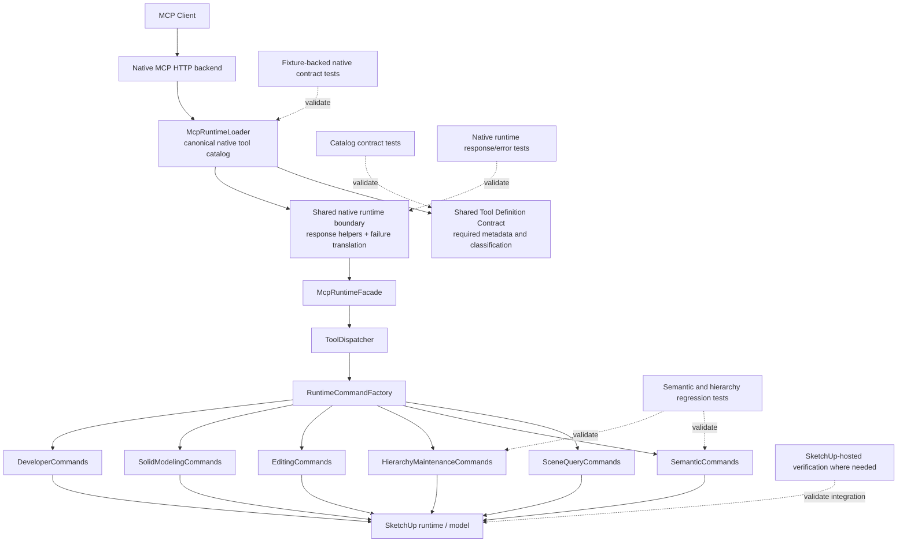

# Technical Plan: PLAT-14 Establish Native MCP Tool Contract And Response Conventions
**Task ID**: `PLAT-14`
**Title**: `Establish Native MCP Tool Contract And Response Conventions`
**Status**: `completed`
**Date**: `2026-04-17`

## Source Task

- [Establish Native MCP Tool Contract And Response Conventions](./task.md)

## Problem Summary

The Ruby-native MCP runtime already owns the canonical public tool catalog, but the current registration seam is still permissive and uneven. Required client-facing metadata is not enforced uniformly, refusal shaping is duplicated across command families, mutation success shapes are only partially structured, and unexpected command failures are not translated through one explicit native runtime boundary. `PLAT-14` should harden the highest-value shared seams now: strict native tool declarations plus shared success, refusal, and failure-shaping conventions.

## Goals

- establish one strict Ruby-owned tool-definition contract for every public native MCP tool
- establish one shared refusal envelope and one shared success-envelope vocabulary without flattening family-specific payloads
- centralize unexpected native tool-call failure translation at the runtime boundary
- prove the shared response conventions on representative command families so future native tools do not invent local patterns

## Non-Goals

- redesigning selector vocabulary across the catalog
- performing a broad public tool-boundary redesign
- forcing every tool family into one identical payload structure
- adding heavy guide-lint or full-catalog conformance-scoring machinery
- introducing compatibility flags or migration hedges for old behavior

## Related Context

- [Platform Architecture and Repo Structure](../../../hlds/hld-platform-architecture-and-repo-structure.md)
- [PLAT-10 Migrate Current Tool Surface To Ruby-Native MCP And Retire Spike](../PLAT-10-migrate-current-tool-surface-to-ruby-native-mcp-and-retire-spike/task.md)
- [PLAT-13 Retire Python Bridge And Remove Compatibility Runtime](../PLAT-13-retire-python-bridge-and-remove-compatibility-runtime/task.md)
- [MCP Tool Authoring Standard for SketchUp Modeling](../../../guidelines/mcp-tool-authoring-sketchup.md)
- [SEM-01 Establish Semantic Core and First Vertical Slice](../../semantic-scene-modeling/SEM-01-establish-semantic-core-and-first-vertical-slice/task.md)
- [SEM-07 hierarchy-maintenance runtime surface](../../../../src/su_mcp/semantic/hierarchy_maintenance_commands.rb)

## Research Summary

- The native catalog is already centralized in [mcp_runtime_loader.rb](../../../../src/su_mcp/runtime/native/mcp_runtime_loader.rb), so `PLAT-14` can tighten an existing seam rather than inventing a second registry.
- Earlier platform work such as `PLAT-01` planned shared response/error helpers, but the current repo does not contain a reusable shared response-helper module; refusal shaping is still duplicated.
- `PLAT-10` made Ruby the canonical owner of names, descriptions, schemas, annotations, and representative response shaping for the native surface.
- `PLAT-13` removed the compatibility runtime, so this work no longer needs to preserve Python as a first-class contract owner.
- The strongest existing refusal posture is in the semantic and hierarchy slices: domain refusals stay in-band as successful results, while transport or unexpected failures belong on the runtime error path.
- The current catalog already includes `name`, `description`, `handler_key`, and `input_schema` for every tool entry, so making the full tool definition explicit now is not materially broader than metadata-only tightening.

## Technical Decisions

### Data Model

- Introduce one small Ruby-owned tool-definition contract object for the native runtime catalog.
- Each public tool definition must include:
  - `name`
  - `title`
  - `description`
  - `annotations`
  - `handler_key`
  - `input_schema`
- Add one explicit classification field to the tool-definition contract:
  - `classification`
  - allowed initial values:
    - `first_class`
    - `escape_hatch`
- `classification` exists to distinguish normal first-class MCP tools from escape-hatch tools at the catalog boundary so implementation and later review can enforce stricter authoring posture without needing a second registry or an implicit exemption list.
- `eval_ruby` must use the same tool-definition contract and be classified as `escape_hatch`.
- Tool-definition validation should fail catalog construction when required fields are absent or structurally invalid.
- Response conventions should use one minimal shared vocabulary rather than one universal payload shape:
  - `success: true` for successful and refusal outcomes
  - `outcome` for mutation-capable or refusal-capable flows
  - `refusal` for structured domain declines
  - family-specific payload sections remain allowed
- When a `refusal` object is present, `outcome` must be `refused`.
- For invalid known-option refusals, `refusal.details.allowedValues` must be included whenever the runtime already knows the authoritative supported set for the rejected field.
- `first_class` tools must adopt the shared success/refusal vocabulary. `escape_hatch` tools may retain raw return values and are explicitly exempt from success-envelope normalization, but still use the strict declaration contract and the centralized runtime error boundary.

### API and Interface Design

- Keep [McpRuntimeLoader](../../../../src/su_mcp/runtime/native/mcp_runtime_loader.rb) as the canonical native registration seam.
- Replace permissive `tool_entry` hash assembly with validated tool-definition objects or an equivalent strict contract builder consumed by the loader.
- Keep [McpRuntimeFacade](../../../../src/su_mcp/runtime/native/mcp_runtime_facade.rb), [ToolDispatcher](../../../../src/su_mcp/runtime/tool_dispatcher.rb), and [RuntimeCommandFactory](../../../../src/su_mcp/runtime/runtime_command_factory.rb) as execution-routing seams.
- Do not move business semantics into the native runtime layer.
- Introduce shared response helpers in Ruby shared runtime support for:
  - read success envelopes where a helper meaningfully reduces repetition
  - mutation success envelopes with `success` and `outcome`
  - refusal envelopes with stable `refusal.code`, `refusal.message`, and optional `refusal.details`
- Shared refusal helpers must support attaching `allowedValues` for unsupported-option cases where the runtime has a known enum or approved set.
- Require representative adoption by:
  - [SemanticCommands](../../../../src/su_mcp/semantic/semantic_commands.rb)
  - [HierarchyMaintenanceCommands](../../../../src/su_mcp/semantic/hierarchy_maintenance_commands.rb)
- Additional editing/modeling adoption is optional in this task and should occur only when the fit is mechanical and does not broaden scope.
- This task does not add output-schema discoverability machinery or response-schema reflection beyond the current native runtime surface.

### Error Handling

- Preserve the existing semantic rule that well-formed business-level declined execution is returned as a structured in-band refusal rather than as a runtime error.
- Introduce one shared native runtime failure-translation seam around tool execution in [McpRuntimeLoader](../../../../src/su_mcp/runtime/native/mcp_runtime_loader.rb).
- Boundary rule:
  - returned hash with `refusal` and `outcome: 'refused'` => preserve as normal structured result through `MCP::Tool::Response` and `structuredContent`
  - returned successful first-class envelope => preserve as normal structured result through `MCP::Tool::Response` and `structuredContent`
  - returned raw escape-hatch value => preserve as normal structured result for the escape-hatch tool without forcing success-envelope normalization
  - raised exception => do not wrap in a successful `MCP::Tool::Response`; route through one shared native runtime error boundary and the MCP error path instead
- Do not rely on command families to shape unexpected runtime exceptions individually.
- Preserve explicit domain refusal codes and details already established by semantic and hierarchy command behavior.
- `eval_ruby` exceptions should be handled by the same centralized runtime failure translation seam rather than by special-case transport behavior.
- The current modeling-family raise-for-domain-error posture is explicitly deferred from this task; semantic and hierarchy remain the mandatory representative adopters for the shared refusal convention.

### State Management

- Keep the native runtime effectively stateless per tool call aside from live SketchUp model state and existing command collaborators.
- Do not introduce a persistent metadata registry or response-state cache.
- Tool-definition objects should be static catalog data owned by the runtime loader.
- Shared response helpers should remain pure value-shaping helpers without runtime lifecycle state.

### Integration Points

- Native MCP client requests continue to enter through the native HTTP backend and [McpRuntimeLoader](../../../../src/su_mcp/runtime/native/mcp_runtime_loader.rb).
- Tool definitions are registered natively through the loader and routed through:
  - [McpRuntimeFacade](../../../../src/su_mcp/runtime/native/mcp_runtime_facade.rb)
  - [ToolDispatcher](../../../../src/su_mcp/runtime/tool_dispatcher.rb)
  - [RuntimeCommandFactory](../../../../src/su_mcp/runtime/runtime_command_factory.rb)
- Representative command-family adoption should occur in:
  - [SemanticCommands](../../../../src/su_mcp/semantic/semantic_commands.rb)
  - [HierarchyMaintenanceCommands](../../../../src/su_mcp/semantic/hierarchy_maintenance_commands.rb)
- Existing fixture-backed native contract cases in [native_runtime_contract_cases.json](../../../../test/support/native_runtime_contract_cases.json) remain the baseline regression guard for representative read success, mutation success, and refusal outcomes.
- Real integration must be validated at the native runtime transport layer for raised exceptions because helper-only unit tests are insufficient to prove MCP-visible failure translation.

### Configuration

- `PLAT-14` introduces no new runtime configuration sources, feature flags, or environment variables.
- The native runtime host/bind/config posture remains unchanged.
- Tool-definition validation is build-time or initialization-time behavior inside the native runtime, not user-configurable behavior.
- Shared response and failure translation rules should be code-owned conventions, not configurable runtime policies.

## Architecture Context

## Key Relationships

- [McpRuntimeLoader](../../../../src/su_mcp/runtime/native/mcp_runtime_loader.rb) remains the single native catalog owner, but after `PLAT-14` it should consume strict tool-definition objects rather than permissive hashes.
- Shared contract enforcement, shared response helpers, and centralized unexpected-failure translation belong in the native runtime layer, not in business command families.
- [McpRuntimeFacade](../../../../src/su_mcp/runtime/native/mcp_runtime_facade.rb), [ToolDispatcher](../../../../src/su_mcp/runtime/tool_dispatcher.rb), and [RuntimeCommandFactory](../../../../src/su_mcp/runtime/runtime_command_factory.rb) remain routing seams and should not absorb business response semantics.
- Semantic and hierarchy slices are the primary adoption targets because they already expose structured outcomes and duplicated refusal logic worth consolidating.
- Escape-hatch tools remain part of the same registration contract but must be explicitly marked so they do not shape the first-class tool posture.

## Acceptance Criteria

- The native tool catalog is authored through one shared Ruby-owned tool-definition contract rather than permissive ad hoc catalog hashes.
- Every public native tool definition declares explicit `name`, `title`, `description`, `annotations`, `handler_key`, and `input_schema`, and catalog construction fails when required fields are omitted.
- Escape-hatch tools remain part of the same tool-definition contract, but are explicitly classified so they do not blur the first-class tool-authoring posture.
- The native runtime exposes one shared refusal envelope for domain-level declined execution outcomes, and representative semantic and hierarchy flows use that shared refusal shape without changing their business meaning.
- Invalid known-option refusals expose `refusal.details.allowedValues` whenever the runtime knows the supported set for the rejected field.
- The native runtime exposes one shared success-envelope convention that can be reused across command families without forcing identical payload structures for every tool.
- Unexpected exceptions raised by tool handlers are translated through one shared native runtime error boundary and the MCP error path rather than relying on local command-family exception shaping or a synthetic successful result envelope.
- Representative native transport tests prove that central runtime failure translation produces one consistent MCP-visible failure posture for raised exceptions.
- Existing representative native contract fixtures for read success, mutation success, and refusal outcomes continue to pass after the shared envelope and contract seams are introduced.
- Semantic and hierarchy command families are migrated onto the shared response/refusal helpers as the mandatory representative adoption slice for the task.
- `eval_ruby` uses the shared tool-definition contract and centralized runtime error translation but remains exempt from success/refusal envelope normalization because of its `escape_hatch` classification.
- Public native tool names remain stable, and the task does not require selector redesign, broad tool-boundary redesign, or full-catalog payload unification to be considered complete.
- The implementation remains fully Ruby-owned at the MCP boundary, and all outputs that cross the boundary remain JSON-serializable.
- Future native tools can extend the shared tool-definition and response conventions without inventing local catalog or envelope patterns.

## Test Strategy

### TDD Approach

- Start with failing native catalog tests that require explicit tool-definition fields and reject permissive omission.
- Add failing tests for the shared native runtime failure boundary before changing runtime execution wrapping.
- Reuse fixture-backed native contract cases as baseline regression guards while introducing shared response helpers.
- Migrate semantic and hierarchy command-family tests only after the shared helpers exist and are exercised through narrow failing cases first.
- Keep helper tests narrow and deterministic, then prove MCP-visible behavior at the transport boundary.
- Add failing cases for unsupported known-option refusals so `allowedValues` becomes a contractual behavior rather than an incidental detail.

### Required Test Coverage

- Native catalog contract tests for:
  - required tool-definition fields on every public native tool
  - explicit `classification` on escape-hatch tools
  - failure when required metadata or schema ownership fields are omitted
- Native runtime boundary tests for:
  - raised handler exceptions become one shared MCP-visible runtime failure posture
  - returned structured results remain unchanged through `structuredContent`
  - returned refusal envelopes remain unchanged through `structuredContent`
- Refusal contract tests for invalid known-option cases where the runtime has an authoritative supported set:
  - `refusal.details.allowedValues` is present and matches that set
  - `structureCategory` remains covered as the initial anchor case
  - additional enum-backed fields such as semantic modes should be covered when brought under the shared helper
- Fixture-backed native contract regression tests using [native_runtime_contract_cases.json](../../../../test/support/native_runtime_contract_cases.json):
  - `sample_surface_z_hit`
  - `set_entity_metadata_invalid_structure_category_refused`
  - `create_group_created`
  - `reparent_entities_cyclic_refused`
- Representative command-family tests for:
  - semantic refusal helper reuse
  - semantic mutation success helper reuse
  - hierarchy refusal helper reuse
  - hierarchy mutation success helper reuse
- Existing native runtime and facade tests should continue passing after mechanical updates:
  - [test/runtime/native/mcp_runtime_loader_test.rb](../../../../test/runtime/native/mcp_runtime_loader_test.rb)
  - [test/runtime/native/mcp_runtime_native_contract_test.rb](../../../../test/runtime/native/mcp_runtime_native_contract_test.rb)
  - [test/runtime/native/mcp_runtime_facade_test.rb](../../../../test/runtime/native/mcp_runtime_facade_test.rb)
- Local validation:
  - `bundle exec rake ruby:test`
  - `bundle exec rake ruby:lint`

## Instrumentation and Operational Signals

- Native catalog tests prove the strict tool-definition contract is enforced rather than documented only by convention.
- Native runtime boundary tests prove the shared runtime failure translation actually shapes MCP-visible failures.
- Fixture-backed native contract tests prove the representative public response shapes remain stable after helper adoption.
- Refusal-contract tests prove supported option sets remain discoverable in-band for invalid known-option cases.
- Local lint and Ruby test runs prove the shared runtime seam integrates cleanly with the canonical native runtime.

## Implementation Phases

1. Introduce the strict native tool-definition contract and fail-fast catalog validation, then update the existing catalog entries to satisfy it.
2. Introduce shared response helpers for refusal and success vocabulary plus one centralized unexpected-failure translation seam in the native runtime boundary, including helper support for `allowedValues` on invalid known-option refusals.
3. Migrate semantic command responses and refusals onto the shared helpers while preserving existing business-level payload meaning.
4. Migrate hierarchy command responses and refusals onto the shared helpers while preserving existing business-level payload meaning.
5. Optionally migrate one thin additional slice such as `eval_ruby` or another mechanical adopter only if it strengthens proof without broadening scope.
6. Run full native runtime, command-family, and fixture-backed regression coverage, then finalize docs and status updates tied to the task artifacts.

## Rollout Approach

- Treat this as a bounded contract-hardening change, not a compatibility migration.
- Do not add feature flags or fallback catalog modes.
- Merge only when the strict contract, shared helper seams, representative-family adoption, and native runtime regression tests all agree on one steady-state behavior.
- Fallback is repository revert, not a dual-contract runtime mode.

## Risks and Controls

- Strict contract adoption may surface more inconsistent catalog entries than expected: add failing catalog-contract tests first and update all native tool entries in the same slice.
- Shared success helpers may become too abstract and flatten useful family payloads: keep the shared vocabulary minimal and preserve family-specific payload sections.
- Central runtime failure translation could swallow domain refusals or misclassify expected outcomes: distinguish returned refusal envelopes from raised exceptions explicitly and test both paths.
- Shared refusal helpers could standardize shape without preserving option discoverability: require `allowedValues` whenever the runtime already knows the authoritative supported set and lock that behavior with contract tests.
- Representative-family migration could stop too early and leave the helpers unproven: require semantic and hierarchy adoption as mandatory completion criteria.
- Mixed posture outside the representative adopters could be mistaken for an unplanned regression: document that modeling-family domain-exception cleanup is intentionally deferred rather than silently left ambiguous.
- Scope could drift into full-catalog payload redesign: keep non-semantic adoption optional and mechanical only, and defer deeper editing/modeling redesign to follow-on work.

## Implementation Notes

- The strict catalog seam shipped as [NativeToolDefinition](../../../../src/su_mcp/runtime/native/tool_definition.rb) consumed by [McpRuntimeLoader](../../../../src/su_mcp/runtime/native/mcp_runtime_loader.rb), preserving the existing loader as the single native catalog owner.
- Shared response helpers shipped as [ToolResponse](../../../../src/su_mcp/runtime/tool_response.rb).
- Representative adoption was completed in:
  - [SemanticCommands](../../../../src/su_mcp/semantic/semantic_commands.rb)
  - [HierarchyMaintenanceCommands](../../../../src/su_mcp/semantic/hierarchy_maintenance_commands.rb)
  - [Semantic::RequestValidator](../../../../src/su_mcp/semantic/request_validator.rb)
  - [Semantic::ManagedObjectMetadata](../../../../src/su_mcp/semantic/managed_object_metadata.rb)
- Runtime failure translation was validated locally through loader-level wrapper tests with a stubbed `MCP::Tool` seam because the vendored native runtime is not available in this checkout.
- The existing vendored transport contract tests remain the intended integration proof once the staged native vendor runtime is available locally or in CI.

## Premortem

### Intended Goal Under Test

Leave the Ruby-native MCP runtime with one enforced native tool-definition contract and one reusable response/failure-shaping posture, so future public tools do not keep inventing permissive catalog entries or incompatible result semantics.

### Failure Paths and Mitigations

- **Base assumptions that could lead us astray**
  - Business-plan mismatch: the task needs durable contract hardening, but the plan could still optimize for minimal metadata cleanup only.
  - Root-cause failure path: the shared tool-definition contract is softened into optional metadata tightening and does not actually prevent future drift.
  - Why this misses the goal: future tools can keep bypassing the intended contract seam and the platform gains only cosmetic consistency.
  - Likely cognitive bias: scope minimization that mistakes low effort for high leverage.
  - Classification: `can be validated before implementation`
  - Mitigation now: require strict tool-definition validation and fail-fast catalog construction as core plan outcomes.
  - Required validation: failing catalog tests that prove missing required fields are rejected.
- **Shortcuts that could weaken the outcome**
  - Business-plan mismatch: the task needs reusable platform seams, but the implementation could add helpers without migrating real command families onto them.
  - Root-cause failure path: helpers land as unused infrastructure while semantic and hierarchy responses keep their duplicated local shaping.
  - Why this misses the goal: the repo still teaches future contributors to hand-roll local response patterns.
  - Likely cognitive bias: infrastructure-first completionism.
  - Classification: `can be validated before implementation`
  - Mitigation now: make semantic and hierarchy adoption mandatory rather than optional examples.
  - Required validation: representative command-family tests proving both slices use the shared helpers.
- **Areas that could be weakly implemented**
  - Business-plan mismatch: the task needs one shared runtime failure boundary, but the implementation could leave exception shaping fragmented across commands.
  - Root-cause failure path: raised exceptions are still handled differently by different command families or leak through as inconsistent runtime failures.
  - Why this misses the goal: the MCP boundary remains inconsistent where it matters most for debugging and downstream tooling.
  - Likely cognitive bias: assuming helper reuse alone is enough without transport-boundary proof.
  - Classification: `requires implementation-time instrumentation or acceptance testing`
  - Mitigation now: centralize unexpected-failure translation in the native runtime boundary and test it through the real transport wrapper.
  - Required validation: native transport tests that simulate raised exceptions and assert the shared MCP-visible failure posture.
- **Tests and evaluations needed to stay on track**
  - Business-plan mismatch: the task needs public-boundary confidence, but the implementation could rely only on helper-level tests.
  - Root-cause failure path: helper tests pass while `structuredContent` or runtime error behavior changes at the actual native transport boundary.
  - Why this misses the goal: the internal design looks correct, but the public MCP surface still drifts.
  - Likely cognitive bias: over-trusting unit tests for boundary behavior.
  - Classification: `requires implementation-time instrumentation or acceptance testing`
  - Mitigation now: keep fixture-backed native runtime contract tests and boundary-level transport tests as mandatory validation.
  - Required validation: passing fixture-backed native contract cases plus explicit boundary failure tests.
- **What must be true for the task to succeed**
  - Business-plan mismatch: the task needs a bounded shared contract slice, but success depends on the current catalog seam being strong enough to tighten rather than replace.
  - Root-cause failure path: the existing loader seam proves too weak, forcing broader runtime redesign before contract hardening can proceed.
  - Why this misses the goal: `PLAT-14` becomes a larger architecture rewrite instead of a bounded platform task.
  - Likely cognitive bias: underestimating the value of the current centralized catalog baseline.
  - Classification: `can be validated before implementation`
  - Mitigation now: keep the loader as the canonical seam and tighten it in place rather than inventing a detached registry.
  - Required validation: implementation review and tests showing the strict contract is layered directly onto the existing catalog owner.
- **Second-order and third-order effects**
  - Business-plan mismatch: the task needs a future-proof authoring seam, but the implementation could over-correct into a response model that is too generic for later capabilities.
  - Root-cause failure path: the shared success helpers erase useful family payload distinctions, so later tools either fight the helpers or bypass them.
  - Why this misses the goal: the shared seam becomes a source of new drift rather than a durable foundation.
  - Likely cognitive bias: false neatness through over-normalization.
  - Classification: `can be validated before implementation`
  - Mitigation now: define a minimal shared envelope vocabulary and explicitly preserve family-specific payload sections.
  - Required validation: representative semantic and hierarchy success-shape assertions proving business payload details remain intact.

## Dependencies

- [PLAT-10 Migrate Current Tool Surface To Ruby-Native MCP And Retire Spike](../PLAT-10-migrate-current-tool-surface-to-ruby-native-mcp-and-retire-spike/task.md)
- [PLAT-13 Retire Python Bridge And Remove Compatibility Runtime](../PLAT-13-retire-python-bridge-and-remove-compatibility-runtime/task.md)
- [Platform Architecture and Repo Structure](../../../hlds/hld-platform-architecture-and-repo-structure.md)
- [MCP Tool Authoring Standard for SketchUp Modeling](../../../guidelines/mcp-tool-authoring-sketchup.md)
- Native runtime test surfaces under [test/runtime/native/](../../../../test/runtime/native/)
- Fixture-backed native contract cases in [test/support/native_runtime_contract_cases.json](../../../../test/support/native_runtime_contract_cases.json)

## Quality Checks

- [x] All required inputs validated
- [x] Problem statement documented
- [x] Goals and non-goals documented
- [x] Research summary documented
- [x] Technical decisions included
- [x] Architecture context included
- [x] Acceptance criteria included
- [x] Test requirements specified
- [x] Instrumentation and operational signals defined when needed
- [x] Risks and dependencies documented
- [x] Rollout approach documented when needed
- [x] Small reversible phases defined
- [x] Premortem completed with falsifiable failure paths and mitigations
