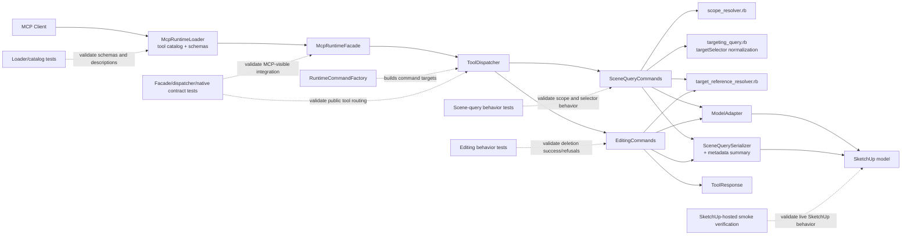

# Technical Plan: PLAT-15 Align Public Targeting and Generic Mutation Tool Boundaries
**Task ID**: `PLAT-15`
**Title**: `Align Public Targeting and Generic Mutation Tool Boundaries`
**Status**: `finalized`
**Date**: `2026-04-18`

## Source Task

- [Align Public Targeting and Generic Mutation Tool Boundaries](./task.md)

## Problem Summary

The live Ruby-native MCP surface still teaches three misleading boundaries. `list_entities` presents as a top-level dump helper instead of explicit scoped inventory. `find_entities` still exposes an STI-01 MVP `query` posture instead of a clearer predicate-first targeting contract. `delete_component` still teaches component-only deletion even though the surrounding generic mutation slice is moving toward supported target types rather than SketchUp primitive names.

This task should correct those public boundaries without broadening into collection discovery, topology work, or a full generic-mutation policy redesign. The delivered contract should make inventory, targeting, and generic deletion easy to distinguish from tool metadata and schema alone.

## Goals

- Reframe `list_entities` as scoped inventory with an explicit `scopeSelector` contract.
- Reframe `find_entities` as predicate-first targeting with an explicit `targetSelector` contract.
- Replace `delete_component` with a generic deletion contract whose name, schema, and refusal behavior match the supported target types.
- Keep targeting ownership in the scene-query slice and mutation ownership in the editing slice while reusing shared contract helpers where appropriate.

## Non-Goals

- Implementing workflow collection lookup or `get_named_collections`.
- Expanding bounds, topology, or surface-interrogation capabilities.
- Redesigning the entire mutation family, including `transform_entities` or `set_material`.
- Introducing compatibility aliases or a dual-contract migration mode for old tool names or old request shapes.
- Expanding deletion into batch semantics, preview mode, or partial-success policy.

## Related Context

- [PLAT-15 task](./task.md)
- [HLD: Scene Targeting and Interrogation](specifications/hlds/hld-scene-targeting-and-interrogation.md)
- [HLD: Semantic Scene Modeling](specifications/hlds/hld-semantic-scene-modeling.md)
- [HLD: Platform Architecture and Repo Structure](specifications/hlds/hld-platform-architecture-and-repo-structure.md)
- [PRD: Scene Targeting and Interrogation](specifications/prds/prd-scene-targeting-and-interrogation.md)
- [PRD: Semantic Scene Modeling](specifications/prds/prd-semantic-scene-modeling.md)
- [STI-01 task](specifications/tasks/scene-targeting-and-interrogation/STI-01-targeting-mvp-and-find-entities/task.md)
- [SEM-03 task](specifications/tasks/semantic-scene-modeling/SEM-03-add-metadata-mutation-for-managed-scene-objects/task.md)
- [PLAT-14 task](specifications/tasks/platform/PLAT-14-establish-native-mcp-tool-contract-and-response-conventions/task.md)
- [MCP Tool Authoring Standard for SketchUp Modeling](specifications/guidelines/mcp-tool-authoring-sketchup.md)
- Runtime seams:
  - [src/su_mcp/runtime/native/mcp_runtime_loader.rb](src/su_mcp/runtime/native/mcp_runtime_loader.rb)
  - [src/su_mcp/runtime/native/mcp_runtime_facade.rb](src/su_mcp/runtime/native/mcp_runtime_facade.rb)
  - [src/su_mcp/runtime/tool_dispatcher.rb](src/su_mcp/runtime/tool_dispatcher.rb)
  - [src/su_mcp/runtime/runtime_command_factory.rb](src/su_mcp/runtime/runtime_command_factory.rb)
  - [src/su_mcp/scene_query/scene_query_commands.rb](src/su_mcp/scene_query/scene_query_commands.rb)
  - [src/su_mcp/scene_query/targeting_query.rb](src/su_mcp/scene_query/targeting_query.rb)
  - [src/su_mcp/scene_query/scene_query_serializer.rb](src/su_mcp/scene_query/scene_query_serializer.rb)
  - [src/su_mcp/editing/editing_commands.rb](src/su_mcp/editing/editing_commands.rb)
  - [src/su_mcp/adapters/model_adapter.rb](src/su_mcp/adapters/model_adapter.rb)
  - [src/su_mcp/runtime/tool_response.rb](src/su_mcp/runtime/tool_response.rb)

## Research Summary

- The current code already implements `find_entities` resolution states and compact match summaries, so the highest-value change is contract redesign, not result-envelope replacement.
- The native runtime already has strict tool-definition and refusal helpers from `PLAT-14`, so this task should extend those seams instead of inventing new contract infrastructure.
- The repo already has a compact direct-reference shape in `target_reference_schema` and a semantic-side `TargetResolver`, which indicates direct-reference reuse is possible, but the shared resolver should move under targeting ownership rather than remain semantic-owned.
- The repo does not contain an implemented workflow collection model or collection-discovery command, so collection-aware targeting must remain deferred.
- Managed-object metadata is already stored in the `su_mcp` dictionary and exposed by semantic serializers, so limited metadata predicate support is feasible without inventing a second metadata system.
- The authoring guideline strongly favors explicit selector vocabulary, bounded tool descriptions, compact outputs, and avoiding tool names tied to backend internals such as `delete_component`.

## Technical Decisions

### Data Model

- Keep `list_entities` as a public tool name, but change its request contract to:
  - required `scopeSelector`
  - optional `outputOptions`
- `scopeSelector` should be a bounded object with:
  - required `mode`
  - optional `targetReference`, required only for `children_of_target`
- Supported `scopeSelector.mode` values in this task:
  - `top_level`
  - `selection`
  - `children_of_target`
- `outputOptions` for `list_entities` should stay compact:
  - `limit`
  - `includeHidden`
- Keep `find_entities` as a public tool name, but replace the flat `query` contract with required `targetSelector`.
- `targetSelector` should be a nested exact-match selector with these owned sections:
  - `identity`
  - `attributes`
  - `metadata`
- Supported `identity` fields:
  - `sourceElementId`
  - `persistentId`
  - `entityId`
- Supported `attributes` fields:
  - `name`
  - `tag`
  - `material`
- Supported `metadata` fields in this task:
  - `managedSceneObject`
  - `semanticType`
  - `status`
  - `state`
  - `structureCategory`
- `find_entities` continues to apply exact-match AND semantics across all populated selector fields.
- `find_entities` continues to return:
  - `success`
  - `resolution`
  - `matches`
- Extend target match summaries so they can surface limited metadata summary fields when present:
  - `semanticType`
  - `status`
  - `state`
  - `structureCategory`
- Replace `delete_component` with a new public tool name `delete_entities`.
- `delete_entities` should accept:
  - required `targetReference`
  - optional `constraints`
  - optional `outputOptions`
- `targetReference` uses the shared direct-reference shape:
  - `sourceElementId`
  - `persistentId`
  - `entityId`
- `delete_entities` should support deleting only supported scene-instance targets:
  - groups
  - component instances
- `delete_entities.constraints` should make destructive behavior explicit:
  - `ambiguityPolicy`
- Supported `ambiguityPolicy` values in this task:
  - `fail`
- `delete_entities.outputOptions` should stay bounded:
  - `responseFormat`
- Supported `responseFormat` values in this task:
  - `concise`
- `delete_entities` should return a structured first-class result:
  - `success`
  - `outcome`
  - `operation`
  - `affectedEntities`
- `operation` should identify the mutation that ran:
  - `name`
  - `targetKind`
- `affectedEntities.deleted` should contain one compact summary captured before erase and should reuse the shared target-summary vocabulary where possible.

### API and Interface Design

- Update the native catalog in [src/su_mcp/runtime/native/mcp_runtime_loader.rb](src/su_mcp/runtime/native/mcp_runtime_loader.rb) to expose:
  - revised `list_entities` title, description, and schema
  - revised `find_entities` title, description, and schema
  - new `delete_entities` title, description, and schema
- Do not keep `delete_component` as a public alias after this change.
- Keep public JSON vocabulary camelCase to match the current native surface while still adopting stronger selector names:
  - `scopeSelector`
  - `outputOptions`
  - `targetSelector`
  - `targetReference`
- Add shared loader schema helpers rather than repeating nested schema literals inline:
  - `target_reference_schema`
  - `scope_selector_schema`
  - `target_selector_schema`
  - `output_options_schema`
  - `mutation_constraints_schema` if deletion constraints remain shared with future destructive tools
- Keep contrastive tool descriptions explicit:
  - `list_entities` is for inventory within a known scope, not predicate search
  - `find_entities` is for exact-match targeting across identity, attributes, and supported metadata, not scoped inventory
  - `delete_entities` is for explicit single-target deletion of supported types, not broad search or batch cleanup
- Keep `list_entities` and `find_entities` in [src/su_mcp/scene_query/scene_query_commands.rb](src/su_mcp/scene_query/scene_query_commands.rb).
- Keep `delete_entities` in [src/su_mcp/editing/editing_commands.rb](src/su_mcp/editing/editing_commands.rb).
- Extract a shared direct-reference resolver from the semantic namespace into a new targeting-owned file:
  - [src/su_mcp/scene_query/target_reference_resolver.rb](src/su_mcp/scene_query/target_reference_resolver.rb)
- Add a dedicated scope-resolution helper under the scene-query slice:
  - [src/su_mcp/scene_query/scope_resolver.rb](src/su_mcp/scene_query/scope_resolver.rb)
- Keep nested `targetSelector` normalization inside [src/su_mcp/scene_query/targeting_query.rb](src/su_mcp/scene_query/targeting_query.rb) rather than creating a second selector grammar.
- Extend [src/su_mcp/runtime/tool_dispatcher.rb](src/su_mcp/runtime/tool_dispatcher.rb) and [src/su_mcp/runtime/native/mcp_runtime_facade.rb](src/su_mcp/runtime/native/mcp_runtime_facade.rb) to route `delete_entities` instead of `delete_component`.

### Public Contract Updates

- `list_entities`
  - Request delta: replace the implicit top-level listing posture with required `scopeSelector` plus optional `outputOptions`.
  - Response delta: keep the existing serialized inventory-row shape; only the scope-selection contract changes.
  - Schema and registration updates: publish `scopeSelector.mode` as an enum covering `top_level`, `selection`, and `children_of_target`; keep `targetReference` required only for `children_of_target`.
  - Dispatcher and routing updates: keep command ownership in the scene-query slice; no new runtime command family is introduced.
  - Contract tests and docs: update loader/catalog tests plus [README.md](README.md) and [sketchup_mcp_guide.md](sketchup_mcp_guide.md) together so inventory is described as scope-first rather than search-first.
- `find_entities`
  - Request delta: replace the flat MVP `query` input with required `targetSelector` containing supported `identity`, `attributes`, and `metadata` sections.
  - Response delta: preserve `success`, `resolution`, and `matches`, while allowing compact metadata summary fields in match rows when present.
  - Schema and registration updates: publish the nested selector sections and supported field names from the loader so clients can discover the bounded predicate families from the schema.
  - Dispatcher and routing updates: keep command ownership in the scene-query slice and keep selector normalization in `targeting_query.rb`.
  - Contract tests and docs: update loader/catalog tests, scene-query behavior tests, native contract fixtures, [README.md](README.md), and [sketchup_mcp_guide.md](sketchup_mcp_guide.md) in the same change.
- `delete_entities`
  - Request delta: replace `delete_component` with `delete_entities`, using required `targetReference`, optional `constraints`, and optional `outputOptions`.
  - Response delta: return structured mutation results with `operation` and `affectedEntities.deleted` instead of a thinner component-specific mutation shape.
  - Schema and registration updates: remove `delete_component` from the native catalog, publish `ambiguityPolicy` and `responseFormat` as bounded enums, and mark the tool as destructive in loader metadata.
  - Dispatcher and routing updates: route `delete_entities` through the editing slice while reusing targeting-owned direct-reference resolution.
  - Contract tests and docs: update loader/catalog tests, dispatcher/facade tests, native contract fixtures, [README.md](README.md), and [sketchup_mcp_guide.md](sketchup_mcp_guide.md) together so the public mutation boundary converges on one tool name and one request shape.

### Error Handling

- Preserve the current rule that malformed requests fail on the runtime error path rather than as successful results.
- For `list_entities`, treat these as request errors:
  - missing `scopeSelector`
  - unsupported `scopeSelector.mode`
  - missing `targetReference` when `mode` is `children_of_target`
  - unsupported keys inside `scopeSelector` or `outputOptions`
- For `find_entities`, treat these as request errors:
  - missing `targetSelector`
  - no populated selector fields after normalization
  - unsupported selector sections or unsupported fields within a section
- For `find_entities`, keep valid search outcomes in-band:
  - `none`
  - `unique`
  - `ambiguous`
- For `delete_entities`, use structured refusals for well-formed requests that cannot safely execute:
  - `target_not_found`
  - `ambiguous_target`
  - `unsupported_target_type`
- `delete_entities` should default `ambiguityPolicy` to `fail` and reject any unsupported ambiguity policy value on the request-error path.
- `delete_entities` should explicitly allow deletion of supported managed scene objects when they resolve to supported scene-instance targets; this task does not invent a separate protection regime.
- Use [src/su_mcp/runtime/tool_response.rb](src/su_mcp/runtime/tool_response.rb) for deletion refusals and success results so the mutation surface stays consistent with `PLAT-14`.

### State Management

- The SketchUp model remains the only source of truth.
- `find_entities` and `list_entities` stay stateless per call.
- Metadata matching for `find_entities` reads only from the existing `su_mcp` attribute dictionary and does not invoke semantic mutation policy.
- Missing metadata keys should behave as non-matches, not as errors.
- `delete_entities` must capture the deleted summary before `erase!` so the response stays serializable after mutation.
- No caches, ranking memory, query history, or compatibility alias state should be introduced.

### Integration Points

- Native tool registration and tool metadata flow through [src/su_mcp/runtime/native/mcp_runtime_loader.rb](src/su_mcp/runtime/native/mcp_runtime_loader.rb).
- Runtime execution flows through:
  - [src/su_mcp/runtime/native/mcp_runtime_facade.rb](src/su_mcp/runtime/native/mcp_runtime_facade.rb)
  - [src/su_mcp/runtime/tool_dispatcher.rb](src/su_mcp/runtime/tool_dispatcher.rb)
  - [src/su_mcp/runtime/runtime_command_factory.rb](src/su_mcp/runtime/runtime_command_factory.rb)
- Scene-query behavior continues to depend on:
  - [src/su_mcp/adapters/model_adapter.rb](src/su_mcp/adapters/model_adapter.rb)
  - [src/su_mcp/scene_query/scene_query_serializer.rb](src/su_mcp/scene_query/scene_query_serializer.rb)
- The extracted direct-reference resolver becomes the shared integration seam for:
  - semantic commands that already resolve compact references
  - editing commands that need explicit target deletion
- `list_entities` should continue to use the existing entity serializer output shape for inventory rows so downstream tooling does not need a second inventory summary vocabulary.
- Public contract verification continues through:
  - [test/runtime/native/mcp_runtime_loader_test.rb](test/runtime/native/mcp_runtime_loader_test.rb)
  - [test/runtime/native/mcp_runtime_facade_test.rb](test/runtime/native/mcp_runtime_facade_test.rb)
  - [test/runtime/native/mcp_runtime_native_contract_test.rb](test/runtime/native/mcp_runtime_native_contract_test.rb)
  - [test/support/native_runtime_contract_cases.json](test/support/native_runtime_contract_cases.json)

### Configuration

- No new runtime configuration should be introduced.
- Supported scope modes, selector fields, and deletion target types should be code-owned contract behavior, not user-configurable options.
- This task should not add environment flags, feature toggles, or alias-migration settings.

## Architecture Context

## Key Relationships

- `list_entities` and `find_entities` belong to the scene-query slice because they define read-side inventory and targeting behavior.
- Generic direct-reference resolution should belong to targeting-owned code, not remain in the semantic namespace, because editing and semantic commands both need it.
- `delete_entities` belongs to the editing slice because it is a mutation tool, but it should reuse targeting-owned direct-reference resolution rather than reimplement lookup.
- `list_entities` should keep the existing serialized entity row shape and only change how the entity set is selected; this avoids inventing a second inventory payload vocabulary.
- Loader metadata, dispatcher routing, command behavior, tests, and docs must move together because this task intentionally changes public contracts.
- Native transport tests are required because unit tests alone cannot prove the revised names and schemas surface correctly at the MCP boundary.

## Acceptance Criteria

- The native tool catalog exposes `list_entities` as a scoped inventory tool whose schema requires `scopeSelector` and no longer presents top-level listing as implicit behavior.
- `list_entities` supports exactly the documented scope modes `top_level`, `selection`, and `children_of_target`, and rejects unsupported scope shapes on the request-error path.
- `list_entities` inventories only the resolved scope and does not accept or document predicate-search fields that belong to `find_entities`.
- `list_entities` continues to return the established serialized entity-row shape so downstream inventory consumers do not need a second row contract.
- The native tool catalog exposes `find_entities` with required `targetSelector` instead of the STI-01-era flat `query` object.
- `find_entities` supports exact-match identity, attribute, and limited metadata predicate families, and its supported fields are discoverable from the tool schema.
- `find_entities` continues to return explicit `none`, `unique`, and `ambiguous` resolution states with compact JSON-serializable match summaries.
- `find_entities` match summaries include stable identifiers plus supported metadata summary fields when those values are present.
- `find_entities` does not claim or implement workflow collection lookup in this task.
- The native tool catalog no longer exposes `delete_component` and instead exposes `delete_entities` with required `targetReference` plus explicit deletion constraints.
- `delete_entities` deletes only supported groups and component instances resolved by explicit reference, and it returns a structured mutation result containing `operation` and `affectedEntities.deleted`.
- `delete_entities` returns structured refusals for unresolved or unsupported targets rather than raw runtime-specific mutation outcomes.
- Loader metadata, dispatcher routing, behavior tests, native contract fixtures, and user-facing docs are updated together so the three revised tools tell one consistent boundary story.

## Test Strategy

### TDD Approach

Start with failing catalog tests so the revised public names, titles, descriptions, and schemas are pinned before command logic changes spread. Then add failing behavior tests for scoped inventory, nested selector normalization, metadata filtering, and deletion refusals. Once command behavior is stable, update dispatcher/facade tests and native contract fixtures to prove the MCP-visible surface is consistent. Finish with doc updates and the smallest practical live SketchUp smoke checks.

### Required Test Coverage

- Native loader/catalog tests in [test/runtime/native/mcp_runtime_loader_test.rb](test/runtime/native/mcp_runtime_loader_test.rb) for:
  - updated `list_entities` metadata and `scopeSelector` schema
  - updated `find_entities` metadata and `targetSelector` schema
  - replacement of `delete_component` with `delete_entities`
- Scene-query tests in:
  - [test/scene_query/scene_query_commands_test.rb](test/scene_query/scene_query_commands_test.rb)
  - [test/scene_query/find_entities_scene_query_commands_test.rb](test/scene_query/find_entities_scene_query_commands_test.rb)
  covering:
  - `list_entities` top-level scope
  - `list_entities` selection scope
  - `list_entities` children-of-target scope
  - selector validation failures
  - exact-match identity filtering
  - exact-match attribute filtering
  - limited metadata filtering
  - unchanged `none`, `unique`, `ambiguous` resolution behavior
- Editing tests in [test/editing/editing_commands_test.rb](test/editing/editing_commands_test.rb) for:
  - successful deletion of a supported group
  - successful deletion of a supported component instance
  - successful deletion of a managed scene object backed by a supported group or component instance
  - structured refusal for unsupported target type
  - structured refusal for unresolved or ambiguous target reference
  - deleted-summary payload capture before erase
  - rejection of unsupported `ambiguityPolicy` values
- Shared resolver regression tests for the extracted direct-reference resolver so semantic flows and deletion share one stable lookup seam.
- Dispatcher and facade tests in:
  - [test/runtime/tool_dispatcher_test.rb](test/runtime/tool_dispatcher_test.rb)
  - [test/runtime/native/mcp_runtime_facade_test.rb](test/runtime/native/mcp_runtime_facade_test.rb)
  covering updated tool-name routing and result-shape preservation.
- Native transport contract updates in:
  - [test/support/native_runtime_contract_cases.json](test/support/native_runtime_contract_cases.json)
  - [test/runtime/native/mcp_runtime_native_contract_test.rb](test/runtime/native/mcp_runtime_native_contract_test.rb)
  including at least one representative `delete_entities` success or refusal case.
- Validation commands:
  - `bundle exec rake ruby:test`
  - `bundle exec rake ruby:lint`
  - `bundle exec rake package:verify` if catalog or packaged metadata changes affect staged runtime validation

## Instrumentation and Operational Signals

- Loader metadata assertions act as the primary regression signal that public boundary wording and schema ownership did not drift.
- Native contract fixtures act as the primary MCP-boundary signal that renamed tools and structured results survive transport unchanged.
- Scene-query and editing tests act as the primary behavior signal that inventory, targeting, and deletion no longer overlap silently.
- Live SketchUp smoke verification remains necessary to confirm:
  - selection scope resolves the real SketchUp selection
  - children-of-target scope behaves correctly for nested groups/components
  - supported deletion types erase successfully inside the host runtime
  - managed-object metadata predicates match the intended live entities
- No new runtime telemetry is required for this bounded contract-alignment task.

## Implementation Phases

1. Update public catalog contracts.
   - Add shared schema helpers.
   - Rewrite loader metadata for `list_entities` and `find_entities`.
   - Replace `delete_component` with `delete_entities` in the native catalog and routing tests.
2. Extract shared direct-reference resolution.
   - Add `target_reference_resolver.rb` under `scene_query/`.
   - Move direct-reference resolution out of the semantic namespace into targeting-owned code.
   - Prove semantic regression safety with focused resolver tests.
3. Implement scoped inventory and predicate-selector normalization.
   - Add `scope_resolver.rb` and scope-resolution support for `list_entities`.
   - Replace `find_entities` flat-query normalization with nested `targetSelector` normalization.
   - Extend target summaries with limited metadata fields.
4. Implement generic deletion behavior.
   - Switch editing commands to `delete_entities`.
   - Enforce supported target types.
   - Return structured mutation results and refusals.
5. Finalize integration and docs.
   - Update facade/dispatcher/native contract fixtures.
   - Update [README.md](README.md) and [sketchup_mcp_guide.md](sketchup_mcp_guide.md).
   - Run Ruby tests, lint, and the smallest practical SketchUp-hosted smoke checks.

## Rollout Approach

- Ship this as one steady-state public-contract change.
- Do not add aliases for `delete_component` or dual support for both `query` and `targetSelector`.
- Update documentation in the same change so downstream agents and operators are not left with mixed guidance.
- Treat residual historical references in older specs or archival task artifacts as separate cleanup work if they remain after the runtime, primary docs, and contract tests converge; do not reintroduce runtime compatibility just to mask stale historical prose.
- Use repository revert as the fallback if the final integrated contract proves incorrect; do not maintain a compatibility layer in runtime code.

## Risks and Controls

- Over-broad deletion targeting could remove the wrong entity: keep deletion on explicit `targetReference` only, support one target only, and refuse unsupported types.
- Selector redesign could accidentally reintroduce overlap between inventory and targeting: keep `scopeSelector` and `targetSelector` as separate owned shapes and pin the contrastive descriptions in loader tests.
- Extracting direct-reference resolution from the semantic namespace could regress semantic workflows: add focused resolver regression tests and keep semantic command coverage in the validation set.
- Metadata targeting could overclaim unsupported behavior: limit supported metadata fields to those already owned by the `su_mcp` dictionary and document collection lookup as deferred.
- Mutation results could remain too thin to be chainable even after the rename: require `operation` and `affectedEntities.deleted` in tests and native fixtures.
- Renaming public tools without complete doc/test updates could leave the surface internally inconsistent: require loader, dispatcher, native contract, README, and guide updates in one change.
- Historical specs or older task artifacts could continue teaching `delete_component` or pre-PLAT-15 selector vocabulary after the live runtime is correct: treat active user docs and contract artifacts as the PLAT-15 convergence boundary, and track any broader repo-history cleanup as follow-on work rather than silently assuming it is complete.

## Dependencies

- [STI-01 task](specifications/tasks/scene-targeting-and-interrogation/STI-01-targeting-mvp-and-find-entities/task.md) for the existing `find_entities` resolution baseline.
- [SEM-03 task](specifications/tasks/semantic-scene-modeling/SEM-03-add-metadata-mutation-for-managed-scene-objects/task.md) for the managed-object metadata dictionary and public metadata vocabulary.
- [PLAT-14 task](specifications/tasks/platform/PLAT-14-establish-native-mcp-tool-contract-and-response-conventions/task.md) for strict tool definitions and shared refusal helpers.
- SketchUp host runtime availability for live smoke verification.
- Staged native vendor runtime availability for [test/runtime/native/mcp_runtime_native_contract_test.rb](test/runtime/native/mcp_runtime_native_contract_test.rb).

## Premortem

### Intended Goal Under Test

The finalized plan must make `list_entities`, `find_entities`, and generic deletion distinguishable from their public contracts alone, so agents stop inferring unsupported behavior and can rely on one coherent Ruby-native MCP boundary for scoped inventory, predicate targeting, and explicit supported-entity deletion.

### Failure Paths and Mitigations

- **Base assumptions that could lead us astray**
  - Business-plan mismatch: The task needs contracts that teach the right boundary from schema alone, but an underspecified plan would still optimize for implementation convenience.
  - Root-cause failure path: We assume a rename plus a few new fields is enough even if the resolver extraction destination and payload ownership remain vague.
  - Why this misses the goal: Implementers would make ad hoc structural choices during coding, and the public surface would drift again.
  - Likely cognitive bias: Planning fallacy.
  - Classification: Validate before implementation
  - Mitigation now: Fix the plan on two concrete targeting-owned helper files, keep `targetSelector` normalization in `targeting_query.rb`, and pin response-shape ownership explicitly.
  - Required validation: Loader tests, resolver tests, and command tests must reference the chosen helper seams and payload contracts directly.
- **Shortcuts that could weaken the outcome**
  - Business-plan mismatch: The task needs a generic deletion contract that teaches safe explicit deletion, but a shortcut would keep the mutation surface as thin success/failure plumbing.
  - Root-cause failure path: We ship `delete_entities` with only `targetReference` and a thin deleted payload, leaving safety policy and chainability implicit.
  - Why this misses the goal: The renamed tool would still teach the wrong affordance and remain hard for agents to reason about safely.
  - Likely cognitive bias: Scope minimization bias.
  - Classification: Validate before implementation
  - Mitigation now: Add explicit `constraints.ambiguityPolicy`, bounded `outputOptions.responseFormat`, and mutation result fields `operation` plus `affectedEntities.deleted`.
  - Required validation: Native loader schema assertions and deletion command tests must prove those sections exist and survive the MCP boundary.
- **Areas that could be weakly implemented**
  - Business-plan mismatch: The task needs honest metadata targeting, but a weak implementation could overclaim support or silently treat semantic metadata inconsistently.
  - Root-cause failure path: Metadata matching reads from `su_mcp` attributes without explicit rules for missing keys or supported fields.
  - Why this misses the goal: `find_entities` would appear richer than it is, and downstream workflows would still rely on inference.
  - Likely cognitive bias: Overgeneralization from existing data.
  - Classification: Validate before implementation
  - Mitigation now: Limit metadata predicates to `managedSceneObject`, `semanticType`, `status`, `state`, and `structureCategory`, and define missing keys as non-matches.
  - Required validation: Scene-query tests for supported metadata filters, unknown-field rejection, and missing-key non-match behavior.
- **Tests and evaluations needed to stay on track**
  - Business-plan mismatch: The task needs MCP-visible boundary clarity, but unit-only validation optimizes for internal correctness rather than public-contract truth.
  - Root-cause failure path: We rely on command tests and skip native transport or live SketchUp checks for renamed tools and new selectors.
  - Why this misses the goal: The surface could remain inconsistent at the catalog or host-runtime boundary even if unit tests pass.
  - Likely cognitive bias: Substitution bias.
  - Classification: Requires implementation-time instrumentation or acceptance testing
  - Mitigation now: Keep native contract fixtures in scope and require minimal SketchUp-hosted smoke checks for selection scope, children-of-target scope, and supported deletion.
  - Required validation: Updated native runtime contract case plus documented live SketchUp smoke results or an explicit validation gap.
- **What must be true for the task to succeed**
  - Business-plan mismatch: The task needs one coherent targeting owner, but the implementation could still leave semantic modeling as the accidental owner of direct-reference lookup.
  - Root-cause failure path: Editing reuses semantic-owned resolution code in place rather than moving the seam under targeting ownership.
  - Why this misses the goal: The platform would keep the wrong dependency direction and future generic tools would continue coupling to semantic internals.
  - Likely cognitive bias: Local convenience bias.
  - Classification: Validate before implementation
  - Mitigation now: Create `scene_query/target_reference_resolver.rb` and migrate semantic callers onto it as part of the task.
  - Required validation: Shared resolver regression tests plus removal of editing-to-semantic direct dependency in changed code.
- **Second-order and third-order effects**
  - Business-plan mismatch: The task needs a consistent product story, but a contract-only code change without full doc alignment optimizes for local implementation completion.
  - Root-cause failure path: README, guide text, loader metadata, and tests update unevenly, so prompts and operators keep using the old names and shapes.
  - Why this misses the goal: Agents would continue learning the wrong affordances from stale docs even after the runtime changed.
  - Likely cognitive bias: Change blindness.
  - Classification: Requires implementation-time instrumentation or acceptance testing
  - Mitigation now: Keep docs in the same implementation phase as dispatcher/runtime updates and treat guide alignment as a release-blocking quality check for this task.
  - Required validation: Review the final diff for synchronized updates to loader metadata, [README.md](README.md), and [sketchup_mcp_guide.md](sketchup_mcp_guide.md).

## Quality Checks

- [x] All required inputs validated
- [x] Problem statement documented
- [x] Goals and non-goals documented
- [x] Research summary documented
- [x] Technical decisions included
- [x] Architecture context included
- [x] Acceptance criteria included
- [x] Test requirements specified
- [x] Instrumentation and operational signals defined when needed
- [x] Risks and dependencies documented
- [x] Rollout approach documented when needed
- [x] Small reversible phases defined
- [x] Premortem completed with falsifiable failure paths and mitigations

## Implementation Outcome

- Updated the native catalog, dispatcher, and facade to expose `list_entities`, `find_entities`, and `delete_entities` with the finalized PLAT-15 contract vocabulary.
- Added `src/su_mcp/scene_query/scope_resolver.rb` for explicit inventory scope resolution and `src/su_mcp/scene_query/target_reference_resolver.rb` for shared direct-reference lookup under targeting ownership.
- Reworked `src/su_mcp/scene_query/targeting_query.rb` and `src/su_mcp/scene_query/scene_query_serializer.rb` so `find_entities` now supports bounded metadata predicates and metadata summary fields in target matches.
- Replaced `delete_component` in `src/su_mcp/editing/editing_commands.rb` with `delete_entities`, including structured refusal handling and pre-erase deleted summaries.
- Migrated semantic callers onto the targeting-owned direct-reference resolver seam and removed the old semantic-owned resolver implementation.

## Validation Results

- Focused implementation loop validation passed on:
  - `bundle exec ruby -Itest test/runtime/native/mcp_runtime_loader_test.rb`
  - `bundle exec ruby -Itest test/runtime/tool_dispatcher_test.rb`
  - `bundle exec ruby -Itest test/runtime/native/mcp_runtime_facade_test.rb`
  - `bundle exec ruby -Itest test/scene_query/scene_query_commands_test.rb`
  - `bundle exec ruby -Itest test/scene_query/scene_query_commands_adapter_test.rb`
  - `bundle exec ruby -Itest test/scene_query/find_entities_scene_query_commands_test.rb`
  - `bundle exec ruby -Itest test/scene_query/target_reference_resolver_test.rb`
  - `bundle exec ruby -Itest test/editing/editing_commands_test.rb`
  - `bundle exec ruby -Itest test/semantic/semantic_commands_test.rb`
  - `bundle exec ruby -Itest test/runtime/native/mcp_runtime_native_contract_test.rb`
- Final repo validation and packaging verification are recorded in `summary.md`.
- Live SketchUp MCP verification completed for the selector surface:
  - `scopeSelector` verified for `top_level`, `selection`, `children_of_target`, `includeHidden`, `limit`, and the planned scope-resolution failure modes
  - `targetSelector` verified for identity, attributes, metadata including `semanticType`, cross-section narrowing, `none`, `ambiguous`, and the planned selector-validation failure modes
- Remaining live manual verification is limited to `delete_entities` behavior in-host.
