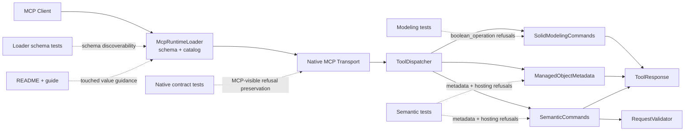

# Technical Plan: PLAT-16 Align Residual Public Contract Discoverability With Runtime Constraints
**Task ID**: `PLAT-16`
**Title**: `Align Residual Public Contract Discoverability With Runtime Constraints`
**Status**: `finalized`
**Date**: `2026-04-23`

## Source Task

- [Align Residual Public Contract Discoverability With Runtime Constraints](./task.md)

## Problem Summary

The Ruby-native MCP runtime already has shared declaration and refusal conventions, but a small residual set of shipped first-class tools still teaches incomplete value discoverability. In those cases the runtime already knows a finite or context-dependent allowed set, yet the public contract still leaves clients guessing through broad strings, incomplete refusals, or both.

PLAT-16 is a bounded cleanup task. It should reconcile the remaining shipped first-class discoverability drift without redesigning tool boundaries, creating a second contract-definition subsystem, or forcing context-dependent constraints into misleading flat schemas.

## Goals

- audit shipped first-class public tools for residual finite or context-dependent discoverability drift and fix every confirmed mismatch found in that bounded audit
- expose unconditional finite option sets through schema and invalid-option refusals where the runtime owns an authoritative set
- expose context-dependent allowed sets through truthful runtime refusals when a flat schema enum would misstate the real contract
- lock the corrected discoverability surfaces with owning tests plus representative native loader and transport contract coverage

## Non-Goals

- redesigning public tool names, workflow boundaries, or general request-shape architecture
- creating a new central contract-definition registry or heavy catalog-conformance framework
- widening existing tool behavior or adding new product capabilities
- forcing context-dependent fields into static schemas that overstate applicability

## Related Context

- [PLAT-16 task](./task.md)
- [HLD: Platform Architecture and Repo Structure](specifications/hlds/hld-platform-architecture-and-repo-structure.md)
- [HLD: Semantic Scene Modeling](specifications/hlds/hld-semantic-scene-modeling.md)
- [PLAT-14 task](specifications/tasks/platform/PLAT-14-establish-native-mcp-tool-contract-and-response-conventions/task.md)
- [PLAT-15 task](specifications/tasks/platform/PLAT-15-align-public-targeting-and-generic-mutation-tool-boundaries/task.md)
- [SEM-11 task](specifications/tasks/semantic-scene-modeling/SEM-11-align-managed-object-maintenance-surface/task.md)
- [SEM-13 task](specifications/tasks/semantic-scene-modeling/SEM-13-realize-horizontal-cross-section-terrain-drape-for-paths/task.md)
- Runtime seams:
  - [src/su_mcp/runtime/native/mcp_runtime_loader.rb](src/su_mcp/runtime/native/mcp_runtime_loader.rb)
  - [src/su_mcp/runtime/tool_dispatcher.rb](src/su_mcp/runtime/tool_dispatcher.rb)
  - [src/su_mcp/runtime/tool_response.rb](src/su_mcp/runtime/tool_response.rb)
  - [src/su_mcp/modeling/solid_modeling_commands.rb](src/su_mcp/modeling/solid_modeling_commands.rb)
  - [src/su_mcp/semantic/managed_object_metadata.rb](src/su_mcp/semantic/managed_object_metadata.rb)
  - [src/su_mcp/semantic/semantic_commands.rb](src/su_mcp/semantic/semantic_commands.rb)
  - [src/su_mcp/semantic/request_validator.rb](src/su_mcp/semantic/request_validator.rb)

## Research Summary

- `PLAT-14` already established the right shared behavior: when the runtime knows an authoritative finite set for an invalid known-option case, the public refusal should expose `allowedValues`.
- `create_site_element.definition.mode`, `create_site_element.lifecycle.mode`, `delete_entities.constraints.ambiguityPolicy`, and `delete_entities.outputOptions.responseFormat` are already aligned and should not be replanned as PLAT-16 work.
- The bounded audit currently confirms these likely residual mismatch families:
  - `boolean_operation.operation`
  - `set_entity_metadata.set.structureCategory`
  - `set_entity_metadata.clear`
  - `create_site_element.hosting.mode` contextual refusal narrowing
- `boolean_operation.operation` is a globally finite field and currently remains schema-broad and invalid-option-error-prone.
- `set_entity_metadata.set.structureCategory` has a globally finite approved vocabulary, but the loader schema still exposes a broad string.
- `set_entity_metadata.clear` is context-dependent by target semantic type and required-field policy, so a flat per-target enum in the top-level schema would be misleading.
- `create_site_element.hosting.mode` already publishes the global hosting superset in schema, so the remaining gap is contextual refusal discoverability rather than schema exposure.

## Technical Decisions

### Data Model

- Treat PLAT-16 as a bounded audit plus remediation pass over shipped first-class public tools only.
- Record the bounded audit as an explicit first-class-tool coverage ledger in the implementation change, including:
  - every shipped first-class public tool inspected
  - every confirmed mismatch included in scope
  - untouched tools or fields explicitly ruled out for this task
- Keep the task bounded to finite or context-dependent discoverability drift only.
- Use this rule for corrected discoverability:
  - unconditional finite domain: publish the field vocabulary in schema and return structured invalid-option refusal details when callers still send an unsupported value
  - context-dependent domain: keep the schema broad or globally truthful, then return the narrowed allowed set in refusal details for the actual execution context
- The initial confirmed worklist is:
  - `boolean_operation.operation`
  - `set_entity_metadata.set.structureCategory`
  - `set_entity_metadata.clear`
  - `create_site_element.hosting.mode`

### API and Interface Design

- Do not add new public tools, aliases, or a new central contract-definition subsystem.
- Keep discoverability ownership in the runtime seam that already enforces the constraint.
- `boolean_operation.operation` should become a first-class discoverability surface:
  - loader schema exposes enum values `union`, `difference`, `intersection`
  - invalid operations return structured `unsupported_option` results instead of only raising a generic runtime error
- `set_entity_metadata.set.structureCategory` should expose the approved structure-category enum in schema as the global field-value domain.
- `set_entity_metadata.clear` should remain an array input, but its discoverability should come primarily from contextual refusal details rather than a misleading static per-target schema.
- `create_site_element.hosting.mode` should remain a global hosting superset in schema and should expose per-`elementType` narrowing through refusal details.

### Public Contract Updates

- `boolean_operation`
  - Request delta: `operation` becomes a schema enum instead of a broad string.
  - Response delta: invalid operations return structured `unsupported_option` with `field`, `value`, and `allowedValues`.
  - Schema and registration updates: update the loader schema for `operation`.
  - Dispatcher and routing updates: dispatcher mapping stays stable; command behavior changes in the modeling command surface only.
  - Contract and docs updates: add modeling behavior tests, loader schema assertions, representative MCP-visible refusal coverage if needed, and update docs/examples if the valid operation vocabulary is user-facing.
- `set_entity_metadata`
  - Request delta: `set.structureCategory` becomes a schema enum for the approved category vocabulary.
  - Response delta: invalid or inapplicable `structureCategory` updates and invalid `clear` requests expose actionable refusal details, including the rejected value and contextual `allowedValues` where the runtime knows them.
  - Schema and registration updates: update the loader schema for `set.structureCategory`; keep `clear` broad but documented as target-context-sensitive.
  - Dispatcher and routing updates: none beyond existing routing; behavior remains owned by the semantic metadata slice.
  - Contract and docs updates: extend semantic metadata tests, loader schema tests, native contract coverage for touched refusal surfaces, and user-facing docs that make clear the category vocabulary is global while applicability still depends on the resolved target type.
- `create_site_element`
  - Request delta: none to the global request shape.
  - Response delta: `unsupported_hosting_mode` refusals include `allowedValues` for the current `elementType`.
  - Schema and registration updates: preserve the broad global `hosting.mode` enum in schema.
  - Dispatcher and routing updates: none; update semantic command refusal shaping only.
  - Contract and docs updates: semantic command tests plus any user-facing guidance that now references contextual hosting-mode discoverability.

### Error Handling

- Preserve the `PLAT-14` distinction:
  - unexpected failures still use the runtime error path
  - invalid known-option cases use structured refusals when the runtime owns the authoritative set
- All PLAT-16-touched invalid-known-option or contextual narrowing cases should use shared `ToolResponse`-compatible refusal shaping rather than per-command ad hoc hashes.
- `boolean_operation.operation`
  - invalid value should return `unsupported_option`
  - refusal details should include:
    - `field: "operation"`
    - `value: <rejected value>`
    - `allowedValues: ["union", "difference", "intersection"]`
- `set_entity_metadata.set.structureCategory`
  - unapproved category values remain `unsupported_option`
  - refusal details should preserve `allowedValues`
  - inapplicable target-type cases should remain structured refusals and should become explicit enough that clients can tell the field is recognized but unsupported for the resolved target context
- `set_entity_metadata.clear`
  - invalid clear requests should expose the rejected clear value and the current target-context `allowedValues`
  - distinguish:
    - unknown or unsupported field for the resolved target type
    - recognized field that cannot be cleared because required-field policy blocks it
- `create_site_element.hosting.mode`
  - `unsupported_hosting_mode` should include `allowedValues` for the current `elementType`
  - refusal details should continue to carry the rejected mode and `elementType`

### State Management

- No new runtime configuration, cache, or registry should be introduced.
- Existing Ruby constants and capability-local policy tables remain the source of truth for allowed values.
- PLAT-16 only synchronizes discoverability surfaces to those existing runtime rules.
- The audit inventory is planning and implementation scaffolding, not a new runtime-owned state store.

### Integration Points

- Loader/schema ownership remains in [mcp_runtime_loader.rb](src/su_mcp/runtime/native/mcp_runtime_loader.rb).
- Routing remains stable through [tool_dispatcher.rb](src/su_mcp/runtime/tool_dispatcher.rb); PLAT-16 should not add routing complexity.
- Structured refusal shaping should reuse [tool_response.rb](src/su_mcp/runtime/tool_response.rb) wherever first-class tool behavior is upgraded from generic errors to invalid-option refusals.
- The semantic discoverability changes integrate through:
  - [managed_object_metadata.rb](src/su_mcp/semantic/managed_object_metadata.rb)
  - [semantic_commands.rb](src/su_mcp/semantic/semantic_commands.rb)
  - [request_validator.rb](src/su_mcp/semantic/request_validator.rb)
- Public-surface validation should continue through:
  - [test/runtime/native/mcp_runtime_loader_test.rb](test/runtime/native/mcp_runtime_loader_test.rb)
  - [test/runtime/native/mcp_runtime_native_contract_test.rb](test/runtime/native/mcp_runtime_native_contract_test.rb)
  - owning command tests under `test/modeling/` and `test/semantic/`

### Configuration

- No new runtime configuration, flags, or policy files.
- Approved value sets stay Ruby-owned in their current capability seams.
- If the bounded audit finds one additional confirmed first-class mismatch, fix it within the same task only if it fits the same discoverability-cleanup boundary.

## Architecture Context

## Key Relationships

- Loader schema is the first discoverability surface for unconditional finite domains.
- Owning command and validator seams are the discoverability surface for context-dependent narrowing.
- `ToolResponse` should remain the shared refusal vocabulary instead of each capability inventing its own invalid-option shape.
- PLAT-16 should strengthen existing seams and tests, not introduce a second contract-definition owner.

## Acceptance Criteria

- The bounded audit result for shipped first-class public tools is explicit enough that reviewers can see which discoverability mismatches were confirmed and fixed under PLAT-16.
- The bounded audit result includes a negative list of shipped first-class public tools or fields inspected and ruled out, so PLAT-16 completion is not inferred from a partial spot-check.
- `boolean_operation.operation` is discoverable as a finite option set from schema and returns structured refusal details with `field`, `value`, and `allowedValues` when the caller provides an invalid operation.
- `set_entity_metadata.set.structureCategory` exposes the approved category vocabulary in-band, and runtime behavior still refuses inapplicable target-type usage explicitly.
- `set_entity_metadata.clear` no longer leaves clients guessing after an invalid clear request; the refusal exposes the rejected clear value and the current target-context allowed values.
- `create_site_element.hosting.mode` continues to expose the global hosting vocabulary in schema, and invalid element-type-specific hosting requests expose narrowed `allowedValues` in refusal details.
- Every touched mismatch is covered by owning behavior tests and representative loader/native-contract tests where MCP-visible discoverability must survive transport.
- User-facing docs are updated where valid-value guidance or discoverability changed materially for the touched surfaces.
- The task lands without renaming tools, widening capabilities, or adding a new contract-definition subsystem.

## Test Strategy

### TDD Approach

Start with the bounded audit and add failing tests that pin the intended discoverability surfaces before changing runtime behavior. Use loader tests to lock schema exposure, owning command tests to lock refusal semantics, and representative native contract tests to prove `allowedValues` and refusal details survive the MCP boundary.

### Required Test Coverage

- Loader/catalog tests in [test/runtime/native/mcp_runtime_loader_test.rb](test/runtime/native/mcp_runtime_loader_test.rb) for:
  - `boolean_operation.operation` enum exposure
  - `set_entity_metadata.set.structureCategory` enum exposure
  - any touched schema or tool-description changes needed to keep discoverability truthful
- Modeling tests in [test/modeling/solid_modeling_commands_test.rb](test/modeling/solid_modeling_commands_test.rb) for:
  - invalid `operation` returns structured refusal rather than only raising
  - refusal details include `field`, `value`, and `allowedValues`
- Semantic metadata tests in:
  - [test/semantic/semantic_metadata_test.rb](test/semantic/semantic_metadata_test.rb)
  - [test/semantic/semantic_commands_test.rb](test/semantic/semantic_commands_test.rb)
  for:
  - `structureCategory` invalid-value discoverability
  - `structureCategory` target-type applicability refusal clarity
  - `clear` invalid-field and required-field refusal details with contextual allowed values
  - `unsupported_hosting_mode` refusal details including narrowed allowed values
- Native transport tests in [test/runtime/native/mcp_runtime_native_contract_test.rb](test/runtime/native/mcp_runtime_native_contract_test.rb) for every touched refusal surface where `allowedValues` or contextual refusal details must survive transport unchanged
- Validation commands:
  - `bundle exec rake ruby:test`
  - `bundle exec rake ruby:lint`
  - `bundle exec rake package:verify`

## Instrumentation and Operational Signals

- Loader schema assertions are the primary signal that unconditional finite domains did not regress back to broad strings.
- Owning refusal tests are the primary signal that contextual narrowing remains actionable.
- Native contract cases are the primary MCP-boundary signal that `allowedValues` survives transport unchanged.
- No new runtime telemetry is required; the correction is contractual rather than operational.

## Implementation Phases

1. Freeze the bounded audit result and add failing contract tests.
   - Confirm the first-class public-tool mismatch inventory.
   - Record the negative list of inspected first-class tools or fields ruled out of scope.
   - Add or tighten loader and owning tests for the touched fields.
2. Fix unconditional finite-domain discoverability.
   - Update `boolean_operation.operation` schema exposure.
   - Convert invalid `boolean_operation` option handling to structured refusal.
   - Update `set_entity_metadata.set.structureCategory` schema exposure.
3. Fix context-dependent discoverability.
   - Tighten `set_entity_metadata.clear` refusal details.
   - Add contextual `allowedValues` to `unsupported_hosting_mode`.
4. Finalize integration and docs.
   - Update native contract coverage for every touched refusal surface.
   - Update [README.md](README.md) and current source-of-truth docs where touched guidance changed.
   - Run Ruby validation and record any remaining manual verification gaps.

## Rollout Approach

- Ship PLAT-16 as one bounded discoverability cleanup change.
- Do not add compatibility aliases, new tool names, or a registry migration path.
- Update docs in the same change for every touched public surface.
- If the bounded audit finds additional first-class mismatches of the same class, include them only if they fit the task’s existing scope without widening into redesign.

## Risks and Controls

- Audit incompleteness could leave one more shipped first-class mismatch behind: freeze and document the bounded audit result before implementing fixes.
- Static schemas could overstate context-dependent truth: keep contextual narrowing in refusals rather than flattening per-target behavior into misleading enums.
- Older modeling behavior could regress when invalid-option errors are converted to refusals: cover the modeling surface with owning tests and representative native transport checks.
- Refusal shapes could drift across seams if one touched path bypasses the shared refusal vocabulary: require all touched invalid-known-option paths to use `ToolResponse`-compatible refusal shaping.
- Refusal details could be correct locally but lose fidelity through transport: add native contract cases that assert `allowedValues` preservation for every touched refusal surface.
- Doc drift could leave clients following stale value guidance even after runtime fixes: update touched docs in the same change and review the final diff for schema/docs parity.

## Dependencies

- [PLAT-14](specifications/tasks/platform/PLAT-14-establish-native-mcp-tool-contract-and-response-conventions/task.md)
- [PLAT-15](specifications/tasks/platform/PLAT-15-align-public-targeting-and-generic-mutation-tool-boundaries/task.md)
- [SEM-11](specifications/tasks/semantic-scene-modeling/SEM-11-align-managed-object-maintenance-surface/task.md)
- [SEM-13](specifications/tasks/semantic-scene-modeling/SEM-13-realize-horizontal-cross-section-terrain-drape-for-paths/task.md)

## Premortem

### Intended Goal Under Test

PLAT-16 must let clients discover the valid values for every touched finite or context-dependent public field without falling back to trial-and-error, while staying bounded to discoverability cleanup rather than broader tool redesign.

### Failure Paths and Mitigations

- **Base assumptions that could lead us astray**
  - Business-plan mismatch: The task needs one bounded but complete cleanup for shipped first-class mismatches, but the plan could optimize for only the already-mentioned examples.
  - Root-cause failure path: The audit is treated as a spot-check instead of an explicit coverage ledger over every shipped first-class public tool.
  - Why this misses the goal: One residual mismatch ships unchanged, so clients still face trial-and-error on a supposedly cleaned-up surface.
  - Likely cognitive bias: Availability bias.
  - Classification: Validate before implementation
  - Mitigation now: Require an explicit first-class-tool audit ledger with included mismatches and a negative list of ruled-out surfaces.
  - Required validation: Review the final audit record and confirm each shipped first-class tool was inspected or explicitly excluded with rationale.
- **Shortcuts that could weaken the outcome**
  - Business-plan mismatch: The task needs canonical public discoverability behavior, but the plan could allow each seam to shape invalid-known-option refusals differently.
  - Root-cause failure path: One touched command returns an ad hoc refusal hash or generic runtime error instead of the shared refusal vocabulary.
  - Why this misses the goal: Clients cannot rely on one recovery pattern across touched tools.
  - Likely cognitive bias: Local optimization bias.
  - Classification: Validate before implementation
  - Mitigation now: Require all PLAT-16-touched invalid-known-option and contextual refusal cases to use `ToolResponse`-compatible shaping.
  - Required validation: Owning tests plus native transport tests assert the same refusal structure for all touched fields.
- **Areas that could be weakly implemented**
  - Business-plan mismatch: The task needs truthful discoverability, but static schema changes could still overstate context-dependent applicability.
  - Root-cause failure path: The implementation adds enums without preserving runtime-context caveats or actionable refusal details.
  - Why this misses the goal: Clients see more discoverability but still guess the applicable subset at execution time.
  - Likely cognitive bias: False precision.
  - Classification: Validate before implementation
  - Mitigation now: Keep contextual narrowing in refusal details, document target-context dependence, and avoid flattening `clear` into a misleading static enum.
  - Required validation: Loader assertions, semantic refusal tests, and doc review all confirm the global-vs-contextual distinction stays explicit.
- **Tests and evaluations needed to stay on track**
  - Business-plan mismatch: The task needs MCP-visible contract truth, but the plan could over-rely on local tests.
  - Root-cause failure path: `allowedValues` survives local command tests but is dropped, renamed, or reshaped at the transport boundary.
  - Why this misses the goal: The runtime is correct internally while clients still cannot recover from bad calls.
  - Likely cognitive bias: Substitution bias.
  - Classification: Requires implementation-time instrumentation or acceptance testing
  - Mitigation now: Require native contract coverage for every touched refusal surface, not only one representative refusal.
  - Required validation: Native contract fixtures and tests assert transport-visible preservation for all touched refusal cases.
- **What must be true for the task to succeed**
  - Business-plan mismatch: The task needs bounded cleanup, but the plan could drift into broader schema architecture work.
  - Root-cause failure path: The implementation invents a registry or heavier verification framework instead of fixing discoverability in the current seams.
  - Why this misses the goal: The task expands, slows down, and risks never finishing the actual cleanup.
  - Likely cognitive bias: Overengineering bias.
  - Classification: Validate before implementation
  - Mitigation now: Keep ownership in current runtime seams and explicitly reject new subsystem work in the plan.
  - Required validation: Final diff shows no new registry/framework and only bounded loader/runtime/test/doc changes.
- **Second-order and third-order effects**
  - Business-plan mismatch: The task needs clients to learn the corrected contract, but stale docs/examples could continue teaching the old values.
  - Root-cause failure path: Runtime and tests are updated, while README/guide guidance for touched fields remains stale or ambiguous.
  - Why this misses the goal: Clients keep generating bad calls from outdated examples even after the runtime is fixed.
  - Likely cognitive bias: Change blindness.
  - Classification: Requires implementation-time instrumentation or acceptance testing
  - Mitigation now: Treat touched docs as release-blocking for PLAT-16 and review schema/docs parity before completion.
  - Required validation: Final diff review confirms touched docs changed with the runtime and tests.

## Quality Checks

- [x] All required inputs validated
- [x] Problem statement documented
- [x] Goals and non-goals documented
- [x] Research summary documented
- [x] Technical decisions included
- [x] Architecture context included
- [x] Acceptance criteria included
- [x] Test requirements specified
- [x] Instrumentation and operational signals defined when needed
- [x] Risks and dependencies documented
- [x] Rollout approach documented when needed
- [x] Small reversible phases defined
- [x] Premortem completed with falsifiable failure paths and mitigations
