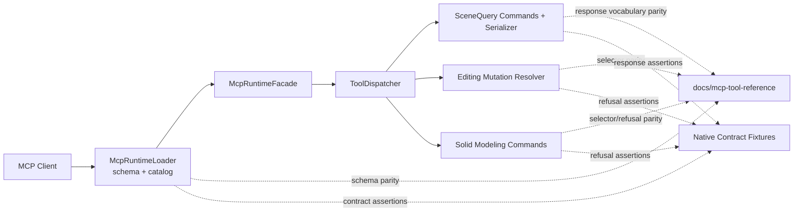

# Technical Plan: PLAT-17 Harmonize Residual Public MCP Contract Conventions
**Task ID**: `PLAT-17`
**Title**: `Harmonize Residual Public MCP Contract Conventions`
**Status**: `finalized`
**Date**: `2026-04-28`

## Source Task

- [Harmonize Residual Public MCP Contract Conventions](./task.md)

## Problem Summary

The public MCP surface still exhibits cross-family contract inconsistency in selector vocabulary, response casing, caller-recoverable refusal behavior, and runtime/docs discoverability alignment. This plan converges those seams in a bounded pass without introducing new tools or widening capability ownership.

## Goals

- Converge touched first-class public tools toward one coherent selector and response vocabulary posture.
- Align runtime schema/registration, runtime behavior, fixtures/tests, and user-facing docs for every touched contract seam.
- Normalize caller-recoverable invalid-input handling to structured refusals on touched first-class tools while preserving runtime error boundaries for unexpected failures.

## Non-Goals

- introducing new semantic, terrain, or staged-asset product capabilities
- redesigning escape-hatch behavior for `eval_ruby`
- broad architecture refactors unrelated to public contract convergence

## Related Context

- [PLAT-17 task](./task.md)
- [HLD: Platform Architecture and Repo Structure](specifications/hlds/hld-platform-architecture-and-repo-structure.md)
- [HLD: Scene Targeting and Interrogation](specifications/hlds/hld-scene-targeting-and-interrogation.md)
- [HLD: Semantic Scene Modeling](specifications/hlds/hld-semantic-scene-modeling.md)
- [MCP Tool Authoring Standard for SketchUp Modeling](specifications/guidelines/mcp-tool-authoring-sketchup.md)
- [PLAT-14 task](specifications/tasks/platform/PLAT-14-establish-native-mcp-tool-contract-and-response-conventions/task.md)
- [PLAT-15 task](specifications/tasks/platform/PLAT-15-align-public-targeting-and-generic-mutation-tool-boundaries/task.md)
- [PLAT-16 task](specifications/tasks/platform/PLAT-16-align-residual-public-contract-discoverability-with-runtime-constraints/task.md)

## Research Summary

- Residual drift is concentrated in known seams already visible in runtime/catalog/docs: mixed selector shapes (`id`, `targetReference`, `target_id/tool_id`), mixed response field casing, and uneven invalid-input refusal behavior.
- Earlier platform tasks intentionally deferred full cross-family harmonization, so PLAT-17 should treat this as bounded convergence rather than net-new capability expansion.
- The highest-risk delivery failure is partial convergence where runtime behavior changes without synchronized schema/docs/fixtures updates.
- Useful calibrated analog signals:
  - [STI-03 size](specifications/tasks/scene-targeting-and-interrogation/STI-03-extend-sample-surface-z-with-profile-and-section-sampling/size.md) reinforces that public contract shifts drive high validation burden and rework when docs/schema/runtime drift.
  - [SEM-15 size](specifications/tasks/semantic-scene-modeling/SEM-15-add-terrain-anchored-hosting-for-tree-proxy-and-structure/size.md) reinforces host-sensitive validation and refusal-path correctness as recurring risk for cross-cutting contract work.

## Technical Decisions

### Data Model

- Canonical public selector shape for touched tools is compact reference objects (`targetReference` and, for dual-target operations, `toolReference`) using `sourceElementId|persistentId|entityId`.
- Breaking-change posture: legacy selector fields (`id`, `target_id`, `tool_id`) are removed from the public request contract for touched tools.
- Response vocabulary for touched first-class tools is camelCase for public fields.
- Unit semantics are explicit per field family; no global meter claim remains where runtime values are not normalized.

### API and Interface Design

- Keep `src/su_mcp/runtime/native/mcp_runtime_loader.rb` as the canonical registration and schema owner.
- For touched tools, loader schema and command behavior must be updated in the same change set:
  - selector fields
  - requiredness rules
  - finite option discoverability
  - response field naming discoverability notes where applicable
- Keep command ownership where it already belongs (`scene_query`, `editing`, `modeling`); do not move behavior into runtime bootstrap.

### Public Contract Updates

#### Tool-by-tool request and response deltas

1. `get_entity_info`
   - **Request delta**
     - Require `targetReference` (`sourceElementId|persistentId|entityId`).
     - Remove `id` from the public request contract.
     - Runtime validation requires `targetReference` and successful entity resolution.
   - **Schema delta**
     - Loader schema exposes only `targetReference` with `additionalProperties: false`.
   - **Response delta**
     - Entity payload moves to canonical camelCase field keys (shared serializer update).
   - **Refusal delta**
     - `missing_target` when `targetReference` is absent.
     - `invalid_target_reference` when `targetReference` is malformed or unresolved.

2. `transform_entities`
   - **Request delta**
     - Require `targetReference`.
     - Remove `id` from the public request contract.
     - Runtime validation requires a valid canonical selector.
   - **Schema delta**
     - Loader schema documents only canonical selector fields.
   - **Response delta**
     - Keep existing mutation outcome envelope; no shape widening.
   - **Refusal delta**
     - Preserve deterministic `missing_target` and `invalid_target_reference` refusals through shared resolver behavior.

3. `set_material`
   - **Request delta**
     - Require `targetReference`.
     - Remove `id` from the public request contract.
     - Runtime validation requires a valid canonical selector.
   - **Schema delta**
     - Loader schema documents only canonical selector fields.
   - **Response delta**
     - Keep existing mutation outcome envelope; no shape widening.
   - **Refusal delta**
     - Preserve deterministic `missing_target` and `invalid_target_reference` refusals through shared resolver behavior.

4. `boolean_operation`
   - **Request delta**
     - Require canonical `targetReference` and `toolReference`.
     - Remove `target_id` and `tool_id` from the public request contract.
     - Runtime validation requires both canonical references and successful entity resolution for each.
   - **Schema delta**
     - Loader schema publishes only canonical pair fields.
     - Runtime rejects removed legacy selector fields as unsupported request fields.
   - **Response delta**
     - Return structured success envelope using `ToolResponse.success(outcome: 'boolean_applied', resultEntity: ...)` rather than raw `{ success: true, id: ... }`.
   - **Refusal delta**
     - `missing_target` when either canonical reference is absent.
     - `invalid_target_reference` when either canonical reference is malformed or unresolved.
     - Existing invalid-operation refusal (`unsupported_option`) remains with `allowedValues`.

5. Scene-query entity serialization surfaces (`get_scene_info`, `list_entities`, `get_entity_info`, `get_selection`)
   - **Response delta**
     - Normalize serialized entity keys to camelCase for MCP-facing payloads.
     - Concrete key migrations:
       - `persistent_id` -> `persistentId`
       - `definition_name` -> `definitionName`
       - `children_count` -> `childrenCount`
       - `active_path_depth` -> `activePathDepth`
       - `top_level_entities` -> `topLevelEntities`
       - `selected_entities` -> `selectedEntities`
       - `by_type` -> `byType`
   - **Schema/documentation delta**
     - Update docs examples and response notes to reflect camelCase field names.

#### Cross-artifact updates required in same change

- Runtime behavior:
  - `src/su_mcp/scene_query/scene_query_commands.rb`
  - `src/su_mcp/scene_query/scene_query_serializer.rb`
  - `src/su_mcp/editing/mutation_target_resolver.rb`
  - `src/su_mcp/modeling/solid_modeling_commands.rb`
- Loader schema/registration:
  - `src/su_mcp/runtime/native/mcp_runtime_loader.rb`
- Dispatcher/routing (if boolean canonical pair introduces different resolver path):
  - `src/su_mcp/runtime/tool_dispatcher.rb` (only if mapping or argument shape mediation changes)
- Contract tests/fixtures:
  - `test/runtime/native/mcp_runtime_loader_test.rb`
  - `test/runtime/native/mcp_runtime_native_contract_test.rb`
  - `test/support/native_runtime_contract_cases.json`
  - owning command tests in `test/scene_query/`, `test/editing/`, `test/modeling/`
- Docs/examples:
  - `docs/mcp-tool-reference.md` (tool inventory sync, selector policy, response-key casing, unit semantics notes)

### Error Handling

- Touched caller-recoverable invalid request paths return structured refusals via shared `ToolResponse` vocabulary.
- Unexpected internal exceptions remain on the runtime error path and are translated by native runtime failure boundaries.
- Every structured invalid-option or invalid-selector refusal includes `field`, rejected `value` when applicable, and `allowedValues` when the runtime owns a finite set.

### State Management

- No persistent state or configuration migration work is required.
- Contract convergence is code-owned through existing command/runtime/schema seams and docs fixtures.

### Integration Points

- Runtime schema/registration: `src/su_mcp/runtime/native/mcp_runtime_loader.rb`
- Command seams:
  - `src/su_mcp/scene_query/scene_query_commands.rb`
  - `src/su_mcp/scene_query/scene_query_serializer.rb`
  - `src/su_mcp/editing/mutation_target_resolver.rb`
  - `src/su_mcp/modeling/solid_modeling_commands.rb`
- Public docs: `docs/mcp-tool-reference.md`
- Contract tests and fixtures:
  - `test/runtime/native/mcp_runtime_loader_test.rb`
  - `test/runtime/native/mcp_runtime_native_contract_test.rb`
  - `test/support/native_runtime_contract_cases.json`
  - owning command tests under `test/scene_query/`, `test/editing/`, `test/modeling/`

### Configuration

- No new feature flags.
- Breaking-change contract posture is explicit behavior, not environment-dependent toggles.

## Architecture Context

## Key Relationships

- Runtime loader remains the source of truth for discoverable request contracts.
- Command seams own execution semantics but must not diverge from loader/docs contracts.
- Docs and contract fixtures are first-class contract artifacts, not post-hoc updates.

## Acceptance Criteria

- Touched first-class tools expose one explicit canonical selector policy with deterministic missing-target and invalid-reference refusal behavior.
- Touched first-class response payloads no longer mix contradictory casing conventions for equivalent public fields.
- Touched caller-recoverable invalid-input paths return structured refusal payloads instead of runtime error-path failures.
- Runtime-exposed tool inventory and unit semantics are synchronized with `docs/mcp-tool-reference.md`.
- Native loader schema coverage and native fixture-backed contract checks detect regression for touched seams.

## Test Strategy

### TDD Approach

- Write/update failing schema and command tests for one seam at a time before code changes.
- Sequence by lowest-risk convergence first: docs/inventory + schema discoverability, then selector/refusal convergence, then response vocabulary convergence.
- Keep each phase reversible with explicit contract snapshots in tests and fixtures.

### Required Test Coverage

- Loader schema tests for touched selector and finite-option fields.
- Scene-query tests for response-field casing migrations and `get_entity_info` selector requiredness enforcement.
- Editing tests for `transform_entities` and `set_material` selector requiredness and invalid-reference refusal behavior.
- Modeling tests for `boolean_operation` canonical-pair requiredness and invalid-reference refusal behavior.
- Modeling tests for `boolean_operation` success envelope (`outcome` + `resultEntity`) and invalid-operation refusal parity.
- Native contract fixture updates for touched request/response/refusal seams.
- Docs parity checks (manual or scripted assertions) for runtime tool inventory and unit semantics.
- Repo validation commands:
  - `bundle exec rake ruby:test`
  - `bundle exec rake ruby:lint`
  - `bundle exec rake package:verify`

## Instrumentation and Operational Signals

- Contract fixture diffs indicate MCP-visible surface changes.
- Loader/schema tests indicate request discoverability drift.
- Command refusal tests indicate caller-recoverable-path stability.
- Docs parity checks indicate runtime/docs divergence risk.

## Implementation Phases

1. **Contract Inventory & Guardrails**
   - Lock touched surface inventory and add failing parity checks for runtime/docs mismatch.
2. **Selector & Refusal Convergence**
   - Normalize touched selector contracts and refusal behavior in editing/modeling/query seams.
3. **Response Vocabulary Convergence**
   - Normalize touched scene-query response field casing and update consumers/tests/fixtures/docs.
4. **Final Contract Hardening**
   - Update native fixtures, run full validation, and close residual docs/schema/runtime drift.

## Rollout Approach

- Land in small phases with fixture-backed diff visibility.
- Ship as a deliberate breaking change with synchronized runtime/schema/docs/fixtures updates.
- Do not ship partial convergence of runtime without synchronized schema/docs/fixtures updates.

## Risks and Controls

- **Risk: Partial contract convergence across artifacts**: enforce per-phase checklist requiring runtime, loader, fixtures, and docs updates together.
- **Risk: Client breakage from removed legacy selector fields**: add explicit negative tests for removed fields and document the breaking contract.
- **Risk: Response casing regression across command families**: add command-level and fixture-level assertions for touched fields.
- **Risk: Host-sensitive semantics hidden by local doubles**: for any touched behavior that depends on SketchUp runtime lifecycle/selection/persistence, add hosted-smoke validation notes and acceptance checks.

## Dependencies

- [PLAT-14 task](specifications/tasks/platform/PLAT-14-establish-native-mcp-tool-contract-and-response-conventions/task.md)
- [PLAT-15 task](specifications/tasks/platform/PLAT-15-align-public-targeting-and-generic-mutation-tool-boundaries/task.md)
- [PLAT-16 task](specifications/tasks/platform/PLAT-16-align-residual-public-contract-discoverability-with-runtime-constraints/task.md)

## Premortem Gate

Status: PASS

### Unresolved Tigers

- None.

### Plan Changes Caused By Premortem

- Added explicit phase ordering that isolates selector/refusal convergence from response-vocabulary convergence to reduce rollback cost.
- Added required docs/runtime parity and fixture-update checks as first-class acceptance surfaces to prevent contract drift.
- Added explicit breaking-change selector policy so legacy fields are removed consistently across touched tools.

### Accepted Residual Risks

- Risk: Consumer disruption from selector breaking changes.
  - Class: Paper Tiger
  - Why accepted: PLAT-17 is intentionally a convergence break with no compatibility window.
  - Required validation: removed-field rejection tests plus canonical selector-path coverage in command tests and native fixtures.
- Risk: Hidden host-sensitive behavior on touched paths.
  - Class: Paper Tiger
  - Why accepted: only blocks final claim when touched behavior depends on host runtime semantics.
  - Required validation: hosted-smoke evidence for any touched host-sensitive path.

### Carried Validation Items

- Run fixture-backed native contract checks for all touched seams after each phase.
- Verify docs inventory and unit semantics parity before final merge.
- Record hosted-smoke coverage notes when touched behavior cannot be proven with Ruby-only doubles.

### Implementation Guardrails

- Do not ship schema/runtime updates without synchronized docs and contract fixture updates.
- Do not introduce a second selector subsystem; converge on existing compact reference shape.
- Do not convert unexpected runtime faults into structured refusals.

## Quality Checks

- [x] All required inputs validated
- [x] Problem statement documented
- [x] Goals and non-goals documented
- [x] Research summary documented
- [x] Technical decisions included
- [x] Architecture context included
- [x] Acceptance criteria included
- [x] Test requirements specified
- [x] Instrumentation and operational signals defined when needed
- [x] Risks and dependencies documented
- [x] Rollout approach documented when needed
- [x] Small reversible phases defined
- [x] Premortem completed with falsifiable failure paths and mitigations
- [x] Planning-stage size estimate considered before premortem finalization
