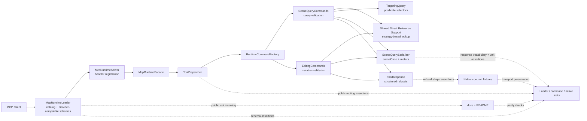

# Technical Plan: PLAT-17 Harmonize Residual Public MCP Contract Conventions

**Task ID**: `PLAT-17`
**Title**: `Harmonize Residual Public MCP Contract Conventions`
**Status**: `finalized`
**Date**: `2026-04-28`

## Source Task

- [Harmonize Residual Public MCP Contract Conventions](./task.md)

## Problem Summary

The Ruby-native MCP surface still exposes mixed public contract conventions after `PLAT-14`, `PLAT-15`, and `PLAT-16`. Public tools mix direct-reference selector vocabulary, response key casing, geometry unit semantics, docs/catalog claims, and caller-recoverable validation behavior. `boolean_operation` is a legacy public tool whose selector shape and result posture would require a one-off modernization, so PLAT-17 removes it completely instead of preserving or reshaping it.

## Goals

- Complete a checked-in first-class public tool shape and vocabulary sweep before behavior-changing implementation commits land.
- Remove public legacy contract residuals instead of keeping compatibility aliases.
- Delete `boolean_operation` completely; do not leave public, routed, fixture-backed, documented, or unreachable internal command behavior behind.
- Converge direct entity references on canonical reference-object vocabulary where the sweep confirms direct-reference behavior.
- Ensure public MCP geometry values use meters for request inputs and response outputs.
- Align runtime schema, command validation, response serialization, native fixtures, docs, and examples for every touched public contract seam.

## Non-Goals

- Introducing new semantic, terrain, staged-asset, or solid-modeling capabilities.
- Replacing `boolean_operation` with a new modern solid-modeling tool.
- Redesigning `eval_ruby`; it remains the only escape-hatch tool.
- Adding a heavy contract linter, registry, or separate contract-definition subsystem.
- Preserving old top-level selector aliases such as `id`, `target_id`, or `tool_id`.

## Related Context

- [PLAT-17 task](./task.md)
- [HLD: Platform Architecture and Repo Structure](specifications/hlds/hld-platform-architecture-and-repo-structure.md)
- [HLD: Scene Targeting and Interrogation](specifications/hlds/hld-scene-targeting-and-interrogation.md)
- [HLD: Semantic Scene Modeling](specifications/hlds/hld-semantic-scene-modeling.md)
- [MCP Tool Authoring Standard for SketchUp Modeling](specifications/guidelines/mcp-tool-authoring-sketchup.md)
- [Ruby Coding Guidelines](specifications/guidelines/ryby-coding-guidelines.md)
- [PLAT-14 task](specifications/tasks/platform/PLAT-14-establish-native-mcp-tool-contract-and-response-conventions/task.md)
- [PLAT-15 task](specifications/tasks/platform/PLAT-15-align-public-targeting-and-generic-mutation-tool-boundaries/task.md)
- [PLAT-16 task](specifications/tasks/platform/PLAT-16-align-residual-public-contract-discoverability-with-runtime-constraints/task.md)
- [PLAT-10 summary](specifications/tasks/platform/PLAT-10-migrate-current-tool-surface-to-ruby-native-mcp-and-retire-spike/summary.md)
- [PLAT-11 summary](specifications/tasks/platform/PLAT-11-decompose-remaining-ruby-modeling-command-hotspot/summary.md)

## Research Summary

Relevant prior work established the shared native tool declaration and response baseline (`PLAT-14`), introduced scoped inventory and shared direct-reference resolution (`PLAT-15`), and improved finite-option discoverability (`PLAT-16`). Those tasks intentionally left cross-family selector, response vocabulary, unit, and legacy tool cleanup for a follow-on convergence pass.

### Current Drift

- `get_entity_info` still requires top-level `id`.
- `transform_entities` and `set_material` still expose both top-level `id` and `targetReference`.
- `boolean_operation` still requires top-level `target_id` and `tool_id` and returns a raw `{ success: true, id: ... }` result.
- Scene-query entity summaries still leak snake_case keys such as `persistent_id`, `definition_name`, `children_count`, `active_path_depth`, `top_level_entities`, `selected_entities`, and `by_type`.
- `SceneQuerySerializer#bounds_to_h` serializes SketchUp numeric lengths without using `LengthConverter`, while public docs and HLDs require meters at the MCP boundary.
- Generic direct-reference fields such as `sample_surface_z.target` and `set_entity_metadata.target` need sweep classification so they do not survive as accidental mixed vocabulary.

## Technical Decisions

### Public Contract

- Public JSON-visible fields use camelCase unless the sweep records a deliberate domain-specific exception.
- Public geometry values use meters at the MCP boundary for both request inputs and response outputs.
- Direct entity references use compact reference objects with `sourceElementId`, `persistentId`, or nested compatibility `entityId`.
- Predicate matching remains `targetSelector`; it is not a compatibility alias for direct references.
- Legacy top-level direct-reference fields are not accepted as behavior after this task.
- Role-specific reference fields may stay role-specific only when they express a genuine role, such as `parent`, `children`, `entities`, `surfaceReference`, or `targetReference`, and when their nested reference shape and refusal semantics remain consistent.
- Generic or ambiguous direct-reference names such as `target` must be normalized or justified by the sweep as deliberate role vocabulary with matching tests and docs.

### Provider-Compatible Schemas And Validation

- `src/su_mcp/runtime/native/mcp_runtime_loader.rb` remains the canonical schema and catalog owner.
- Public schemas must stay provider-compatible:
  - top-level `type: "object"`
  - top-level `properties`
  - optional top-level `required`
  - no top-level `anyOf`, `oneOf`, `allOf`, `not`, or root `enum`
- Schemas document canonical current shapes. Runtime command validation owns nuanced current-shape validation when provider-compatible schemas cannot express it without root composition.
- This is not a compatibility pass-through posture. Legacy shapes may be rejected by wrapper/schema validation or by runtime validation; they must not execute as compatibility behavior.
- Existing `validate_tool_call_arguments: false` may remain, but end-to-end native transport behavior must be proven for representative current-schema cases where runtime validation should produce full structured refusal details.

### Selector And Reference Reuse

- PLAT-17 must not implement a new selector parser per tool.
- Shared direct-reference support is required for normalization, unsupported-field detection, lookup result semantics, and field-path-aware refusal mapping.
- The reusable direct-reference facility must preserve fast lookup paths:
  - `entityId` resolves through active-model direct ID lookup, not recursive scene traversal.
  - `persistentId` uses active-model persistent-ID lookup when available, with any fallback explicit and tested.
  - `sourceElementId` and other metadata-backed references may use traversal or a local index because they are extension metadata, not native model IDs.
- `TargetReferenceResolver` is reusable as lookup logic today, but implementation must harden its public-contract boundary before broad adoption: normalize consistently, avoid raw string exceptions leaking into commands, choose the cheapest lookup strategy per identifier, and keep entity-kind checks outside lookup or behind a thin adapter.
- `TargetingQuery` remains focused on predicate `targetSelector` matching and full-scene filtering.
- `Editing::MutationTargetResolver` should be simplified around canonical `targetReference` or replaced with a thin adapter over the shared direct-reference facility; it must not preserve old additive `id` plus `targetReference` behavior.

### Boolean Operation Deletion

- `boolean_operation` is deleted completely.
- Delete `SolidModelingCommands#boolean_operation`, boolean-operation-specific helper code, dedicated tests, native fixtures, docs, loader schema/catalog entry, dispatcher/facade/server routing, and runtime command assembly.
- Delete `SolidModelingCommands` itself if no non-boolean command behavior remains.
- Do not introduce `toolReference` or any replacement solid-modeling public convention in PLAT-17.

## Contract Sweep Requirement

Before changing behavior, implementation must create or update checked-in test-owned sweep evidence. The sweep is not a new runtime registry; it is review and regression evidence that every first-class public tool was inspected.

The sweep must include:

- every loader-classified `first_class` tool
- whether the tool remains public, is removed, or is explicitly out of scope with reason
- every top-level direct-reference-like field, including `target`, `targetReference`, `parent`, `children`, `entities`, and `surfaceReference`
- predicate-selector posture
- public response object families with identity/entity/summary vocabulary
- public geometry-bearing request or response field families
- structured refusal posture for caller-correctable inputs
- docs/schema/native-fixture parity

Known sweep candidates that must not be skipped:

- `sample_surface_z.target`
- `set_entity_metadata.target`
- hierarchy fields such as `create_group.parent`, `create_group.children`, `reparent_entities.parent`, and `reparent_entities.entities`
- validation and measurement reference fields where `targetReference` and `targetSelector` coexist
- staged asset and terrain surfaces that reuse direct references or scene-query bounds

## Contract Change Matrix

| Surface | Required Change | Verification |
|---|---|---|
| `boolean_operation` | Remove from catalog, schema, routing, command assembly, docs, fixtures, tests, and implementation code. Delete `SolidModelingCommands` if empty after removal. | Loader/catalog absence, dispatcher/facade/server absence, command-factory absence, docs parity, fixture removal, no boolean-operation implementation/test seam remains. |
| `get_entity_info` | Replace top-level `id` with required `targetReference`; support `sourceElementId`, `persistentId`, and nested `entityId`; response uses audited vocabulary and meters. | Loader schema, command validation, shared direct-reference fast-path tests, response vocabulary/unit tests, docs/examples. |
| `transform_entities` | Require canonical `targetReference`; remove public top-level `id`; keep transform inputs in meters. | Loader schema, editing command tests, mutation target resolver canonicalization, meter-to-internal conversion tests, docs/examples. |
| `set_material` | Require canonical `targetReference`; remove public top-level `id`; keep `material`. | Loader schema, editing command tests, material failure/refusal tests, docs/examples. |
| Scene-query responses | Normalize audited keys: `persistent_id` -> `persistentId`, `definition_name` -> `definitionName`, `children_count` -> `childrenCount`, `active_path_depth` -> `activePathDepth`, `top_level_entities` -> `topLevelEntities`, `selected_entities` -> `selectedEntities`, `by_type` -> `byType`. | Serializer/command tests, native fixture examples where practical, docs examples. |
| Public geometry outputs | Convert `bounds`, instance `origin`, and sweep-confirmed reused public serializers to meters. | Unit tests with non-1.0 conversion factors and docs examples. |
| Other sweep-confirmed references | Normalize primary direct-reference fields to `targetReference`; retain role-specific names only with sweep justification, shared nested reference semantics, tests, and docs. | Sweep evidence, loader schemas, command tests, docs parity. |

## Error And Refusal Policy

- Unexpected internal failures remain on the native runtime error path.
- Caller-correctable request, selector, unit, finite-option, and unsupported-field problems return structured `ToolResponse` refusals where they reach command validation.
- Touched direct-reference paths should converge toward:
  - `unsupported_request_field` for non-canonical fields that are not accepted as behavior
  - `missing_target` for missing required reference objects
  - `invalid_target_reference` when a reference object is malformed, contains unsupported nested fields, resolves to no entity, or resolves ambiguously
  - `unsupported_target_type` when the reference resolves to the wrong entity kind
  - `unsupported_option` for finite invalid values, with `field`, `value`, and `allowedValues`
- Refusal details should include `field`, `value` when applicable, `allowedValues` or `allowedFields` when known, and a short `reason` where it helps clients recover.

## Integration Points

- Runtime schema/catalog: `src/su_mcp/runtime/native/mcp_runtime_loader.rb`
- Runtime public routing: `src/su_mcp/runtime/tool_dispatcher.rb`, `src/su_mcp/runtime/native/mcp_runtime_facade.rb`, `src/su_mcp/runtime/native/mcp_runtime_server.rb`
- Command assembly: `src/su_mcp/runtime/runtime_command_factory.rb`
- Scene query and serialization: `src/su_mcp/scene_query/scene_query_commands.rb`, `src/su_mcp/scene_query/scene_query_serializer.rb`, `src/su_mcp/scene_query/target_reference_resolver.rb`
- Shared selector and reference support: `src/su_mcp/scene_query/target_reference_resolver.rb`, `src/su_mcp/scene_query/targeting_query.rb`
- Model lookup adapter: `src/su_mcp/adapters/model_adapter.rb`
- Editing commands and target resolution: `src/su_mcp/editing/editing_commands.rb`, `src/su_mcp/editing/mutation_target_resolver.rb`
- Legacy solid-modeling deletion: `src/su_mcp/modeling/solid_modeling_commands.rb`, `src/su_mcp/modeling/modeling_support.rb` if boolean-only code remains there
- Public docs: `docs/mcp-tool-reference.md`, `README.md`
- Native fixtures and tests: `test/support/native_runtime_contract_cases.json`, `test/runtime/native/mcp_runtime_loader_test.rb`, `test/runtime/native/mcp_runtime_native_contract_test.rb`

## Architecture Context

## Acceptance Criteria

- A checked-in first-class public contract sweep exists and identifies every inspected public tool, selector posture, response vocabulary posture, geometry unit posture, and inclusion/removal/out-of-scope decision.
- `boolean_operation` is absent from public catalog, `tools/list`, dispatcher/facade/server routing, runtime command assembly, native fixtures, docs, README public capability language, and implementation/test seams.
- No public schema or docs advertise top-level legacy direct-reference fields such as `id`, `target_id`, or `tool_id`.
- `get_entity_info`, `transform_entities`, and `set_material` expose canonical `targetReference` request contracts and no public legacy selector aliases.
- Shared direct-reference support preserves native lookup fast paths for `entityId` and supported `persistentId`; traversal/indexing is limited to metadata-backed references such as `sourceElementId`.
- Caller-correctable invalid target inputs that reach Ruby command validation return structured `ToolResponse` refusals with actionable details.
- Public response payloads use audited camelCase vocabulary for equivalent concepts across first-class tools.
- All public geometry-bearing request and response values are meters, with tests covering scene-query bounds/origin and any public serializers that reuse those helpers.
- Runtime catalog, dispatcher/facade/server wiring, native fixtures, docs, and examples remain synchronized.
- `eval_ruby` remains the only escape-hatch tool and does not shape first-class contract conventions.

## Test Strategy

Start with failing contract inventory and catalog tests, then work one seam at a time:

1. public sweep and `boolean_operation` complete deletion
2. shared direct-reference boundary and lookup strategies
3. canonical direct-reference schemas and command validation
4. response vocabulary and meter conversion
5. docs, README, native fixtures, and full validation

Required coverage:

- Loader tests prove public catalog excludes `boolean_operation`, `eval_ruby` remains the only `escape_hatch`, canonical schemas omit legacy top-level selectors, and provider-compatible root schema constraints remain enforced.
- Dispatcher/facade/server tests prove removed public tools do not route and remaining public tools still route to owning command targets.
- Command-factory tests prove no boolean-operation command seam is constructed for public MCP behavior.
- Shared reference tests prove `entityId` uses active-model direct lookup, supported `persistentId` uses native persistent-ID lookup, metadata-backed `sourceElementId` may traverse/index, and malformed/unsupported references produce mappable validation results.
- Scene-query tests cover `get_entity_info` `targetReference`, response casing, bounds/origin meters, and sweep-confirmed generic direct-reference normalization.
- Editing tests cover `transform_entities` and `set_material` canonical `targetReference`, rejection of legacy `id` as behavior, structured invalid-reference refusals, and meters-to-internal transform conversion.
- Native contract fixtures remove boolean-operation coverage and add representative canonical selector success/refusal, current-schema runtime validation, response-key, and meter examples where practical.
- Docs parity checks prove public docs match runtime inventory, no docs teach legacy selectors, and docs state meters as the public geometry unit.

Validation commands:

- `bundle exec rake ruby:test`
- `bundle exec rake ruby:lint`
- `bundle exec rake package:verify`

## Implementation Phases

1. **Inventory And Failing Tests**
   - Add the public contract sweep evidence.
   - Add failing assertions for boolean deletion, selector posture, response casing, meter semantics, and docs/fixture parity.

2. **Delete `boolean_operation`**
   - Remove loader entry, dispatcher/facade/server routing, command-factory assembly, docs, README language, and native fixtures.
   - Delete `SolidModelingCommands#boolean_operation`, boolean-operation-specific helpers, dedicated tests, and `SolidModelingCommands` itself if empty.

3. **Shared Direct-Reference Support**
   - Harden the shared resolver boundary so commands receive consistent normalized lookup results.
   - Preserve native active-model lookup for `entityId`, native persistent-ID lookup when available, and traversal/indexing only for metadata-backed references.
   - Simplify or replace editing-specific selector extraction that currently supports `id` plus `targetReference`.

4. **Canonical References, Responses, And Units**
   - Update `get_entity_info`, `transform_entities`, and `set_material` schemas and command validation.
   - Apply sweep-confirmed direct-reference normalizations.
   - Update scene-query serializer and commands for camelCase and meter conversion.

5. **Docs, Fixtures, And Full Validation**
   - Update `docs/mcp-tool-reference.md`, README, and native fixtures.
   - Run focused tests, full Ruby tests, lint, and package verification.
   - Record hosted/manual verification results or explicit gaps.

## Risks And Controls

- **Public contract drift**: Runtime behavior, loader schema, docs, and fixtures diverge. Control with sweep tests, loader tests, native fixtures, and docs parity checks in the same change.
- **Hidden boolean route remains**: Tool disappears from docs but still routes or assembles internally. Control with catalog, handler registration, dispatcher/facade/server, command-factory, and source-search assertions.
- **Over-broad sweep expands into product redesign**: Include equivalent-concept public-boundary fixes, but split any product redesign follow-up instead of preserving residual mixed behavior.
- **Under-specified sweep preserves residual mixed vocabulary**: Require a checked-in sweep table covering every first-class tool and every reference-like top-level field.
- **Unit conversion regression**: Use explicit meter conversion tests with non-1.0 conversion factors.
- **Wrapper/schema misunderstanding**: Control with loader tests forbidding root composition and command/native transport tests for nuanced runtime validation.
- **Duplicated selector implementations**: Route direct-reference lookup through shared support, keep predicate matching in `TargetingQuery`, and keep role-specific adapters thin.
- **Selector reuse regresses lookup performance**: Prove `entityId` and supported `persistentId` paths use native model lookup; limit traversal/indexing to metadata-backed references.
- **Host-sensitive entity behavior differs from tests**: Run focused live SketchUp smoke where practical for `get_entity_info`, `transform_entities`, `set_material`, and scene-query bounds/origin; record gaps explicitly if not run.

## Dependencies

- Implemented platform baseline from `PLAT-14`, `PLAT-15`, and `PLAT-16`.
- MCP tool authoring guidance, especially provider-compatible schema root constraints.
- Ruby coding guidelines for command/validation/serializer ownership.
- Existing target reference resolver and length converter.
- SketchUp model lookup APIs for active model entity IDs and persistent IDs.
- Local Ruby validation tooling: Minitest, RuboCop, Rake package verification.
- Optional but recommended SketchUp-hosted MCP smoke environment for final confidence.

## Rollout Approach

- Treat PLAT-17 as an intentional breaking public contract cleanup.
- Ship runtime, schema, fixture, and docs changes together.
- No compatibility window or feature flag.
- If implementation discovers a public tool whose contract cannot be harmonized without product redesign, split that tool into a follow-on task rather than preserving residual mixed behavior.

## Premortem Gate

Status: PASS

Unresolved Tigers: none.

Carried validation items:

- Contract sweep table or fixture covering every first-class public tool.
- Loader/docs/native-fixture parity checks after `boolean_operation` deletion.
- Meter conversion tests with a non-1.0 converter for bounds, origin, and reused public serializers.
- Hosted smoke where practical for target resolution, transforms, and scene-query bounds/origin.

Implementation guardrails:

- Do not reintroduce `boolean_operation` or replace it with a new solid-modeling public tool.
- Do not preserve legacy top-level selector aliases as behavior.
- Do not implement per-tool selector parsers when shared direct-reference support or `TargetingQuery` applies.
- Do not replace direct active-model entity lookup with full-scene traversal for `entityId` or supported `persistentId` references.
- Do not use root `anyOf`, `oneOf`, `allOf`, `not`, or root `enum` in public tool schemas.
- Do not let public geometry leave the MCP boundary in SketchUp internal units.
- Do not retain a role-specific reference name unless the sweep records why it is deliberate and tests/docs cover it.

## Quality Checks

- [x] All required inputs validated
- [x] Problem statement documented
- [x] Goals and non-goals documented
- [x] Research summary documented
- [x] Technical decisions included
- [x] Architecture context included
- [x] Acceptance criteria included
- [x] Test requirements specified
- [x] Risks and dependencies documented
- [x] Rollout approach documented
- [x] Small reversible phases defined
- [x] Premortem completed with falsifiable failure paths and mitigations
- [x] Planning-stage size estimate considered after refinement
