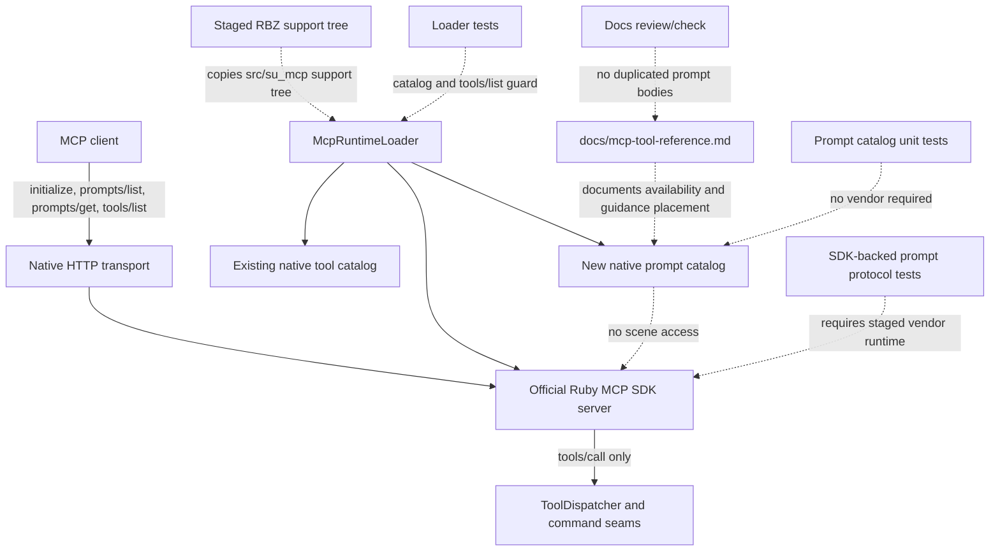

# Technical Plan: PLAT-18 Implement Initial MCP Prompts Guidance Surface
**Task ID**: `PLAT-18`
**Title**: `Implement Initial MCP Prompts Guidance Surface`
**Status**: `finalized`
**Date**: `2026-04-29`

## Source Task

- [Implement Initial MCP Prompts Guidance Surface](./task.md)

## Problem Summary

The Ruby-native MCP runtime exposes first-class tools with descriptions and schemas, but it does not expose MCP prompts as a server-owned guidance surface. Terrain workflow feedback showed that baseline-safe semantics must stay in `tools/list`, while richer reusable recipes, examples, and troubleshooting playbooks need a more appropriate home than long tool descriptions.

This task adds the first small prompt surface for reusable terrain and scene workflow guidance. It must preserve the rule that generic MCP clients can use tools safely from the tool catalog alone.

## Goals

- Expose an MCP prompt catalog through the Ruby-native runtime.
- Ship exactly two initial static no-argument prompts: `managed_terrain_edit_workflow` and `terrain_profile_qa_workflow`.
- Support `prompts/list` discovery and `prompts/get` retrieval through the packaged Ruby MCP SDK path.
- Keep existing `tools/list` behavior, tool schemas, tool names, dispatcher behavior, and command behavior unchanged.
- Keep prompt bodies focused on client-facing terrain and scene workflows.
- Document the prompt surface without duplicating full prompt bodies in docs.
- Cover prompt catalog shape, prompt discovery, prompt retrieval, and unchanged tool catalog behavior with focused tests.

## Non-Goals

- Do not move baseline-safe tool semantics out of tool descriptions or input-schema field descriptions.
- Do not implement or change terrain edit behavior.
- Do not redesign the public tool catalog.
- Do not add client-specific prompt wrappers.
- Do not add prompt arguments, prompt completion behavior, dynamic scene-state prompt generation, embedded resources, images, or audio content.
- Do not implement MCP resources unless a later task explicitly accepts that scope.
- Do not expose internal platform or implementation guidance as prompts for scene-manipulating clients.
- Do not duplicate full runtime prompt text in `docs/mcp-tool-reference.md`.

## Related Context

- [Platform Architecture and Repo Structure](specifications/hlds/hld-platform-architecture-and-repo-structure.md)
- [MCP Tool Authoring Standard](specifications/guidelines/mcp-tool-authoring-sketchup.md)
- [Ruby Coding Guidelines](specifications/guidelines/ryby-coding-guidelines.md)
- [SketchUp Extension Development Guidance](specifications/guidelines/sketchup-extension-development-guidance.md)
- [MTA-15 Harden Terrain Edit Contract Discoverability plan](specifications/tasks/managed-terrain-surface-authoring/MTA-15-harden-terrain-edit-contract-discoverability/plan.md)
- [PLAT-14 Establish Native MCP Tool Contract And Response Conventions summary](specifications/tasks/platform/PLAT-14-establish-native-mcp-tool-contract-and-response-conventions/summary.md)
- [PLAT-17 Harmonize Residual Public MCP Contract Conventions size ledger](specifications/tasks/platform/PLAT-17-harmonize-residual-public-mcp-contract-conventions/size.md)
- [MCP prompt specification](https://modelcontextprotocol.io/specification/latest/server/prompts)
- [MCP schema reference](https://modelcontextprotocol.io/specification/latest/schema)
- [Official Ruby MCP SDK README](https://github.com/modelcontextprotocol/ruby-sdk/blob/main/README.md)
- [Official Ruby MCP SDK server implementation](https://github.com/modelcontextprotocol/ruby-sdk/blob/main/lib/mcp/server.rb)

## Research Summary

- The MCP prompt specification defines `prompts/list` for discovery and `prompts/get` for retrieval. Prompt results contain a description and `messages`; text-only `user` messages are sufficient for this initial surface.
- The official Ruby MCP SDK supports registered prompts through `MCP::Prompt`, routes `prompts/list` and `prompts/get`, and accepts prompts during `MCP::Server` construction.
- The current local checkout does not include `vendor/ruby`, so SDK-backed transport tests may skip locally. This matches prior native runtime precedent, but the validation gap must be stated if the staged vendor runtime is unavailable.
- `PLAT-14` established the current native runtime catalog and response conventions. Its summary is the precedent for calling out skipped native transport tests when the staged runtime is absent.
- `PLAT-17` is the closest calibrated analog for public MCP surface work. Its lesson is that runtime catalog, docs, tests, fixtures, and client smoke can drift unless they move together.
- `MTA-15` is the content dependency for terrain guidance. It should provide the finalized wording boundary for safe terrain edit and profile QA recipes before prompt bodies are written.

## Technical Decisions

### Data Model

Add a small native prompt catalog seam under `src/su_mcp/runtime/native/`, such as `PromptCatalog` plus a lightweight prompt definition shape.

The prompt catalog should own:

- prompt names
- titles
- descriptions
- no-argument declaration
- prompt result descriptions
- text-only message bodies

The catalog should not own:

- tool schemas
- dispatcher routing
- command behavior
- terrain solver behavior
- SketchUp entity access
- docs rendering

Prompt bodies are static strings. They must avoid raw SketchUp objects and any non-serializable content.

### API and Interface Design

`McpRuntimeLoader` remains the server assembly owner. It should require the prompt catalog and pass SDK prompt objects into `MCP::Server.new`.

Expected runtime integration shape:

- `McpRuntimeLoader#build_server` continues to pass existing `tools: build_tools(handlers)`.
- It also passes `prompts: build_prompts` or equivalent.
- Prompt construction uses official SDK prompt APIs, not hand-built JSON-RPC handlers.
- The initial prompts expose no arguments.
- `managed_terrain_edit_workflow` provides reusable managed-terrain edit workflow guidance based on finalized `MTA-15` wording.
- `terrain_profile_qa_workflow` provides reusable terrain profile QA guidance based on finalized `MTA-15`, `STI-03`, and `SVR-04` boundaries.

### Public Contract Updates

This task adds a new MCP prompt surface. It does not change any existing public tool request or response shape.

- Request deltas:
  - Add support for MCP `prompts/list`.
  - Add support for MCP `prompts/get` with `name` and no required arguments for the two initial prompts.
  - No tool request shape changes.
- Response deltas:
  - `prompts/list` returns exactly the initial prompt catalog with prompt metadata and no required arguments.
  - `prompts/get` returns a prompt result with `description` and text-only prompt `messages`.
  - No tool response shape changes.
- Schema and registration updates:
  - Register prompts through the Ruby SDK runtime path.
  - Do not change tool input schemas.
- Dispatcher or routing updates:
  - No `ToolDispatcher`, runtime command factory, command, or SketchUp adapter changes.
- Contract and integration test updates:
  - Add catalog tests that do not require vendored SDK runtime.
  - Add SDK-backed loader or native transport tests for `prompts/list` and `prompts/get`, skipped only when the staged vendor runtime is absent.
  - Preserve existing `tools/list` inventory expectations.
- Docs and examples:
  - Update [docs/mcp-tool-reference.md](docs/mcp-tool-reference.md) to list the prompt names, intended use, and guidance-placement rules.
  - Review [README.md](README.md) for stale MCP surface language and update only if needed.
  - Do not duplicate full prompt bodies in docs.

### Error Handling

Prompt protocol errors remain SDK-owned.

- Unknown prompt names should use the SDK's JSON-RPC error path.
- Malformed `prompts/get` requests should use the SDK's JSON-RPC error path.
- Prompt handling should not use `ToolResponse`, because prompts are not tool calls.
- The task does not define compatibility behavior for extra prompt arguments. Tests should cover the supported no-argument happy paths and unknown prompt error behavior only if the SDK path is easy to exercise.

### State Management

No persistent state is introduced.

The prompt catalog is static and should not read or mutate SketchUp model state. Prompt list changes are not expected at runtime.

### Integration Points

- `src/su_mcp/runtime/native/mcp_runtime_loader.rb`: server assembly and prompt registration.
- `src/su_mcp/runtime/native/prompt_catalog.rb`: planned prompt catalog ownership.
- `test/runtime/native/mcp_runtime_loader_test.rb`: catalog and transport behavior coverage.
- `test/runtime/native/mcp_runtime_native_contract_test.rb` or equivalent direct loader tests: SDK-backed prompt protocol proof where practical.
- `docs/mcp-tool-reference.md`: public prompt surface documentation.
- `rakelib/release_support/runtime_package_stage_builder.rb`: expected to stage the new runtime file automatically because the support tree is copied wholesale.

### Configuration

No new configuration, flags, environment variables, or package manifest settings are planned.

Do not customize SDK prompt capabilities unless implementation proves the packaged SDK does not advertise prompts correctly. The upstream SDK already exposes prompt support as a server capability.

## Architecture Context

## Key Relationships

- `McpRuntimeLoader` remains the runtime assembly seam and should not absorb long prompt text directly.
- The prompt catalog is a separate MCP surface from the tool catalog.
- `ToolDispatcher` and capability commands remain unchanged because prompt retrieval does not execute scene operations.
- Full prompt body wording depends on finalized `MTA-15` wording and should be maintained in the runtime prompt catalog, not duplicated in docs.
- Docs describe discovery and guidance placement; prompt bodies provide the reusable recipe text.

## Acceptance Criteria

- The native runtime exposes `managed_terrain_edit_workflow` and `terrain_profile_qa_workflow` through `prompts/list`.
- Both initial prompts are static, no-argument prompts.
- `prompts/get` returns protocol-native prompt results for both prompts with text-only messages.
- Prompt bodies are based on finalized `MTA-15` wording and do not claim unsupported planar fitting, monotonic profile verdicts, preview/dry-run behavior, validation pass/fail policy, or hidden tool-calling requirements.
- Existing `tools/list` inventory and tool schemas remain unchanged.
- No `ToolDispatcher`, runtime command factory, terrain command, SketchUp adapter, or scene mutation behavior changes are introduced.
- Docs list the prompt catalog and explain that prompts are workflow guidance, not required context for correct tool calls.
- Docs do not duplicate full prompt bodies.
- Focused tests cover prompt catalog shape, prompt discovery/retrieval where the staged SDK runtime is available, and unchanged `tools/list` behavior.
- Package verification still stages and loads the native runtime with the new prompt catalog file.
- At least one SDK-backed runtime or package-smoke path proves `prompts/list` and `prompts/get` before the task can claim the prompt surface is complete.
- If SDK-backed prompt proof cannot run because `vendor/ruby` or equivalent staged runtime support is unavailable, the implementation closeout records a blocking validation gap instead of treating catalog-only tests as full completion.

## Test Strategy

### TDD Approach

Start with vendor-independent catalog tests. Lock the prompt names, no-argument shape, text-only result shape, and forbidden content claims before wiring the catalog into the SDK server.

Then wire prompts into `McpRuntimeLoader` and add SDK-backed tests for `prompts/list` and `prompts/get`, following existing skip behavior when the staged vendor runtime is absent.

### Required Test Coverage

- Prompt catalog unit tests:
  - exactly two prompt names
  - no required or optional arguments
  - non-empty title and description
  - text-only message body
  - no unsupported terrain behavior claims
- Loader tests:
  - `McpRuntimeLoader` includes prompt registration during server construction
  - existing canonical native tool names remain unchanged
  - existing `tools/list` behavior remains green
- SDK-backed runtime tests:
  - `prompts/list` returns both prompt definitions
  - `prompts/get` returns each prompt's text messages
  - malformed or unknown prompt behavior is covered only if the SDK path is available without brittle assertions
  - at least one SDK-backed prompt discovery/retrieval path runs before implementation is marked complete, or the summary carries a blocking validation gap
- Docs checks:
  - `docs/mcp-tool-reference.md` lists both prompt names
  - docs state prompts are guidance, not required hidden context
  - docs do not duplicate full prompt bodies
- Validation commands:
  - `bundle exec ruby -Itest test/runtime/native/mcp_runtime_loader_test.rb`
  - `bundle exec ruby -Itest test/runtime/native/mcp_runtime_native_contract_test.rb` when relevant
  - `bundle exec rake ruby:test`
  - `bundle exec rake ruby:lint`
  - `bundle exec rake package:verify`
  - `git diff --check`

## Instrumentation and Operational Signals

- No runtime telemetry is required.
- Operational proof is successful prompt discovery/retrieval through the SDK-backed runtime path, unchanged tool catalog tests, docs review, and package verification.

## Implementation Phases

1. Finalize content dependency.
   - Confirm `MTA-15` wording is finalized enough for prompt bodies.
   - Extract only reusable workflow recipe guidance appropriate for prompts.
2. Add prompt catalog seam.
   - Add prompt definition/catalog code under `src/su_mcp/runtime/native/`.
   - Add vendor-independent catalog tests.
3. Wire SDK prompt registration.
   - Require the prompt catalog from `McpRuntimeLoader`.
   - Build SDK prompt objects and pass them to `MCP::Server.new`.
   - Preserve existing tool construction and handler behavior.
4. Add protocol coverage.
   - Add `prompts/list` and `prompts/get` SDK-backed tests.
   - Keep existing `tools/list` assertions unchanged.
5. Update docs.
   - Document prompt availability and guidance placement.
   - Review README for stale MCP surface language.
6. Validate and close gaps.
   - Run focused tests, lint, package verification, and broader tests.
   - Prove `prompts/list` and `prompts/get` through an SDK-backed runtime path.
   - If staged vendor runtime is absent everywhere available to the implementer, carry a blocking validation gap rather than claiming public prompt completion.

## Rollout Approach

- Ship prompts as an additive MCP surface.
- No migration path is required because existing tools remain unchanged.
- If SDK-backed prompt registration fails in the packaged runtime, do not fall back to ad hoc JSON-RPC prompt handling. Fix the SDK integration or split the task.
- If `MTA-15` wording is not finalized, hold prompt-body implementation rather than shipping duplicated or speculative guidance.

## Risks and Controls

- `MTA-15` wording is not finalized: block prompt body implementation until wording is stable enough to avoid duplicated or contradictory recipes.
- SDK/runtime prompt API mismatch: use official SDK APIs and prove behavior through SDK-backed tests or package smoke; do not claim full completion without real prompt protocol proof.
- Contract drift between prompts, tools, and docs: keep baseline-safe semantics in tool descriptions, list prompt availability in docs, and avoid duplicated full prompt bodies.
- `McpRuntimeLoader` growth: keep prompt content in a small prompt catalog seam rather than embedding long prompt text in server assembly.
- Overclaiming terrain behavior: include forbidden-claim review against planar fitting, monotonic verdicts, preview/dry-run, validation pass/fail, and hidden required context.
- Host-sensitive SketchUp behavior risk: not applicable for prompt retrieval because prompts are static and do not access or mutate scene state.

## Dependencies

- Finalized `MTA-15` safe terrain edit and profile QA wording.
- Official Ruby MCP SDK prompt support in the packaged runtime path.
- Existing native runtime packaging path under `rakelib/`.
- Existing runtime tests under `test/runtime/native/`.
- [MCP prompt specification](https://modelcontextprotocol.io/specification/latest/server/prompts).
- [MCP schema reference](https://modelcontextprotocol.io/specification/latest/schema).

## Premortem Gate

Status: PASS

### Unresolved Tigers

- None.

### Plan Changes Caused By Premortem

- Tightened validation from "record skipped SDK-backed tests as a gap" to "run at least one SDK-backed `prompts/list` and `prompts/get` proof before claiming completion, or carry a blocking validation gap."
- Made the `MTA-15` dependency a first implementation phase so prompt bodies are not written from speculative or duplicated wording.
- Preserved the fallback prohibition: do not implement ad hoc JSON-RPC prompt handling if SDK registration fails.

### Accepted Residual Risks

- Risk: `MTA-15` wording may delay prompt body implementation.
  - Class: Paper Tiger
  - Why accepted: Waiting for finalized wording is intentional and prevents contradictory prompt/docs guidance.
  - Required validation: Implementation must cite the finalized `MTA-15` guidance source used for prompt bodies.
- Risk: SDK default capability details may differ from expectations.
  - Class: Paper Tiger
  - Why accepted: The task can rely on official SDK prompt support if actual `prompts/list` and `prompts/get` behavior is proven.
  - Required validation: SDK-backed prompt discovery/retrieval proof in tests or package smoke.

### Carried Validation Items

- SDK-backed `prompts/list` proof returns both prompt definitions.
- SDK-backed `prompts/get` proof returns text-only prompt messages for both prompts.
- Existing `tools/list` inventory remains unchanged.
- Docs list prompt availability and guidance placement without duplicating full prompt bodies.
- Package verification stages and loads the runtime with the new prompt catalog file.

### Implementation Guardrails

- Do not move baseline-safe tool semantics out of tool and field descriptions.
- Do not add prompt arguments, resources, completions, embedded media, or dynamic scene-state prompt generation.
- Do not let prompt retrieval call `ToolDispatcher`, command factory, terrain commands, or SketchUp adapters.
- Do not ship speculative prompt bodies before `MTA-15` wording is finalized enough to cite.
- Do not replace SDK prompt registration with custom JSON-RPC prompt handlers inside this task.

## Quality Checks

- [x] All required inputs validated
- [x] Problem statement documented
- [x] Goals and non-goals documented
- [x] Research summary documented
- [x] Technical decisions included
- [x] Architecture context included
- [x] Acceptance criteria included
- [x] Test requirements specified
- [x] Instrumentation and operational signals defined when needed
- [x] Risks and dependencies documented
- [x] Rollout approach documented when needed
- [x] Small reversible phases defined
- [x] Premortem completed with falsifiable failure paths and mitigations
- [x] Planning-stage size estimate considered before premortem finalization
