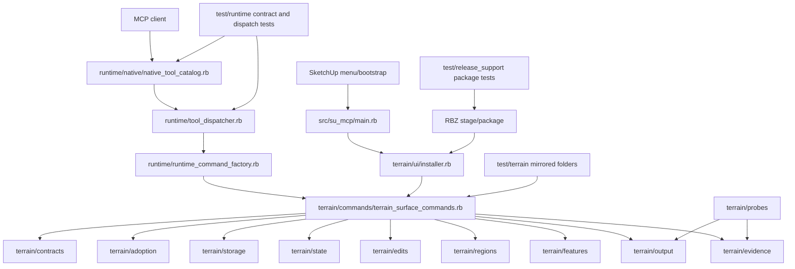

# Technical Plan: PLAT-19 Restructure Managed Terrain Support Tree
**Task ID**: `PLAT-19`
**Title**: `Restructure Managed Terrain Support Tree`
**Status**: `implemented`
**Date**: `2026-05-08`

## Source Task

- [Restructure Managed Terrain Support Tree](./task.md)

## Problem Summary

`src/su_mcp/terrain/` has grown into a large flat capability root containing
terrain command orchestration, public request contracts, state, storage,
adoption, edit kernels, region helpers, feature intent support, output
generation, evidence builders, probes, and UI support. That shape no longer
matches the platform direction for large capability folders or the managed
terrain HLD ownership boundaries.

This task is a mechanical restructuring. It should improve placement and review
clarity without changing terrain behavior, public MCP contracts, Ruby constants,
response shapes, packaging semantics, or SketchUp-hosted behavior.

## Goals

- Move terrain implementation files into named ownership folders.
- Keep `SU_MCP::Terrain` constants and public command methods stable.
- Mirror source-owned terrain tests under `test/terrain/`.
- Keep cross-cutting terrain tests in explicit terrain test areas.
- Update direct `require_relative` paths in source, tests, test support, runtime
  integration, and package tests.
- Validate terrain, runtime contract/dispatch, and package loadability.
- Update normative docs only when they contain stale current-state claims.

## Non-Goals

- Changing public terrain MCP tool names, schemas, descriptions, examples, or
  response payload contracts.
- Renaming Ruby classes, modules, or public constants for aesthetics.
- Redesigning terrain algorithms, output strategies, storage formats, evidence
  semantics, UI behavior, undo behavior, or package staging semantics.
- Adding compatibility root loaders unless implementation discovers an external
  consumer that cannot be updated directly.
- Restructuring other capability folders beyond terrain integration path updates.
- Updating historical completed task plans, summaries, or records.

## Related Context

- [Platform Architecture and Repo Structure](specifications/hlds/hld-platform-architecture-and-repo-structure.md)
- [Managed Terrain Surface Authoring](specifications/hlds/hld-managed-terrain-surface-authoring.md)
- [Ruby Coding Guidelines](specifications/guidelines/ryby-coding-guidelines.md)
- [SketchUp Extension Development Guidance](specifications/guidelines/sketchup-extension-development-guidance.md)
- [AGENTS.md](AGENTS.md)
- [PLAT-12 Ruby Support Tree analog](specifications/tasks/platform/README.md)

## Research Summary

- `PLAT-12` is the closest restructuring analog: it moved Ruby support files,
  rewired direct `require_relative` paths, preserved public constants, mirrored
  app-owned tests where practical, and validated package loadability.
- Terrain is large enough to justify a fuller internal structure: it currently
  has dozens of top-level Ruby files plus an existing `terrain/ui/` subtree.
- Runtime integration is narrow. External runtime touchpoints are
  `src/su_mcp/runtime/runtime_command_factory.rb`,
  `src/su_mcp/runtime/tool_dispatcher.rb`,
  `src/su_mcp/runtime/native/native_tool_catalog.rb`, and `src/su_mcp/main.rb`.
- Packaging copies the entire extension support tree recursively, so package code
  should not need structural changes unless tests expose a path-specific
  assertion.
- External/domain research is not needed for this folder split. Local HLDs,
  repository code, and Ruby load-path behavior are sufficient.

## Technical Decisions

### Data Model

No terrain data model changes are planned. The move preserves existing terrain
state classes, storage payloads, serializers, command evidence, and response
payloads.

The accepted source ownership folders are:

- `src/su_mcp/terrain/commands/`
- `src/su_mcp/terrain/contracts/`
- `src/su_mcp/terrain/state/`
- `src/su_mcp/terrain/storage/`
- `src/su_mcp/terrain/adoption/`
- `src/su_mcp/terrain/edits/`
- `src/su_mcp/terrain/regions/`
- `src/su_mcp/terrain/features/`
- `src/su_mcp/terrain/output/`
- `src/su_mcp/terrain/evidence/`
- `src/su_mcp/terrain/probes/`
- existing `src/su_mcp/terrain/ui/`

This taxonomy is terrain-specific. Other capabilities should not copy it by
default; they should split only when stable ownership pressure appears.

After the move, `src/su_mcp/terrain/` should contain no top-level Ruby files
unless an explicit index/loader is intentionally introduced and justified in the
implementation summary.

### Initial Move Map

| Target folder | Source file stems |
| --- | --- |
| `commands/` | `terrain_surface_commands` |
| `contracts/` | `create_terrain_surface_request`, `edit_terrain_surface_request` |
| `state/` | `heightmap_state`, `tiled_heightmap_state`, `terrain_surface_state_builder` |
| `storage/` | `attribute_terrain_storage`, `terrain_repository`, `terrain_state_serializer` |
| `adoption/` | `terrain_surface_adoption_sampler` |
| `edits/` | `bounded_grade_edit`, `corridor_transition_edit`, `local_fairing_edit`, `planar_region_fit_edit`, `regional_survey_correction_solver`, `survey_correction_solver`, `survey_point_constraint_edit` |
| `regions/` | `corridor_frame`, `fixed_control_evaluator`, `raster_edit_window`, `region_influence`, `sample_window`, `survey_bilinear_stencil`, `survey_grid_residual_field`, `survey_point_constraint_context`, `survey_point_input_refusals` |
| `features/` | `feature_intent_merger`, `feature_intent_set`, `terrain_feature_geometry`, `terrain_feature_geometry_builder`, `terrain_feature_intent_emitter`, `terrain_feature_planner` |
| `output/` | `adaptive_output_conformity`, `cdt_height_error_meter`, `cdt_terrain_candidate_backend`, `cdt_terrain_point_planner`, `cdt_triangulator`, `intent_aware_adaptive_grid_policy`, `intent_aware_enhanced_adaptive_grid_prototype`, `terrain_mesh_generator`, `terrain_output_cell_window`, `terrain_output_plan` |
| `evidence/` | `survey_correction_evidence`, `survey_correction_metrics`, `terrain_edit_evidence_builder`, `terrain_surface_evidence_builder` |
| `probes/` | `adaptive_terrain_mta23_candidate_comparison`, `mta23_failure_capture_artifact`, `mta23_hosted_sidecar_probe`, `mta24_hosted_bakeoff_probe`, `mta24_three_way_terrain_comparison` |
| `ui/` | keep current UI Ruby files and assets in place |

Implementation may adjust a single file placement only when direct dependency
evidence shows stronger ownership. Such adjustments should remain mechanical and
be reflected in mirrored tests.

### API and Interface Design

Public Ruby constants stay in `SU_MCP::Terrain`. The file path changes must not
change public class/module names, public MCP tool names, command method names, or
runtime handler keys.

Use direct `require_relative` rewrites. Do not add root-level compatibility
loaders for every moved file. A compatibility shim is allowed only if a real
external consumer cannot be updated in the same change.

Before moving files, produce an implementation-time require audit from the live
tree using `rg -n "require_relative .*terrain|require_relative" src/su_mcp/terrain src/su_mcp test/terrain test/support test/runtime test/release_support`.
Use that audit as the checklist for path rewrites and load checks.

### Public Contract Updates

Not applicable. Intended public contract delta is zero.

Implementation must still prove:

- `create_terrain_surface` and `edit_terrain_surface` tool names remain stable.
- Native input schemas still load request constants from moved contract files.
- Dispatcher mappings still route to terrain command methods.
- Command factory assembly still exposes the terrain command target.
- Terrain success/refusal response shapes remain stable.
- User-facing MCP docs and examples are unchanged unless a stale path or
  ownership claim is found in normative docs.

### Error Handling

No error-handling semantics change. Existing refusal payload codes, messages, and
runtime error envelopes must remain stable.

The primary new failure mode is load failure from a missed `require_relative`
path. Detect it with focused file loads, recursive terrain tests, runtime tests,
and package verification.

### State Management

No state ownership or migration changes are planned. Terrain state remains owned
by the terrain capability and persisted through existing repository/storage
behavior.

### Integration Points

Update direct require paths in these integration files when source files move:

- `src/su_mcp/runtime/runtime_command_factory.rb`
- `src/su_mcp/runtime/native/native_tool_catalog.rb`
- `src/su_mcp/main.rb` only if UI paths change
- runtime and package tests that assert current terrain paths

`src/su_mcp/runtime/tool_dispatcher.rb` should not require structural changes
unless validation exposes an accidental contract issue.

### Configuration

Not applicable. No configuration source, default, or override changes are
planned.

## Architecture Context

## Key Relationships

- Native catalog/schema ownership stays in `runtime/native/native_tool_catalog.rb`.
- Runtime dispatch and command assembly stay outside terrain.
- Terrain UI stays capability-local under `terrain/ui/` and invokes managed
  terrain command/use-case behavior.
- Terrain internals move under ownership folders while preserving
  `SU_MCP::Terrain` constants.
- Source-owned tests mirror source folders; cross-cutting terrain tests use
  explicit terrain test areas.

## Acceptance Criteria

- `src/su_mcp/terrain/` no longer holds the main terrain implementation as a
  large flat peer set.
- Public terrain MCP tool names, input schemas, command methods, Ruby constants,
  refusal payloads, and success response shapes are unchanged.
- Native catalog loading, schema constant references, dispatcher routing, and
  command factory assembly continue to reach terrain command behavior.
- Source-owned tests under `test/terrain/` mirror moved terrain source ownership
  folders.
- Cross-cutting terrain tests live under explicit terrain test areas.
- Affected source, test, test-support, runtime, and package require paths load
  the moved files.
- Focused terrain tests, relevant runtime tests, and package verification pass,
  or validation gaps are called out.
- Normative docs are reviewed for stale current-state path or ownership claims.
- Historical completed task artifacts remain unchanged.

## Test Strategy

### TDD Approach

This is a mechanical refactor, so the test-first move is to preserve the current
behavioral test expectations and use load/contract tests as the guardrail. Start
by freezing a move map, then move files in ownership batches and run focused
load tests after each significant batch.

### Required Test Coverage

- Terrain recursive suite:
  `bundle exec ruby -Itest -e 'Dir["test/terrain/**/*_test.rb"].sort.each { |path| load path }'`
- Focused terrain contract/command tests after the final move:
  - `bundle exec ruby -Itest test/terrain/contracts/terrain_contract_stability_test.rb`
  - `bundle exec ruby -Itest test/terrain/commands/terrain_surface_commands_test.rb`
- Runtime integration:
  - `bundle exec ruby -Itest test/runtime/tool_dispatcher_test.rb`
  - `bundle exec ruby -Itest test/runtime/runtime_command_factory_test.rb`
  - `bundle exec ruby -Itest test/runtime/native/mcp_runtime_loader_test.rb`
  - `bundle exec ruby -Itest test/runtime/native/mcp_runtime_native_contract_test.rb`
  - `bundle exec ruby -Itest test/runtime/public_mcp_contract_posture_test.rb`
- Package and UI asset path checks:
  - `bundle exec ruby -Itest test/release_support/runtime_package_stage_builder_test.rb`
  - `bundle exec rake package:verify`
- Structural checks:
  - verify `find src/su_mcp/terrain -maxdepth 1 -name '*.rb' -print` is empty,
    unless an intentional root index/loader is documented
  - audit `src/su_mcp/terrain/ui/` asset path references after moves even if the
    UI subtree itself remains in place
- Lint:
  - Run RuboCop or the repo Ruby lint task for moved terrain source/tests and
    touched runtime/package files where practical.
- Hosted SketchUp smoke:
  - Not required for a pure mechanical move when all Ruby/runtime/package checks
    pass.
  - Not running hosted smoke is not a validation gap for the in-scope refactor.
  - If implementation changes `src/su_mcp/main.rb`, `src/su_mcp/terrain/ui/`,
    package asset paths, generated geometry/output code beyond require rewrites,
    undo behavior, storage behavior, or command behavior, that is a scope escape
    or separate behavior change and needs hosted validation or follow-up work.

## Instrumentation and Operational Signals

- No new runtime instrumentation is required.
- Operational proof comes from unchanged public contract tests, successful Ruby
  loads, package verification, and absence of behavior diffs in terrain tests.

## Implementation Phases

1. Freeze the live move map from current `src/su_mcp/terrain/` and
   `test/terrain/`, including any in-progress files already present.
2. Run the pre-move require audit and use it as the rewrite checklist.
3. Create source ownership folders and move terrain source files by ownership
   batch, preserving file contents except require paths.
4. Move source-owned tests into mirrored `test/terrain/` folders; move
   cross-cutting tests into `contracts/`, `integration/`, `fixtures/`, or `ui/`.
5. Rewrite direct `require_relative` paths in terrain source, terrain tests, test
   support, runtime native catalog, runtime command factory, main integration
   tests, and release-support tests.
6. Run focused load checks after each major move batch, then run final terrain
   and runtime load/contract tests; fix missed paths without
   behavior edits.
7. Verify the terrain root contains no unintended top-level Ruby files.
8. Run package verification and lint checks.
9. Sweep normative docs for stale current-state path or ownership claims and
   update only those docs.
10. Record validation results and any hosted smoke gap in the implementation
   summary.

## Rollout Approach

- No staged runtime rollout or migration is needed.
- Keep the change reviewable as file moves plus require/test/doc path updates.
- If a behavior change becomes necessary, split it into follow-up work unless it
  is the smallest possible load-path correction.

## Risks and Controls

- Require path churn: mitigate with batch load checks, recursive terrain tests,
  runtime tests, and package verification.
- Public contract drift: mitigate with native catalog/schema tests, dispatcher
  tests, command factory tests, and terrain contract stability tests.
- Hidden behavior edits: mitigate by limiting code edits to path rewrites and
  calling out any unavoidable behavior change separately.
- Cross-cutting test drift: mitigate with explicit `contracts/`, `integration/`,
  `fixtures/`, and `ui/` test areas.
- Normative doc drift: mitigate with a final normative doc sweep only.
- Active worktree files: mitigate by deriving the move map from the live tree and
  avoiding any unrelated revert.
- Host-sensitive behavior risk: in-scope file moves and require rewrites should
  not require hosted validation. If implementation touches UI install behavior,
  package layout, generated geometry, undo, storage, or command behavior, treat
  that as scope escape requiring split/follow-up or hosted validation.

## Premortem Gate

Status: PASS

### Unresolved Tigers

- None.

### Plan Changes Caused By Premortem

- Added a required pre-move require audit so path rewrites are driven by the live
  dependency surface, not memory.
- Added an explicit terrain-root structural check to prevent the refactor from
  leaving accidental flat Ruby files behind.
- Added UI asset path auditing as a first-class structural check.
- Made hosted SketchUp smoke triggers concrete instead of relying on a vague
  "mechanical move" assumption.
- Strengthened implementation sequencing with batch load checks before final
  recursive terrain/runtime/package validation.

### Accepted Residual Risks

- Risk: implementation accidentally escapes into SketchUp-hosted behavior while
  presented as a mechanical move.
  - Class: Paper Tiger
  - Why accepted: the in-scope refactor does not change host behavior, and
    runtime/package tests cover Ruby/package loadability.
  - Required validation: split or explicitly validate any host-facing behavior
    change; otherwise hosted smoke is not applicable.
- Risk: active terrain work changes the live file set during implementation.
  - Class: Paper Tiger
  - Why accepted: implementation starts with a live move map and require audit.
  - Required validation: include newly present terrain files in the move map and
    avoid reverting unrelated changes.

### Carried Validation Items

- Recursive terrain test load after final moves.
- Runtime catalog, dispatcher, command factory, and public MCP contract posture
  tests.
- Package verification and terrain UI asset path verification.
- Terrain root top-level Ruby file count check.
- Hosted SketchUp smoke is not applicable for the in-scope mechanical move; it
  is required only if implementation introduces or keeps a host-facing behavior
  change instead of splitting it out.

### Implementation Guardrails

- Do not change public MCP tool names, schemas, handler keys, response shapes,
  refusal payloads, or public Ruby constants.
- Do not introduce root compatibility loaders unless a real external consumer
  cannot be updated directly.
- Do not use historical completed task artifacts as documents to update.
- Do not mix terrain behavior cleanup into the structural move.
- Do not leave source-owned terrain tests in a flat root.

## Dependencies

- `PLAT-12` restructuring analog.
- Platform HLD and managed terrain HLD.
- Ruby coding guidelines and SketchUp extension guidance.
- Existing terrain, runtime native, dispatcher, command factory,
  release-support, and package tests.
- Local Ruby/Rake tooling for tests, lint, and package verification.

## Quality Checks

- [x] All required inputs validated
- [x] Problem statement documented
- [x] Goals and non-goals documented
- [x] Research summary documented
- [x] Technical decisions included
- [x] Architecture context included
- [x] Acceptance criteria included
- [x] Test requirements specified
- [x] Instrumentation and operational signals defined when needed
- [x] Risks and dependencies documented
- [x] Rollout approach documented when needed
- [x] Small reversible phases defined
- [x] Premortem completed with falsifiable failure paths and mitigations
- [x] Planning-stage size estimate considered before premortem finalization
