# Technical Plan: STI-01 Targeting MVP and find_entities
**Task ID**: `STI-01`
**Title**: `Targeting MVP and find_entities`
**Status**: `finalized`
**Date**: `2026-04-14`

## Source Task

- [Targeting MVP and find_entities](./task.md)

## Problem Summary

The repo currently exposes broad scene-inspection helpers, but it does not expose a workflow-facing targeting tool that can resolve intended entities before mutation, placement, or validation flows begin. `STI-01` introduces `find_entities` as the first explicit targeting surface and must do so without overstating current metadata or collection capabilities.

This MVP should establish a compact cross-runtime targeting contract, keep lookup behavior in Ruby, and make unresolved and ambiguous outcomes explicit and reviewable. The first release should stay narrow enough that `STI-02` and later targeting work can build on it without inheriting a vague or ad hoc target-reference model.

## Goals

- Add a new public MCP tool `find_entities` with a compact structured query contract.
- Keep entity resolution, identifier preference, ambiguity handling, and match-summary serialization in Ruby.
- Expose the query shape clearly enough that MCP clients can discover nested fields from the tool schema rather than infer them from prose.
- Return deterministic `none`, `unique`, and `ambiguous` outcomes with compact JSON-safe match summaries.
- Land Ruby behavior tests, Python tool tests, and shared contract coverage for the new public tool.

## Non-Goals

- Implement metadata-aware filtering beyond best-effort `sourceElementId` support when present.
- Implement collection-aware filtering or `get_named_collections`.
- Add `require_unique` to the MVP contract.
- Reuse the broad scene-inspection entity payload shape as the public targeting contract.
- Deliver `get_bounds`, `sample_surface_z`, or topology-analysis behavior in this task.

## Related Context

- [STI-01 Task](./task.md)
- [Scene Targeting and Interrogation HLD](specifications/hlds/hld-scene-targeting-and-interrogation.md)
- [PRD: Scene Targeting and Interrogation](specifications/prds/prd-scene-targeting-and-interrogation.md)
- [Domain Analysis](specifications/domain-analysis.md)
- [Scene Targeting and Interrogation Tasks README](specifications/tasks/scene-targeting-and-interrogation/README.md)
- [STI-02 Explicit Surface Interrogation via sample_surface_z](specifications/tasks/scene-targeting-and-interrogation/STI-02-explicit-surface-interrogation-via-sample-surface-z/task.md)
- Implemented Ruby seams:
  - [src/su_mcp/scene_query_commands.rb](src/su_mcp/scene_query_commands.rb)
  - [src/su_mcp/scene_query_serializer.rb](src/su_mcp/scene_query_serializer.rb)
  - [src/su_mcp/adapters/model_adapter.rb](src/su_mcp/adapters/model_adapter.rb)
  - [src/su_mcp/tool_dispatcher.rb](src/su_mcp/tool_dispatcher.rb)
- Implemented Python seams:
  - [python/src/sketchup_mcp_server/tools/scene.py](python/src/sketchup_mcp_server/tools/scene.py)
  - [python/src/sketchup_mcp_server/tools/__init__.py](python/src/sketchup_mcp_server/tools/__init__.py)
  - [python/src/sketchup_mcp_server/bridge.py](python/src/sketchup_mcp_server/bridge.py)
- Contract foundations:
  - [contracts/bridge/bridge_contract.json](contracts/bridge/bridge_contract.json)
  - [test/contracts/bridge_contract_invariants_test.rb](test/contracts/bridge_contract_invariants_test.rb)
  - [python/tests/contracts/test_bridge_contract_invariants.py](python/tests/contracts/test_bridge_contract_invariants.py)

## Research Summary

- `PLAT-02`, `PLAT-03`, and `PLAT-05` are already implemented, so `STI-01` can build on explicit Ruby adapter/serializer seams, thin Python tool modules, and the shared contract harness instead of inventing them.
- There is no implemented `find_entities` tool yet in either runtime. The current repo exposes broad inspection helpers only.
- The HLD and domain analysis require identity preference `sourceElementId` -> `persistentId` -> compatibility `entityId`, but current code clearly exposes only `persistent_id` and runtime `entityID`. `sourceElementId` should therefore be treated as best-effort “when present” in this MVP.
- The current serializer is inspection-oriented and snake_case. The targeting tool should use a dedicated compact summary contract in camelCase rather than binding the new public tool to inspection payloads.
- The current task set README explicitly limits this iteration to `find_entities` MVP and `sample_surface_z`, with metadata-aware and collection-aware targeting deferred.
- FastMCP’s schema tooling is a good fit for a typed nested `query` object. A loose `dict[str, Any]` input would make the contract harder for MCP clients to discover.
- A Grok critique pass supported the overall direction and specifically reinforced two points:
  - document `sourceElementId` as optional/best-effort in the contract
  - keep malformed-request failures distinct from valid `none` and `ambiguous` outcomes

## Technical Decisions

### Data Model

- Define one public input object:
  - `query` with optional fields `sourceElementId`, `persistentId`, `entityId`, `name`, `tag`, and `material`
- Require at least one query field.
- Treat all public identifier fields as strings in both request and response contracts.
- Define one public result envelope:
  - `success: true`
  - `resolution: "none" | "unique" | "ambiguous"`
  - `matches: []`
- Define one compact targeting summary shape for each match:
  - `sourceElementId`
  - `persistentId`
  - `entityId`
  - `type`
  - `name`
  - `tag`
  - `material`
- Omit unsupported optional fields rather than inventing values.

### API and Interface Design

- Add a new public Python tool `find_entities` in [python/src/sketchup_mcp_server/tools/scene.py](python/src/sketchup_mcp_server/tools/scene.py).
- Expose `query` through a typed schema at the Python boundary so MCP clients can inspect nested fields and descriptions from the tool schema.
- Add a new Ruby command method in the existing scene-query slice rather than adding a separate subsystem.
- Add Ruby dispatcher wiring in [src/su_mcp/tool_dispatcher.rb](src/su_mcp/tool_dispatcher.rb) for the stable tool name `find_entities`.
- Keep Python close to a 1:1 mapping:
  - Python tool name `find_entities`
  - Ruby dispatch name `find_entities`
  - Ruby returns the public result shape directly
- Use `tag` as the public contract field name. Ruby handles internal SketchUp layer/tag compatibility.
- Defer `require_unique` from the MVP contract.

### Error Handling

- Treat valid search outcomes as successful responses:
  - `none` for zero matches
  - `unique` for exactly one match
  - `ambiguous` for multiple matches
- Do not silently select a winner for ambiguous results.
- Fail malformed requests clearly:
  - empty `query`
  - semantically invalid query after Ruby validation
- Keep Ruby as the owner of semantic validation such as “at least one criterion required”.
- Keep Python validation limited to typed field names and basic field types so the adapter remains thin.
- Reuse the existing bridge error path for malformed semantic requests instead of inventing a targeting-specific error envelope.

### State Management

- Keep the Ruby query/filtering and summary-serialization path stateless.
- Resolve scene state fresh per call through adapter-owned entity access.
- Do not add caches, ranking state, or cross-request targeting memory.
- Keep match ordering deterministic by traversal order only; do not imply scoring or ranking in MVP.

### Integration Points

- Python `scene` tool module exposes the public schema and forwards the request over the shared bridge client.
- Ruby request handling and tool dispatch route the tool call into the scene-query command slice.
- Ruby query logic uses adapter-owned scene/entity access and a targeting-specific summary serializer or serializer method.
- Shared contract cases pin the public request/response shape independently of implementation details.
- `STI-02` should consume the target-reference model established here rather than redefining one.

### Configuration

- No new runtime configuration is needed for this task.
- Reuse the existing FastMCP app, shared bridge client, and SketchUp socket configuration.
- Keep all public contract behavior configuration-free for MVP.

## Architecture Context

```mermaid
flowchart LR
    Client[MCP Client]
    PyTool[Python scene tool<br/>find_entities]
    PyBridge[Python BridgeClient<br/>request shaping only]
    Boundary[[Ruby/Python socket boundary]]
    RubyDispatch[Ruby RequestHandler + ToolDispatcher]
    RubyCommand[Ruby scene targeting command]
    RubyQuery[Query normalization + filtering]
    RubyAdapter[ModelAdapter<br/>scene/entity access]
    RubySerializer[Targeting summary serializer]
    Result[Structured result<br/>resolution + matches]

    Client --> PyTool
    PyTool --> PyBridge
    PyBridge --> Boundary
    Boundary --> RubyDispatch
    RubyDispatch --> RubyCommand
    RubyCommand --> RubyQuery
    RubyQuery --> RubyAdapter
    RubyCommand --> RubySerializer
    RubyAdapter --> RubySerializer
    RubySerializer --> Result
    Result --> Boundary
    Boundary --> PyBridge
    PyBridge --> PyTool
    PyTool --> Client

    RubyUnit[Ruby behavior tests]
    PyUnit[Python tool tests]
    Contract[Shared contract artifact +<br/>Ruby/Python contract suites]

    RubyUnit -. validates .-> RubyCommand
    RubyUnit -. validates .-> RubyQuery
    RubyUnit -. validates .-> RubySerializer
    PyUnit -. validates .-> PyTool
    Contract -. validates .-> Boundary
```

## Key Relationships

- The new tool belongs in the existing scene-query capability area, not in `socket_server.rb` as an ad hoc command.
- Ruby owns the targeting behavior; Python owns schema visibility and bridge invocation only.
- Adapter-owned entity access remains the source of live SketchUp data for the targeting flow.
- The targeting result shape should remain distinct from the broader scene-inspection serializer output so later targeting work can evolve without dragging inspection payloads with it.
- Shared contract cases are required because this is a new public tool and `STI-02` depends on the target-reference model introduced here.

## Acceptance Criteria

- `find_entities` is exposed as a new public MCP tool with a structured `query` input object whose fields are discoverable from the tool schema.
- The MVP query surface accepts the supported exact-match filters `sourceElementId`, `persistentId`, compatibility `entityId`, `name`, `tag`, and `material`.
- At least one query criterion is required, and malformed requests fail clearly rather than returning a misleading resolution state.
- All public identifier fields in the request and response contract are serialized as strings.
- When multiple query fields are provided, the tool applies exact-match AND semantics across all provided criteria.
- Ruby remains the sole owner of target lookup, identifier preference, ambiguity handling, and match-summary serialization.
- A valid search with no matches returns `success: true`, `resolution: "none"`, and an empty `matches` array.
- A valid search with one match returns `success: true`, `resolution: "unique"`, and one compact match summary.
- A valid search with multiple matches returns `success: true`, `resolution: "ambiguous"`, and all matching summaries without silently selecting one winner.
- Match summaries are fully JSON-serializable and use the targeting contract fields rather than raw SketchUp objects or broad inspection payloads.
- Match summaries include `sourceElementId` when present and include `persistentId` and compatibility `entityId` as strings when available.
- The public contract uses `tag` as the workflow-facing field name, while Ruby handles internal layer/tag compatibility.
- `sourceElementId` support is explicitly limited to “when present” in current scene data; the task does not claim broader metadata-aware targeting behavior.
- The implementation updates the shared contract artifact plus both native contract suites for representative `none`, `unique`, `ambiguous`, and malformed-request cases.
- The implementation adds Ruby behavior coverage for query validation, identifier handling, exact-match filtering, deterministic resolution states, and targeting summary serialization.
- The implementation adds Python tool coverage for registration, typed request shaping, and bridge request-id propagation.
- The task does not claim metadata-aware filtering, collection-aware filtering, `get_named_collections`, `get_bounds`, `sample_surface_z`, or topology analysis as delivered behavior.

## Test Strategy

### TDD Approach

- Start by writing the shared contract cases so the public request and response shape is fixed before implementation spreads across both runtimes.
- Add failing Ruby behavior tests next for query validation, exact-match filtering, identifier handling, resolution states, and targeting summary serialization.
- Implement the Ruby command and supporting query/summary logic before adding Python tool wiring.
- Add Python tool tests after the Ruby contract behavior is stable, limiting Python assertions to schema visibility, bridge request shaping, and request-id propagation.
- Finish with contract-suite execution and the smallest practical Ruby/Python validation gates for the touched layers.

### Required Test Coverage

- Shared contract artifact updates in [contracts/bridge/bridge_contract.json](contracts/bridge/bridge_contract.json) for:
  - one `unique` result case
  - one `none` result case
  - one `ambiguous` result case
  - one malformed-request failure case
- Ruby behavior tests for:
  - at least one criterion required
  - unique resolution by `persistentId`
  - compatibility lookup by `entityId`
  - exact-match lookup by `name`
  - exact-match lookup by `tag`
  - exact-match lookup by `material`
  - exact-match AND behavior across multiple filters
  - ambiguous result behavior without winner selection
  - `sourceElementId` included when present and absent when unavailable
  - string serialization for public identifier fields
- Ruby support-fixture updates in [test/support/scene_query_test_support.rb](test/support/scene_query_test_support.rb) to model optional `sourceElementId` presence.
- Python tests for:
  - tool registration includes `find_entities`
  - typed nested `query` argument is accepted and forwarded in contract shape
  - request-id propagation is preserved
- Contract suites:
  - [test/contracts/](test/contracts)
  - [python/tests/contracts/](python/tests/contracts)
- Language quality gates for touched code:
  - `bundle exec rake ruby:test`
  - `bundle exec rake python:test`
  - `bundle exec rake ruby:contract`
  - `bundle exec rake python:contract`
  - `bundle exec rake ruby:lint`
  - `bundle exec rake python:lint`

## Implementation Phases

1. Define the public contract.
   - Add `find_entities` cases to the shared contract artifact and native contract suites.
   - Pin string-typed identifiers, `resolution` semantics, and malformed-request behavior.
2. Implement Ruby targeting behavior.
   - Add failing Ruby tests.
   - Extend fixtures for optional `sourceElementId`.
   - Add the Ruby command path, exact-match filtering, and targeting summary serialization.
3. Wire the Python adapter.
   - Add the typed `query` schema and `find_entities` tool registration in the scene tool module.
   - Add Python tool-wiring tests and tool-list expectations.
4. Validate the boundary.
   - Run Ruby and Python unit tests, both contract suites, and both lint gates.
   - Update lightweight docs only if the public tool catalog is documented in a touched surface.

## Risks and Mitigations

- Sparse `sourceElementId` adoption: document it as best-effort, test present and absent cases, and avoid claiming metadata-aware targeting.
- Contract drift from inspection payloads: use a dedicated targeting summary shape and pin it in contract cases.
- Python scope creep: limit Python to typed field validation and bridge shaping; keep matching and semantic validation in Ruby.
- Misuse of `none` or `ambiguous` as failures: document and test successful resolution semantics explicitly.
- Identifier-type instability: serialize all public ids as strings and add tests that prevent numeric leakage.
- Downstream churn for `STI-02`: keep the target-reference model compact and explicit so later explicit-target geometry work can reuse it without redesign.

## Dependencies

- Implemented platform seams from:
  - [PLAT-02 Extract Ruby SketchUp Adapters and Serializers](specifications/tasks/platform/PLAT-02-extract-ruby-sketchup-adapters-and-serializers/task.md)
  - [PLAT-03 Decompose Python MCP Adapter](specifications/tasks/platform/PLAT-03-decompose-python-mcp-adapter/task.md)
  - [PLAT-05 Prepare Python/Ruby Contract Coverage Foundations](specifications/tasks/platform/PLAT-05-add-python-ruby-contract-coverage/task.md)
- Capability specifications:
  - [Scene Targeting and Interrogation HLD](specifications/hlds/hld-scene-targeting-and-interrogation.md)
  - [PRD: Scene Targeting and Interrogation](specifications/prds/prd-scene-targeting-and-interrogation.md)
  - [Domain Analysis](specifications/domain-analysis.md)
- Existing runtime seams and tests:
  - [src/su_mcp/scene_query_commands.rb](src/su_mcp/scene_query_commands.rb)
  - [src/su_mcp/scene_query_serializer.rb](src/su_mcp/scene_query_serializer.rb)
  - [src/su_mcp/adapters/model_adapter.rb](src/su_mcp/adapters/model_adapter.rb)
  - [python/src/sketchup_mcp_server/tools/scene.py](python/src/sketchup_mcp_server/tools/scene.py)
  - [contracts/bridge/bridge_contract.json](contracts/bridge/bridge_contract.json)
  - [test/support/scene_query_test_support.rb](test/support/scene_query_test_support.rb)
- Downstream consumer:
  - [STI-02 Explicit Surface Interrogation via sample_surface_z](specifications/tasks/scene-targeting-and-interrogation/STI-02-explicit-surface-interrogation-via-sample-surface-z/task.md)

## Quality Checks

- [x] All required inputs validated
- [x] Problem statement documented
- [x] Goals and non-goals documented
- [x] Research summary documented
- [x] Technical decisions included
- [x] Architecture context included
- [x] Acceptance criteria included
- [x] Test requirements specified
- [x] Risks and dependencies documented
- [x] Small reversible phases defined
