# Technical Plan: STI-02 Explicit Surface Interrogation via sample_surface_z
**Task ID**: `STI-02`
**Title**: `Explicit Surface Interrogation via sample_surface_z`
**Status**: `finalized`
**Date**: `2026-04-14`

## Source Task

- [Explicit Surface Interrogation via sample_surface_z](./task.md)

## Problem Summary

The repo does not yet expose a product-owned way to sample explicit target geometry at one or more XY points and return deterministic structured surface results. `STI-02` introduces `sample_surface_z` as the first explicit surface-interrogation tool and must do so without falling back to unconstrained generic probing, without moving geometry behavior into Python, and without leaving ambiguity handling to downstream callers.

This first iteration should consume the targeting contract direction established by `STI-01`, keep target resolution and geometry evaluation in Ruby, and return compact per-point outcomes that downstream placement and reprojection workflows can consume directly.

## Goals

- Add a new public MCP tool `sample_surface_z` for explicit surface interrogation against one resolved target.
- Keep target resolution integration, face resolution, hit evaluation, ambiguity handling, and result serialization in Ruby.
- Return deterministic point-by-point `hit`, `miss`, and `ambiguous` outcomes in a compact JSON-safe payload.
- Report sampled geometry in world space and meters at the MCP boundary.
- Land Ruby behavior coverage, Python tool coverage, shared contract coverage, and explicit manual SketchUp verification for runtime-dependent geometry behavior.

## Non-Goals

- Accept broad discovery queries inside `sample_surface_z`.
- Implement `get_bounds`, `get_named_collections`, or `analyze_edge_network`.
- Add workflow-specific interrogation helper tools beyond `sample_surface_z`.
- Expose hit-chain detail, tolerance overrides, or other debug-heavy interrogation knobs in the v1 public contract.
- Move geometry logic or target-resolution policy into Python.

## Related Context

- [STI-02 Task](./task.md)
- [STI-01 Technical Plan](specifications/tasks/scene-targeting-and-interrogation/STI-01-targeting-mvp-and-find-entities/plan.md)
- [Scene Targeting and Interrogation HLD](specifications/hlds/hld-scene-targeting-and-interrogation.md)
- [PRD: Scene Targeting and Interrogation](specifications/prds/prd-scene-targeting-and-interrogation.md)
- [Domain Analysis](specifications/domain-analysis.md)
- [Scene Targeting and Interrogation Tasks README](specifications/tasks/scene-targeting-and-interrogation/README.md)
- Implemented Ruby seams:
  - [src/su_mcp/scene_query_commands.rb](src/su_mcp/scene_query_commands.rb)
  - [src/su_mcp/scene_query_serializer.rb](src/su_mcp/scene_query_serializer.rb)
  - [src/su_mcp/adapters/model_adapter.rb](src/su_mcp/adapters/model_adapter.rb)
  - [src/su_mcp/tool_dispatcher.rb](src/su_mcp/tool_dispatcher.rb)
- Implemented Python seams:
  - [python/src/sketchup_mcp_server/tools/scene.py](python/src/sketchup_mcp_server/tools/scene.py)
  - [python/src/sketchup_mcp_server/tools/__init__.py](python/src/sketchup_mcp_server/tools/__init__.py)
  - [python/src/sketchup_mcp_server/bridge.py](python/src/sketchup_mcp_server/bridge.py)
- Contract foundations:
  - [contracts/bridge/bridge_contract.json](contracts/bridge/bridge_contract.json)
  - [test/contracts/bridge_contract_invariants_test.rb](test/contracts/bridge_contract_invariants_test.rb)
  - [python/tests/contracts/test_bridge_contract_invariants.py](python/tests/contracts/test_bridge_contract_invariants.py)
- Deferred hosted-runtime verification follow-on:
  - [PLAT-06 Add SketchUp-Hosted Smoke and Fixture Coverage](specifications/tasks/platform/PLAT-06-add-sketchup-hosted-smoke-and-fixture-coverage/task.md)

## Research Summary

- `STI-01` is now planned and defines the contract direction `STI-02` should consume: explicit target references, explicit uncertainty states, compact public payloads, and shared contract coverage for new public tools.
- The current repo still exposes only broad inspection helpers. There is no implemented `find_entities` or `sample_surface_z` surface yet in Ruby, Python, or the shared contract artifact.
- The existing Ruby scene-query slice, adapter seam, and serializer seam are the correct baseline for `STI-02`; this task should extend those seams rather than invent a new subsystem.
- Official SketchUp Ruby API documentation confirms that `Sketchup::Model#raytest` returns only the first hit and uses a WYSIWYG hidden-geometry flag, which makes it a poor primary fit for explicit-target multi-candidate interrogation and ambiguity detection in this task.
- Official SketchUp Ruby API documentation confirms that `Sketchup::Face#classify_point` can determine whether a point lies inside, on, or outside a face, which is a workable primitive for explicit target-face evaluation after transforming candidate geometry into world space.
- Official SketchUp Ruby API documentation confirms that SketchUp length values are stored internally in inches, with `Numeric#m` converting meters to internal lengths and `Numeric#to_m` converting internal lengths back to meters. The public contract must therefore state input and output units explicitly instead of relying on current inspection serializer behavior.
- The current inspection serializer rounds using model length precision, but the HLD requires interrogation outputs in world space and meters. `sample_surface_z` therefore needs a dedicated serialization path for public geometry values instead of reusing inspection arrays as-is.
- The repo already has shared contract infrastructure from `PLAT-05`, so `STI-02` should add tool-specific cases rather than inventing a new boundary-testing mechanism.
- SketchUp-hosted runtime coverage is still a deferred platform concern under `PLAT-06`, so `STI-02` should require explicit manual SketchUp verification for representative geometry scenarios rather than silently assuming non-hosted tests are sufficient.

## Technical Decisions

### Data Model

- Define one public input object `target` using a compact target-reference shape aligned to `STI-01` identifier semantics:
  - `sourceElementId`
  - `persistentId`
  - `entityId`
- Require at least one target-reference field in `target`.
- Define optional `ignoreTargets` as a list of the same compact target-reference shape.
- Define `samplePoints` as a non-empty list of named XY point objects in world-space meters:
  - `x`
  - `y`
- Define `visibleOnly` as an explicit boolean public flag with default `true`.
- Do not accept broad targeting fields such as `name`, `tag`, or `material` in `sample_surface_z`; discovery belongs to `find_entities`.
- Define one public success result envelope:
  - `success: true`
  - `results: []`
- Define one per-point result object:
  - `samplePoint: { x, y }`
  - `status: "hit" | "miss" | "ambiguous"`
  - `hitPoint: { x, y, z }` only when `status` is `hit`
- Emit world-space meter values for all public point coordinates.
- Keep non-hit metadata minimal in v1. Do not add `reason`, `candidateCount`, or hit-chain detail by default.

### API and Interface Design

- Add a new public Python tool `sample_surface_z` in [python/src/sketchup_mcp_server/tools/scene.py](python/src/sketchup_mcp_server/tools/scene.py).
- Expose nested request objects through typed Python input models so the MCP tool schema advertises:
  - `target`
  - `samplePoints`
  - `ignoreTargets`
  - `visibleOnly`
- Document in the Python schema and plan prose that `samplePoints` use world-space XY coordinates in meters.
- Keep Python close to a 1:1 mapping:
  - Python tool name `sample_surface_z`
  - Ruby dispatch name `sample_surface_z`
  - Ruby returns the public success payload directly
- Add Ruby dispatcher wiring in [src/su_mcp/tool_dispatcher.rb](src/su_mcp/tool_dispatcher.rb) for the stable tool name `sample_surface_z`.
- Add a new Ruby command method inside the existing scene-query slice rather than creating a dedicated subsystem immediately.
- Resolve `target` and `ignoreTargets` through the identifier-based unique-resolution subset of shared targeting internals aligned with `STI-01`; do not call the public `find_entities` tool over the bridge and do not duplicate broad discovery semantics inside `sample_surface_z`.
- Support v1 target references that resolve to sampleable face geometry for:
  - faces
  - groups
  - component instances
- Reject unsupported target types explicitly.
- Preserve request order in `results` so callers can correlate outputs directly to input `samplePoints`.
- Use a concrete first-pass Ruby sampling strategy:
  - resolve the target uniquely to one SketchUp entity
  - collect candidate sampleable faces from the resolved entity, transforming them into world-space geometry
  - for each XY sample point, project vertically against those candidate faces
  - use face-plane intersection plus `Face#classify_point`-style containment checks to determine whether the projected point lies on a candidate face
  - cluster near-equal candidate Z values using one documented default hit-clustering tolerance
  - return `hit` for one surviving Z cluster, `miss` for none, and `ambiguous` for multiple surviving Z clusters
- Do not use `Model#raytest` as the primary sampling algorithm in v1, because the API returns only the first hit and is better suited to generic scene ray casting than explicit-target ambiguity evaluation.

### Error Handling

- Treat malformed or semantically invalid requests as tool errors through the existing Ruby exception path, not as in-band sample statuses. This includes:
  - missing `target`
  - no usable identifier field in `target`
  - `target` resolves to `none` or `ambiguous` under the shared targeting-resolution rules
  - empty `samplePoints`
  - any `ignoreTarget` that resolves to `none` or `ambiguous`
  - unsupported target type
  - target resolves to no sampleable face geometry
- Keep Python validation limited to typed shape and basic field types so the adapter remains thin.
- Keep Ruby as the owner of semantic validation and runtime failure messages.
- Treat valid geometric outcomes as successful responses:
  - `hit` when exactly one candidate sampled Z cluster survives normal filtering for a point
  - `miss` when no valid candidate survives for a point
  - `ambiguous` when multiple distinct candidate sampled Z clusters survive for a point after tolerance-based clustering
- Do not apply an implicit topmost-hit or first-hit policy in v1, because that would silently choose among multiple valid target surfaces and weaken the explicit uncertainty contract.
- Do not silently degrade unsupported or non-sampleable targets into generic scene probing.
- Reuse the existing bridge error path and JSON-RPC error envelope rather than inventing a `sample_surface_z`-specific error envelope.

### State Management

- Keep the sampling flow stateless across requests.
- Resolve live SketchUp state fresh per call through adapter-owned model and entity access.
- Do not add caches, target registries, or cross-request sampling memory.
- Keep result ordering deterministic by input point order and resolved-geometry evaluation order.

### Integration Points

- Python `scene` tool module owns schema visibility and bridge request shaping only.
- Ruby request handling and tool dispatch route `sample_surface_z` into the scene-query command slice.
- Ruby target-resolution internals from the `STI-01` path resolve `target` and `ignoreTargets` into uniquely identified SketchUp entities using the identifier-based subset of the targeting contract.
- Ruby sampling behavior collects sampleable face geometry from the resolved target, applies visibility and ignore-target filtering, evaluates vertical XY-to-face intersections in world space, clusters candidate Z values by the default sampling tolerance, and serializes compact results.
- Shared contract cases pin the public request and response shape independently of implementation details.
- Manual SketchUp verification remains the explicit live-runtime confidence layer for this task until reusable hosted coverage exists under `PLAT-06`.

### Configuration

- No new runtime configuration is needed for this task.
- Reuse the existing FastMCP app, shared bridge client, and SketchUp socket configuration.
- Keep `visibleOnly: true` as a contract default rather than an environment-driven setting.
- Keep any future detail flags or tolerance overrides deferred from v1 to avoid configuration drift in the initial public contract.
- Use one documented default hit-clustering tolerance internally in v1, but do not expose a public tolerance override yet.

## Architecture Context

```mermaid
flowchart LR
    Client[MCP Client]
    PyTool[Python scene tool<br/>sample_surface_z]
    PyBridge[Python BridgeClient<br/>request shaping only]
    Boundary[[Ruby/Python socket boundary]]
    RubyDispatch[Ruby RequestHandler + ToolDispatcher]
    RubyCommand[Ruby scene-query command<br/>sample_surface_z]
    RubyTargeting[Shared target-resolution internals<br/>aligned with STI-01]
    RubySampling[Surface sampling path<br/>face resolution + hit evaluation]
    RubySerializer[Surface result serializer<br/>world-space meters]
    Result[Structured results<br/>per-point status + hitPoint]

    Client --> PyTool
    PyTool --> PyBridge
    PyBridge --> Boundary
    Boundary --> RubyDispatch
    RubyDispatch --> RubyCommand
    RubyCommand --> RubyTargeting
    RubyCommand --> RubySampling
    RubyTargeting --> RubySampling
    RubySampling --> RubySerializer
    RubySerializer --> Result
    Result --> Boundary
    Boundary --> PyBridge
    PyBridge --> PyTool
    PyTool --> Client

    RubyUnit[Ruby behavior tests]
    PyUnit[Python tool tests]
    Contract[Shared contract artifact + native contract suites]
    Manual[Manual SketchUp verification]

    RubyUnit -. validates .-> RubyCommand
    RubyUnit -. validates .-> RubySampling
    RubyUnit -. validates .-> RubySerializer
    PyUnit -. validates .-> PyTool
    Contract -. validates .-> Boundary
    Manual -. validates live geometry .-> RubySampling
```

## Key Relationships

- `sample_surface_z` is a consumer of the targeting contract direction from `STI-01`, not a replacement for it.
- Ruby remains the owner of target resolution integration, geometry sampling, ambiguity handling, and public result serialization.
- Python remains a thin adapter that exposes the typed schema and forwards one coherent request over the bridge.
- The public sampling result shape should remain distinct from the broad scene-inspection serializer so world-space meter reporting can be explicit and stable.
- Real geometry confidence still depends on a live SketchUp runtime, so manual verification must remain explicit until `PLAT-06` delivers reusable hosted coverage.

## Acceptance Criteria

- `sample_surface_z` is exposed as a new public MCP tool with a discoverable structured request schema containing `target`, `samplePoints`, optional `ignoreTargets`, and `visibleOnly`.
- The tool requires one explicit `target` reference that resolves uniquely and a non-empty ordered list of world-space XY sample points in meters.
- The tool consumes explicit target-reference semantics aligned to `STI-01` and does not perform unconstrained generic scene probing as the normal execution path.
- Ruby remains the sole owner of target resolution integration, supported-target enforcement, face resolution, hit evaluation, ambiguity handling, and result serialization.
- V1 supports target references that resolve to sampleable face geometry for face, group, and component-instance targets, and fails clearly for unsupported or non-sampleable targets.
- `ignoreTargets` can exclude supported geometry from the intended sampling result when provided, and each ignore-target reference must also resolve uniquely.
- `visibleOnly` defaults to `true` and affects sampling deterministically.
- The response returns one result per input point in input order.
- Each point result is JSON-serializable and contains only the compact public fields `samplePoint`, `status`, and `hitPoint` when a hit is resolved.
- `hit` results include world-space meter XYZ coordinates in `hitPoint`.
- `miss` and `ambiguous` results do not fabricate coordinates or silently collapse uncertainty into an implicit topmost-hit policy.
- The public contract and implementation distinguish invalid requests from valid `miss` and `ambiguous` outcomes.
- The implementation updates the shared contract artifact and both native contract suites for representative success, uncertainty, and failure scenarios.
- The implementation adds Ruby behavior coverage for request validation, target-to-face resolution, ignore-target handling, visible-only behavior, per-point result shaping, and world-space meter serialization.
- The implementation adds Python tool coverage for registration, typed request shaping, and request-id propagation.
- The implementation includes explicit manual SketchUp verification for representative geometry scenarios, or documents any remaining hosted-runtime gap directly if that verification cannot be completed.

## Test Strategy

### TDD Approach

- Start by defining the public request and response cases in the shared contract artifact so the boundary is fixed before implementation spreads across both runtimes.
- Add failing Ruby behavior tests next for:
  - semantic request validation
  - supported and unsupported target handling
  - target-to-sampleable-face resolution
  - `visibleOnly` and `ignoreTargets` behavior
  - per-point `hit`, `miss`, and `ambiguous` shaping
  - world-space meter serialization
- Implement the Ruby command and supporting sampling path before adding Python tool wiring.
- Add Python tool tests after the Ruby behavior stabilizes, limiting Python assertions to typed schema visibility, request shaping, and request-id propagation.
- Finish with contract-suite execution, language quality gates, and explicit manual SketchUp verification for runtime-dependent geometry scenarios.

### Required Test Coverage

- Shared contract artifact updates in [contracts/bridge/bridge_contract.json](contracts/bridge/bridge_contract.json) for:
  - one representative `hit` success case
  - one representative `miss` success case
  - one representative `ambiguous` success case
  - one mixed multi-point response case
  - one representative `ignoreTargets` interaction case
  - one malformed or unsupported-request failure case
- Ruby behavior tests for:
  - missing target failure
  - ambiguous target-resolution failure
  - empty `samplePoints` failure
  - unsupported target type failure
  - target resolves to no sampleable faces failure
  - face target sampling
  - group or component-instance target resolution to sampleable faces
  - `ignoreTargets` exclusion behavior
  - `visibleOnly` default behavior
  - tolerance-based clustering of near-equal candidate Z values
  - deterministic point-order preservation
  - `hit`, `miss`, and `ambiguous` result shaping
  - world-space meter point serialization
- Ruby fixture or support updates in [test/support/scene_query_test_support.rb](test/support/scene_query_test_support.rb) or adjacent support files as needed to model target resolution, face collections, and competing sample candidates.
- Python tests for:
  - tool registration includes `sample_surface_z`
  - nested typed request arguments are accepted and forwarded in contract shape
  - request-id propagation is preserved
- Contract suites:
  - [test/contracts/](test/contracts)
  - [python/tests/contracts/](python/tests/contracts)
- Language quality gates for touched code:
  - `bundle exec rake ruby:test`
  - `bundle exec rake python:test`
  - `bundle exec rake ruby:contract`
  - `bundle exec rake python:contract`
  - `bundle exec rake ruby:lint`
  - `bundle exec rake python:lint`
  - `bundle exec rake package:verify`
- Manual SketchUp verification scenarios:
  - a visible top-face hit on a simple sampleable target
  - an ignored occluding target changes the result
  - an unsupported or non-sampleable target fails clearly
  - competing candidate surfaces produce `ambiguous` when appropriate

## Implementation Phases

1. Define the public contract.
   - Add `sample_surface_z` cases to the shared contract artifact and native contract suites.
   - Pin the request shape, point-object structure, default `visibleOnly`, and representative success and failure outcomes.
2. Implement Ruby validation and result-shape tests.
   - Add failing Ruby tests for request validation, unique target-resolution behavior, supported and unsupported target handling, per-point outcomes, and world-space meter serialization.
   - Extend test support for target resolution, sampleable faces, and ambiguity scenarios.
3. Implement Ruby sampling behavior.
   - Add dispatcher wiring and the Ruby command path in the scene-query slice.
   - Reuse the identifier-based unique-resolution subset of targeting internals from `STI-01`.
   - Add a dedicated surface-result serialization path for world-space meter output.
4. Wire the Python adapter.
   - Add the typed nested request models and `sample_surface_z` tool registration in the scene tool module.
   - Preserve 1:1 bridge request shaping and request-id propagation.
5. Validate, document, and verify.
   - Run Ruby and Python lint, test, contract, and packaging checks.
   - Update [README.md](README.md) if the exposed tool catalog or usage examples need refresh.
   - Perform representative manual SketchUp verification and record any remaining hosted-runtime gap explicitly.

## Risks and Mitigations

- `STI-01` target-resolution behavior is not yet implemented: sequence `STI-02` after the targeting contract and shared Ruby target-resolution internals are available, and do not duplicate targeting semantics inside sampling.
- Public geometry units may drift if inspection-style serialization is reused accidentally: add a dedicated sampling serializer path and explicit tests for world-space meter output.
- Group and component-instance sampling may expose transformation or nested-face edge cases: keep v1 support bounded to sampleable face resolution, require world-space transformation handling in the sampling path, add targeted Ruby tests, and include manual SketchUp verification for transformed geometry.
- Ambiguity behavior may be underdefined in pure fake-scene tests: define ambiguity at the Z-cluster level rather than raw face count, keep the rule deterministic, and verify representative competing-surface cases manually in SketchUp.
- A generic `raytest`-style approach could accidentally reintroduce scene-probing semantics or first-hit bias: keep the plan explicit that v1 uses target-bounded face evaluation instead.
- Hosted-runtime verification infrastructure is still deferred under `PLAT-06`: keep manual verification explicit in this task rather than assuming confidence from non-hosted tests alone.

## Dependencies

- Upstream task dependency:
  - [STI-01 Technical Plan](specifications/tasks/scene-targeting-and-interrogation/STI-01-targeting-mvp-and-find-entities/plan.md)
- Architectural and product specs:
  - [Scene Targeting and Interrogation HLD](specifications/hlds/hld-scene-targeting-and-interrogation.md)
  - [PRD: Scene Targeting and Interrogation](specifications/prds/prd-scene-targeting-and-interrogation.md)
  - [Domain Analysis](specifications/domain-analysis.md)
- Platform foundations already in place:
  - `PLAT-02` shared Ruby adapter and serializer seams
  - `PLAT-03` decomposed Python tool modules and bridge client
  - `PLAT-05` shared contract artifact and native contract suites
- Deferred complement:
  - [PLAT-06 Add SketchUp-Hosted Smoke and Fixture Coverage](specifications/tasks/platform/PLAT-06-add-sketchup-hosted-smoke-and-fixture-coverage/task.md)
- Tooling and runtime:
  - FastMCP tool registration in Python
  - Ruby test support under `test/support/`
  - a live SketchUp runtime for representative manual verification

## Quality Checks

- [x] All required inputs validated
- [x] Problem statement documented
- [x] Goals and non-goals documented
- [x] Research summary documented
- [x] Technical decisions included
- [x] Architecture context included
- [x] Acceptance criteria included
- [x] Test requirements specified
- [x] Risks and dependencies documented
- [x] Small reversible phases defined
