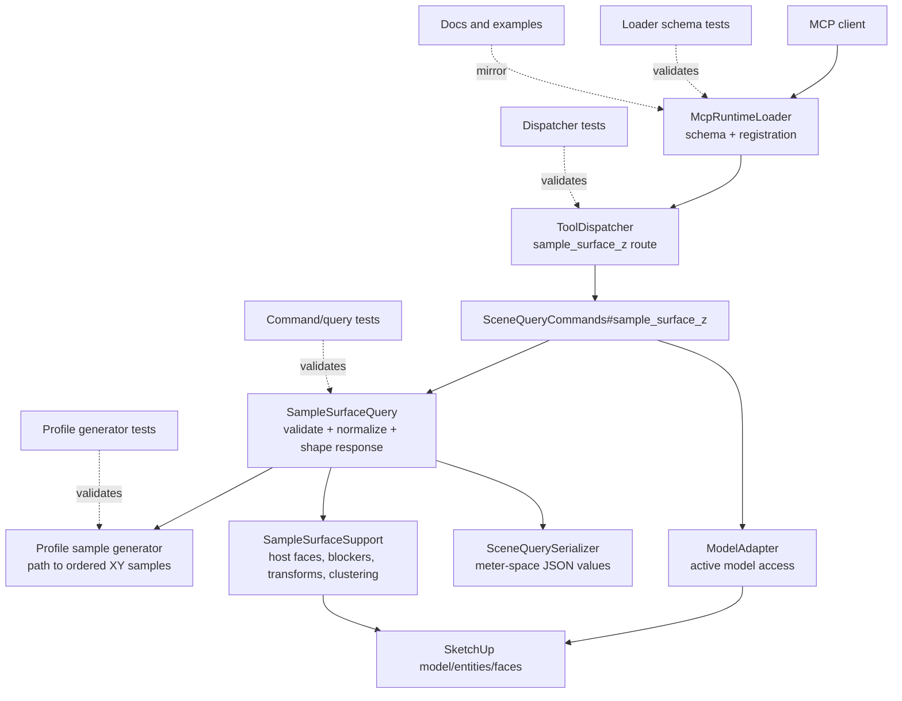

# Technical Plan: STI-03 Extend sample_surface_z With Profile and Section Sampling
**Task ID**: `STI-03`
**Title**: `Extend sample_surface_z With Profile and Section Sampling`
**Status**: `finalized`
**Date**: `2026-04-24`

## Source Task

- [Extend sample_surface_z With Profile and Section Sampling](./task.md)

## Problem Summary

Point-based `sample_surface_z` is valuable but still forces agents to manually build repeated probe grids when they need a section line or terrain profile. `STI-03` should add a bounded, explicit-host profile sampling contract that returns ordered evidence along a path while keeping terrain interpretation, validation, and editing out of scope.

## Goals

- Replace the public point-only request shape with one canonical `sampling` object that supports both point batches and profile sampling.
- Keep `sample_surface_z` as the public explicit-host surface evidence tool.
- Reuse the `STI-02` explicit target resolution and surface sampling internals.
- Return ordered, compact, JSON-safe evidence suitable for later measurement and validation tasks.
- Preserve the targeting/interrogation ownership boundary by avoiding terrain verdicts and terrain edits.

## Non-Goals

- Do not add terrain editing, patch replacement, smoothing, fairing, or working-copy behavior.
- Do not add slope, trench, hump, drainage, fairness, or grade-compliance verdicts.
- Do not add a separate public profile-sampling tool in this task.
- Do not make `measure_scene` call the public `sample_surface_z` tool.
- Do not document the old top-level `samplePoints` request shape as a supported public contract.

## Related Context

- [Scene Targeting and Interrogation HLD](specifications/hlds/hld-scene-targeting-and-interrogation.md)
- [PRD: Scene Targeting and Interrogation](specifications/prds/prd-scene-targeting-and-interrogation.md)
- [STI-02: Add Targeted Surface Z Sampling](specifications/tasks/scene-targeting-and-interrogation/STI-02-add-targeted-surface-z-sampling/task.md)
- [Terrain authoring signal](specifications/signals/2026-04-24-partial-terrain-authoring-session-reveals-stable-patch-editing-contract.md)
- [MCP tool authoring guide](specifications/guidelines/mcp-tool-authoring-sketchup.md)

## Research Summary

- `STI-02` established the existing `sample_surface_z` runtime path with explicit `target`, point samples, ignore targets, visibility policy, and structured hit/miss/ambiguous statuses.
- `SceneQueryCommands` should remain a thin command entrypoint and delegate behavior to query objects.
- `SampleSurfaceQuery` is the natural owner for request validation, point/profile normalization, target resolution, sampling orchestration, and response shaping.
- `SampleSurfaceSupport` already owns host-face collection, transforms, blockers, clustering, and geometry-facing sampling helpers; profile sampling should reuse it rather than introducing a second raytest stack.
- `SceneQuerySerializer` owns meter-space XY/XYZ serialization and should remain the output normalization seam.
- Native loader schemas must be provider-compatible at the root: top-level `type: "object"` only, with no root `oneOf`, `anyOf`, `allOf`, `not`, or root `enum`.

## Technical Decisions

### Data Model

The public request shape is:

```json
{
  "target": {"sourceElementId": "terrain-main"},
  "sampling": {
    "type": "points",
    "points": [
      {"x": 1.0, "y": 2.0},
      {"x": 2.0, "y": 2.5}
    ]
  },
  "visibleOnly": true,
  "ignoreTargets": [{"sourceElementId": "tree-006"}]
}
```

```json
{
  "target": {"sourceElementId": "terrain-main"},
  "sampling": {
    "type": "profile",
    "path": [
      {"x": 0.0, "y": 0.0},
      {"x": 5.0, "y": 0.0}
    ],
    "sampleCount": 25
  },
  "visibleOnly": true,
  "ignoreTargets": [{"sourceElementId": "tree-006"}]
}
```

The top-level request fields are:

- `target`: required explicit host reference.
- `sampling`: required sampling specification.
- `visibleOnly`: optional existing visibility policy.
- `ignoreTargets`: optional existing ignore-target list.
- `outputOptions`: optional existing output controls if already supported by the current command path.

The `sampling` object fields are:

- `type`: required, allowed values `points` or `profile`.
- `points`: required only for `type: "points"`, minimum one XY point.
- `path`: required only for `type: "profile"`, minimum two distinct XY points.
- `sampleCount`: profile spacing strategy, integer minimum `2`, maximum `200`.
- `intervalMeters`: profile spacing strategy, positive number; generated sample count must not exceed `200`.

The old top-level `samplePoints` request is not part of the advertised public contract. If implementation keeps temporary runtime recovery for old callers, it must be undocumented, tested as compatibility-only behavior, and removed from examples.

Decision record: the public contract uses a nested `sampling` object rather than flatter top-level `points`/`path` fields. The reason is not schema expressiveness; the root must remain provider-compatible either way. The reason is to keep one stable top-level operation shape with an explicit sampling intent while avoiding root `oneOf`/`anyOf` branches. The tradeoff is extra payload nesting for point sampling. Implementation must validate that the rendered schema descriptions and examples remain easy for MCP clients to follow; if a mocked client exercise shows persistent misuse caused by the nesting, this plan must be reopened before implementation proceeds.

### API and Interface Design

`sample_surface_z` remains the only public tool. Internally, normalize `sampling.type: "points"` into the existing point evaluator path and generate profile point sequences before invoking the same evaluator for `sampling.type: "profile"`.

Profile generation rules:

- Use ordered world-space XY path vertices in meters.
- Ignore zero-length internal path segments, but refuse an all-zero-length path.
- Include generated start and end samples.
- Preserve deterministic path order.
- For `sampleCount`, distribute samples evenly along total path length.
- For `intervalMeters`, generate samples at interval distances and add the final endpoint if it is not already represented.
- Refuse any request that would generate more than the justified profile sample cap. The default MVP cap is `200`; if implementation profiling proves that value is too high or too low, update this plan and the tests before merging.

Response shape:

- Always return `success: true` with a `results` array for successful command execution.
- Point results retain the existing status semantics and include `samplePoint`, `status`, and `hitPoint` only when hit.
- Profile results include `index`, `samplePoint`, `distanceAlongPathMeters`, `pathProgress`, `status`, and `hitPoint` only when hit.
- Profile responses include `summary` with `totalSamples`, `hitCount`, `missCount`, `ambiguousCount`, `sampledLengthMeters`, and `minZ`/`maxZ` when hit data exists.
- Internally, profile and point sampling should populate a narrow sampling-evidence DTO before public serialization. Future `measure_scene` helpers may consume that internal DTO directly; they must not call the public MCP tool or parse serialized public JSON.
- Responses must not include raw SketchUp objects, raw face dumps, slope verdicts, trench verdicts, fairness verdicts, or edit recommendations.

### Public Contract Updates

This task intentionally changes a public tool request contract.

- Loader schema: update `sample_surface_z` to require top-level `target` and `sampling`.
- Loader schema: remove advertised top-level `samplePoints`.
- Loader schema: keep the root provider-compatible with no top-level `oneOf`, `anyOf`, `allOf`, `not`, or root `enum`.
- Loader schema: describe conditional legality in field descriptions, not root schema composition.
- Dispatcher/runtime: ensure the dispatcher still routes `sample_surface_z` arguments without shape-specific branching outside the command/query layer.
- Command/query: add runtime validation for `sampling.type` and for illegal field combinations.
- Tests: update loader schema tests, dispatcher tests, command/query behavior tests, and any contract fixtures.
- Docs/examples: update `README.md`, current source-of-truth docs, and relevant task/HLD examples that currently show stale `points`, `ignore`, or `samplePoints` usage.

### Error Handling

Return structured refusals for invalid requests:

- missing `target`
- missing `sampling`
- unsupported `sampling.type`
- `type: "points"` without non-empty `points`
- `type: "points"` with profile-only fields
- `type: "profile"` without a valid `path`
- `type: "profile"` with `points`
- `type: "profile"` with neither or both `sampleCount` and `intervalMeters`
- profile path with fewer than two distinct XY positions
- interval/count values that are non-positive, non-integer where integer is required, or generate more than the justified profile sample cap
- unresolved target host
- unsupported broad discovery target

Miss and ambiguous sample outcomes are result statuses, not command failures. The command should fail only for invalid request shape, unresolved host, or runtime errors that prevent sampling.

### State Management

This task is read-only. It must not create, modify, hide, lock, duplicate, or delete SketchUp entities. It should not cache model state across calls beyond existing runtime support patterns.

### Integration Points

- Reuse `TargetReferenceResolver` for the explicit host.
- Reuse the existing `sample_surface_z` surface-interrogation component for host-target disambiguation and visibility/ignore behavior.
- Keep profile-specific sampling orchestration in the targeting/interrogation slice, not inside validation or measurement commands.
- Ensure later `measure_scene` follow-ons can call internal sampling helpers directly without invoking the public MCP tool.
- Keep schema registration in `src/su_mcp/runtime/native/mcp_runtime_loader.rb` synchronized with runtime validation and docs.
- Keep public results JSON-serializable through `SceneQuerySerializer`.
- Keep the internal sampling-evidence DTO narrower than the public JSON response so `measure_scene` reuse does not inherit MCP transport fields.

### Configuration

No user-facing configuration is added. The MVP default cap is `200` generated profile samples per call. Implementation must benchmark the existing sampling path against a realistically large terrain host before final merge and either confirm `200` or update this plan, tests, and refusal messages to the justified cap. If a constant is introduced, keep it internal and covered by tests.

## Architecture Context



## Key Relationships

- `sample_surface_z` owns explicit-host sampling evidence; validation/review tasks interpret that evidence later.
- `measure_scene` may reuse internal measurement/sampling helpers later, but must not call the public MCP tool.
- `find_entities` and targeting selectors remain responsible for finding candidate hosts before sampling.
- `ignoreTargets` remains a top-level host/occlusion policy, not a profile geometry input.

## Acceptance Criteria

- The public loader schema for `sample_surface_z` requires top-level `target` and `sampling`.
- The public loader schema does not advertise top-level `samplePoints`.
- The public loader schema root is provider-compatible and has no top-level `oneOf`, `anyOf`, `allOf`, `not`, or root `enum`.
- `sampling.type: "points"` accepts one or more XY points and returns deterministic point results through the existing explicit-host sampling semantics.
- `sampling.type: "profile"` accepts an ordered XY path and exactly one spacing strategy, either `sampleCount` or `intervalMeters`.
- Profile generation includes the start and end points, preserves path order, and reports `index`, `distanceAlongPathMeters`, and `pathProgress` for every sample.
- Profile requests that generate more than the justified profile sample cap are refused before sampling, and the refusal includes the generated count and allowed cap.
- Misses and ambiguous samples are returned as per-sample statuses without fabricated `hitPoint` coordinates.
- Sampling never falls back from the explicit resolved host to generic nearest-scene probing.
- Overlapping vegetation or other scene geometry does not replace the explicit host as the sampled surface.
- Profile responses include compact summary fields and exclude terrain verdicts, diagnostics, edit recommendations, raw SketchUp objects, and verbose face/debug dumps.
- Invalid request combinations return structured refusals with actionable messages.
- Documentation and examples teach only the canonical `sampling` request shape.

## Test Strategy

### TDD Approach

Start with failing tests at the public and query seams before modifying behavior:

1. Add loader schema tests for the canonical `target + sampling` contract and provider-compatible root.
2. Add profile generator tests for count spacing, interval spacing, endpoint inclusion, zero-length segment handling, and sample cap refusal.
3. Add command/query behavior tests for `points`, `profile`, invalid combinations, miss/ambiguous statuses, and compact summaries.
4. Add dispatcher or native runtime tests proving `sample_surface_z` still routes to the command path with the new arguments.
5. Update docs/example parity tests or fixture checks if present.

### Required Test Coverage

- Loader schema tests prove `sample_surface_z` requires `target` and `sampling`, does not advertise `samplePoints`, and has no forbidden root composition keywords.
- Contract fixture tests cover one canonical point request and one canonical profile request.
- Profile generation tests cover `sampleCount`, `intervalMeters`, multi-segment paths, zero-length internal segments, all-zero-length refusal, start/end inclusion, deterministic ordering, and no duplicate final endpoint.
- Runtime validation tests cover illegal field combinations and the justified generated-sample cap, including refusal payloads that report the generated count and allowed cap.
- Query tests prove point sampling still uses explicit host resolution under the new `sampling.type: "points"` shape.
- Query tests prove profile sampling precomputes/uses the explicit host path and returns ordered results with distance/progress metadata.
- Result-shape tests prove non-hit statuses do not include fabricated `hitPoint` values.
- Hosted or documented manual SketchUp verification covers an explicit terrain host with overlapping vegetation or geometry that would confuse generic ray probing.
- Host-sensitive verification must include a nested or transformed terrain host, overlapping non-terrain geometry, and an assertion that samples are evaluated only against the explicit host.
- If the project has a SketchUp-hosted acceptance harness available during implementation, convert the hosted verification into an automated fixture test; otherwise document the manual evidence and the missing automation gap in the implementation summary.

## Instrumentation and Operational Signals

- Return `summary.totalSamples`, `summary.hitCount`, `summary.missCount`, and `summary.ambiguousCount` for profile calls so clients can detect low-quality sample runs.
- Preserve structured error/refusal payloads for invalid request shape so contract misuse can be diagnosed without text scraping.
- No persistent telemetry or scene annotations are added in this task.

## Implementation Phases

1. Contract tests and loader schema: update the public schema to canonical `target + sampling`, add provider-compatibility assertions, and update contract fixtures.
2. Sampling request validation: add runtime validation and normalization for `sampling.type: "points"` and `sampling.type: "profile"` while keeping behavior read-only.
3. Profile generation helper: implement deterministic path-to-samples generation with count/interval spacing, endpoint inclusion, zero-length handling, and the justified sample cap.
4. Query integration: reuse existing explicit-host point sampling for normalized point samples and generated profile samples, then shape profile summaries.
5. Docs and examples: update public examples and remove stale `samplePoints`, `points`, or `ignore` naming where it conflicts with the canonical request.
6. Profiling and hosted/manual verification: benchmark the sample cap against a realistically large terrain host, then run or document a SketchUp smoke scenario with nested terrain plus overlapping vegetation.

## Rollout Approach

- Ship this as an intentional public contract change for `sample_surface_z`.
- Do not advertise legacy `samplePoints`; if compatibility recovery exists internally, mark it as non-public and do not include it in examples.
- Keep all profile interpretation in downstream validation/review follow-ons so this slice remains low-risk evidence collection.
- If implementation reveals existing docs or examples outside the obvious files, update them in the same change rather than leaving mixed contracts.
- If profiling changes the default cap or the mocked client exercise shows repeated `sampling`-shape misuse, update this finalized plan before continuing implementation.

## Risks and Controls

- Public contract drift: require loader schema tests, command tests, contract fixtures, and docs/examples to move in the same change.
- Provider schema rejection: keep the root schema a plain object and cover all public tool schemas with top-level compatibility tests.
- Hidden generic probing fallback: add behavior tests proving the resolved target host is used and misses remain misses rather than probing unrelated geometry.
- Profile generator off-by-one errors: test endpoint inclusion, no duplicate endpoint, multi-segment ordering, and interval/count behavior.
- Excessive sampling cost: benchmark the sampling path on a realistically large terrain host, then enforce the justified generated-sample cap before host geometry traversal.
- Host-sensitive SketchUp behavior: local tests can miss face transform, visibility, nested-instance behavior, and active model-unit conversion; require hosted/manual verification against a real nested or transformed terrain host with overlapping geometry.
- Scope creep into validation: keep slope/fairness/trench outputs out of response fixtures and docs.

## Dependencies

- `STI-02` explicit surface sampling implementation.
- Runtime command path under `src/su_mcp/commands/`.
- Native MCP schema registration under `src/su_mcp/runtime/native/`.
- Scene targeting/interrogation docs and examples.
- SketchUp-hosted environment for final smoke verification.

## Premortem

### Intended Goal Under Test

Enable agents to collect ordered terrain/profile evidence against an explicit host through `sample_surface_z`, without committing this task to terrain validation, terrain editing, or paid-plugin-scale terrain modeling.

### Failure Paths and Mitigations

- **Contract shape is harder for clients than expected**
  - Business-plan mismatch: the task needs a single documented public sampling surface, but the nested `sampling` object could add avoidable client confusion for the common point-sampling case.
  - Root-cause failure path: implementation assumes the nested shape is self-explanatory because it is convenient for runtime normalization.
  - Why this misses the goal: agents may produce invalid requests or keep relying on stale `samplePoints` examples.
  - Likely cognitive bias: implementation anchoring.
  - Classification: indicates the task, spec, or success criteria are underspecified.
  - Mitigation now: keep the settled canonical `sampling` shape, but add an explicit decision record and require a mocked client/schema-readability exercise before implementation proceeds too far.
  - Required validation: loader schema, examples, and a mocked MCP client exercise show correct `points` and `profile` requests without relying on hidden legacy shapes.
- **Sample cap is arbitrary**
  - Business-plan mismatch: terrain evidence must be useful across real sections, but a hard cap chosen without profiling could reject useful profiles or permit calls that time out.
  - Root-cause failure path: the plan treats `200` as inherently safe without measuring the current sampling path on realistic terrain.
  - Why this misses the goal: agents either receive incomplete evidence or hit MCP latency failures.
  - Likely cognitive bias: premature concretization.
  - Classification: can be validated before implementation.
  - Mitigation now: keep `200` as the default MVP cap, but require implementation profiling and a refusal payload that reports generated count and allowed cap.
  - Required validation: benchmark result included in the implementation notes or PR summary; tests cover cap refusal payloads.
- **Public response shape is not reusable by future measurement helpers**
  - Business-plan mismatch: `measure_scene` should reuse measurement internals later without calling the public MCP tool, but a response-only design can force JSON parsing or duplicate DTOs.
  - Root-cause failure path: `SceneQuerySerializer` becomes the only stable shape and internal consumers have no narrower evidence seam.
  - Why this misses the goal: downstream validation and measurement work inherits avoidable contract coupling.
  - Likely cognitive bias: local optimization.
  - Classification: indicates the task, spec, or success criteria are underspecified.
  - Mitigation now: require a narrow internal sampling-evidence DTO that public serialization and later internal helpers can share.
  - Required validation: command/query tests assert public JSON is produced from the internal evidence object, and implementation notes identify how `measure_scene` can reuse it without calling the MCP tool.
- **Host-sensitive behavior passes local tests but fails in SketchUp**
  - Business-plan mismatch: explicit-host disambiguation is the product value, but local tests may not model nested transforms, visibility, model units, or overlapping geometry.
  - Root-cause failure path: implementation relies on synthetic doubles and a manual smoke note without enough host-specific assertions.
  - Why this misses the goal: vegetation or nested terrain can still pollute samples in the real authoring environment.
  - Likely cognitive bias: test-double overconfidence.
  - Classification: requires implementation-time instrumentation or acceptance testing.
  - Mitigation now: strengthen required verification to include nested/transformed terrain and overlapping non-terrain geometry, with automation preferred when the hosted harness is available.
  - Required validation: hosted acceptance or documented manual evidence proves samples are evaluated only against the explicit host.
- **Provider-compatible schema drifts from runtime validation**
  - Business-plan mismatch: the public tool must register with strict MCP clients and remain understandable, but conditional legality cannot be fully expressed in the root schema.
  - Root-cause failure path: loader descriptions, examples, runtime refusals, and tests evolve separately.
  - Why this misses the goal: clients see one contract while runtime enforces another.
  - Likely cognitive bias: schema expressiveness bias.
  - Classification: can be validated before implementation.
  - Mitigation now: require loader schema tests, illegal-combination refusal tests, and docs/example updates in the same PR.
  - Required validation: all illegal combinations listed in Error Handling have behavior coverage and public examples teach only the canonical `sampling` shape.

## Quality Checks

- [x] All required inputs validated
- [x] Problem statement documented
- [x] Goals and non-goals documented
- [x] Research summary documented
- [x] Technical decisions included
- [x] Architecture context included
- [x] Acceptance criteria included
- [x] Test requirements specified
- [x] Instrumentation and operational signals defined
- [x] Risks and dependencies documented
- [x] Rollout approach documented
- [x] Small reversible phases defined
- [x] Premortem completed with falsifiable failure paths and mitigations
