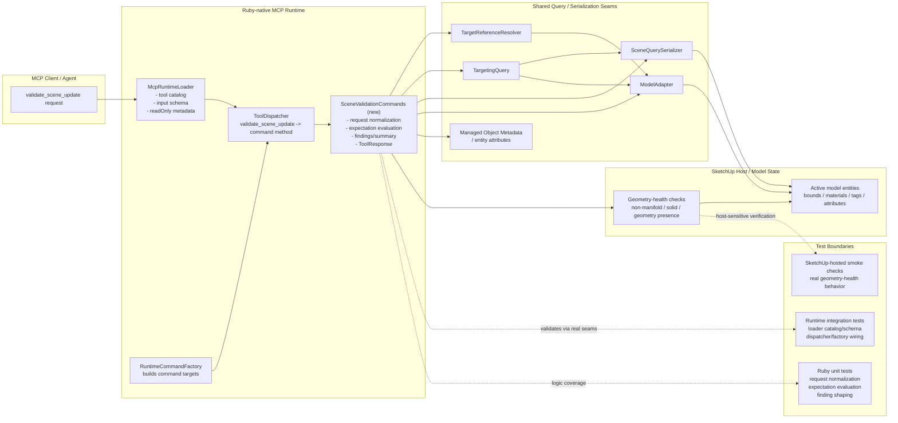

# Technical Plan: SVR-01 Establish `validate_scene_update` MVP With Initial Generic Geometry-Aware Checks
**Task ID**: `SVR-01`
**Title**: `Establish validate_scene_update MVP With Initial Generic Geometry-Aware Checks`
**Status**: `finalized`
**Date**: `2026-04-21`

## Source Task

- [Establish `validate_scene_update` MVP With Initial Generic Geometry-Aware Checks](./task.md)

## Problem Summary

The repository has Ruby-native runtime seams, shared target-resolution helpers, and scene-query serialization, but it still lacks a public validation surface that can decide whether a scene update satisfied explicit expectations. That forces callers to compose inspection tools or fall back to ad hoc checks, and it makes tool success too easy to confuse with scene correctness.

`SVR-01` must add `validate_scene_update` as the first bounded validation endpoint without drifting into whole-scene auditing, workflow-specific validators, or a broad geometry-analysis subsystem. The MVP has to provide a compact expectation contract, stable structured results, and a small geometry-health slice that reflects real acceptance failures in the SketchUp-hosted domain.

## Goals

- add `validate_scene_update` as a first-class public MCP tool in the Ruby-native runtime
- define a stable expectation-scoped request and response contract for MVP validation
- reuse the existing selector and target-resolution direction instead of introducing validation-only targeting semantics
- support the confirmed MVP expectation families, including compact geometry-health checks that are more valuable than inspection tooling alone
- ship the contract, runtime wiring, tests, and docs together as one coordinated public-surface change

## Non-Goals

- whole-scene validation or scene-health auditing
- public `measure_scene`
- workflow-specific validators or geometry micro-tools
- richer topology, section-sampling, asset-integrity, or snapshot validation
- broad selector-framework redesign
- promotion of the full geometry signal inventory into first-class MVP request fields

## Related Context

- [Scene Validation and Review HLD](specifications/hlds/hld-scene-validation-and-review.md)
- [PRD: Scene Validation and Review](specifications/prds/prd-scene-validation-and-review.md)
- [Scene Validation and Review task scope README](specifications/tasks/scene-validation-and-review/README.md)
- [Tool authoring guide](specifications/guidelines/mcp-tool-authoring-sketchup.md)
- [Tool dispatcher](src/su_mcp/runtime/tool_dispatcher.rb)
- [Runtime command factory](src/su_mcp/runtime/runtime_command_factory.rb)
- [Native runtime loader](src/su_mcp/runtime/native/mcp_runtime_loader.rb)
- [Tool response helper](src/su_mcp/runtime/tool_response.rb)
- [Target reference resolver](src/su_mcp/scene_query/target_reference_resolver.rb)
- [Targeting query](src/su_mcp/scene_query/targeting_query.rb)
- [Scene query serializer](src/su_mcp/scene_query/scene_query_serializer.rb)

## Research Summary

- The runtime already has the right public-surface seams: loader catalog/schema ownership, dispatcher routing, command-factory composition, and structured tool responses.
- Shared target resolution is already split between direct `targetReference` handling and predicate-driven `targetSelector` handling. `SVR-01` should consume those seams rather than create a validation-local selector grammar.
- The first MVP geometry value should not be size-oriented. In this domain, the more valuable early acceptance signals are geometry-health concepts such as missing geometry, non-manifold defects, and conditional solid validity.
- `validSolid` is not a universal failure in landscape workflows. It should only fail when explicitly requested through the validation contract.
- Richer geometry signals such as `internalFaceRisk`, `unexpectedLooseGeometry`, `faces`, `edges`, and `bounds` are useful as evidence vocabulary, but they should not all become first-class expectation fields in this MVP.

## Technical Decisions

### Data Model

- `validate_scene_update` accepts a top-level `expectations` object only for MVP.
- The MVP `expectations` sections are:
  - `mustExist`
  - `mustPreserve`
  - `metadataRequirements`
  - `tagRequirements`
  - `materialRequirements`
  - `geometryRequirements`
- Every expectation object supports exactly one target input:
  - `targetReference`
  - `targetSelector`
- Expectation objects may include an optional `expectationId` for caller-side correlation. When omitted, findings still correlate by expectation family and array index.
- Validation request normalization must reject unsupported top-level keys, unsupported expectation family keys, and unsupported per-family fields explicitly in Ruby. The native runtime cannot rely on automatic schema enforcement because tool-call argument validation is disabled at the MCP server boundary.
- `metadataRequirements` objects use `requiredKeys`.
- `tagRequirements` objects use `expectedTag`.
- `materialRequirements` objects use `expectedMaterial`.
- `mustPreserve` means the expected target still resolves uniquely after the scene update using the supplied identity/selector input. It is an existence-preservation check in MVP, not a geometry-integrity or no-change guarantee.
- `geometryRequirements` objects use a `kind` enum with these MVP values:
  - `mustHaveGeometry`
  - `mustNotBeNonManifold`
  - `mustBeValidSolid`
- MVP `geometryRequirements` apply only to supported entity/container targets where the host geometry-health semantics are meaningful, starting with groups and component instances. Unsupported target types should be refused or reported as unsupported request usage rather than evaluated heuristically.
- `targetReference` and `targetSelector` must reuse the existing repo field names and section names already exposed by neighboring tools and the native loader schema:
  - `targetReference`: `sourceElementId`, `persistentId`, `entityId`
  - `targetSelector.identity`: `sourceElementId`, `persistentId`, `entityId`
  - `targetSelector.attributes`: `name`, `tag`, `material`
  - `targetSelector.metadata`: `managedSceneObject`, `semanticType`, `status`, `state`, `structureCategory`
- Geometry evidence may internally compute richer signals such as `validSolid`, `nonManifold`, `emptyMesh`, `internalFaceRisk`, `faces`, `edges`, and `bounds`, but those remain finding details rather than first-class request fields in `SVR-01`.

### API and Interface Design

- Add `validate_scene_update` as a new read-oriented native MCP tool.
- The tool metadata should be explicit in the native loader and tests:
  - `name`: `validate_scene_update`
  - `title`: `Validate Scene Update`
  - `annotations.readOnlyHint`: `true`
  - `annotations.destructiveHint`: `false`
  - description should tell agents that the tool validates explicit scene-update expectations against resolved scene targets and returns structured acceptance findings
- The input contract remains shallow:

```json
{
  "expectations": {
    "mustExist": [
      {
        "targetReference": { "sourceElementId": "path-main" },
        "expectationId": "path-exists"
      }
    ],
    "metadataRequirements": [
      {
        "targetSelector": {
          "identity": { "sourceElementId": "path-main" }
        },
        "requiredKeys": ["sourceElementId", "status"],
        "expectationId": "path-metadata"
      }
    ],
    "geometryRequirements": [
      {
        "targetReference": { "sourceElementId": "path-main" },
        "kind": "mustNotBeNonManifold",
        "expectationId": "path-manifold"
      }
    ]
  }
}
```

- Request normalization must reject malformed expectation objects that provide both `targetReference` and `targetSelector`, or neither.
- Request normalization must also reject unsupported extra fields so the contract cannot widen silently through permissive hashes.
- Target resolution for MVP requires a unique match for every expectation. Resolution outcomes of `none` or `ambiguous` remain validation failures for the relevant expectation.
- Validation candidate sets should default to the same public-surface posture expected by neighboring user-facing tools, so placeholder or hidden implementation artifacts do not accidentally satisfy expectations in MVP.
- The response contract follows the existing runtime convention:
  - use the centralized [ToolResponse](src/su_mcp/runtime/tool_response.rb) conventions rather than inventing a new top-level envelope
  - `success: true`
  - `outcome`
  - `errors`
  - `warnings`
  - `summary`
- `validate_scene_update` may add tool-specific payload fields under that existing envelope, but it should not introduce a parallel top-level response contract.
- Findings should include stable automation-friendly context:
  - finding type
  - expectation family
  - expectation index
  - optional `expectationId`
  - resolved target summary when available
  - compact details/evidence payload

### Public Contract Updates

- Request delta:
  - add new tool `validate_scene_update`
  - add new top-level input object `expectations`
  - add six MVP expectation families under `expectations`
  - allow exactly one of `targetReference` or `targetSelector` on each expectation object
  - support `geometryRequirements.kind` enum values `mustHaveGeometry`, `mustNotBeNonManifold`, and `mustBeValidSolid`
- Response delta:
  - return structured validation result with `outcome`, `errors`, `warnings`, and `summary`
  - use refusal results for malformed request usage
  - return geometry-health evidence inside failing findings rather than through a separate measurement surface
- Schema and registration updates:
  - add a native tool catalog entry and input schema in [src/su_mcp/runtime/native/mcp_runtime_loader.rb](src/su_mcp/runtime/native/mcp_runtime_loader.rb)
  - expose the proper MCP metadata for agents:
    - stable tool `name`
    - `title`
    - clear `description`
    - read-only `annotations`
  - add dispatcher mapping in [src/su_mcp/runtime/tool_dispatcher.rb](src/su_mcp/runtime/tool_dispatcher.rb)
  - add command-target construction in [src/su_mcp/runtime/runtime_command_factory.rb](src/su_mcp/runtime/runtime_command_factory.rb)
- Contract and integration test updates:
  - loader catalog/schema tests in `test/runtime/native/`
  - loader metadata tests for tool name, title, description, annotations, and input schema shape
  - dispatcher routing tests in `test/runtime/`
  - new validation command tests in `test/scene_validation/` or equivalent owning layer
- Docs and example updates:
  - update [README.md](README.md) if the public tool list or usage examples surface this tool
  - update current source-of-truth docs when tool-surface guidance changes
  - keep capability docs aligned where the exposed contract materially changes

### Error Handling

- Malformed request usage returns `ToolResponse.refusal(...)`.
- Refusal cases include:
  - missing `expectations`
  - unsupported top-level request keys
  - unsupported expectation family
  - unsupported geometry `kind`
  - unsupported target type for a requested geometry check
  - both `targetReference` and `targetSelector` provided
  - neither `targetReference` nor `targetSelector` provided
  - invalid family payload types or malformed selector/reference shapes
  - unsupported extra expectation fields
- Well-formed requests never fail by raising user-facing runtime exceptions for unsatisfied expectations.
- Validation failures return structured findings under `errors` and `warnings`.
- Geometry-health failures may include richer evidence details, but the outward failure type must remain stable even if internal evidence expands later.

### State Management

- `validate_scene_update` is read-oriented and owns no persistent runtime state.
- Validation lifecycle state is contained in the result:
  - refusal result for malformed request usage
  - validation outcome for satisfied or unsatisfied expectations
- No scene mutation, staging state, or cached validation state is introduced in this task.

### Integration Points

- Add a new validation command slice under `src/su_mcp/scene_validation/`.
- The new slice should own:
  - request normalization
  - expectation planning/evaluation
  - findings shaping
  - response assembly
- The new slice should reuse:
  - [ToolResponse](src/su_mcp/runtime/tool_response.rb) for result conventions
  - [TargetReferenceResolver](src/su_mcp/scene_query/target_reference_resolver.rb) for direct references
  - [TargetingQuery](src/su_mcp/scene_query/targeting_query.rb) for selector normalization and filtering
  - [SceneQuerySerializer](src/su_mcp/scene_query/scene_query_serializer.rb) for target summaries and JSON-safe bounds/material/tag data
  - [Adapters::ModelAdapter](src/su_mcp/adapters/model_adapter.rb) for model/entity access
- Reuse here means existing response and selector shapes remain authoritative unless the plan explicitly changes them. `SVR-01` should not create a second naming scheme for target selectors or a second top-level result envelope.
- The validation slice must not call other MCP tools internally.
- Geometry-health evaluation should use SketchUp-native entity semantics directly enough that real hosted smoke checks remain meaningful.

### Configuration

- No new persisted configuration is required for MVP.
- Geometry-health support is fixed to the supported `kind` values in this task.
- Later output controls or ambiguity policies are explicitly deferred and must not be backfilled through hidden configuration in `SVR-01`.

## Architecture Context



## Key Relationships

- `validate_scene_update` is a coordinated public-surface change: loader catalog/schema, dispatcher mapping, command-factory composition, command behavior, and docs must move together.
- Validation owns expectation planning and result shaping, but it should delegate target resolution and selector semantics to the existing query seams.
- Geometry-health checks are the highest-value host-sensitive part of the MVP and therefore require real SketchUp validation rather than relying on mocked Ruby behavior alone.
- The geometry signal inventory is broader than the MVP public contract. `SVR-01` intentionally promotes only a small subset into request semantics and keeps the rest as evidence vocabulary.
- The MVP only succeeds if it catches representative supported defect cases that inspection tooling does not decide for the caller. A clean contract without real defect detection would miss the task goal even if the runtime wiring is correct.

## Acceptance Criteria

- The runtime exposes `validate_scene_update` as a new first-class read-oriented MCP tool that is reachable through the native loader, dispatcher, and command factory.
- The MVP request contract accepts only a top-level `expectations` object and validates only the expectations explicitly supplied by the caller.
- The MVP supports these `expectations` families:
  - `mustExist`
  - `mustPreserve`
  - `metadataRequirements`
  - `tagRequirements`
  - `materialRequirements`
  - `geometryRequirements`
- Each expectation object accepts exactly one target input source, `targetReference` or `targetSelector`, and malformed expectation objects are refused.
- For MVP evaluation, every expectation target must resolve uniquely. `none` and `ambiguous` resolution outcomes are surfaced as validation failures rather than silently accepted.
- The tool reuses the repository’s existing target-resolution and selector behavior instead of introducing validation-only targeting semantics.
- The tool reuses the centralized runtime response shape conventions instead of inventing a new top-level validation envelope.
- Request normalization rejects unsupported top-level keys and unsupported per-family fields rather than silently ignoring them.
- Well-formed requests return fully JSON-serializable structured results with stable `outcome`, `errors`, `warnings`, and `summary` fields.
- Malformed contract usage returns structured refusal results instead of ad hoc exceptions or partial validation responses.
- `mustPreserve` is implemented and documented as unique continued resolution of the expected target in MVP, not as a stronger geometry-preservation guarantee.
- `geometryRequirements` supports the MVP `kind` values `mustHaveGeometry`, `mustNotBeNonManifold`, and `mustBeValidSolid`.
- `mustBeValidSolid` only fails when explicitly requested and does not make non-solid landscape surface geometry invalid by default.
- Geometry checks refuse or reject unsupported target types instead of applying weak heuristics to arbitrary entities.
- Geometry-health findings can include compact structured evidence without expanding the MVP into a generic measurement or diagnostics surface.
- Findings correlate back to the relevant expectation in a stable automation-friendly way.

## Test Strategy

### TDD Approach

- Start at the public surface and move inward:
  1. add failing loader catalog/schema tests for `validate_scene_update`
  2. add failing dispatcher and command-factory tests for routing to the new validation slice
  3. add failing validation command tests for request normalization and refusal behavior
  4. add failing family-by-family evaluation tests for core expectations
  5. add failing geometry-health tests for supported `geometryRequirements.kind` values
  6. finish with docs/example parity and any required SketchUp-hosted smoke verification notes
- Keep the first implementation pass small: loader wiring, command ownership, and refusal behavior should be green before geometry-health logic lands.

### Required Test Coverage

- Ruby seam tests for:
  - unsupported top-level and per-family field rejection
  - request normalization and malformed-request refusal behavior
  - exactly-one-of target input enforcement
  - unique-resolution handling for `targetReference`
  - unique-resolution handling for `targetSelector`
  - `mustPreserve` semantics as continued unique resolution only
  - `mustExist`
  - `mustPreserve`
  - `metadataRequirements`
  - `tagRequirements`
  - `materialRequirements`
  - `geometryRequirements` kinds `mustHaveGeometry`, `mustNotBeNonManifold`, and `mustBeValidSolid`
  - unsupported target type handling for geometry expectations
  - finding correlation and summary shaping
- Runtime integration tests for:
  - tool catalog entry and input schema exposure
  - read-only tool annotations
  - tool name, title, and description exposure for agent-facing discovery
  - dispatcher mapping
  - command-factory composition
- Public contract parity checks for:
  - response shape expectations
  - refusal result shape
  - docs/examples updated with the shipped contract
- SketchUp-hosted smoke validation for:
  - geometry-health behavior against real entities where manifold/solid semantics matter
  - conditional `mustBeValidSolid` behavior for non-volumetric geometry vs volumetric geometry
  - at least one representative negative defect case where a tool may succeed but validation still fails for supported geometry-health reasons

## Instrumentation and Operational Signals

- The primary operational signals for MVP are the structured validation results themselves:
  - refusal codes for malformed request usage
  - stable finding types for failed expectations
  - summary counts for validated expectations, errors, and warnings
- Hosted smoke validation notes should record which real defect cases were exercised so later follow-on work can distinguish unsupported failures from regressions in supported behavior.
- Geometry-health findings should expose enough compact evidence to debug false positives or false negatives during smoke validation without inventing a second diagnostics API.

## Implementation Phases

1. **Contract and runtime wiring**
   - add `validate_scene_update` catalog entry and schema
   - add dispatcher mapping
   - add command-factory ownership for the new validation slice
   - create failing tests for public-surface wiring
2. **Validation slice and core expectation families**
   - add `scene_validation` command slice and request normalizer
   - implement refusal behavior and unique-resolution handling
   - implement `mustExist`, `mustPreserve`, `metadataRequirements`, `tagRequirements`, and `materialRequirements`
   - add finding/result shaping
3. **Geometry-health MVP and final contract pass**
   - implement `geometryRequirements` with the three supported `kind` values
   - enforce supported target types and explicit unsupported-target refusals for geometry checks
   - shape compact geometry evidence for failures
   - add SketchUp-hosted smoke validation against representative supported defect cases or document the remaining hosted gap
   - update docs/examples and confirm final contract parity

## Rollout Approach

- Ship `validate_scene_update` as an additive new tool. No migration or backwards-compatibility shim is required because no previous validation tool exists.
- Do not expose deferred policy/output controls in this task.
- Do not expand the geometry contract during implementation beyond the three supported `kind` values unless the plan is revised first.

## Risks and Controls

- **Public contract drift risk**: loader schema, dispatcher mapping, command-factory wiring, tests, and docs diverge.
  Control: land all public-surface artifacts in the same change and keep runtime integration tests failing until all layers align.
- **Selector-semantic drift risk**: validation resolves `targetSelector` differently from existing query tools.
  Control: reuse current query seams directly or through a thin wrapper and add targeted tests that mirror existing resolution behavior.
- **Geometry false-positive / false-negative risk**: geometry-health checks do not match real SketchUp semantics.
  Control: keep the public geometry contract small, include compact evidence in failures, and require SketchUp-hosted smoke validation for manifold/solid-sensitive cases.
- **Domain misuse of solid validity risk**: `mustBeValidSolid` is treated as a universal requirement and incorrectly fails legitimate surface geometry.
  Control: keep `mustBeValidSolid` opt-in only and cover both volumetric and non-volumetric cases in tests.
- **Scope-creep risk**: the richer signal inventory expands MVP into a mesh-analysis subsystem.
  Control: limit first-class request semantics to the three supported geometry kinds and keep richer signals in finding details only.
- **Permissive-request drift risk**: unsupported fields appear to work because the runtime does not enforce the schema automatically.
  Control: implement explicit Ruby-owned request validation for unsupported top-level keys, family fields, and target shapes, with refusal tests for each case.
- **False-positive target satisfaction risk**: placeholders or non-public implementation artifacts satisfy selectors and make validation look successful.
  Control: define and test the candidate-set posture for validation so MVP expectations evaluate against the intended public scene surface.

## Dependencies

- [Scene Validation and Review HLD](specifications/hlds/hld-scene-validation-and-review.md)
- [PRD: Scene Validation and Review](specifications/prds/prd-scene-validation-and-review.md)
- [Tool authoring guide](specifications/guidelines/mcp-tool-authoring-sketchup.md)
- [Tool dispatcher](src/su_mcp/runtime/tool_dispatcher.rb)
- [Runtime command factory](src/su_mcp/runtime/runtime_command_factory.rb)
- [Native runtime loader](src/su_mcp/runtime/native/mcp_runtime_loader.rb)
- [Tool response helper](src/su_mcp/runtime/tool_response.rb)
- [Target reference resolver](src/su_mcp/scene_query/target_reference_resolver.rb)
- [Targeting query](src/su_mcp/scene_query/targeting_query.rb)
- SketchUp-hosted runtime for geometry-health smoke validation

## Quality Checks

- [x] All required inputs validated
- [x] Problem statement documented
- [x] Goals and non-goals documented
- [x] Research summary documented
- [x] Technical decisions included
- [x] Architecture context included
- [x] Acceptance criteria included
- [x] Test requirements specified
- [x] Instrumentation and operational signals defined when needed
- [x] Risks and dependencies documented
- [x] Rollout approach documented when needed
- [x] Small reversible phases defined
- [x] Premortem completed with falsifiable failure paths and mitigations

## Premortem

### Intended Goal Under Test

Deliver a first `validate_scene_update` MVP that is materially more useful than inspection tools by letting callers declare explicit expectations and catch supported scene-correctness failures, especially geometry-health failures, through the shipped Ruby-native MCP runtime.

### Failure Paths and Mitigations

- **Base assumptions that could lead us astray**
  - Business-plan mismatch: the business needs an acceptance tool that catches supported defects, while the draft plan could have optimized mainly for a clean public contract.
  - Root-cause failure path: the plan assumed that a compact contract alone would create value even if the geometry-health slice did not catch representative real defect cases.
  - Why this misses the goal: the tool would be little more than structured inspection orchestration and would not justify its surface over existing scene-query tools.
  - Likely cognitive bias: interface-first bias and optimism bias.
  - Classification: requires implementation-time instrumentation or acceptance testing
  - Mitigation now: require hosted smoke validation against at least one representative supported negative defect case where command success is not enough.
  - Required validation: SketchUp-hosted smoke evidence covering one supported geometry-health failure case plus one accepted non-volumetric case.
- **Shortcuts that could weaken the outcome**
  - Business-plan mismatch: the business needs a stable contract, while a permissive implementation would silently accept unsupported fields and let the contract widen accidentally.
  - Root-cause failure path: the draft relied too much on loader schema documentation even though MCP argument validation is disabled in the runtime configuration.
  - Why this misses the goal: callers could believe unsupported fields or variants are accepted behavior, and the public surface would drift without explicit design.
  - Likely cognitive bias: documentation-as-enforcement fallacy.
  - Classification: can be validated before implementation
  - Mitigation now: make explicit Ruby request validation a first-class technical decision and test target.
  - Required validation: failing Ruby tests for unsupported top-level keys, unsupported family fields, unsupported geometry kinds, and malformed target combinations.
- **Areas that could be weakly implemented**
  - Business-plan mismatch: the business needs geometry validation that reflects domain semantics, while the draft left supported target types too implicit.
  - Root-cause failure path: geometry checks might be applied heuristically to arbitrary entities, producing false positives or false negatives.
  - Why this misses the goal: a validator that misclassifies unsupported entity types would erode trust in the first release.
  - Likely cognitive bias: overgeneralization from a few entity examples.
  - Classification: can be validated before implementation
  - Mitigation now: bound MVP geometry checks to supported target types and refuse unsupported target-type usage explicitly.
  - Required validation: unit tests for unsupported target types plus hosted smoke validation on supported group/component cases.
- **Tests and evaluations needed to stay on track**
  - Business-plan mismatch: the business needs consistent acceptance semantics, while local doubles alone could mask real SketchUp behavior.
  - Root-cause failure path: Ruby tests could all pass while manifold and solid semantics still fail in the host.
  - Why this misses the goal: the geometry slice is the main product differentiator for the MVP, so host-hidden failures would undermine the release.
  - Likely cognitive bias: substitution bias toward the easiest test layer.
  - Classification: requires implementation-time instrumentation or acceptance testing
  - Mitigation now: make hosted smoke validation an explicit MVP exit condition for geometry-health behavior rather than optional cleanup.
  - Required validation: real SketchUp-hosted checks for `mustNotBeNonManifold` and conditional `mustBeValidSolid`.
- **What must be true for the task to succeed**
  - Business-plan mismatch: the business needs preservation semantics that are understandable, while the draft left `mustPreserve` open to stronger interpretation than MVP can support.
  - Root-cause failure path: implementers or callers infer that `mustPreserve` means no geometry or metadata change, even though MVP only proves continued unique resolution.
  - Why this misses the goal: callers would trust the tool for guarantees it does not provide and make bad acceptance decisions.
  - Likely cognitive bias: semantic overloading.
  - Classification: can be validated before implementation
  - Mitigation now: define `mustPreserve` explicitly as continued unique resolution in MVP and reflect that in tests and docs.
  - Required validation: contract examples and tests that distinguish `mustExist` from `mustPreserve` without claiming no-change semantics.
- **Second-order and third-order effects**
  - Business-plan mismatch: the business needs acceptance decisions over the intended scene surface, while the draft did not make candidate-set posture explicit.
  - Root-cause failure path: placeholder or hidden implementation artifacts satisfy selectors and make validation pass even though the visible managed scene state is wrong.
  - Why this misses the goal: downstream agents would trust false positives and skip corrective action.
  - Likely cognitive bias: reuse bias from neighboring query seams without checking surface differences.
  - Classification: indicates the task, spec, or success criteria are underspecified
  - Mitigation now: define the validation candidate-set posture in implementation as public-surface by default and test it explicitly.
  - Required validation: unit tests proving placeholder or hidden implementation artifacts do not satisfy MVP expectations unless a future family explicitly opts into internal targets.
