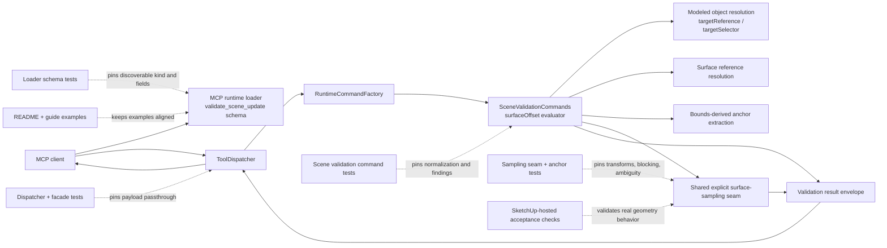

# Technical Plan: SVR-02 Broaden `validate_scene_update` With Object-Anchor Surface-Offset Validation
**Task ID**: `SVR-02`
**Title**: `Broaden validate_scene_update With Object-Anchor Surface-Offset Validation`
**Status**: `finalized`
**Date**: `2026-04-23`

## Source Task

- [Broaden validate_scene_update With Object-Anchor Surface-Offset Validation](./task.md)

## Problem Summary

`SVR-01` gave `validate_scene_update` a stable expectation-scoped surface, but its geometry checks still only answer coarse questions like "does geometry exist" or "is this solid healthy." That is not enough for terrain-relative workflows that derive support or embedment assumptions from terrain sampling and then need a post-build acceptance check that the modeled object still satisfies those assumptions. The delivered follow-on needs to validate the built object itself by deriving documented anchor points from the resolved modeled target, comparing those anchors against an explicit target surface with an expected vertical offset and tolerance, and returning automation-friendly findings without adding a new public validation tool.

## Goals

- Extend `validate_scene_update` with one richer geometry expectation that validates object-derived anchors against an explicit target surface.
- Keep the new expectation narrow and MCP-discoverable so clients can discover and use it from the loader schema.
- Reuse existing target resolution and explicit surface-sampling mechanics instead of creating a second probing subsystem in validation.
- Deliver a practical MVP for simple rectangular or slab-like forms while making its irregular-shape limitation explicit.

## Non-Goals

- Introduce `measure_scene` or any other new public validation or measurement tool.
- Accept free-form caller-supplied world points as the primary validation primitive for this task.
- Introduce a broad relationship framework with multiple relationship types in this iteration.
- Claim actual footprint or contact-point validation for irregular shapes such as L-shaped extensions.
- Add topology-backed, edge-network, clearance, or broad terrain-diagnostic validation in this task.

## Related Context

- [Task: SVR-02 Broaden validate_scene_update With Object-Anchor Surface-Offset Validation](./task.md)
- [HLD: Scene Validation and Review](specifications/hlds/hld-scene-validation-and-review.md)
- [HLD: Scene Targeting and Interrogation](specifications/hlds/hld-scene-targeting-and-interrogation.md)
- [PRD: Scene Validation and Review](specifications/prds/prd-scene-validation-and-review.md)
- [PRD: Scene Targeting and Interrogation](specifications/prds/prd-scene-targeting-and-interrogation.md)
- [Guide: MCP Tool Authoring for SketchUp](specifications/guidelines/mcp-tool-authoring-sketchup.md)
- [Runtime validation command](src/su_mcp/scene_validation/scene_validation_commands.rb)
- [Runtime loader](src/su_mcp/runtime/native/mcp_runtime_loader.rb)
- [Surface sampling query](src/su_mcp/scene_query/sample_surface_query.rb)
- [Surface sampling support](src/su_mcp/scene_query/sample_surface_support.rb)
- [Target reference resolver](src/su_mcp/scene_query/target_reference_resolver.rb)

## Research Summary

- The highest-value product slice is not replaying caller-supplied coordinates; it is validating the built object against terrain-relative assumptions after creation or editing.
- The guide supports extending `validate_scene_update` instead of adding a new tool, but it favors a compact discriminated contract over a sprawling catch-all object.
- A broad `surfaceRelationship` framework is premature for this task. The MVP should ship one explicit meaning only: expected surface offset equality.
- The current interrogation seam already knows how to resolve explicit target surfaces, sample points, cluster ambiguous hits, and ignore blocking geometry. Validation should reuse that behavior through Ruby seams rather than calling an MCP tool internally.
- Bounds-derived anchors are acceptable for a first generic MVP, but they are only a coarse approximation. They are materially unreliable for irregular footprints, especially on slopes.
- A quick follow-up after MVP is required for stronger shape-derived or contact-oriented anchors for irregular forms. The MVP plan must not pretend bounds anchors solve that class of problem.
- Surface sampling under a modeled object can fail if the modeled object is treated as visible blocking geometry. The validation plan must explicitly ignore the modeled target during terrain sampling for this expectation.

## Technical Decisions

### Data Model

- Keep the new capability inside `expectations.geometryRequirements`.
- Add one new geometry kind: `surfaceOffset`.
- Reuse the existing one-of modeled-object targeting contract:
  - exactly one of `targetReference` or `targetSelector`
- Add `surfaceReference` as an explicit surface target using the same compact reference shape as existing `targetReference`:
  - `sourceElementId`
  - `persistentId`
  - `entityId`
- Add `anchorSelector` as a nested owned object for MVP anchor derivation.
- Add `constraints` as a nested owned object for comparison semantics.
- MVP anchor vocabulary is intentionally coarse, bounds-based, and explicitly approximate:
  - `approximate_bottom_bounds_corners`
  - `approximate_top_bounds_corners`
  - `approximate_bottom_bounds_center`
  - `approximate_top_bounds_center`
- `constraints.expectedOffset` and `constraints.tolerance` are numeric meter values expressed at the MCP boundary.
- The modeled-object anchors are derived from the resolved target's world-space bounds, not from semantic footprint extraction or polygon-vertex analysis.

### API and Interface Design

- Request shape for the new expectation:

```json
{
  "targetReference": { "sourceElementId": "house-pad-001" },
  "kind": "surfaceOffset",
  "surfaceReference": { "sourceElementId": "terrain-main" },
  "anchorSelector": {
    "anchor": "approximate_bottom_bounds_corners"
  },
  "constraints": {
    "expectedOffset": 0.0,
    "tolerance": 0.02
  },
  "expectationId": "pad-supported-on-terrain"
}
```

- Semantics:
  - resolve the modeled object via `targetReference` or `targetSelector`
  - resolve the target surface via `surfaceReference`
  - derive anchor points from the modeled object's world bounds according to `anchorSelector.anchor`
  - sample the explicit target surface at each anchor XY
  - compute `actualOffset = derivedAnchor.z - sampledSurfaceZ`
  - pass only when every derived anchor is a non-ambiguous hit and `|actualOffset - expectedOffset| <= tolerance`
- The sampler used for this expectation must ignore the modeled object target when computing visible blockers. Without that, a pad or slab can occlude the terrain it is being validated against and create false misses.
- The shared scene-query seam reused by validation must therefore expose an explicit ignore-target contract, not a validation-local workaround.
- MVP modeled-object support is intentionally narrow:
  - primary support target classes: `group`, `componentinstance`
  - direct face support is deferred unless current command/test evidence shows it can be added without widening ambiguity
- MVP surface target support should match the existing explicit sampling seam:
  - `face`, `group`, `componentinstance`

### Public Contract Updates

- Request delta:
  - add `geometryRequirements.kind = "surfaceOffset"`
  - add `surfaceReference`
  - add `anchorSelector`
  - add `constraints`
- Response delta:
  - no new top-level envelope
  - failing findings for this kind include `failedAnchors` evidence with:
    - `anchorIndex`
    - `anchorName`
    - `anchorSelector`
    - `derivedPoint`
    - `expectedOffset`
    - `tolerance`
    - `surfaceSampleStatus`
    - `sampledSurfacePoint` when status is `hit`
    - `actualOffset` when status is `hit`
    - `offsetDelta` when status is `hit`
- Schema and registration updates:
  - update `validate_scene_update` input schema in [src/su_mcp/runtime/native/mcp_runtime_loader.rb](src/su_mcp/runtime/native/mcp_runtime_loader.rb)
  - expose the new kind and its branch fields in a schema shape that MCP clients can discover programmatically
  - update schema tests in [test/runtime/native/mcp_runtime_loader_test.rb](test/runtime/native/mcp_runtime_loader_test.rb)
- Dispatcher and routing updates:
  - no new tool or dispatch route
  - existing dispatcher and runtime facade tests must prove the extended payload reaches the command unchanged
- Docs and example updates:
  - [README.md](README.md)
  - current source-of-truth docs
- Public contract note:
  - the docs and examples must explicitly say that MVP anchors are approximate bounds-derived anchors and are coarse for irregular footprints

### Error Handling

- Refusal cases:
  - missing `expectations`
  - unsupported expectation family
  - malformed expectation item
  - missing `kind`, `surfaceReference`, `anchorSelector`, or `constraints` for `surfaceOffset`
  - unsupported `anchorSelector.anchor`
  - non-numeric `constraints.expectedOffset` or `constraints.tolerance`
  - invalid `surfaceReference` shape
- Validation-failure cases:
  - modeled object resolves to `none` or `ambiguous`
  - surface target resolves to `none` or `ambiguous`
  - modeled object target class is unsupported for bounds-derived anchor extraction
  - surface target class is unsupported for explicit surface sampling
  - requested anchor selector produces no anchors
  - any derived anchor samples `miss`
  - any derived anchor samples `ambiguous`
  - any derived anchor's offset falls outside tolerance
- Failure reporting must stay expectation-scoped and stable. No silent approximation from unsupported target types to some other geometry logic.

### State Management

- No persistent runtime state is added.
- Validation remains request-scoped and read-only.
- All derived anchors and sampled points are transient evaluation artifacts returned only through structured findings.

### Integration Points

- [src/su_mcp/scene_validation/scene_validation_commands.rb](src/su_mcp/scene_validation/scene_validation_commands.rb)
  - extend request normalization and evaluation for `geometryRequirements.kind = surfaceOffset`
  - shape `failedAnchors` evidence
- [src/su_mcp/scene_query/sample_surface_query.rb](src/su_mcp/scene_query/sample_surface_query.rb)
  - identify or extract the reusable surface-sampling seam needed by validation
- [src/su_mcp/scene_query/sample_surface_support.rb](src/su_mcp/scene_query/sample_surface_support.rb)
  - reuse face traversal, transform handling, visibility blocking, and ambiguity clustering
- [src/su_mcp/scene_query/target_reference_resolver.rb](src/su_mcp/scene_query/target_reference_resolver.rb)
  - resolve `surfaceReference`
- [src/su_mcp/runtime/native/mcp_runtime_loader.rb](src/su_mcp/runtime/native/mcp_runtime_loader.rb)
  - expose the new kind and branch shape in MCP-discoverable schema
- [src/su_mcp/runtime/tool_dispatcher.rb](src/su_mcp/runtime/tool_dispatcher.rb)
- [src/su_mcp/runtime/runtime_command_factory.rb](src/su_mcp/runtime/runtime_command_factory.rb)
  - unchanged routing surface, but contract passthrough coverage must be updated

### Configuration

- No new global configuration is planned.
- `constraints.tolerance` is caller-owned per expectation.
- The shared sampling seam's existing ambiguity clustering remains in effect.
- For this expectation kind, the validation flow must effectively ignore the modeled object target during target-surface visibility blocking through a shared-seam ignore-target contract.

## Architecture Context



## Key Relationships

- `validate_scene_update` remains the only public validation entrypoint.
- `surfaceOffset` is a validation-owned expectation kind, not a new public tool.
- `surfaceReference` reuses the compact reference identity shape, while modeled-object targeting keeps the existing one-of `targetReference` or `targetSelector`.
- Validation depends on scene-query-owned surface interrogation behavior but should not call a public MCP tool internally.
- Approximate bounds-derived anchors are an MVP compromise, not a claim of true footprint or contact validation.

## Acceptance Criteria

- `validate_scene_update` exposes `geometryRequirements.kind = "surfaceOffset"` in its MCP-discoverable schema.
- MCP clients can discover the `surfaceOffset` branch fields `surfaceReference`, `anchorSelector`, and `constraints` through the loader schema rather than prose alone.
- A valid `surfaceOffset` expectation resolves a modeled object target and a surface target independently and evaluates object-derived anchors against the surface target.
- The MVP derives approximate anchors from world-space bounds for the supported anchor selector enum only.
- The evaluation computes actual surface offset at each derived anchor and passes only when every anchor hits uniquely and is within tolerance.
- The evaluation ignores the modeled object target during visible-blocker sampling so terrain under the object can still be interrogated.
- Any miss, ambiguity, unsupported resolved target type, or offset mismatch becomes structured expectation-scoped failure evidence.
- Malformed `surfaceOffset` payloads are refused explicitly and do not fall through to generic invalid-request behavior.
- The response remains inside the existing `validate_scene_update` envelope and includes stable `failedAnchors` evidence for this kind.
- Loader schema tests, command tests, runtime passthrough tests, and docs/examples all move together with the contract.
- The MVP docs explicitly describe approximate bounds-derived anchors as coarse for irregular shapes and point to an immediate follow-up for stronger shape-derived anchors.

## Test Strategy

### TDD Approach

- Start with loader schema tests so the MCP-discoverable surface is fixed before implementation.
- Add validation command tests that define refusal behavior, target-resolution behavior, anchor derivation, self-occlusion handling, and `failedAnchors` result shape.
- Add or extend focused scene-query tests around the reusable surface-sampling seam and any new anchor-derivation helper before wiring validation logic.
- Only after those tests are in place should the command and loader implementation be updated.

### Required Test Coverage

- Loader schema tests in [test/runtime/native/mcp_runtime_loader_test.rb](test/runtime/native/mcp_runtime_loader_test.rb):
  - `surfaceOffset` enum exposure
  - discoverable discriminated branch fields
  - continued reuse of shared target shapes
- Validation command tests in [test/scene_validation/scene_validation_commands_test.rb](test/scene_validation/scene_validation_commands_test.rb):
  - malformed payload refusal
  - unsupported anchor selector refusal
  - modeled target resolution failure
  - surface target resolution failure
  - unsupported modeled target type failure
  - unsupported surface target type failure
  - `miss`, `ambiguous`, and offset mismatch findings
  - self-occlusion case where the modeled object would otherwise block the sampled terrain
  - mixed-anchor results with stable `failedAnchors` evidence
- Scene-query support tests in:
  - [test/scene_query/sample_surface_support_test.rb](test/scene_query/sample_surface_support_test.rb)
  - [test/scene_query/target_reference_resolver_test.rb](test/scene_query/target_reference_resolver_test.rb)
  - new focused tests if a reusable sampler or anchor helper is extracted
- Runtime passthrough tests:
  - [test/runtime/tool_dispatcher_test.rb](test/runtime/tool_dispatcher_test.rb)
  - [test/runtime/native/mcp_runtime_facade_test.rb](test/runtime/native/mcp_runtime_facade_test.rb)
- Public contract parity checks:
  - [README.md](README.md)
  - current source-of-truth docs
- SketchUp-hosted validation:
  - transformed component or group on sloped sample terrain
  - terrain sampled beneath an occluding modeled object
  - ambiguity behavior on multi-surface overlap

## Instrumentation and Operational Signals

- The primary operational signal is the structured validation result:
  - expectation outcome
  - `failedAnchors`
  - sample status values
  - actual vs expected offset deltas
- Contract health is signaled through pinned loader-schema tests and docs/example parity checks.
- Host-sensitive confidence comes from explicit SketchUp-hosted acceptance coverage or a documented manual verification note if hosted automation is not available in this iteration.

## Implementation Phases

1. **Lock the public contract**
   - extend loader schema tests
   - extend command tests for refusal and failure behavior
   - document the exact expectation shape and evidence fields in tests first
2. **Add reusable internals**
   - introduce or extract the narrow surface-sampling seam needed by validation
   - add bounds-derived anchor extraction helper logic and focused tests
   - ensure modeled-object self-occlusion is ignored for this validation path through an explicit shared-seam ignore-target contract
3. **Wire `surfaceOffset` into validation**
   - update `SceneValidationCommands`
   - update loader schema
   - update runtime passthrough tests
4. **Ship public parity and host confidence**
   - update README and guide examples
   - run focused Ruby coverage
   - complete hosted or manual geometry validation for the self-occlusion and transform-sensitive paths
5. **Immediate follow-up after MVP**
   - define a new task for stronger shape-derived or contact-oriented anchors for irregular footprints
   - keep this out of the MVP code path, but do not leave it as a vague future idea

## Rollout Approach

- Additive only. No existing expectation family or tool is renamed.
- Ship the new kind only after schema, tests, and docs are aligned.
- Document the MVP anchor limitation at release time so consumers do not treat approximate bounds anchors as true footprint validation.
- Follow immediately with the stronger-anchor task for irregular forms.

## Risks and Controls

- **Business goal mismatch from coarse anchors**: approximate bounds-derived anchors can pass simple rectangular pads but misrepresent irregular footprints on slopes. Control: make the approximation explicit in enum names and docs, position this explicitly as an MVP for simple forms, and schedule the stronger-anchor follow-up immediately after MVP.
- **Self-occlusion hides the target surface**: the modeled object being validated can block the terrain sample and produce false misses. Control: the reusable sampling path for this expectation must ignore the modeled object during blocker evaluation through an explicit shared-seam ignore-target contract, with direct tests and hosted acceptance coverage.
- **Transform or unit errors distort offsets**: nested transforms or meter conversion mistakes can produce plausible but wrong offsets. Control: add focused tests for transformed groups/components and require hosted verification on sloped geometry.
- **Schema discoverability drift**: implementing runtime behavior without exposing the branch in loader schema would leave clients without a stable discovery path. Control: schema tests pin the new kind and branch fields, and docs/examples ship in the same change.
- **Behavior drift between validation and interrogation**: duplicating surface sampling inside validation would create divergent hit, miss, ambiguity, or visibility behavior. Control: extract or reuse a shared Ruby seam owned by scene-query code and forbid tool-to-tool coupling.
- **Overgeneralization during implementation**: broadening this MVP into multiple relationship types or semantic anchors will increase risk and leave behavior underspecified. Control: constrain MVP to one kind, one comparison meaning, and one coarse anchor family.

## Dependencies

- Existing `validate_scene_update` baseline from `SVR-01`
- Existing explicit surface-sampling behavior from `STI-02`
- [src/su_mcp/scene_validation/scene_validation_commands.rb](src/su_mcp/scene_validation/scene_validation_commands.rb)
- [src/su_mcp/runtime/native/mcp_runtime_loader.rb](src/su_mcp/runtime/native/mcp_runtime_loader.rb)
- [src/su_mcp/runtime/tool_dispatcher.rb](src/su_mcp/runtime/tool_dispatcher.rb)
- [src/su_mcp/runtime/runtime_command_factory.rb](src/su_mcp/runtime/runtime_command_factory.rb)
- [src/su_mcp/scene_query/sample_surface_query.rb](src/su_mcp/scene_query/sample_surface_query.rb)
- [src/su_mcp/scene_query/sample_surface_support.rb](src/su_mcp/scene_query/sample_surface_support.rb)
- [src/su_mcp/scene_query/target_reference_resolver.rb](src/su_mcp/scene_query/target_reference_resolver.rb)
- [test/scene_validation/scene_validation_commands_test.rb](test/scene_validation/scene_validation_commands_test.rb)
- [test/runtime/native/mcp_runtime_loader_test.rb](test/runtime/native/mcp_runtime_loader_test.rb)
- [test/runtime/tool_dispatcher_test.rb](test/runtime/tool_dispatcher_test.rb)
- [test/runtime/native/mcp_runtime_facade_test.rb](test/runtime/native/mcp_runtime_facade_test.rb)
- [README.md](README.md)
- current source-of-truth docs

## Premortem

### Intended Goal Under Test

Deliver a post-build acceptance check through `validate_scene_update` that lets MCP clients verify whether terrain-related modeled objects such as pads, slabs, sheds, and extensions still satisfy the intended terrain-relative support or elevation assumptions after creation or editing, without forcing clients back to ad hoc geometry code or manual visual inspection.

### Failure Paths and Mitigations

- **Base assumptions that could lead us astray**
  - Business-plan mismatch: the business needs a validation mode that is honest about what it proves, while an overly optimistic anchor contract would optimize for a neat-looking generic enum rather than trustworthy acceptance.
  - Root-cause failure path: `surfaceOffset` ships with bounds-derived anchors named as if they were real geometric support points, so clients use them on irregular or sloped forms and get false confidence.
  - Why this misses the goal: a false pass on an L-shaped or stepped object defeats the whole point of post-build acceptance and pushes detection back to manual inspection.
  - Likely cognitive bias: abstraction bias and naming optimism.
  - Classification: Validate before implementation
  - Mitigation now: keep the MVP anchor family, but rename the enum values to `approximate_*`, document the limitation contrastively in schema/docs/examples, and keep the immediate stronger-anchor follow-up explicit in rollout.
  - Required validation: schema tests pin the exact enum names; docs and guide examples describe simple-form-only suitability; hosted verification includes at least one irregular form that demonstrates why the approximation is not sufficient.
- **Shortcuts that could weaken the outcome**
  - Business-plan mismatch: the business needs validation of terrain under the modeled object, while a shortcut that reuses visible-only blocking without exception optimizes for implementation convenience.
  - Root-cause failure path: the modeled object is still treated as visible blocking geometry while sampling the target surface, so valid slab-on-terrain cases fail with `miss` or `ambiguous`.
  - Why this misses the goal: the MVP would reject correct modeled results and teach clients not to trust the feature.
  - Likely cognitive bias: reuse bias and local-success bias.
  - Classification: Requires implementation-time instrumentation or acceptance testing
  - Mitigation now: make ignore-target behavior part of the shared sampling seam contract and require validation to pass the resolved modeled object as an ignored blocker.
  - Required validation: scene-query seam tests pin the ignore-target behavior; command tests cover self-occlusion; hosted SketchUp acceptance reproduces terrain sampling beneath an occluding pad or slab.
- **Areas that could be weakly implemented**
  - Business-plan mismatch: the business needs the new kind to behave like existing explicit surface interrogation, while a weak implementation could duplicate or drift from those semantics.
  - Root-cause failure path: validation reimplements hit, miss, ambiguity, transform, or blocker logic instead of sharing the scene-query-owned seam.
  - Why this misses the goal: clients will see contradictory answers between `sample_surface_z` and `validate_scene_update`, making the new acceptance mode unreliable.
  - Likely cognitive bias: copy-paste bias and local reasoning.
  - Classification: Validate before implementation
  - Mitigation now: require a shared Ruby seam for sampling behavior and forbid public-tool-to-public-tool coupling.
  - Required validation: focused tests prove the shared seam is reused; review the implementation diff to ensure no second probing subsystem appears in validation.
- **Tests and evaluations needed to stay on track**
  - Business-plan mismatch: the business needs MCP clients to discover the feature programmatically, while weak tests would optimize only for local Ruby behavior.
  - Root-cause failure path: the loader schema exposes the new enum value but not the discriminated branch fields, so clients still need prose docs to construct valid requests.
  - Why this misses the goal: the capability ships but is not truly MCP-discoverable, which breaks automation expectations.
  - Likely cognitive bias: checklist completion bias.
  - Classification: Validate before implementation
  - Mitigation now: pin the full discriminated `surfaceOffset` branch shape in loader tests, not just enum membership.
  - Required validation: loader tests assert `surfaceReference`, `anchorSelector`, and `constraints` are discoverable under the `surfaceOffset` branch; docs and guide examples stay aligned in the same change.
- **What must be true for the task to succeed**
  - Business-plan mismatch: the business needs a useful MVP for common simple forms, while the plan only works if the approximation remains explicit and constrained.
  - Root-cause failure path: the MVP is marketed or documented as general support validation instead of simple-form approximate validation.
  - Why this misses the goal: consumers will over-apply it, then distrust the tool when it fails on the very irregular cases it never intended to solve.
  - Likely cognitive bias: scope creep through documentation language.
  - Classification: Validate before implementation
  - Mitigation now: make the public wording contrastive everywhere the feature is exposed and name the immediate stronger-anchor follow-up in rollout and risks.
  - Required validation: review README, guide, and schema descriptions together before implementation is considered complete.
- **Second-order and third-order effects**
  - Business-plan mismatch: the business needs a narrow useful MVP, while a plan with loose boundaries invites premature generalization into a broad relationship framework.
  - Root-cause failure path: once `surfaceOffset` lands, follow-on implementation starts adding new relationship kinds or semantic anchors before the stronger irregular-shape anchor task is done.
  - Why this misses the goal: the contract widens faster than its geometry truthfulness, increasing ambiguity and maintenance risk.
  - Likely cognitive bias: expansion bias.
  - Classification: Validate before implementation
  - Mitigation now: keep non-goals explicit, keep the implementation phases narrow, and treat the stronger-anchor follow-up as the next task rather than broadening `surfaceOffset` in place.
  - Required validation: implementation review checks that no additional relationship kinds or semantic anchor systems were added beyond the finalized MVP contract.

## Quality Checks

- [x] All required inputs validated
- [x] Problem statement documented
- [x] Goals and non-goals documented
- [x] Research summary documented
- [x] Technical decisions included
- [x] Architecture context included
- [x] Acceptance criteria included
- [x] Test requirements specified
- [x] Instrumentation and operational signals defined when needed
- [x] Risks and dependencies documented
- [x] Rollout approach documented when needed
- [x] Small reversible phases defined
- [x] Premortem completed with falsifiable failure paths and mitigations
