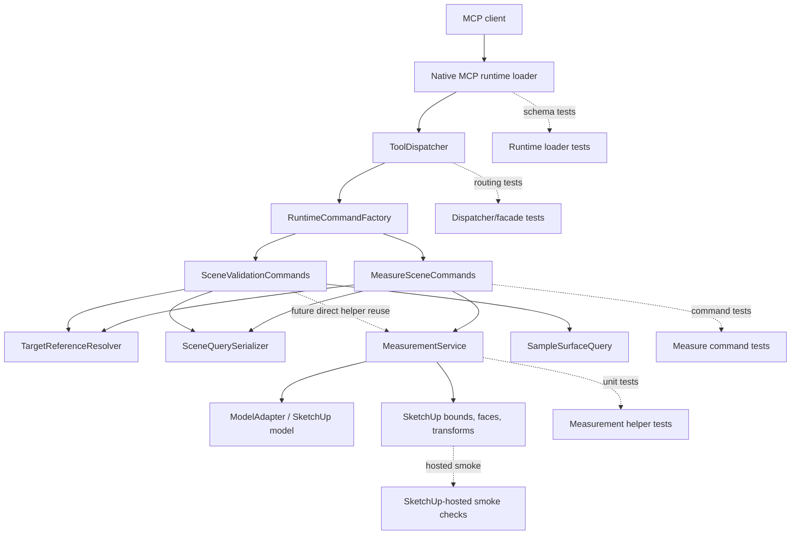

# Technical Plan: SVR-03 Establish measure_scene MVP With Structured Measurement Modes
**Task ID**: `SVR-03`
**Title**: `Establish measure_scene MVP With Structured Measurement Modes`
**Status**: `finalized`
**Date**: `2026-04-24`

## Source Task

- [Establish measure_scene MVP With Structured Measurement Modes](./task.md)

## Problem Summary

`measure_scene` is the public direct-measurement counterpart to `validate_scene_update`. The current runtime has validation and surface sampling capabilities, but it does not yet expose a structured measurement tool for common size and fit questions. `SVR-03` ships a bounded public `measure_scene` MVP so callers can ask direct quantitative questions without arbitrary Ruby, while keeping validation verdicts in `validate_scene_update`.

The plan deliberately separates direct measurement from acceptance validation. Measurement returns quantities and evidence. Validation can later consume the same internal measurement behavior to evaluate expectations, but this task does not add measured pass/fail checks to `validate_scene_update`.

## Goals

- Add `measure_scene` as a first-class read-only MCP tool.
- Ship a bounded first mode set: `bounds`, `height`, `distance`, and `area`.
- Keep request shapes compact, explicit, and discoverable by MCP clients.
- Return JSON-safe, unit-bearing measurement results in public meters or square meters.
- Reuse target-resolution and serialization patterns from existing scene-query and validation code.
- Establish reusable Ruby measurement behavior for later validation integration.

## Non-Goals

- Extending `validate_scene_update` with measured dimension or tolerance verdicts.
- Implementing `path_length`, `clearance`, or `slope_hint`.
- Adding terrain-specific diagnostics such as terrain profile, grade-break, trench/hump, or fairness measurements.
- Validating persisted semantic stored values as geometric measurements.
- Exposing raw SketchUp dictionaries, arbitrary Ruby, or unrestricted property interrogation.
- Adding snapshot, asset-integrity, or topology-backed validation behavior.

## Related Context

- [Scene Validation and Review HLD](../../../hlds/hld-scene-validation-and-review.md)
- [PRD: Scene Validation and Review](../../../prds/prd-scene-validation-and-review.md)
- [PRD: Scene Targeting and Interrogation](../../../prds/prd-scene-targeting-and-interrogation.md)
- [MCP Tool Authoring Standard](../../../guidelines/mcp-tool-authoring-sketchup.md)
- [SVR-01 summary](../SVR-01-establish-validate-scene-update-mvp-with-initial-generic-geometry-aware-checks/summary.md)
- [SVR-02 summary](../SVR-02-broaden-validate-scene-update-with-surface-relationship-and-reference-point-validation/summary.md)
- [STI-02 summary](../../scene-targeting-and-interrogation/STI-02-explicit-surface-interrogation-via-sample-surface-z/summary.md)

## Research Summary

- `SVR-01` shipped `validate_scene_update` and established the runtime loader, dispatcher, factory, and validation command patterns.
- `SVR-02` shipped `surfaceOffset` under `validate_scene_update.geometryRequirements`, proving that geometry-aware behavior should use explicit finite modes, schema exposure, structured refusals, and user-facing docs together.
- `STI-02` shipped `sample_surface_z`, which remains relevant for later terrain-specific measurement follow-ons but is not required for the generic four-mode MVP.
- The HLD and PRD define `measure_scene` as a distinct public measurement surface and `validate_scene_update` as the validation orchestrator.
- The MCP authoring guide argues for compact public surfaces, explicit section ownership, small enums, field-level usage guidance, and avoiding vague catch-all objects.

## Technical Decisions

### Data Model

`measure_scene` uses `mode` and `kind` as the public discriminator pair. The MVP supports only these combinations:

| mode | kind | required reference fields |
| --- | --- | --- |
| `bounds` | `world_bounds` | `target` |
| `height` | `bounds_z` | `target` |
| `distance` | `bounds_center_to_bounds_center` | `from`, `to` |
| `area` | `surface` | `target` |
| `area` | `horizontal_bounds` | `target` |

Compact target references are the only supported MVP reference shape:

```json
{
  "sourceElementId": "terrace-001",
  "persistentId": "12345",
  "entityId": "67890"
}
```

Callers may supply any one supported identifier. Selector-based measurements are deferred until aggregation and uniqueness behavior are explicitly designed. The public schema must refuse selector-style shapes rather than accepting them as opaque objects.

### Measurement Semantics

- `bounds/world_bounds` returns world-space `min`, `max`, `center`, and `size` values in meters for the resolved target bounds. The implementation must not leak SketchUp internal inches.
- `height/bounds_z` returns `bounds.max.z - bounds.min.z` in meters. It is vertical bounds extent only, not semantic design height, terrain relief, tree height metadata, or clearance.
- `distance/bounds_center_to_bounds_center` returns Euclidean distance in meters between the two resolved world-bounds centers. It is not nearest-point distance, clearance, path length, or centroid distance.
- `area/surface` returns summed descendant face area in square meters for the resolved target. Group/component traversal must account for cumulative transforms where SketchUp face area requires an explicit transform.
- `area/horizontal_bounds` returns `(bounds.max.x - bounds.min.x) * (bounds.max.y - bounds.min.y)` in square meters. It is an axis-aligned horizontal bounds area, not exact polygon footprint, terrain profile, or projected surface area.
- Terrain-shaped groups and components are valid targets for these generic modes only when the generic evidence exists. They do not activate terrain profile, slope, clearance-to-terrain, grade-break, trench/hump, or fairness diagnostics.

### API and Interface Design

Example requests:

```json
{
  "mode": "bounds",
  "kind": "world_bounds",
  "target": { "sourceElementId": "house-pad-001" }
}
```

```json
{
  "mode": "distance",
  "kind": "bounds_center_to_bounds_center",
  "from": { "sourceElementId": "tree-001" },
  "to": { "sourceElementId": "path-001" }
}
```

```json
{
  "mode": "area",
  "kind": "horizontal_bounds",
  "target": { "sourceElementId": "terrace-001" },
  "outputOptions": { "includeEvidence": false }
}
```

`outputOptions.includeEvidence` defaults to `false`. Evidence must remain compact and JSON-safe. It must not expose raw SketchUp objects, raw attribute dictionaries, or implementation-only internals.

### Public Contract Updates

Request deltas:

- Add public tool `measure_scene`.
- Add required top-level `mode` and `kind`.
- Support compact reference fields:
  - `target`
  - `from`
  - `to`
- Add optional `outputOptions.includeEvidence`.
- Expose the legal `mode` and `kind` values through small enums and field-level descriptions.
- Keep the tool-parameter root provider-compatible: top-level `type: "object"` with no top-level `oneOf`, `anyOf`, `allOf`, `not`, or root `enum`.
- Enforce exact legal `mode`/`kind`/reference combinations in runtime validation and structured refusals rather than root schema branches.
- Add field-level descriptions with short contrastive guidance: use when, do not use for, units, and direct-measurement ownership.

Response deltas:

- Measured result:

```json
{
  "success": true,
  "outcome": "measured",
  "measurement": {
    "mode": "height",
    "kind": "bounds_z",
    "value": 5.5,
    "unit": "m",
    "target": { "sourceElementId": "tree-001" }
  }
}
```

- Unavailable result:

```json
{
  "success": true,
  "outcome": "unavailable",
  "measurement": {
    "mode": "area",
    "kind": "surface",
    "reason": "no_faces",
    "target": { "sourceElementId": "terrace-001" }
  }
}
```

Schema and registration updates:

- Register `measure_scene` in [src/su_mcp/runtime/native/mcp_runtime_loader.rb](src/su_mcp/runtime/native/mcp_runtime_loader.rb).
- Add read-only annotations and precise use/not-use descriptions.
- Use provider-compatible top-level schema fields and runtime refusals so illegal `mode`/`kind`/field combinations are corrected without root schema composition.
- Add field descriptions that distinguish direct measurement from validation verdicts and terrain diagnostics.
- Add one compact misuse/correction example in the tool description only if it materially improves client behavior without bloating the definition.

Routing updates:

- Add `measure_scene` to [src/su_mcp/runtime/tool_dispatcher.rb](src/su_mcp/runtime/tool_dispatcher.rb).
- Add the measurement command target to [src/su_mcp/runtime/runtime_command_factory.rb](src/su_mcp/runtime/runtime_command_factory.rb).

Tests and docs:

- Add loader, dispatcher, facade, command, helper, native-contract, README, and guide updates in the same change.
- Include a golden schema or equivalent native-contract snapshot for the rendered `measure_scene` tool definition so client-visible drift is caught.

### Error Handling

Use `ToolResponse.refusal` for invalid request usage:

- unsupported `mode`
- unsupported `kind`
- unsupported `mode`/`kind` combination
- missing required reference field for the mode
- none or ambiguous target resolution
- unsupported target type for a mode

Refusals should include correction details where applicable:

- `field`
- `value`
- `allowedValues`
- `mode`
- `kind`

Use `outcome: "unavailable"` when the request is valid and the target resolves, but required measurable evidence is absent.

Finite unavailable reasons:

- `invalid_bounds`
- `empty_bounds`
- `no_faces`
- `unsupported_geometry`

Do not use validation-style `failed` outcomes in this task. `failed` belongs to acceptance checks, not direct measurement.

### State Management

`measure_scene` is read-only and owns no persistent state. It must not mutate scene geometry, metadata, materials, tags, model units, or selection state.

### Integration Points

- Reuse `TargetReferenceResolver` for compact reference resolution.
- Reuse `SceneQuerySerializer` for compact target summaries where practical, but do not reuse serializer helpers that emit SketchUp internal units unless they are explicitly normalized.
- Keep measurement logic in a new measurement command/helper path, not inside `SceneValidationCommands`.
- Later validation work should call the internal measurement helper directly rather than routing through MCP or the public tool.

### Configuration

No user-facing configuration is introduced in this task. Numeric outputs must be normalized to public meters and square meters regardless of model display units. Length conversion should be centralized around SketchUp internal inches to meters (`inches * 0.0254`); area conversion should use square meters (`square_inches * 0.0254 * 0.0254`) unless a SketchUp API returns an already converted unit-bearing value that is proven by tests.

## Architecture Context



## Key Relationships

- `measure_scene` answers direct quantitative questions.
- `validate_scene_update` answers acceptance questions and remains separate from this task.
- Measurement behavior should be reusable by future validation without internal MCP calls.
- Terrain-shaped groups and components are valid generic measurement targets when they expose the required generic evidence.
- Terrain diagnostics remain separate follow-ons and should build on `sample_surface_z` plus the reusable measurement internals.

## Acceptance Criteria

- `measure_scene` is registered as a first-class public MCP tool with read-only annotations, clear use/not-use descriptions, and schema-visible `mode`/`kind` combinations.
- The public request contract supports only `bounds/world_bounds`, `height/bounds_z`, `distance/bounds_center_to_bounds_center`, `area/surface`, and `area/horizontal_bounds`.
- The MVP supports compact references only for `target`, `from`, and `to`.
- The rendered MCP schema uses explicit branch definitions for all five legal combinations and does not expose selector-style request shapes as supported.
- Each public `mode`/`kind` branch includes contrastive field descriptions that say when to use it and what not to use it for.
- Invalid mode/kind combinations, missing required fields, unsupported modes, unsupported kinds, and none/ambiguous target resolution return structured refusals.
- Successful measurements return `success: true`, `outcome: "measured"`, and a unit-bearing `measurement` payload.
- Valid requests with missing measurable evidence return `success: true`, `outcome: "unavailable"`, and a finite `reason`.
- `bounds/world_bounds` returns meter-space `min`, `max`, `center`, and `size`.
- `height/bounds_z` returns meter-space vertical bounds extent and does not claim semantic design height or terrain relief.
- `distance/bounds_center_to_bounds_center` returns meter-space distance between resolved world-bounds centers and does not imply clearance, nearest-point distance, or centroid distance.
- `area/surface` returns square-meter summed face area when face evidence is available.
- `area/horizontal_bounds` returns square-meter horizontal bounds area and is documented as bounds-derived.
- Terrain-shaped groups/components are accepted for generic modes but do not unlock terrain diagnostics.
- Runtime contract artifacts, tests, README, and guide examples are updated together.
- A client-facing smoke review confirms `measure_scene` appears as a top-level read-only measurement tool and every legal branch is discoverable without reading implementation docs or using Ruby.

## Test Strategy

### TDD Approach

Start with contract and routing skeletons, then command behavior, then measurement helper behavior. Keep every public branch red before production implementation so the mode/kind matrix cannot drift silently.

### Required Test Coverage

- Runtime loader tests:
  - tool registration
  - read-only annotations
  - `mode` and `kind` enum discoverability
  - provider-compatible top-level tool schema without root schema composition keywords
  - runtime refusals for selector-shaped references and wrong-reference fields for the requested mode/kind
  - use/not-use field descriptions
- Dispatcher and facade tests:
  - `measure_scene` dispatch
  - factory-backed command construction
- Measurement command tests:
  - success for each shipped mode/kind
  - refusal for unsupported mode
  - refusal for unsupported kind
  - refusal for illegal mode/kind combination
  - refusal for missing target/from/to
  - none and ambiguous target resolution refusals
  - unavailable results for missing bounds or faces
- Measurement helper tests:
  - world bounds extraction
  - bounds height calculation
  - bounds-center-to-bounds-center distance
  - horizontal bounds area
  - surface face area
  - unit conversion to meters and square meters
  - identical public values across representative model display units where the runtime can simulate or host those settings
  - transformed and nested group/component geometry behavior where isolation is practical
- Native contract tests:
  - provider-compatible rendered tool schema snapshot
  - one measured success
  - one unavailable result
  - one structured refusal
- Hosted SketchUp smoke checks:
  - transformed/scaled group or component with known bounds height and horizontal bounds area
  - nested component or group with at least one transformed face for `area/surface`
  - terrain-shaped group/component measured through generic modes, proving generic support without terrain-specific diagnostics
- MCP client smoke checks:
  - wrapped `tools/call` invocation for each legal branch
  - bad `mode`/`kind` pair rejected predictably
  - selector-shaped request rejected predictably
  - rendered tool description does not suggest validation verdicts, clearance, slope, or terrain diagnostics
- Documentation checks:
  - README and guide examples match the shipped request and response shapes.

## Instrumentation and Operational Signals

- No persistent runtime telemetry is required for this task.
- Measurement responses should include enough structured evidence when requested to diagnose how a value was derived without logging or text scraping.
- Evidence should include the resolved target summary, resolved `mode`/`kind`, unit, and compact derivation fields such as bounds min/max/center or face count when requested.
- Final implementation notes must call out whether hosted SketchUp smoke validation was completed and list any host-sensitive assumptions left unverified.

## Implementation Phases

1. Add failing loader/schema, dispatcher/facade, and native-contract skeletons for `measure_scene`, including provider-compatible schema coverage and runtime refusal coverage for illegal combinations.
2. Add failing command tests for the public mode/kind matrix, refusal cases, and unavailable outcomes.
3. Add failing helper tests for numeric measurement behavior, transforms, and unit conversion.
4. Implement the measurement helper and command path.
5. Wire loader, dispatcher, and command factory.
6. Update docs and examples, keeping inline MCP descriptions compact and moving richer examples to the guide.
7. Run focused tests, then broad Ruby, lint, and package verification.
8. Run or explicitly record the hosted smoke status for transformed groups/components, face-area behavior, and MCP client branch discoverability.

## Rollout Approach

- Ship `measure_scene` additively as a new read-only tool.
- Do not migrate existing validation behavior in this task.
- Leave deferred modes and validation verdict integration as follow-ons.
- Keep the corrected task folder slug aligned with the measurement scope so task discovery does not reinforce the old `validate_scene_update` interpretation.

## Risks and Controls

- Contract drift: enforce exact rendered schema, runtime, native contract, and docs parity through tests.
- Scope creep into terrain diagnostics: refuse unsupported modes and keep docs explicit about deferred terrain profile, slope, clearance-to-terrain, grade-break, trench/hump, and fairness measurements.
- Ambiguous measurement meaning: require `mode` and `kind`; use contrastive descriptions and precise kind names; avoid generic `area`, `height`, or `distance` meanings.
- Host-sensitive SketchUp behavior: verify or document transformed group/component bounds, face area under transforms, nested faces, and degenerate geometry.
- Unit conversion bugs: centralize conversion from SketchUp internal units and test meter and square-meter values explicitly.
- Validation-boundary drift: keep `validate_scene_update` unchanged and ensure measurement outputs do not include pass/fail verdicts.
- Bounds-derived area misuse: name it `horizontal_bounds` and document that it is not exact polygon footprint.

## Premortem

### Intended Goal Under Test

`SVR-03` must ship a clear, bounded, MCP-client-usable `measure_scene` public tool for structured scene measurements. It should reduce arbitrary Ruby fallback, expose supported options before execution, and remain distinct from `validate_scene_update`.

### Failure Paths and Mitigations

- **Mode/kind combinations are described in prose but not enforced clearly**
  - Business-plan mismatch: The business needs clients to know the legal request shapes before execution; a loose schema would optimize only for server-side recovery/refusal.
  - Root-cause failure path: The rendered MCP schema exposes independent `mode` and `kind` enums, so `{ "mode": "height", "kind": "bounds_z", "from": {...} }` appears plausible to clients.
  - Why this misses the goal: Clients guess, misfire, or fall back to `eval_ruby`, repeating the finite-option discoverability failure this task is meant to prevent.
  - Likely cognitive bias: Illusion of transparency from compact enum fields.
  - Classification: can be validated before implementation.
  - Mitigation now: Keep provider-compatible tool parameters, add strong field descriptions listing supported pairs, and make runtime refusals return correction details and `allowedValues`.
  - Required validation: Native loader test for provider-compatible schema plus runtime command tests for wrong-reference fields, illegal mode/kind pairs, and selector-shaped references.
- **Enum names remain technically finite but semantically under-described**
  - Business-plan mismatch: The business needs clients to choose the right direct measurement; generic descriptions would optimize for compactness while leaving measurement meaning ambiguous.
  - Root-cause failure path: The tool card says "height" or "area" without contrastive "not for" guidance, causing clients to use `height/bounds_z` for semantic design height, `distance/bounds_center_to_bounds_center` for clearance, or `area/horizontal_bounds` for terrain footprint.
  - Why this misses the goal: The public surface remains guesswork, and agents still need Ruby or docs archaeology to infer meaning.
  - Likely cognitive bias: Curse of knowledge by authors who already know the intended meaning.
  - Classification: indicates the task, spec, or success criteria are underspecified.
  - Mitigation now: Add branch/field descriptions with use and do-not-use guidance, rename the distance kind to `bounds_center_to_bounds_center`, and keep a compact misuse/correction example only if it improves the rendered tool card.
  - Required validation: MCP-client smoke review of the rendered tool definition confirming each legal branch is understandable without implementation docs.
- **Host-sensitive geometry works in local doubles but fails in real SketchUp models**
  - Business-plan mismatch: The business needs trustworthy measurements on real site models; unit tests over untransformed stubs would optimize for isolated code coverage.
  - Root-cause failure path: Bounds and face area are computed without accounting for group/component transforms, nesting, scaling, or rotated terrain-shaped components.
  - Why this misses the goal: Common SketchUp model structures produce wrong values, making the new tool less reliable than direct Ruby inspection.
  - Likely cognitive bias: Availability bias from simple local fixture geometry.
  - Classification: requires implementation-time instrumentation or acceptance testing.
  - Mitigation now: Require helper seams that explicitly handle or prove SketchUp transform behavior and hosted smoke checks for transformed/nested group and component targets.
  - Required validation: Hosted SketchUp smoke log for known transformed bounds, transformed face area, and a terrain-shaped generic target.
- **Public units leak SketchUp internals or model display settings**
  - Business-plan mismatch: The business needs programmatic meter and square-meter values; relying on SketchUp defaults optimizes for local convenience.
  - Root-cause failure path: Some paths convert `Length` values while area or bounds values remain internal inches/square inches, or display-unit settings alter public numeric output.
  - Why this misses the goal: Downstream automation cannot compare values consistently and will add Ruby-side conversions.
  - Likely cognitive bias: Representativeness heuristic from testing only one unit setting.
  - Classification: can be validated before implementation.
  - Mitigation now: Centralize unit conversion and specify conversion rules for lengths and areas in the plan.
  - Required validation: Helper/native tests proving identical meter outputs for representative unit settings or explicitly documented host limits where unit settings cannot be simulated outside SketchUp.
- **Local direct-command tests pass while the public MCP tool remains broken**
  - Business-plan mismatch: The business needs a client-facing MCP contract; direct Ruby command tests optimize for internal behavior only.
  - Root-cause failure path: Tests call `MeasureSceneCommands` directly, while loader, dispatcher, factory, native wrapper shape, and rendered descriptions drift.
  - Why this misses the goal: The implementation can be internally correct but still unusable from MCP clients.
  - Likely cognitive bias: Checklist completion bias from green local tests.
  - Classification: indicates the task, spec, or success criteria are underspecified.
  - Mitigation now: Require native-contract tests against real loader output, dispatcher/factory coverage, wrapped MCP-style smoke calls, and no validation cross-references in the tool description.
  - Required validation: MCP client-facing smoke matrix showing one wrapped success per legal branch plus predictable refusals for bad shape and bad options.

## Dependencies

- Implemented `SVR-01` validation baseline.
- Implemented `SVR-02` surface-offset validation baseline.
- Implemented `STI-02` surface sampling baseline for later terrain follow-ons.
- Existing runtime loader, dispatcher, factory, target resolver, and scene-query serializer.
- SketchUp-hosted runtime for final geometry-sensitive smoke validation when available.

## Quality Checks

- [x] All required inputs validated
- [x] Problem statement documented
- [x] Goals and non-goals documented
- [x] Research summary documented
- [x] Technical decisions included
- [x] Architecture context included
- [x] Acceptance criteria included
- [x] Test requirements specified
- [x] Instrumentation and operational signals defined when needed
- [x] Risks and dependencies documented
- [x] Rollout approach documented when needed
- [x] Small reversible phases defined
- [x] Premortem completed with falsifiable failure paths and mitigations
