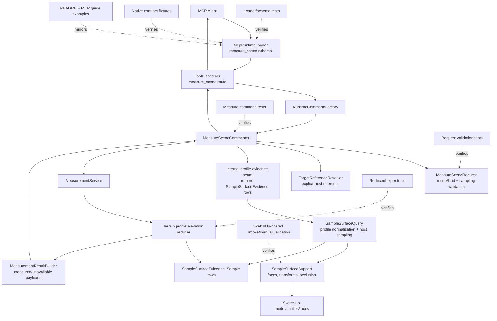

# Technical Plan: SVR-04 Add Terrain-Aware Measurement Evidence
**Task ID**: `SVR-04`
**Title**: `Add Terrain-Aware Measurement Evidence`
**Status**: `finalized`
**Date**: `2026-04-24`

## Source Task

- [Add Terrain-Aware Measurement Evidence](./task.md)

## Problem Summary

`SVR-03` shipped `measure_scene` as the public direct-measurement surface for generic bounds, height, distance, and area questions. Terrain review workflows still need profile-derived elevation evidence, but they should not jump directly to slope diagnostics, grade verdicts, trench/hump detection, fairness checks, or terrain editing.

`SVR-04` adds one bounded terrain-aware measurement branch to `measure_scene`: `terrain_profile/elevation_summary`. The branch consumes explicit-host profile evidence from the completed `STI-03` profile sampling internals, reduces that evidence into compact elevation quantities, and returns the result through the existing `measure_scene` measured/unavailable envelope.

## Goals

- Add one public `measure_scene` terrain-aware mode/kind: `terrain_profile/elevation_summary`.
- Return compact unit-bearing elevation summary evidence for explicit terrain profiles.
- Reuse `STI-03` internal `SampleSurfaceEvidence::Sample` rows rather than duplicating terrain sampling or calling public MCP tools internally.
- Preserve the existing `measure_scene` public response posture: `outcome: "measured"` or `outcome: "unavailable"`.
- Keep terrain-aware measurement evidence distinct from validation verdicts, diagnostics, and terrain editing.
- Keep existing `measure_scene` generic modes and existing `sample_surface_z` behavior stable.

## Non-Goals

- Before/after, design/current, or baseline comparison.
- Slope, grade, crossfall, max grade, grade-break, trench/hump, fairness, drainage, or clearance-to-terrain quantities.
- Pass/fail validation verdicts or compliance language.
- Terrain editing, patch replacement, smoothing, fairing, working-copy lifecycle, commit, or rollback.
- A new public terrain measurement tool separate from `measure_scene`.
- Routing validation through the public `measure_scene` MCP tool.
- Parsing public serialized `sample_surface_z` JSON inside measurement internals.
- Adding a caller-configurable evidence limit in this task. Evidence samples are capped by the implementation to keep the measurement result compact.

## Related Context

- [SVR-04 source task](./task.md)
- [SVR-03 task](specifications/tasks/scene-validation-and-review/SVR-03-measure-scene-mvp-with-structured-measurement-modes/task.md)
- [SVR-03 summary](specifications/tasks/scene-validation-and-review/SVR-03-measure-scene-mvp-with-structured-measurement-modes/summary.md)
- [STI-03 task](specifications/tasks/scene-targeting-and-interrogation/STI-03-extend-sample-surface-z-with-profile-and-section-sampling/task.md)
- [STI-03 summary](specifications/tasks/scene-targeting-and-interrogation/STI-03-extend-sample-surface-z-with-profile-and-section-sampling/summary.md)
- [Scene Validation and Review HLD](specifications/hlds/hld-scene-validation-and-review.md)
- [PRD: Scene Validation and Review](specifications/prds/prd-scene-validation-and-review.md)
- [PRD: Scene Targeting and Interrogation](specifications/prds/prd-scene-targeting-and-interrogation.md)
- [Terrain authoring signal](specifications/signals/2026-04-24-partial-terrain-authoring-session-reveals-stable-patch-editing-contract.md)

## Research Summary

- `SVR-03` is implemented and provides the established `measure_scene` mode/kind pattern, compact target references, runtime refusal style, optional evidence, and `measured` / `unavailable` response outcomes.
- `STI-03` is implemented and provides canonical `sample_surface_z` requests with `target + sampling`, `sampling.type: "profile"`, sample generation by `sampleCount` or `intervalMeters`, a 200-sample cap, ordered profile rows, and compact summaries.
- `STI-03` introduced `SampleSurfaceEvidence::Sample` with index, XY, optional Z, distance along path, path progress, and status. This is the correct internal bridge for `SVR-04`.
- The terrain authoring signal supports terrain profile evidence as a repeated workflow need, but it also reinforces that slope, fairness, trench/hump, and editing concerns must remain deferred.
- External review with `grok-4.20` and `gpt-5.4` converged on one MVP branch: `terrain_profile/elevation_summary`. Both recommended deferring comparison and slope/grade because of contract ambiguity, diagnostic boundary risk, and unnecessary implementation surface for the first slice.
- `STI-03` hosted validation found and addressed nested ignore-target and hidden-ancestor visibility defects, but future hosted coverage should still include realistic transformed/nested terrain and occlusion-sensitive cases when `SVR-04` wires measurement through those internals.
- A separate `grok-4.20` premortem against the MCP tool authoring guide identified four plan corrections: avoid adding too many flat `measure_scene` siblings, keep partial response fields chainable, harden the internal evidence seam so implementation cannot parse public JSON, and cap returned sample evidence so `includeEvidence` remains compact.

## Technical Decisions

### Data Model

The public branch is:

| mode | kind | required fields | optional fields |
| --- | --- | --- | --- |
| `terrain_profile` | `elevation_summary` | `target`, `sampling` | `samplingPolicy.visibleOnly`, `samplingPolicy.ignoreTargets`, `outputOptions.includeEvidence` |

The `sampling` object for this branch must be STI-03 profile sampling only:

```json
{
  "type": "profile",
  "path": [
    { "x": 0.0, "y": 0.0 },
    { "x": 5.0, "y": 0.0 }
  ],
  "sampleCount": 25
}
```

or:

```json
{
  "type": "profile",
  "path": [
    { "x": 0.0, "y": 0.0 },
    { "x": 5.0, "y": 0.0 }
  ],
  "intervalMeters": 0.5
}
```

`sampling.type: "points"` is valid for `sample_surface_z`, but invalid for `measure_scene` `terrain_profile/elevation_summary`.

Profile sampling policy is nested separately from the sampling geometry:

```json
{
  "visibleOnly": true,
  "ignoreTargets": [
    { "sourceElementId": "tree-006" }
  ]
}
```

This keeps the `measure_scene` root compact and separates the profile path from host visibility and occlusion policy. The semantics mirror STI-03 profile sampling, but the public request shape remains owned by `measure_scene`.

Internal profile evidence must be represented as `SampleSurfaceEvidence::Sample` rows, not public serialized `sample_surface_z` hashes. The reducer consumes rows with:

- `index`
- `x`
- `y`
- `z`
- `distance_along_path_meters`
- `path_progress`
- `status`

### API and Interface Design

Example request:

```json
{
  "mode": "terrain_profile",
  "kind": "elevation_summary",
  "target": { "sourceElementId": "terrain-main" },
  "sampling": {
    "type": "profile",
    "path": [
      { "x": 0.0, "y": 0.0 },
      { "x": 5.0, "y": 0.0 }
    ],
    "sampleCount": 25
  },
  "samplingPolicy": {
    "visibleOnly": true,
    "ignoreTargets": [{ "sourceElementId": "tree-006" }]
  },
  "outputOptions": { "includeEvidence": false }
}
```

Measured response with complete hits:

```json
{
  "success": true,
  "outcome": "measured",
  "measurement": {
    "mode": "terrain_profile",
    "kind": "elevation_summary",
    "value": {
      "minElevation": 1.2,
      "maxElevation": 2.4,
      "elevationRange": 1.2,
      "sampledLengthMeters": 10.0,
      "totalSamples": 25,
      "hitCount": 25,
      "missCount": 0,
      "ambiguousCount": 0,
      "startElevation": 1.2,
      "endElevation": 1.9,
      "netElevationDelta": 0.7,
      "totalRise": 0.9,
      "totalFall": 0.2
    },
    "unit": "m"
  }
}
```

Measured response with partial hits:

```json
{
  "success": true,
  "outcome": "measured",
  "measurement": {
    "mode": "terrain_profile",
    "kind": "elevation_summary",
    "value": {
      "minElevation": 1.2,
      "maxElevation": 2.4,
      "elevationRange": 1.2,
      "sampledLengthMeters": 10.0,
      "totalSamples": 25,
      "hitCount": 23,
      "missCount": 2,
      "ambiguousCount": 0,
      "startElevation": null,
      "endElevation": null,
      "netElevationDelta": null,
      "totalRise": null,
      "totalFall": null
    },
    "unit": "m"
  }
}
```

Unavailable response when no samples hit:

```json
{
  "success": true,
  "outcome": "unavailable",
  "measurement": {
    "mode": "terrain_profile",
    "kind": "elevation_summary",
    "reason": "no_profile_hits"
  }
}
```

Evidence response when requested:

```json
{
  "evidence": {
    "summary": {
      "totalSamples": 25,
      "hitCount": 23,
      "missCount": 2,
      "ambiguousCount": 0,
      "sampledLengthMeters": 10.0,
      "complete": false
    },
    "omittedQuantities": [
      {
        "field": "totalRise",
        "reason": "requires_all_samples_hit"
      },
      {
        "field": "totalFall",
        "reason": "requires_all_samples_hit"
      }
    ],
    "samples": [
      {
        "index": 0,
        "samplePoint": { "x": 0.0, "y": 0.0 },
        "distanceAlongPathMeters": 0.0,
        "pathProgress": 0.0,
        "status": "hit",
        "hitPoint": { "x": 0.0, "y": 0.0, "z": 1.2 }
      }
    ],
    "samplesTruncated": true,
    "sampleLimit": 50
  }
}
```

Derivation rules:

- `minElevation`: minimum `z` across hit samples.
- `maxElevation`: maximum `z` across hit samples.
- `elevationRange`: `maxElevation - minElevation`.
- `sampledLengthMeters`: final sample `distance_along_path_meters`, or `0.0` if no rows exist.
- `startElevation`: first sample `z`, or `null` when the first sample is not a hit.
- `endElevation`: last sample `z`, or `null` when the last sample is not a hit.
- `netElevationDelta`: `endElevation - startElevation`, or `null` unless both endpoint samples hit.
- `totalRise`: sum of positive `z` deltas between consecutive samples, or `null` unless every sample hits.
- `totalFall`: absolute sum of negative `z` deltas between consecutive samples, or `null` unless every sample hits.
- `totalSamples`, `hitCount`, `missCount`, and `ambiguousCount`: counts across all generated profile samples.
- `samplesTruncated`: true when the evidence sample list was capped below the generated sample count.
- `sampleLimit`: maximum number of compact evidence samples returned by `measure_scene`.

### Public Contract Updates

Request deltas:

- Extend `measure_scene` `mode` enum with `terrain_profile`.
- Extend `measure_scene` `kind` enum with `elevation_summary`.
- Add `sampling` to the `measure_scene` schema.
- Add `samplingPolicy` to the `measure_scene` schema for terrain profile visibility and ignore-target policy.
- Add `samplingPolicy.visibleOnly` for terrain profile sampling.
- Add `samplingPolicy.ignoreTargets` for terrain profile sampling.
- Keep `target`, `from`, `to`, and `outputOptions.includeEvidence`.
- Keep the root schema provider-compatible: top-level `type: "object"` with no top-level `oneOf`, `anyOf`, `allOf`, `not`, or root `enum`.
- Enforce legal field combinations at runtime, not through root schema composition.

Response deltas:

- Add measured value shape for `terrain_profile/elevation_summary`.
- Add unavailable reason `no_profile_hits`.
- Add optional compact evidence with `summary`, `omittedQuantities`, capped `samples`, `samplesTruncated`, and `sampleLimit`.
- Do not add a new `partial` outcome.

Schema and registration updates:

- Update `src/su_mcp/runtime/native/mcp_runtime_loader.rb` `measure_scene` description, schema properties, `mode` enum, `kind` enum, and field descriptions.
- Keep `measure_scene` read-only annotations.
- Document that `terrain_profile/elevation_summary` is not slope, grade, trench/hump, fairness, drainage, validation, or editing.

Routing updates:

- No new public tool route is added.
- `src/su_mcp/runtime/tool_dispatcher.rb` should remain unchanged unless tests reveal a dispatch assumption.
- `src/su_mcp/runtime/runtime_command_factory.rb` should remain unchanged unless the command constructor needs new collaborator injection.

Runtime updates:

- Update `src/su_mcp/scene_validation/measure_scene_request.rb` with `terrain_profile/elevation_summary`, mode-specific reference fields, profile-only sampling validation, and `samplingPolicy` validation.
- Update `src/su_mcp/scene_validation/measure_scene_commands.rb` to route terrain profile requests through the internal evidence seam and then into measurement reduction.
- Update `src/su_mcp/scene_validation/measurement_service.rb` or a small helper called by it to reduce `SampleSurfaceEvidence::Sample` rows.
- Extend `src/su_mcp/scene_validation/measurement_result_builder.rb` only if a small reusable builder method avoids duplicating envelope construction.
- Reuse `src/su_mcp/scene_query/sample_surface_evidence.rb`.
- Reuse `src/su_mcp/scene_query/sample_surface_query.rb` internals through an explicit internal method/helper that returns `SampleSurfaceEvidence::Sample` objects. Do not parse public `sample_surface_z` JSON.

Test and docs updates:

- Update `test/runtime/native/mcp_runtime_loader_test.rb`.
- Update `test/scene_validation/measure_scene_request_test.rb`.
- Update `test/scene_validation/measure_scene_commands_test.rb`.
- Add or update terrain profile reducer/helper tests.
- Update `test/runtime/native/mcp_runtime_native_contract_test.rb`.
- Update `test/support/native_runtime_contract_cases.json`.
- Update `README.md`.
- Update the MCP guide or current source-of-truth documentation that describes `measure_scene`.
- Add hosted/manual verification notes to the implementation summary when implementation is complete.

### Error Handling

Use `ToolResponse.refusal` for invalid request usage:

- unsupported `mode`
- unsupported `kind`
- illegal `mode`/`kind` pair
- missing `target`
- missing `sampling`
- unsupported `sampling.type`
- `sampling.type: "points"` for `terrain_profile/elevation_summary`
- missing or invalid profile `path`
- missing or mutually exclusive profile spacing fields
- generated profile sample count above cap
- unresolved target
- ambiguous target
- unsupported target type
- target with no sampleable face geometry
- unsupported `samplingPolicy`, `samplingPolicy.visibleOnly`, `samplingPolicy.ignoreTargets`, or `outputOptions` shape

Use `outcome: "unavailable"` only when the request is valid and profile evidence is generated, but no generated profile sample has `status: "hit"`.

Finite unavailable reason:

- `no_profile_hits`

Do not use validation-style `failed` outcomes and do not introduce `partial`.

### State Management

`terrain_profile/elevation_summary` is read-only. It must not:

- create, modify, hide, lock, duplicate, delete, or reparent SketchUp entities
- mutate materials, tags, metadata, model units, selection, or camera state
- persist sampled evidence or cache model state across calls

### Integration Points

- `MeasureSceneRequest` owns public request validation and legal field combinations.
- `MeasureSceneCommands` owns command orchestration, target resolution, evidence retrieval, and result shaping.
- `TargetReferenceResolver` remains the target identity seam for `measure_scene`.
- STI-03 sampling internals remain the host-surface sampling seam.
- `SampleSurfaceEvidence::Sample` is the evidence DTO crossing from targeting/interrogation into measurement.
- A terrain profile reducer/helper owns numeric derivation from profile evidence.
- `MeasurementResultBuilder` preserves public unit and envelope consistency.
- Future validation work should reuse internal measurement helpers directly, not call public `measure_scene`.

### Configuration

No user-facing configuration is added.

The profile sample cap remains owned by STI-03 profile generation. SVR-04 accepts that cap and does not add a separate measurement-specific generation cap.

`measure_scene` evidence samples are capped to 50 serialized samples when `outputOptions.includeEvidence` is true. Summary counts and numeric measurement values are still computed from the full generated profile evidence. When more than 50 rows exist, `samplesTruncated: true` and `sampleLimit: 50` are included. The returned sample subset should be deterministic and include the first and last generated samples so endpoint evidence remains inspectable.

Numeric outputs use public meters and six-decimal rounding consistent with existing measurement behavior.

## Architecture Context



## Key Relationships

- `measure_scene` answers direct measurement questions.
- `sample_surface_z` answers explicit-host interrogation questions.
- `terrain_profile/elevation_summary` composes STI-03 profile evidence into SVR-04 measurement output.
- Validation diagnostics remain downstream follow-ons and should consume internal measurement helpers directly.
- Terrain editing remains outside this task.

## Acceptance Criteria

- `measure_scene` exposes exactly one new terrain-aware public branch: `mode: "terrain_profile"` with `kind: "elevation_summary"`.
- The `terrain_profile/elevation_summary` request accepts an explicit `target` and a STI-03-compatible `sampling` object with `sampling.type: "profile"`.
- `terrain_profile/elevation_summary` accepts `samplingPolicy.visibleOnly`, `samplingPolicy.ignoreTargets`, and `outputOptions.includeEvidence` with semantics aligned to STI-03 profile sampling.
- `terrain_profile/elevation_summary` refuses missing `target`, missing `sampling`, `sampling.type` values other than `profile`, invalid profile paths, invalid spacing, profile sample counts over the STI-03 cap, unresolved targets, ambiguous targets, unsupported target types, and targets with no sampleable face geometry.
- The runtime does not add before/after comparison, slope/grade/crossfall quantities, trench/hump/fairness/drainage diagnostics, terrain editing, patch helpers, or working-copy lifecycle behavior.
- The implementation reuses STI-03 internal profile evidence and does not call public `sample_surface_z` over MCP or parse public serialized `sample_surface_z` JSON.
- When at least one profile sample hits, the response returns `success: true`, `outcome: "measured"`, and matching `measurement.mode` / `measurement.kind`.
- A measured terrain profile response always includes `measurement.value.minElevation`, `maxElevation`, `elevationRange`, `sampledLengthMeters`, `totalSamples`, `hitCount`, `missCount`, and `ambiguousCount`.
- A measured terrain profile response always includes `startElevation`, `endElevation`, `netElevationDelta`, `totalRise`, and `totalFall`, using `null` for any quantity that the available profile evidence cannot support.
- When zero profile samples hit, the response returns `success: true`, `outcome: "unavailable"`, and `measurement.reason: "no_profile_hits"`.
- With `outputOptions.includeEvidence` false or omitted, the response omits compact sample evidence.
- With `outputOptions.includeEvidence: true`, the response includes compact serialized profile sample evidence capped at 50 samples plus explicit omitted-quantity entries and reasons; it does not include raw SketchUp objects, face dumps, validation findings, diagnostics, or edit suggestions.
- Public schema, native contract fixtures, command/request tests, reducer tests, README, and MCP guide examples describe the same request/response contract.
- Existing `measure_scene` branches and existing `sample_surface_z` behavior remain compatible with their current contracts.
- Hosted or documented manual SketchUp validation covers transformed/nested terrain, explicit-host profile sampling, occluders, `samplingPolicy.visibleOnly`, `samplingPolicy.ignoreTargets`, boundary/miss handling, and the no-hit unavailable path.

## Test Strategy

### TDD Approach

Start at the public contract and reducer seams, then wire runtime orchestration:

1. Add failing loader/schema tests for the new `measure_scene` mode/kind and profile-only request fields.
2. Add failing request validation tests for legal and illegal terrain profile shapes.
3. Add failing reducer/helper tests for complete, partial, endpoint-miss, internal-miss, ambiguous, and zero-hit evidence.
4. Add failing command tests proving `MeasureSceneCommands` resolves the target, uses internal STI-03 evidence, shapes measured/unavailable results, and preserves existing generic modes.
5. Add native contract fixtures for one measured success, one unavailable no-hit result, and one structured refusal.
6. Update docs/examples after tests pin the contract.
7. Run focused tests, then broad Ruby tests, lint, package verification, and hosted/manual smoke.

### Required Test Coverage

- Loader/schema tests:
  - `terrain_profile` appears in `measure_scene` mode enum.
  - `elevation_summary` appears in `measure_scene` kind enum.
  - `sampling` and `samplingPolicy` are documented in the `measure_scene` schema.
  - root schema remains provider-compatible.
  - descriptions distinguish elevation summary from slope, grade, diagnostics, validation, and editing.
- Request tests:
  - valid `terrain_profile/elevation_summary` profile sampling request.
  - missing `target`.
  - missing `sampling`.
  - `sampling.type: "points"` refusal.
  - unsupported sampling type refusal.
  - invalid path and invalid spacing refusals.
  - sample cap refusal.
  - invalid `samplingPolicy.visibleOnly`, `samplingPolicy.ignoreTargets`, and `outputOptions.includeEvidence` shapes.
- Reducer/helper tests:
  - all-hit profile includes every value field.
  - partial profile includes mandatory fields and returns `null` for unsupported conditional fields.
  - endpoint miss returns `null` for endpoint and net-delta fields.
  - internal miss returns `null` for `totalRise` and `totalFall`.
  - ambiguous samples count correctly and do not contribute elevations.
  - zero-hit profile returns unavailable `no_profile_hits`.
  - formulas and rounding are deterministic.
- Command tests:
  - target resolution is called with compact target references.
  - internal evidence seam returns `SampleSurfaceEvidence::Sample` objects, not public serialized hashes.
  - measurement hot path does not call `JSON.parse` or `serialize_sampling_evidence`.
  - output evidence is omitted by default.
  - output evidence is included when requested.
  - existing generic `measure_scene` modes still pass.
  - validation does not call public `measure_scene` or public `sample_surface_z` MCP internally.
- Native contract tests:
  - one wrapped measured success.
  - one wrapped unavailable no-hit result.
  - one structured refusal for invalid sampling type or cap.
- Docs checks:
  - README example matches schema.
  - MCP guide or current source-of-truth docs mention only `terrain_profile/elevation_summary` for SVR-04 and explicitly defer slope/grade/comparison/diagnostics.
- Hosted/manual SketchUp validation:
  - transformed and nested terrain host.
  - occluding geometry with `samplingPolicy.visibleOnly` true/false.
  - ignored occluder by `sourceElementId`, `persistentId`, and compatibility `entityId` where practical.
  - boundary hit/miss behavior.
  - vertical face or non-sampleable geometry returning no bogus Z.
  - no-hit unavailable path.

## Instrumentation and Operational Signals

- No persistent telemetry is required.
- Measurement response counts (`totalSamples`, `hitCount`, `missCount`, `ambiguousCount`) are the primary operational signal for profile quality.
- `includeEvidence` provides compact derivation evidence for debugging without logs or text scraping.
- Implementation summary must record hosted/manual smoke status and any remaining host-sensitive gaps.

## Implementation Phases

1. Contract tests and request validation:
   - Add failing loader/schema tests and request tests for `terrain_profile/elevation_summary`.
   - Pin profile-only sampling, optional `samplingPolicy.visibleOnly`, `samplingPolicy.ignoreTargets`, and evidence controls.
2. Reducer/helper:
   - Add a terrain profile elevation reducer that consumes `SampleSurfaceEvidence::Sample` rows.
   - Cover complete, partial, endpoint-miss, internal-miss, ambiguous, and zero-hit cases.
3. Internal evidence seam:
   - Expose or extract a non-public STI-03 profile evidence path suitable for `MeasureSceneCommands`.
   - Block implementation if this seam cannot return `SampleSurfaceEvidence::Sample` rows without public serialization.
   - Keep public serialization separate from internal evidence generation.
4. Command and service wiring:
   - Route terrain profile requests through target resolution, profile evidence generation, reduction, and result shaping.
   - Preserve existing generic measurement branches.
5. Public contract artifacts:
   - Update loader schema, native contract fixtures, README, and guide examples.
6. Verification:
   - Run focused Ruby tests.
   - Run broad `bundle exec rake ruby:test`.
   - Run RuboCop or project Ruby lint task.
   - Run package verification if runtime packaging surface changed.
   - Complete or explicitly document hosted/manual SketchUp smoke.

## Rollout Approach

- Ship additively as a new `measure_scene` mode/kind.
- Do not migrate existing `measure_scene` callers.
- Do not change `sample_surface_z` public behavior.
- Keep deferred modes absent from schema and examples.
- If implementation discovers that the internal STI-03 evidence seam cannot return `SampleSurfaceEvidence::Sample` rows without public JSON parsing, stop and revise this plan before continuing.

## Risks and Controls

- Contract drift: require loader schema, runtime validation, native contract fixtures, command tests, docs, and examples to move together.
- Public surface widens accidentally: explicitly refuse non-profile sampling and unsupported terrain-aware modes/kinds.
- Transport coupling: use internal `SampleSurfaceEvidence::Sample` rows; never call public MCP tools internally.
- Partial data misuse: include counts always, keep value keys stable with `null` for unsupported quantities, and include omitted-quantity reasons with evidence.
- Host-sensitive geometry gaps: require hosted/manual validation for transforms, nesting, occlusion, visibility, ignore targets, boundaries, vertical faces, and no-hit paths.
- Boundary drift into diagnostics: document that slope, grade, comparison, trench/hump, fairness, drainage, validation, and editing are out of scope.
- Payload size: cap returned evidence samples at 50 while computing summaries from the full STI-03 profile cap.
- Unit inconsistency: consume meter-space STI-03 evidence and assert public meter values in tests.

## Dependencies

- Completed `SVR-03` `measure_scene` MVP and existing measurement response conventions.
- Completed `STI-03` profile sampling internals and `SampleSurfaceEvidence::Sample`.
- Existing runtime loader, dispatcher, factory, target resolver, and scene-query serializer.
- Existing Ruby test and lint tasks.
- SketchUp-hosted runtime or manual validation environment for final geometry-sensitive smoke checks.

## Premortem

### Intended Goal Under Test

`SVR-04` must add a bounded, public, MCP-client-usable `measure_scene` branch for terrain profile elevation evidence. It should reduce fallback to arbitrary Ruby for terrain review evidence while keeping measurement separate from interrogation, validation verdicts, terrain diagnostics, and terrain editing.

### Failure Paths and Mitigations

- **The public request shape becomes too flat and too similar to `sample_surface_z`**
  - Business-plan mismatch: The business needs one clear terrain measurement branch; a flat request with copied sampling controls optimizes for implementation convenience while weakening tool boundaries.
  - Root-cause failure path: `sampling`, `visibleOnly`, and `ignoreTargets` are added as independent top-level `measure_scene` siblings, making `measure_scene` look like a second profile-sampling tool rather than a measurement reducer.
  - Why this misses the goal: MCP clients choose between `measure_scene` and `sample_surface_z` inconsistently, and the tool surface violates the MCP authoring guide's compactness and boundary guidance.
  - Likely cognitive bias: Anchoring on the existing flat SVR-03 schema and copying STI-03 fields because the internals are shared.
  - Classification: can be validated before implementation.
  - Mitigation now: Keep `target` and `sampling` top-level, but move visibility and ignore-target behavior under `samplingPolicy`; add contrastive schema descriptions that say `sample_surface_z` is for raw profile interrogation and `measure_scene` is for elevation summary measurement.
  - Required validation: Loader/schema tests check top-level field count, `samplingPolicy` ownership, provider-compatible root schema, and contrastive descriptions for both neighboring tools.

- **Partial-hit measured responses mislead downstream agents**
  - Business-plan mismatch: The business needs compact, chainable measurement evidence; conditional missing keys optimize for compactness but make partial results easy to misread.
  - Root-cause failure path: A partial profile returns `outcome: "measured"` while omitting endpoint or rise/fall fields, causing downstream code or agents to treat absence as zero or ignore profile quality.
  - Why this misses the goal: Review automation can make wrong terrain inferences from a successful-looking response, reintroducing the manual interpretation burden this task is meant to reduce.
  - Likely cognitive bias: Optimism bias that callers will study schema prose and evidence details before using numeric fields.
  - Classification: requires implementation-time instrumentation or acceptance testing.
  - Mitigation now: Keep all declared value keys present in measured responses and use `null` for unsupported endpoint or rise/fall quantities; include counts always and omitted-quantity reasons when evidence is requested.
  - Required validation: Reducer tests and native contract fixtures for complete, endpoint-miss, internal-miss, ambiguous, and partial profiles; client-facing smoke confirms partial responses remain chainable without interpreting missing keys.

- **The implementation quietly parses public `sample_surface_z` JSON**
  - Business-plan mismatch: The business needs reusable measurement internals; parsing public JSON optimizes for short-term wiring and creates transport coupling.
  - Root-cause failure path: The only available STI-03 integration path returns serialized public hashes, so the measurement reducer consumes those hashes or reparses JSON instead of `SampleSurfaceEvidence::Sample` rows.
  - Why this misses the goal: Public transport shape becomes an internal dependency, making future `sample_surface_z` documentation or serialization changes risky for measurement.
  - Likely cognitive bias: Path-of-least-resistance implementation momentum.
  - Classification: requires implementation-time instrumentation or acceptance testing.
  - Mitigation now: Plan requires an explicit internal profile evidence seam that returns `SampleSurfaceEvidence::Sample` rows and blocks implementation if that seam cannot be provided without public serialization.
  - Required validation: Command/helper tests assert reducer inputs are `SampleSurfaceEvidence::Sample` objects, and the measurement hot path does not call `JSON.parse` or `serialize_sampling_evidence`.

- **Evidence payloads become too large for practical MCP use**
  - Business-plan mismatch: The business needs compact terrain evidence; returning all profile samples up to STI-03's 200-sample generation cap optimizes for debug completeness over normal agent usability.
  - Root-cause failure path: `includeEvidence: true` returns every generated row, inflating the response in realistic profiles and causing provider truncation, token pressure, or slower multi-step workflows.
  - Why this misses the goal: Agents avoid the tool or lose evidence reliability under realistic terrain review profiles.
  - Likely cognitive bias: Availability bias from small local fixtures and the assumption that explicit evidence requests can be arbitrarily large.
  - Classification: can be validated before implementation.
  - Mitigation now: Cap returned evidence samples at 50, compute summaries from the full generated profile, and include `samplesTruncated` plus `sampleLimit`.
  - Required validation: Evidence-size test or fixture asserts the sample cap behavior, includes first and last samples in truncated evidence, and keeps default responses evidence-free.

- **Mock-friendly tests miss SketchUp host behavior**
  - Business-plan mismatch: The business needs terrain measurement evidence that works in actual SketchUp scenes; fake geometry tests optimize for deterministic local coverage.
  - Root-cause failure path: Implementation passes reducer and command tests while real nested components, transformed terrain, hidden ancestors, occluders, boundary points, or vertical faces produce different hit counts or elevation values.
  - Why this misses the goal: `measure_scene` returns plausible but wrong terrain evidence, pushing users back to arbitrary Ruby or manual inspection.
  - Likely cognitive bias: Availability bias from STI-03 unit tests and overconfidence after hosted defects were fixed once.
  - Classification: requires implementation-time instrumentation or acceptance testing.
  - Mitigation now: Hosted/manual SketchUp validation is required before implementation close-out, not optional, and must cover transformed/nested terrain, occlusion policy, ignore targets, boundaries, vertical faces, and no-hit paths.
  - Required validation: Hosted smoke record in the implementation summary, including any residual host-sensitive gaps and exact scenarios exercised.

- **The tool drifts into slope, grade, or diagnostics after the elevation reducer exists**
  - Business-plan mismatch: The business needs a small evidence branch now and diagnostic follow-ons later; adding more fields optimizes for perceived immediate value but blurs validation boundaries.
  - Root-cause failure path: Implementers add slope, grade, crossfall, or comparison fields because the profile evidence makes them easy to derive.
  - Why this misses the goal: The public contract starts implying grade compliance or terrain quality judgments without the diagnostics plan, tests, or product semantics to support them.
  - Likely cognitive bias: Feature creep and implementation proximity bias.
  - Classification: can be validated before implementation.
  - Mitigation now: Keep only `terrain_profile/elevation_summary` in schema, docs, examples, and tests; explicitly defer comparison, slope/grade, trench/hump, fairness, drainage, and editing.
  - Required validation: Loader tests, docs checks, and native fixtures confirm no deferred mode/kind names or diagnostic fields appear.

## Quality Checks

- [x] All required inputs validated
- [x] Problem statement documented
- [x] Goals and non-goals documented
- [x] Research summary documented
- [x] Technical decisions included
- [x] Architecture context included
- [x] Acceptance criteria included
- [x] Test requirements specified
- [x] Instrumentation and operational signals defined when needed
- [x] Risks and dependencies documented
- [x] Rollout approach documented when needed
- [x] Small reversible phases defined
- [x] Premortem completed with falsifiable failure paths and mitigations
