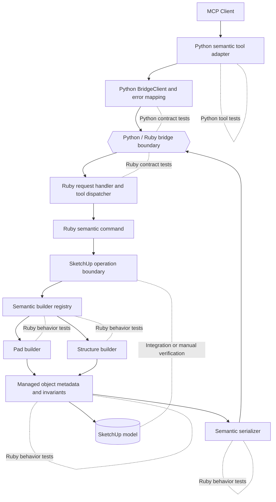

# Technical Plan: SEM-01 Establish Semantic Core and First Vertical Slice
**Task ID**: `SEM-01`
**Title**: `Establish Semantic Core and First Vertical Slice`
**Status**: `finalized`
**Date**: `2026-04-14`

## Source Task

- [Establish Semantic Core and First Vertical Slice](./task.md)

## Problem Summary

The repository has the platform seams needed for semantic modeling, but it still exposes only primitive-first creation and mutation helpers. `SEM-01` must introduce the first end-to-end semantic creation slice through one public `create_site_element` tool while proving the core capability boundaries that later semantic tasks depend on: Ruby-owned semantic execution, Managed Scene Object metadata ownership, explicit `pad` versus `structure` refusal behavior, and JSON-safe semantic serialization across the Python/Ruby bridge.

## Goals

- Add `create_site_element` as the first public semantic creation tool through the existing Python MCP adapter and Ruby bridge boundary.
- Deliver Ruby-owned MVP semantic creation for `structure` and `pad`.
- Establish the first Managed Scene Object metadata and invariant layer for semantic objects created through MCP.
- Return structured, JSON-serializable semantic results for successful creation and structured semantic refusals for well-formed but unsupported or ambiguous requests.
- Land Ruby tests, Python tests, and shared contract coverage for the new public semantic boundary in the same change.

## MCP Decoration Guidance

- Live tool title: `Create Semantic Site Element`
- Current-phase live description: `Create a managed semantic site element in SketchUp. Current support is limited to footprint-based structure and pad creation.`
- MCP posture: mutating and non-destructive

## Non-Goals

- Completing the remaining first-wave semantic types beyond `structure` and `pad`.
- Delivering `set_entity_metadata`.
- Delivering identity-preserving rebuild or replacement flows.
- Defining the full compatibility policy for generic mutation tools on Managed Scene Objects.
- Hardening `status` to a controlled enum in this task.
- Introducing richer footprint schemas with holes or multi-ring geometry.

## Related Context

- [Semantic Scene Modeling HLD](specifications/hlds/hld-semantic-scene-modeling.md)
- [Semantic Scene Modeling PRD](specifications/prds/prd-semantic-scene-modeling.md)
- [Domain Analysis](specifications/domain-analysis.md)
- [PLAT-02 Extract Ruby SketchUp Adapters and Serializers](specifications/tasks/platform/PLAT-02-extract-ruby-sketchup-adapters-and-serializers/task.md)
- [PLAT-03 Decompose Python MCP Adapter](specifications/tasks/platform/PLAT-03-decompose-python-mcp-adapter/task.md)
- [STI-01 Targeting MVP and `find_entities`](specifications/tasks/scene-targeting-and-interrogation/STI-01-targeting-mvp-and-find-entities/task.md)

## Research Summary

- The repo already has the required platform seams in code: centralized Python bridge invocation, capability-oriented Python tool modules, Ruby request normalization, a stable Ruby dispatcher, and reusable Ruby serialization helpers.
- `PLAT-02` and `PLAT-03` are implemented and should be treated as completed dependencies for this task.
- `STI-01` is also implemented in code despite stale task metadata; its request-shaping, typed Python schema, compact Ruby command surface, and shared contract-test pattern are the main reusable examples for `SEM-01`.
- The only existing semantic-adjacent metadata precedent in code is `su_mcp.sourceElementId`; there is no Managed Scene Object metadata/invariant layer yet.
- Current Python bridge error handling collapses remote errors into a message-only `BridgeRemoteError`, so semantic refusals should stay in the successful result envelope rather than relying on JSON-RPC error payloads for structured domain outcomes.

## Technical Decisions

### Data Model

- `create_site_element` will accept one compact top-level request shape with explicit semantic fields rather than a free-form metadata blob.
- Required request fields for all MVP element types:
  - `elementType`
  - `sourceElementId`
  - `status`
  - `footprint`
- Optional request fields for all MVP element types:
  - `elevation`
  - `name`
  - `tag`
  - `material`
- `footprint` will be an ordered point list `[[x, y], ...]` with polygon closure implied by the runtime.
- All numeric coordinates and lengths will be interpreted in the active SketchUp model units.
- `footprint` validation rules for `SEM-01`:
  - at least 3 distinct points after normalization
  - no consecutive duplicate points after normalization
  - non-zero polygon area
  - no self-intersection
  - closure implied by the runtime; a repeated closing point may be normalized away
- `elevation` is optional for both element types, defaults to `0.0`, and negative values are allowed.
- `structure` additionally requires:
  - `height`
  - `structureCategory`
- `structure.height` must be finite and strictly greater than `0`.
- `pad` supports:
  - `elevation` as top-surface reference
  - optional `thickness` as downward body depth
- `pad.thickness`, when present, must be finite and strictly greater than `0`.
- Optional scene-facing convenience fields may be accepted without becoming semantic invariants:
  - `name`
  - `tag`
  - `material`
- `material`, when provided, is applied at the wrapper-group level in `SEM-01`.
- Managed Scene Object metadata will live in the existing `su_mcp` attribute dictionary on the wrapper group.
- Minimum persisted metadata keys for `SEM-01`:
  - `managedSceneObject = true`
  - `sourceElementId`
  - `semanticType`
  - `status`
  - `state = Created`
  - `schemaVersion = 1`
  - `structureCategory` for `structure` only
- Approved MVP `structureCategory` values will be centrally defined in Ruby:
  - `main_building`
  - `outbuilding`
  - `extension`

### Geometry Contract

- `SEM-01` uses a simple footprint-driven geometry contract and does not introduce roofs, openings, terrain snapping, or hole/ring support.
- Both semantic builders create one top-level `Sketchup::Group` that owns the semantic metadata and is the serialized Managed Scene Object.
- `pad` geometry rules:
  - project the footprint onto a horizontal plane at `Z = elevation`
  - create one coplanar top face inside the wrapper group
  - if `thickness` is absent, keep the result as a face-only group
  - if `thickness > 0`, extrude the top face downward by `thickness`
- `structure` geometry rules:
  - project the footprint onto a horizontal base plane at `Z = elevation`
  - create one coplanar base face inside the wrapper group
  - extrude the base face upward by `height`
  - no roof, opening, or enclosure-detail semantics are part of `SEM-01`
- The semantic serializer should expose wrapper-group identifiers and bounds, not raw face or edge inventories.

### API and Interface Design

- Python will expose a new public tool in `python/src/sketchup_mcp_server/tools/semantic.py`.
- Python will use a typed request model for `create_site_element`, mirroring the current `find_entities` nested-schema pattern where practical, but without embedding semantic policy beyond shape/type validation.
- `python/src/sketchup_mcp_server/tools/__init__.py` will register the semantic tool explicitly to preserve deterministic tool ordering.
- Ruby will add a dedicated semantic command entrypoint and support tree:
  - `src/su_mcp/semantic_commands.rb`
  - `src/su_mcp/semantic/`
- `src/su_mcp/tool_dispatcher.rb` will map `create_site_element` to the new Ruby semantic command entrypoint.
- Ruby semantic support will be split into focused owners:
  - builder registry
  - `structure` builder
  - `pad` builder
  - managed-object metadata/invariant helper
  - semantic serializer
  - operation wrapper if needed
- MVP wrapper choice is fixed to `Sketchup::Group` for both `structure` and `pad` in this task.

Proposed request shape:

```json
{
  "elementType": "structure",
  "sourceElementId": "house-extension-001",
  "status": "proposed",
  "footprint": [[0, 0], [6, 0], [6, 4], [0, 4]],
  "elevation": 0.0,
  "height": 3.2,
  "structureCategory": "extension",
  "name": "Rear Extension",
  "tag": "Proposed",
  "material": "Siding"
}
```

Successful result shape:

```json
{
  "success": true,
  "outcome": "created",
  "managedObject": {
    "sourceElementId": "house-extension-001",
    "persistentId": "1234",
    "entityId": "56",
    "semanticType": "structure",
    "status": "proposed",
    "state": "Created",
    "structureCategory": "extension",
    "name": "Rear Extension",
    "tag": "Proposed",
    "material": "Siding",
    "bounds": {
      "min": [0.0, 0.0, 0.0],
      "max": [6.0, 4.0, 3.2]
    }
  }
}
```

Structured refusal shape:

```json
{
  "success": true,
  "outcome": "refused",
  "refusal": {
    "code": "contradictory_semantic_payload",
    "message": "Request includes conflicting pad and structure semantics.",
    "details": {
      "elementType": "pad"
    }
  }
}
```

### Error Handling

- Transport failures, malformed bridge responses, and unexpected Ruby exceptions will continue to use the existing JSON-RPC error path.
- Well-formed semantic requests that cannot be accepted should return a structured semantic refusal in the result envelope, not a JSON-RPC error.
- Semantic refusals in `SEM-01` should cover:
  - unsupported `elementType`
  - invalid footprint shape
  - invalid numeric values or dimensions
  - well-formed requests missing semantic requirements after Ruby normalization
  - invalid `structureCategory`
  - contradictory type-specific payloads that express both `pad` and `structure` semantics at once
- Because `elementType` is explicitly required in `SEM-01`, semantic ambiguity is narrowed to contradictory payload semantics rather than open-ended type guessing.
- This split keeps domain outcomes structured without expanding platform-wide bridge error mapping in the same task.

### State Management

- The SketchUp model remains the source of truth for semantic object state.
- No long-lived in-memory registry of Managed Scene Objects will be introduced.
- Semantic state is established at creation time through metadata written to the wrapper group.
- `SEM-01` only establishes the `Created` state posture and minimum creation-time identity fields; broader lifecycle transitions remain for later tasks.

### Integration Points

- Python MCP tool -> shared `BridgeClient.call_tool(...)` -> Ruby `tools/call` dispatch -> Ruby semantic command.
- Ruby semantic command -> one SketchUp operation boundary -> builder registry -> type-specific builder -> metadata/invariant helper -> semantic serializer.
- Semantic serializer may reuse low-level normalization helpers or patterns from `src/su_mcp/scene_query_serializer.rb` without reusing its scene-query result shape.
- `su_mcp.sourceElementId` remains compatible with targeting work and should not diverge from the existing metadata convention used by targeting/query paths.
- Shared bridge contract cases must be updated together with native Python and Ruby contract suites.

### Configuration

- `SEM-01` introduces no new user-configurable runtime settings.
- The task will use the existing bridge endpoint and MCP transport configuration owned by the platform layer.
- Approved `structureCategory` vocabulary is capability-local Ruby configuration, not external runtime configuration.

## Architecture Context



## Key Relationships

- Python owns tool exposure and boundary-shape validation only; Ruby owns semantic interpretation and all SketchUp-facing behavior.
- `create_site_element` remains one public semantic constructor, while the Ruby registry keeps per-type behavior isolated and extensible.
- Metadata ownership and serializer ownership are separate so semantic identity rules do not get mixed into builder geometry code.
- Real integration must be validated at the SketchUp operation boundary because undo/rollback behavior cannot be proven through pure mocking.
- The semantic metadata namespace must stay compatible with targeting conventions already in use for `sourceElementId`.

## Acceptance Criteria

- `create_site_element` is exposed through the Python MCP surface and forwards a compact semantic request to Ruby without Python-side semantic branching beyond boundary-shape validation.
- A `structure` request with valid MVP fields creates one top-level managed object and returns a JSON-serializable semantic result with required identity fields and `structureCategory`.
- A `pad` request with valid MVP fields creates one top-level managed object and returns a JSON-serializable semantic result with required identity fields.
- A `pad` request without `thickness` produces a face-only semantic object, while a `pad` request with `thickness` produces a downward-extruded slab-like body.
- A `structure` request uses `elevation` as the base Z, `height` as upward extrusion distance, and produces a simple prismatic mass without roof/opening semantics.
- Created semantic objects persist the agreed minimum metadata keys in the `su_mcp` attribute dictionary on the wrapper group.
- Requests with unsupported semantic types, invalid footprints, invalid dimensions, or contradictory type-specific semantics return a structured refusal outcome with a stable refusal code and message.
- The Ruby dispatcher, Python tool registration, shared bridge contract artifact, and native Ruby/Python contract suites all align on the `create_site_element` request and response shape.
- The implementation does not move semantic policy into Python or transport-adjacent Ruby files.
- The task lands automated Ruby and Python coverage for the new tool boundary and explicitly calls out any remaining SketchUp-hosted manual verification gaps.

## Test Strategy

### TDD Approach

Implement the slice contract-first and outside-in:

1. Add failing shared contract cases for created and refused outcomes.
2. Add failing Python tool tests for registration, schema exposure, and passthrough request shaping.
3. Add failing Ruby dispatcher and semantic-command tests for routing and envelope shape.
4. Add failing Ruby behavior tests for metadata persistence, builder selection, refusal behavior, and serializer output.
5. Implement the minimum code needed to satisfy one semantic type at a time, starting with the shared semantic core and then `pad` and `structure`.
6. Finish with lint, contract suites, and any required manual verification notes for SketchUp-hosted behavior.

### Required Test Coverage

- Python tool tests for:
  - tool registration and ordering
  - typed `create_site_element` schema exposure
  - passthrough request shaping and `request_id` propagation
- Python contract tests for:
  - shared contract artifact request/response parity
  - refusal outcomes remaining in the successful result envelope
- Ruby tests for:
  - dispatcher mapping for `create_site_element`
  - semantic command routing and envelope shape
  - builder registry selection
  - `pad` and `structure` required-field handling
  - footprint normalization and validation failures
  - numeric validation for `height`, `thickness`, and finite values
  - metadata persistence to `su_mcp`
  - semantic serializer output and identifier normalization
  - face-only `pad` versus extruded `pad` behavior
  - structured refusal behavior for contradictory or invalid payloads
- Contract artifact updates for at least:
  - `structure` created
  - `pad` created
  - contradictory or invalid semantic request refused
  - unsupported semantic request refused
- Integration or manual verification for:
  - one-operation undo behavior
  - representative `structure` and `pad` geometry outcomes
  - at least one invalid-footprint or invalid-dimension refusal example

## Implementation Phases

1. Add the public contract shell.
   - Add Python `semantic.py` tool registration and request model.
   - Register the tool in `python/src/sketchup_mcp_server/tools/__init__.py`.
   - Extend `src/su_mcp/tool_dispatcher.rb`.
   - Add shared bridge contract cases and failing Python/Ruby contract tests.
2. Build the Ruby semantic core.
   - Add `src/su_mcp/semantic_commands.rb`.
   - Add the semantic support tree for registry, metadata/invariants, serializer, and any operation helper.
   - Return one stable semantic result envelope for created and refused outcomes.
3. Implement MVP builders.
   - Implement `pad` creation with footprint, elevation, and optional thickness.
   - Implement `structure` creation with footprint, elevation, height, and required `structureCategory`.
   - Persist metadata on the wrapper group and serialize the managed object response.
4. Tighten verification and close gaps.
   - Expand Ruby and Python tests to cover request and response behavior fully.
   - Run lint, tests, and both contract suites.
   - Document any SketchUp-hosted behavior still verified manually.

## Risks and Mitigations

- Semantic policy leaks into Python: keep Python validation limited to shape/type checks and cover passthrough behavior in Python tests.
- The semantic command grows into a monolith immediately: split the semantic core into registry, builders, metadata, and serializer from the start.
- Wrapper choice creates churn later: keep `SEM-01` fixed to `Group` for simplicity, but isolate wrapper handling inside builders and serializer so later tasks can revisit the choice deliberately.
- Bridge errors swallow semantic structure: keep domain refusals in the successful result envelope and reserve JSON-RPC errors for transport/protocol/internal failures.
- `sourceElementId` conventions drift from targeting work: reuse the existing `su_mcp` namespace and treat targeting compatibility as a testable boundary.
- Undo behavior is assumed rather than verified: require an explicit integration or manual verification note for operation-boundary behavior.

## Dependencies

- Implemented platform seams from [PLAT-02 Extract Ruby SketchUp Adapters and Serializers](specifications/tasks/platform/PLAT-02-extract-ruby-sketchup-adapters-and-serializers/task.md)
- Implemented Python tool decomposition from [PLAT-03 Decompose Python MCP Adapter](specifications/tasks/platform/PLAT-03-decompose-python-mcp-adapter/task.md)
- Targeting metadata precedent from [STI-01 Targeting MVP and `find_entities`](specifications/tasks/scene-targeting-and-interrogation/STI-01-targeting-mvp-and-find-entities/task.md)
- Semantic capability rules from [Semantic Scene Modeling HLD](specifications/hlds/hld-semantic-scene-modeling.md)
- Product contract from [Semantic Scene Modeling PRD](specifications/prds/prd-semantic-scene-modeling.md)
- Identity and classification rules from [Domain Analysis](specifications/domain-analysis.md)
- Local validation commands exposed through [Rakefile](Rakefile)
- SketchUp runtime availability for integration or manual verification of operation behavior

## Quality Checks

- [x] All required inputs validated
- [x] Problem statement documented
- [x] Goals and non-goals documented
- [x] Research summary documented
- [x] Technical decisions included
- [x] Architecture context included
- [x] Acceptance criteria included
- [x] Test requirements specified
- [x] Risks and dependencies documented
- [x] Small reversible phases defined

## Implementation Notes

- The implementation followed the planned outside-in order:
  - shared contract shell and Python tool tests
  - Ruby dispatcher and socket-server wiring
  - Ruby semantic core helpers
  - `pad` and `structure` builders
- A narrow test-owned semantic fixture overlay was added at `test/support/semantic_test_support.rb`.
  - Reason: the existing `scene_query_test_support.rb` helpers were read-oriented and could not credibly model operation boundaries, wrapper-group creation, attribute writes, or face `pushpull` behavior for semantic creation tests.
- The shipped Ruby validation layer currently covers:
  - unsupported semantic type refusal
  - contradictory `pad` versus `structure` payload refusal
  - invalid footprint refusal for degenerate polygons
  - required `structureCategory` refusal
  - approved `structureCategory` vocabulary checks
  - positive numeric checks for `structure.height` and `pad.thickness`
