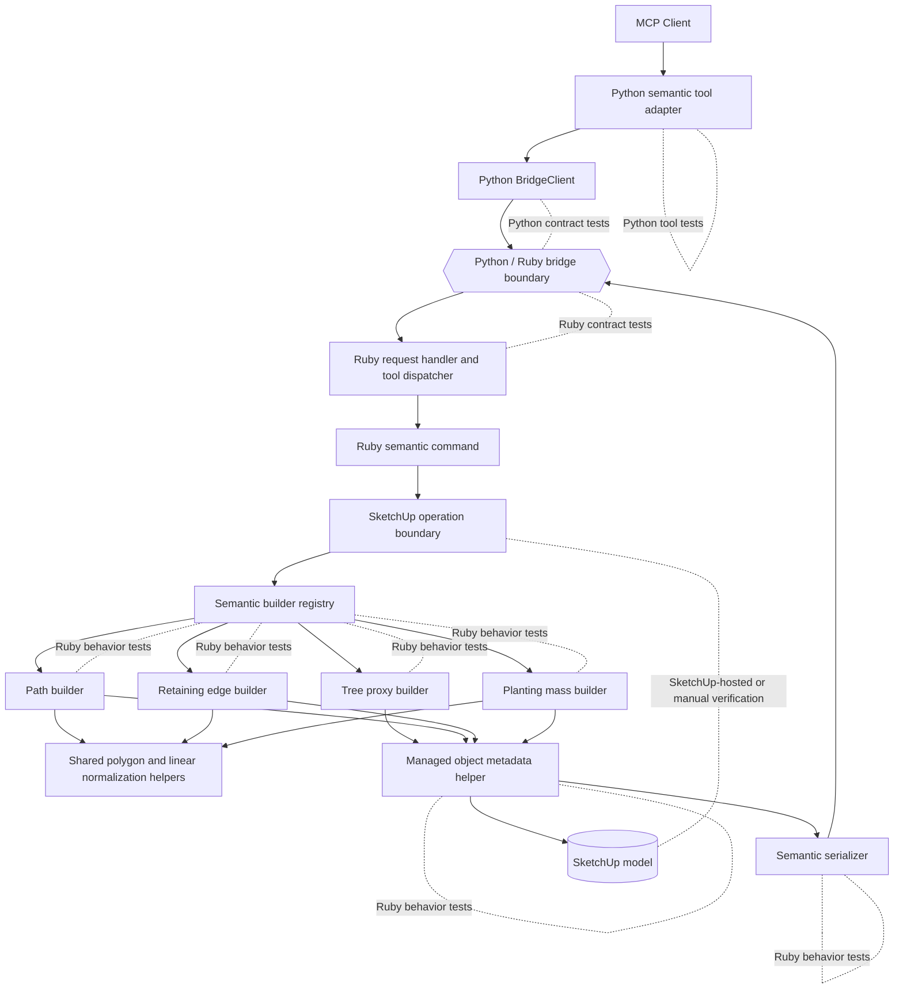

# Technical Plan: SEM-02 Complete First-Wave Semantic Creation Vocabulary
**Task ID**: `SEM-02`
**Title**: `Complete First-Wave Semantic Creation Vocabulary`
**Status**: `finalized`
**Date**: `2026-04-15`

## Source Task

- [Complete First-Wave Semantic Creation Vocabulary](./task.md)

## Problem Summary

`SEM-02` completes the remaining first-wave semantic creation surface on top of the `SEM-01` semantic core. The task must extend `create_site_element` to support `path`, `retaining_edge`, `planting_mass`, and `tree_proxy` without reopening the public command contract, fragmenting the public tool surface, or leaking semantic behavior into Python. The resulting slice must preserve the `SEM-01` managed-object envelope, Ruby-owned builder registry, metadata ownership, structured refusal posture, and shared Python/Ruby contract model.

## Goals

- Extend `create_site_element` to support `path`, `retaining_edge`, `planting_mass`, and `tree_proxy` through the existing semantic command path.
- Preserve the `SEM-01` public semantic envelope, one public tool surface, one managed-object contract, and one refusal/result shape.
- Keep Ruby as the owner of per-type normalization, geometry creation, metadata writes, refusal behavior, and JSON-safe serialization.
- Land the expansion with Ruby tests, Python tests, and shared contract coverage in the same change.
- Deliver a lightweight but visually meaningful `tree_proxy` with a deterministic low-poly clustered canopy rather than a box or single regular canopy primitive.

## Non-Goals

- Redesigning the public `create_site_element` contract into the guide-style nested `geometry` / `metadata` envelope.
- Redefining the `SEM-01` managed-object model, wrapper posture, or shared result envelope.
- Delivering `set_entity_metadata`, identity-preserving rebuild or replacement, or generic mutation compatibility policy.
- Adding terrain-aware placement, ground snapping, grading behavior, or `sample_surface_z` integration to semantic creation.
- Introducing species-specific procedural tree generation, asset instancing, or next-wave semantic families.

## Related Context

- [Semantic Scene Modeling HLD](specifications/hlds/hld-semantic-scene-modeling.md)
- [Semantic Scene Modeling PRD](specifications/prds/prd-semantic-scene-modeling.md)
- [Domain Analysis](specifications/domain-analysis.md)
- [SEM-01 Technical Plan](specifications/tasks/semantic-scene-modeling/SEM-01-establish-semantic-core-and-first-vertical-slice/plan.md)
- [Semantic Scene Modeling Task Set](specifications/tasks/semantic-scene-modeling/README.md)
- [Contract Artifact](contracts/bridge/bridge_contract.json)
- [Grok Contract-Change Signal](specifications/signals/2026-04-14-sem-02-grok-contract-change-signal.md)
- [Semantic Lifecycle And Eval Ruby Gap Signal](specifications/signals/2026-04-15-semantic-lifecycle-and-eval-ruby-gap-signal.md)

## Research Summary

- The current repo has the right platform seams for this task: Python capability modules, a shared bridge client, Ruby request normalization, stable tool dispatch, and shared contract-test infrastructure.
- No landed semantic implementation was visible during planning, so `SEM-01` should be treated as the design baseline rather than assumed delivered code.
- The HLD supports one public semantic constructor backed by a registry with strict per-element sub-schemas; it does not require a public contract redesign in `SEM-02`.
- The guide contains useful shape examples for the four remaining first-wave types, but its richer nested contract should remain a deferred contract decision rather than part of this task.
- Existing bridge error handling still collapses remote errors into message-based Python exceptions, so semantic refusals should remain domain outcomes in the successful result envelope.
- The current targeting tests and fake SketchUp support already provide reusable patterns for metadata access, identifier normalization, contract testing, and Ruby-side scene behavior tests.
- The 2026-04-15 lifecycle signal shows that creation breadth alone does not guarantee the broader PRD outcome; `SEM-02` must prove baseline creation coverage without assuming the broader lifecycle gaps are already solved.

## Technical Decisions

### Data Model

- `SEM-02` preserves the `SEM-01` outer request envelope:
  - `elementType`
  - `sourceElementId`
  - `status`
  - optional `name`
  - optional `tag`
  - optional `material`
- `elementType` remains the public discriminator and uses the semantic type strings already established by the task and PRD:
  - `path`
  - `retaining_edge`
  - `planting_mass`
  - `tree_proxy`
- Each request must contain exactly one matching type payload section whose key is identical to `elementType`:
  - `path`
  - `retaining_edge`
  - `planting_mass`
  - `tree_proxy`
- Requests that omit the matching type payload section or include additional mismatched type payload sections must be refused with `missing_element_payload` or `contradictory_payload`.
- Ruby owns normalization from the outer request plus matching payload section into the internal builder input, including defaulting behavior.
- The normative MVP payloads for `SEM-02` are:

```json
{
  "elementType": "path",
  "sourceElementId": "main-walk-001",
  "status": "proposed",
  "name": "Main Walk",
  "material": "gravel_light",
  "path": {
    "centerline": [[0.0, 0.0], [4.0, 1.0], [8.0, 1.0]],
    "width": 1.6,
    "elevation": 0.0,
    "thickness": 0.1
  }
}
```

```json
{
  "elementType": "retaining_edge",
  "sourceElementId": "ret-edge-001",
  "status": "proposed",
  "retaining_edge": {
    "polyline": [[2.0, 0.0], [8.0, 0.0], [8.0, 4.0]],
    "height": 0.45,
    "thickness": 0.25,
    "elevation": 0.0
  }
}
```

```json
{
  "elementType": "planting_mass",
  "sourceElementId": "hedge-001",
  "status": "proposed",
  "planting_mass": {
    "boundary": [[0.0, 0.0], [4.0, 0.0], [4.0, 2.0], [0.0, 2.0]],
    "averageHeight": 1.8,
    "plantingCategory": "hedge",
    "elevation": 0.0
  }
}
```

```json
{
  "elementType": "tree_proxy",
  "sourceElementId": "tree-001",
  "status": "retained",
  "tree_proxy": {
    "position": {
      "x": 14.0,
      "y": 37.7,
      "z": 0.0
    },
    "canopyDiameterX": 6.0,
    "canopyDiameterY": 5.6,
    "height": 5.5,
    "trunkDiameter": 0.45,
    "speciesHint": "cherry"
  }
}
```

- Validation rules for `path`:
  - `centerline` must contain at least 2 distinct XY points after normalization
  - `width` must be finite and strictly greater than `0`
  - `thickness`, when present, must be finite and strictly greater than `0`
  - `elevation`, when present, must be finite
  - `elevation` means the top-surface Z reference
- Validation rules for `retaining_edge`:
  - `polyline` must contain at least 2 distinct XY points after normalization
  - `height` must be finite and strictly greater than `0`
  - `thickness` must be finite and strictly greater than `0`
  - `elevation`, when present, must be finite
  - `elevation` means the base Z reference
- Validation rules for `planting_mass`:
  - `boundary` must follow the same polygon rules established by `SEM-01` for `footprint`
  - at least 3 distinct points after normalization
  - no consecutive duplicate points after normalization
  - non-zero polygon area
  - no self-intersection
  - a repeated closing point may be normalized away
  - `averageHeight` must be finite and strictly greater than `0`
  - `elevation`, when present, must be finite
  - `elevation` means the base Z reference
- Validation rules for `tree_proxy`:
  - `position.x`, `position.y`, and optional `position.z` must be finite
  - `position.z`, when omitted, defaults in Ruby to `0.0`
  - `canopyDiameterX` must be finite and strictly greater than `0`
  - `canopyDiameterY`, when omitted, defaults in Ruby to `canopyDiameterX`
  - `canopyDiameterY`, when present, must be finite and strictly greater than `0`
  - `height` must be finite and strictly greater than `0`
  - `trunkDiameter` must be finite and strictly greater than `0`
  - `trunkDiameter` must be less than the effective minimum canopy diameter
- `planting_mass` stays polygon-only for `SEM-02`; ellipse or richer shape unions are deferred.
- All new types persist the shared minimum metadata established by `SEM-01`:
  - `managedSceneObject = true`
  - `sourceElementId`
  - `semanticType`
  - `status`
  - `state = Created`
  - `schemaVersion = 1`
- No additional hard metadata invariants are introduced for the new types in `SEM-02`; optional fields such as `speciesHint` and `plantingCategory` remain semantic attributes rather than required invariants.

### API and Interface Design

- Python exposes the same public tool, `create_site_element`, through a dedicated semantic tool module and keeps the MCP layer mechanical.
- Python uses a discriminated request shape keyed by `elementType` for type and shape validation only.
- Python must not interpret geometry semantics, choose builders, infer defaults beyond obvious optional field handling, or duplicate Ruby refusal policy.
- Python validates:
  - presence of the required outer-envelope fields
  - presence of the one matching type payload section
  - basic field types for the matching payload section
- Python does not validate semantic geometry rules such as polygon area, self-intersection, minimum distinct-point counts after normalization, or cross-field numeric relationships.
- Ruby extends the semantic command support tree established by `SEM-01`:
  - semantic command entrypoint
  - builder registry
  - one builder per new type
  - shared metadata helper
  - shared semantic serializer
  - shared normalization helpers for polygonal and linear payloads where useful
- The builder registry remains the only semantic extension point. `semantic_commands.rb` should not grow new ad hoc branching for each type.
- Each builder should conform to one explicit interface:
  - input: normalized semantic payload for its `elementType`
  - output: one top-level managed `Sketchup::Group`
  - responsibilities: geometry creation only for its type, delegation to shared metadata persistence, and no direct response-envelope shaping
- All new builders return one top-level managed `Sketchup::Group`.
- `tree_proxy` geometry is Ruby-owned and deterministic:
  - simple trunk prism
  - one primary low-poly canopy crown
  - two smaller offset canopy lobes to create a more tree-like silhouette
  - fixed canopy and lobe proportions defined in Ruby capability-local constants
  - fixed lobe offsets defined in Ruby capability-local constants
  - no randomness
  - no species-specific geometry logic in `SEM-02`
- The `managedObject` result envelope stays consistent with `SEM-01` and should expose only minimal type-specific fields:
  - `path`: `width`, `thickness` when present
  - `retaining_edge`: `height`, `thickness`
  - `planting_mass`: `averageHeight`, `plantingCategory` when present
  - `tree_proxy`: `height`, `canopyDiameterX`, `canopyDiameterY`, `trunkDiameter`, `speciesHint` when present
- The response should not echo full input geometry arrays such as `centerline`, `polyline`, or `boundary` in `SEM-02`.

### Error Handling

- Python boundary errors should be limited to malformed MCP argument types or missing required top-level tool arguments.
- Ruby returns structured semantic refusals in the successful result envelope for domain-invalid but well-formed requests.
- Use one shared refusal taxonomy across the semantic slice:
  - `unsupported_element_type`
  - `missing_element_payload`
  - `missing_required_field`
  - `invalid_geometry`
  - `invalid_numeric_value`
  - `contradictory_payload`
  - `unsupported_option`
- Refusals should cover at least:
  - unsupported `elementType`
  - missing payload section for the chosen semantic type
  - insufficient points in `centerline`, `polyline`, or `boundary`
  - invalid or non-finite numeric dimensions
  - negative or zero dimensions where prohibited
  - payload sections that do not match `elementType`
  - unsupported convenience inputs deferred from MVP
- `SEM-02` should align its refusal codes with the semantic refusal posture established by `SEM-01`; if `SEM-01` uses a narrower refusal code set when implemented, the shared contract artifact should be updated so the whole semantic slice exposes one coherent taxonomy.
- Transport failures, malformed bridge responses, and unexpected Ruby exceptions remain on the JSON-RPC error path and should not be repurposed for domain refusals.

### State Management

- The SketchUp model remains the source of truth for semantic object state.
- `SEM-02` extends only creation-time semantic state and does not introduce new lifecycle transitions.
- Each builder creates the geometry, delegates metadata persistence to the shared metadata helper, and returns the resulting wrapper group for serialization.
- Managed-object identity remains attached to the top-level wrapper group through the `su_mcp` attribute dictionary.

### Integration Points

- Python semantic tool -> shared `BridgeClient.call_tool(...)` -> Ruby request handler -> Ruby tool dispatcher -> Ruby semantic command.
- Ruby semantic command -> one SketchUp operation boundary -> semantic registry -> type-specific builder -> shared metadata helper -> shared semantic serializer.
- Contract alignment must remain explicit across:
  - Python MCP tool shape
  - Ruby dispatcher tool name
  - Ruby result envelope
  - shared contract artifact
  - Python contract suite
  - Ruby contract suite
- `SEM-02` depends on the `SEM-01` semantic core; if `SEM-01` is not yet implemented when work begins, implementation must first establish that missing baseline rather than building a parallel semantic path.

### Configuration

- `SEM-02` introduces no new runtime configuration.
- No user-configurable canopy complexity, planting style catalogs, or terrain-coupling modes are added in this task.
- Any constants needed for deterministic proxy geometry, such as canopy lobe offsets or trunk-height ratios, should live in Ruby capability-local code rather than external configuration.

## Architecture Context



## Key Relationships

- Python stays responsible for MCP registration and shape validation only; Ruby owns all semantic interpretation and SketchUp-facing behavior.
- The builder registry remains the semantic extension seam, so new first-wave types do not force public tool sprawl or transport-adjacent branching.
- Metadata persistence and serialization remain centralized so builder geometry code does not accumulate cross-cutting managed-object rules.
- `tree_proxy` geometry complexity belongs in Ruby builder code, not in the public payload or Python adapter.
- Real integration must still be validated at the SketchUp operation boundary because undo behavior and geometry outcomes cannot be proven by mocks alone.

## Acceptance Criteria

- `create_site_element` accepts `path`, `retaining_edge`, `planting_mass`, and `tree_proxy` through the existing semantic command path without introducing new public creation tools.
- Each new semantic type accepts the documented `SEM-02` payload section for its MVP inputs and returns either a created managed-object result or a structured refusal.
- Representative baseline creation scenarios for path-like, edge-like, planting-mass, and tree-proxy requests complete through `create_site_element` without needing primitive creation tools or `eval_ruby` for the covered create step.
- The Python MCP layer validates only boundary shape and type information for the expanded semantic request surface and continues to forward requests to Ruby without semantic branching.
- The Ruby semantic registry dispatches all four new types through dedicated builders without concentrating new per-type logic in transport-adjacent files or one large command-level case analysis.
- Successful creation for each new type writes the shared minimum semantic metadata keys to the wrapper group in the `su_mcp` dictionary.
- A created object for each new type is immediately targetable through `find_entities` by `sourceElementId`, proving the managed-object metadata is usable for downstream automation.
- The shared semantic serializer returns one stable `managedObject` envelope for all new types with core identity fields and the agreed minimal type-specific fields.
- Requests with unsupported types, missing payload sections, invalid geometry, invalid numeric values, or contradictory payloads return structured refusals using the shared semantic refusal taxonomy.
- Created geometry for each new type respects the repo's public meter-based contract within explicit tolerance checks at the SketchUp-hosted boundary.
- `tree_proxy` creates a lightweight deterministic proxy with a simple trunk and a low-poly clustered canopy consisting of one primary crown and two secondary lobes, rather than a box or single regular canopy primitive.
- The shared contract artifact and both native contract suites are updated together for the expanded semantic surface.
- Ruby tests, Python tests, and contract tests cover the delivered request and response behavior for the new types, and any remaining SketchUp-hosted verification gaps are explicitly documented.

## Test Strategy

### TDD Approach

Implement `SEM-02` contract-first and builder-by-builder:

1. Add failing shared contract cases for the four new semantic types, at least one invalid-shape or invalid-value case per validation family, and one running-bridge smoke checklist for local capability verification.
2. Add failing Python schema and passthrough tests for the expanded `create_site_element` boundary, including no-implicit-semantic-logic assertions.
3. Add failing Ruby dispatcher, registry-routing, metadata, serializer, and sourceElementId-targetability tests for the new semantic surface.
4. Add failing SketchUp-hosted or harness-backed checks for public meter semantics and representative scenario outcomes before treating builder work as complete.
5. Implement shared normalization helpers only where they clearly remove duplicated builder logic.
6. Implement one builder at a time in business-critical order while preserving shared seams:
   1. `path`
   2. `planting_mass`
   3. `retaining_edge`
   4. `tree_proxy`
7. Run contract suites, unit tests, scenario checks, and language-appropriate linting, then document any remaining SketchUp-hosted verification gaps and any follow-on lifecycle gaps outside `SEM-02`.

### Required Test Coverage

- Python tool tests for:
  - semantic tool registration and ordering
  - discriminated request shape by `elementType`
  - request passthrough and `request_id` propagation
  - rejection of missing or wrongly typed matching payload sections
- Python contract tests for:
  - shared artifact parity for new created cases
  - refusal outcomes remaining in the successful result envelope
  - contract coverage for at least one invalid request family beyond unsupported type
- Ruby tests for:
  - dispatcher mapping for `create_site_element`
  - registry dispatch for all four new types
  - payload normalization and required-field handling
  - geometry validation for `centerline`, `polyline`, and `boundary`
  - numeric validation for widths, heights, thicknesses, canopy diameters, and trunk diameters
  - metadata persistence to `su_mcp`
  - shared serializer output and identifier normalization
  - post-create targetability through `find_entities` by `sourceElementId`
  - deterministic `tree_proxy` geometry shape expectations at the builder level, including stable structural invariants such as expected canopy sub-mass count or equivalent builder-owned geometry assertions
  - refusal outcomes for missing payloads, invalid geometry, invalid numeric values, and contradictory payloads
- Contract artifact updates for at least:
  - one created case per new semantic type
  - one refusal case per major validation family that is expected to stay stable across runtimes
- Scenario or evaluation coverage for:
  - one representative baseline creation request per new semantic type using only the intended public semantic surface for the create step
  - one mixed baseline site-scene slice that proves the new vocabulary reduces primitive-first fallback for covered creation requests
- SketchUp-hosted or manual verification for:
  - one-operation undo behavior
  - representative geometry outcomes for each new type
  - public meter-semantics conformance for key dimensions on each new type
  - create then find-by-`sourceElementId` verification for each new type
  - visual confirmation that `tree_proxy` produces the intended clustered canopy silhouette

## Instrumentation and Operational Signals

- Record a representative scenario matrix for the four new types and whether any covered create step still required primitive tools or `eval_ruby`.
- Record refusal-code counts and smoke-test outcomes for the new semantic types during development verification so unsupported-type or shape-drift regressions stay visible.
- Capture explicit meter-conformance evidence at the SketchUp-hosted boundary for the key public dimensions of each new type.
- Capture one local capability-alignment check showing the running bridge and shared contract artifact agree on the supported semantic types before treating the task as complete.

## Implementation Phases

1. Extend the semantic boundary shell and outcome-proof scaffolding.
   Add Python schema coverage, dispatcher mapping, registry routing, shared contract cases, representative scenario definitions, and a local capability-alignment check for the four new semantic types.
2. Extend shared semantic support.
   Add or refine shared normalization helpers, metadata handling, serializer support, and sourceElementId-targetability coverage only where the new types need them.
3. Implement highest-value baseline creation types first.
   Land `path`, then `planting_mass`, so partial progress still improves the most common semantic baseline authoring surface.
4. Complete the remaining first-wave breadth.
   Land `retaining_edge`, then `tree_proxy`, reusing shared helpers and preserving the shared refusal model.
5. Tighten verification and completion checks.
   Run Python and Ruby tests, both contract suites, representative scenario checks, Ruff, RuboCop, and SketchUp-hosted meter and targetability checks before treating the task as complete.

## Risks and Controls

- Builder-level proof substitutes for workflow-level proof and the product still feels primitive-first for covered creation requests: require representative scenario coverage tied to the covered create step.
- Local capability assumptions drift from the running bridge and contract artifact: require a running-bridge smoke checklist across all four new types before treating the task as complete.
- New semantic types inherit hidden unit-conversion bugs and create physically wrong geometry: add explicit SketchUp-hosted meter-conformance checks for each type before completion.
- Partial delivery lands lower-value types first and still misses the baseline workflow goal: sequence implementation by business-critical coverage and validate partial progress against the highest-value path-like cases first.
- Creation succeeds but downstream automation still cannot reliably target the new objects: require immediate post-create `find_entities` coverage by `sourceElementId` for each new type.
- `SEM-02` is judged against lifecycle outcomes it does not yet own: keep the task boundary scoped to creation breadth and explicitly retain lifecycle follow-on dependency visibility through `SEM-03` and related maintenance work.
- The semantic command regresses into a large per-type dispatcher or Python policy sink: keep the registry as the only builder extension seam and verify Python remains mechanical in tests.
- SketchUp operation behavior is assumed rather than proven: require explicit SketchUp-hosted verification notes for undo, dimensions, and representative geometry posture.

## Dependencies

- [SEM-01 Technical Plan](specifications/tasks/semantic-scene-modeling/SEM-01-establish-semantic-core-and-first-vertical-slice/plan.md)
- Implemented platform seams from [PLAT-02 Extract Ruby SketchUp Adapters and Serializers](specifications/tasks/platform/PLAT-02-extract-ruby-sketchup-adapters-and-serializers/task.md)
- Implemented Python decomposition from [PLAT-03 Decompose Python MCP Adapter](specifications/tasks/platform/PLAT-03-decompose-python-mcp-adapter/task.md)
- Targeting metadata precedent from [STI-01 Targeting MVP and `find_entities`](specifications/tasks/scene-targeting-and-interrogation/STI-01-targeting-mvp-and-find-entities/task.md)
- Semantic capability rules from [Semantic Scene Modeling HLD](specifications/hlds/hld-semantic-scene-modeling.md)
- Product contract from [Semantic Scene Modeling PRD](specifications/prds/prd-semantic-scene-modeling.md)
- Domain vocabulary and lifecycle terminology from [Domain Analysis](specifications/domain-analysis.md)
- Shared bridge contract artifact and native contract suites
- SketchUp runtime availability for geometry and undo verification
- Follow-on lifecycle maintenance work from [SEM-03 Add Metadata Mutation For Managed Scene Objects](specifications/tasks/semantic-scene-modeling/SEM-03-add-metadata-mutation-for-managed-scene-objects/task.md) for business claims beyond creation-time semantic coverage

## Premortem

### Intended Goal Under Test

Enable the remaining first-wave site-object requests to stay on one semantic creation surface with trustworthy meter-based geometry, durable managed-object identity, and enough workflow utility that covered baseline creation requests do not fall back to primitive tools or `eval_ruby`.

### Failure Paths and Mitigations

- **Incorrect base assumptions**
  - Business-plan mismatch: the business goal is baseline semantic workflow coverage, but the original plan proved mostly per-type builder correctness and contract parity.
  - Root-cause failure path: all four new builders pass unit and contract tests, yet representative site-authoring requests still fall back to primitive tools or `eval_ruby` during the create step because no scenario-level proof was required.
  - Why this misses the goal: the product still feels primitive-first for covered creation work even though the implementation appears complete.
  - Likely cognitive bias: proxy-metric substitution in which builder completeness stands in for workflow success.
  - Classification: Requires implementation-time instrumentation or acceptance testing.
  - Mitigation now: add scenario-level acceptance criteria, representative baseline creation evaluations, and a local capability-alignment check for the covered create step.
  - Required validation: pass a representative scenario matrix covering path-like, edge-like, planting-mass, and tree-proxy creation without primitive-tool or `eval_ruby` fallback for the create step.
- **Shortcuts that could weaken the outcome**
  - Business-plan mismatch: the business needs the highest-value baseline cases first, but the original phase order optimized mostly for perceived implementation convenience.
  - Root-cause failure path: schedule slip lands easier or lower-value types first, leaving path-like coverage late or incomplete and still missing the baseline workflow outcome.
  - Why this misses the goal: partial delivery would ship semantic breadth that does not materially improve the most common site-authoring requests.
  - Likely cognitive bias: ease bias and local optimization toward low-coupling work instead of business-critical coverage.
  - Classification: Can be validated before implementation.
  - Mitigation now: reorder phases so `path` lands before lower-priority types and evaluate partial progress against the highest-value baseline scenarios first.
  - Required validation: phase order is updated in the plan and checked against the PRD baseline creation scenarios before implementation starts.
- **Areas that could be weakly implemented**
  - Business-plan mismatch: the business needs correct physical authoring in repo meter semantics, but the original plan did not require explicit cross-runtime dimension proof for the new types.
  - Root-cause failure path: new semantic types inherit hidden unit-conversion ambiguity and create wrong-sized geometry while still satisfying shape-level tests.
  - Why this misses the goal: objects may be semantically typed yet unusable for real design work because their physical dimensions are wrong.
  - Likely cognitive bias: inheritance bias from assuming the existing semantic core already proves meter correctness for the new builders.
  - Classification: Requires implementation-time instrumentation or acceptance testing.
  - Mitigation now: add SketchUp-hosted meter-conformance checks for key dimensions and treat them as completion blockers for the new types.
  - Required validation: compare payload dimensions with created geometry or serialized bounds within explicit tolerance for each new type.
- **Tests and evaluations needed to stay on track**
  - Business-plan mismatch: the task needs local capability truth, but the original plan did not require a direct proof that the running bridge and contract artifact agree on supported types.
  - Root-cause failure path: the task artifacts and assumptions move ahead of the actual running bridge, so local validation targets unsupported types and gives misleading confidence about task completion.
  - Why this misses the goal: the implementation appears more complete than it is, and verification effort gets spent against behavior that is not actually available.
  - Likely cognitive bias: coordination neglect across docs, tool metadata, contract fixtures, and live runtime behavior.
  - Classification: Requires implementation-time instrumentation or acceptance testing.
  - Mitigation now: add a local capability-alignment check and smoke-test gate that must pass before the task is treated as complete.
  - Required validation: running-bridge smoke creation checks succeed for all four types and the shared contract artifact matches the supported behavior on the same revision.
- **What must be true for the task to succeed**
  - Business-plan mismatch: the business wants workflow-friendly results for downstream automation, but the original plan assumed creation plus minimum metadata was enough without proving immediate targetability.
  - Root-cause failure path: objects are created successfully yet cannot be reliably found and revised by `sourceElementId`, so downstream automation still falls back to brittle name or hierarchy targeting.
  - Why this misses the goal: the semantic constructor would create objects that are technically managed but operationally weak for later workflows.
  - Likely cognitive bias: happy-path serialization bias in which emitting metadata is mistaken for making that metadata usable.
  - Classification: Requires implementation-time instrumentation or acceptance testing.
  - Mitigation now: require post-create `find_entities` coverage by `sourceElementId` and keep serializer plus metadata persistence centralized.
  - Required validation: create-then-target tests and SketchUp-hosted checks pass for each new type.
- **Second-order and third-order effects**
  - Business-plan mismatch: the wider product goal includes revision-friendly semantic workflows and reduced `eval_ruby`, but `SEM-02` only expands creation vocabulary.
  - Root-cause failure path: the team interprets successful builder completion as proof that broader semantic lifecycle gaps are solved, then users still need `eval_ruby` for maintenance, replacement, or metadata repair and conclude the semantic surface underperformed.
  - Why this misses the goal: the product overclaims semantic readiness and users lose confidence when post-create workflows remain weak.
  - Likely cognitive bias: scope substitution, where creation breadth is treated as a proxy for full lifecycle adequacy.
  - Classification: Indicates the task, spec, or success criteria are underspecified.
  - Mitigation now: keep the task boundary narrowed to creation-time coverage, preserve visibility of lifecycle follow-on dependencies, and avoid treating `SEM-02` alone as proof that the primary PRD KPI is fully achieved.
  - Required validation: task boundaries and follow-on dependencies explicitly distinguish creation coverage from lifecycle maintenance coverage.

## Quality Checks

- [x] All required inputs validated
- [x] Problem statement documented
- [x] Goals and non-goals documented
- [x] Research summary documented
- [x] Technical decisions included
- [x] Architecture context included
- [x] Acceptance criteria included
- [x] Test requirements specified
- [x] Instrumentation and operational signals defined where needed
- [x] Risks and dependencies documented
- [x] Small reversible phases defined
- [x] Premortem completed with falsifiable failure paths and mitigations
- [x] Plan created
