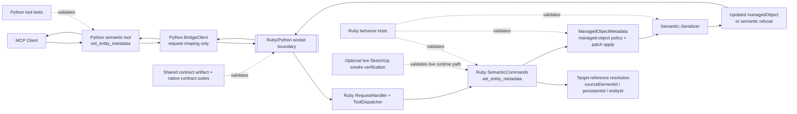

# Technical Plan: SEM-03 Add Metadata Mutation for Managed Scene Objects
**Task ID**: `SEM-03`
**Title**: `Add Metadata Mutation for Managed Scene Objects`
**Status**: `finalized`
**Date**: `2026-04-14`

## Source Task

- [Add Metadata Mutation for Managed Scene Objects](./task.md)

## Problem Summary

`SEM-03` adds the first public semantic metadata-mutation path for existing Managed Scene Objects. The task must let workflow clients revise supported semantic metadata without rebuilding geometry, while preserving stable business identity, reusing the delivered targeting contract, and avoiding any second metadata or lookup subsystem outside the Ruby-owned semantic slice.

The task also needs to stay valid in hierarchy-heavy scenes. Managed Scene Objects may be nested inside groups or components used for accepted-scene organization, so metadata mutation must resolve and update those nested targets without flattening, implicitly reparenting, or otherwise disturbing their existing parent placement.

## Goals

- Add `set_entity_metadata` as a public semantic mutation tool through the existing Python/Ruby bridge.
- Keep Ruby as the owner of target resolution consumption, metadata policy, invariant enforcement, operation bracketing, and result serialization.
- Allow supported metadata updates for existing Managed Scene Objects without rebuilding geometry.
- Return structured semantic refusals when mutation would violate managed-object identity or required metadata rules.
- Land Ruby tests, Python tests, and shared contract coverage for the new public semantic mutation boundary.
- Ensure the first metadata-mutation slice works for nested Managed Scene Objects in grouped scene structure while preserving their current parent context.

## Non-Goals

- Defining generic mutation compatibility rules for `transform_component` or `set_material`.
- Delivering identity-preserving rebuild or replacement flows.
- Introducing a second lookup subsystem or broad query surface inside semantic modeling.
- Expanding the semantic metadata schema beyond the fields already documented or already owned by the semantic slice.
- Moving semantic mutation policy into Python.
- Delivering explicit hierarchy-editing operations such as reparent, active edit-context control, or duplicate-into-parent behavior.

## Related Context

- [Semantic Scene Modeling HLD](specifications/hlds/hld-semantic-scene-modeling.md)
- [Semantic Scene Modeling PRD](specifications/prds/prd-semantic-scene-modeling.md)
- [Domain Analysis](specifications/domain-analysis.md)
- [Semantic Scene Modeling Task Set](specifications/tasks/semantic-scene-modeling/README.md)
- [SEM-01 Task](specifications/tasks/semantic-scene-modeling/SEM-01-establish-semantic-core-and-first-vertical-slice/task.md)
- [SEM-01 Technical Plan](specifications/tasks/semantic-scene-modeling/SEM-01-establish-semantic-core-and-first-vertical-slice/plan.md)
- [STI-01 Task](specifications/tasks/scene-targeting-and-interrogation/STI-01-targeting-mvp-and-find-entities/task.md)
- [STI-01 Technical Plan](specifications/tasks/scene-targeting-and-interrogation/STI-01-targeting-mvp-and-find-entities/plan.md)
- [Contract Artifact](contracts/bridge/bridge_contract.json)
- [Ruby Semantic Commands](src/su_mcp/semantic_commands.rb)
- [Ruby Managed Object Metadata](src/su_mcp/semantic/managed_object_metadata.rb)
- [Ruby Semantic Serializer](src/su_mcp/semantic/serializer.rb)
- [Ruby Scene Query Commands](src/su_mcp/scene_query_commands.rb)
- [Ruby Targeting Query](src/su_mcp/targeting_query.rb)
- [Python Semantic Tools](python/src/sketchup_mcp_server/tools/semantic.py)
- [Python Tool Registration](python/src/sketchup_mcp_server/tools/__init__.py)
- [Python Bridge Client](python/src/sketchup_mcp_server/bridge.py)

## Research Summary

- The platform seams needed for this task are already implemented: thin Python tool modules, a shared bridge client, Ruby tool dispatch, and shared contract-test infrastructure.
- `STI-01` is the correct targeting baseline. `SEM-03` should reuse compact target-reference semantics based on `sourceElementId`, `persistentId`, and compatibility `entityId`, not import broad `find_entities` query behavior into a mutating tool.
- The semantic slice is partially implemented but still in motion under `SEM-01`. `create_site_element` and its refusal envelope exist in code, while semantic tool registration and metadata support remain incomplete or still stabilizing.
- The current Python bridge collapses remote errors into message-based `BridgeRemoteError`, so semantic-domain failures should remain in-band structured refusals where possible.
- The HLD explicitly splits semantic metadata into hard invariants and soft mutable fields, but the exact mutable set is not fully elaborated in source specs. To avoid inventing unsupported behavior, `SEM-03` should use a conservative first mutable set.
- The repo already uses nested typed Python schemas for targeting-style inputs in `find_entities` and `sample_surface_z`, which is the right contract shape to reuse for `set_entity_metadata`.
- The semantic PRD and HLD now make hierarchy-aware maintenance explicit, so `SEM-03` should not be designed around a top-level-only managed-object assumption even though full hierarchy-editing operations remain out of scope.

## Technical Decisions

### Data Model

- `set_entity_metadata` will use one compact public request shape:
  - `target`
  - optional `set`
  - optional `clear`
- `target` will use the compact target-reference contract:
  - `sourceElementId`
  - `persistentId`
  - `entityId`
- `target` must contain at least one identifier field after Ruby normalization.
- The target contract does not add parent or hierarchy directives in `SEM-03`; the operation mutates the resolved object in place.
- At least one of `set` or `clear` must be present after Ruby normalization.
- `set` will be a typed semantic metadata patch rather than a free-form metadata dictionary.
- `clear` will be a list of semantic metadata field names.
- The initial documented mutable field set for `SEM-03` is intentionally conservative:
  - `status`
  - `structureCategory` only when the target is a managed `structure`
- The initial protected field set is:
  - `managedSceneObject`
  - `sourceElementId`
  - `semanticType`
  - `schemaVersion`
  - `state`
- Required-field rules for `SEM-03`:
  - `status` cannot be cleared
  - `structureCategory` cannot be cleared from managed `structure` objects
  - `structureCategory` updates must remain in the approved semantic vocabulary
- `clear` is part of the public contract so removal attempts are explicit and reviewable, but no currently documented required field is clearable in the v1 happy path.
- Ruby should centralize these field sets and rules in the managed-object metadata layer rather than scattering them across commands.

### API and Interface Design

- Add a new public Python tool `set_entity_metadata` in [python/src/sketchup_mcp_server/tools/semantic.py](python/src/sketchup_mcp_server/tools/semantic.py).
- Register the semantic tool module in [python/src/sketchup_mcp_server/tools/__init__.py](python/src/sketchup_mcp_server/tools/__init__.py) so semantic tools are actually exposed through the shared tool-registration path.
- Use typed nested Python models for:
  - `target`
  - `set`
  - `clear`
- Keep Python close to a 1:1 mapping:
  - Python tool name `set_entity_metadata`
  - Ruby dispatch name `set_entity_metadata`
  - Ruby returns the public result envelope directly
- Ruby will add `SemanticCommands#set_entity_metadata` in [src/su_mcp/semantic_commands.rb](src/su_mcp/semantic_commands.rb).
- Ruby target resolution should reuse the existing target-reference posture locally, similar to `sample_surface_z`, rather than calling the public `find_entities` tool over the bridge.
- Ruby target resolution must work against nested Managed Scene Objects in the normal queryable-entity set rather than assuming the target is top-level.
- `SemanticCommands` should orchestrate:
  - target resolution
  - one SketchUp operation boundary
  - metadata-layer update call
  - final serialization
- `SemanticCommands#set_entity_metadata` should preserve the resolved object's existing parent placement and scene context; no hierarchy reassignment occurs in this task.
- `ManagedObjectMetadata` should own:
  - managed-object detection
  - metadata reads and writes
  - protected-vs-mutable field policy
  - patch application
  - required-field clear checks

Recommended public request shape:

```json
{
  "target": {
    "sourceElementId": "house-extension-001"
  },
  "set": {
    "status": "existing",
    "structureCategory": "outbuilding"
  },
  "clear": ["someOptionalSemanticField"]
}
```

Recommended success result shape:

```json
{
  "success": true,
  "outcome": "updated",
  "managedObject": {
    "sourceElementId": "house-extension-001",
    "persistentId": "1234",
    "entityId": "56",
    "semanticType": "structure",
    "status": "existing",
    "state": "Created",
    "structureCategory": "outbuilding"
  }
}
```

Recommended refusal shape:

```json
{
  "success": true,
  "outcome": "refused",
  "refusal": {
    "code": "protected_metadata_field",
    "message": "Field cannot be modified for a Managed Scene Object.",
    "details": {
      "field": "sourceElementId"
    }
  }
}
```

### Error Handling

- Keep transport, protocol, and malformed bridge failures on the existing Ruby exception / JSON-RPC error path.
- Keep semantic-domain outcomes in-band in the result envelope, following the existing `create_site_element` posture:
  - `success: true`
  - `outcome: "updated"` for a successful mutation
  - `outcome: "refused"` for a domain-valid request that cannot be accepted
- Treat the following as structured refusals:
  - target resolves to no entity
  - target resolves ambiguously
  - target entity is not a Managed Scene Object
  - request attempts to modify a protected field
  - request attempts to clear a required field
  - request applies `structureCategory` to a non-`structure` target
  - request uses an unapproved `structureCategory`
- Treat the following as Ruby-side request errors rather than semantic refusals:
  - missing `target`
  - unsupported keys in `target`
  - no usable identifier in `target`
  - neither `set` nor `clear` provided
  - non-list `clear`
  - shape/type mismatches that break the public contract
- Keep Python validation limited to typed shape and scalar types so Python remains mechanical.
- Keep refusal codes aligned with the existing semantic slice where practical instead of inventing a second refusal taxonomy.

### State Management

- The SketchUp model remains the source of truth for managed-object state.
- Managed-object metadata continues to live in the semantic namespace on the entity attribute dictionary.
- No long-lived registry, cache, or Python-side semantic state should be introduced.
- `set_entity_metadata` should execute inside one SketchUp operation boundary so the mutation is one undo step and can roll back cleanly on failure.
- `state` remains system-managed in `SEM-03`; this task does not introduce lifecycle-transition rules.
- The mutation is in-place only for `SEM-03`; the resolved object's existing parent placement and nested scene context must remain unchanged after a successful metadata update.

### Integration Points

- Python semantic tool -> shared `BridgeClient.call_tool(...)` -> Ruby request handler -> Ruby tool dispatcher -> `SemanticCommands#set_entity_metadata`
- `SemanticCommands#set_entity_metadata` -> target-resolution helper using compact target-reference semantics -> `ManagedObjectMetadata` policy/update path -> `Semantic::Serializer`
- `SEM-03` should consume the same semantic namespace, serializer posture, and refusal-envelope shape established by `SEM-01` rather than creating parallel concepts.
- `SEM-03` should coordinate with the in-progress `SEM-01` implementation by freezing the shared metadata keys and serialized semantic result shape before contract cases are finalized.
- Contract artifacts and both native contract suites remain the durable bridge boundary for this public tool.

### Configuration

- No new runtime configuration is required for this task.
- Reuse the existing FastMCP app, shared Python bridge client, Ruby request handling, and SketchUp socket configuration.
- Do not add environment-driven behavior for mutable-field policy or refusal behavior.

## Architecture Context



## Key Relationships

- `set_entity_metadata` belongs in the semantic slice, not the generic modeling tool group.
- Ruby owns all semantic interpretation, target resolution use, invariant enforcement, and serialization.
- Python owns only MCP schema visibility, request shaping, and request-id propagation.
- The targeting contract is consumed internally through compact target references, not by calling public targeting tools over the bridge.
- The managed-object metadata layer is the stable owner for protected-vs-mutable policy so command orchestration stays thin and testable.
- Real runtime confidence still depends on the live SketchUp environment even though most behavior can be covered in deterministic Ruby tests.

## Acceptance Criteria

- `set_entity_metadata` is exposed as a public MCP tool with a discoverable structured request schema containing `target`, optional `set`, and optional `clear`.
- The public target-reference schema accepts only `sourceElementId`, `persistentId`, and compatibility `entityId`.
- Ruby remains the sole owner of target resolution consumption, managed-object detection, metadata mutation policy, operation bracketing, and result serialization.
- A valid request that updates supported mutable metadata on one Managed Scene Object returns `success: true`, `outcome: "updated"`, and the updated serialized `managedObject`.
- The mutation executes inside one SketchUp operation boundary and rolls back cleanly on unexpected runtime failures.
- Requests that resolve to no entity or to multiple entities return structured semantic refusals rather than silently selecting a target.
- Requests that target nested Managed Scene Objects succeed through the same compact target-reference contract and do not require top-level-only assumptions.
- Requests against entities that are not Managed Scene Objects return structured semantic refusals.
- Attempts to modify protected fields such as `sourceElementId`, `semanticType`, `schemaVersion`, `state`, or the managed-object marker return structured semantic refusals.
- Attempts to clear required metadata fields such as `status` or `structureCategory` for managed `structure` objects return structured semantic refusals.
- `structureCategory` updates are accepted only for managed `structure` targets and only when the value is in the approved vocabulary.
- Successful updates preserve the target object's existing parent placement and do not implicitly flatten, reparent, replace, or duplicate the object.
- The implementation updates the shared contract artifact and both native contract suites for representative success and refusal scenarios.
- The implementation adds Ruby behavior tests for mutation policy, target resolution outcomes, operation boundaries, and result serialization.
- The implementation adds Python tool tests for registration, typed request shaping, and request-id propagation.
- The task does not introduce broad semantic query behavior, generic mutation compatibility rules, identity-preserving replacement flows, or explicit hierarchy-editing operations.

## Test Strategy

### TDD Approach

- Start by adding shared contract cases for the new public tool so the bridge boundary is fixed before implementation spreads across both runtimes.
- Add failing Ruby tests next for:
  - managed-object detection
  - protected-field refusal
  - required-field clear refusal
  - allowed `status` update
  - validated `structureCategory` update
  - target `none` and `ambiguous` outcomes
  - successful mutation of a nested managed object
  - unmanaged-target refusal
  - preservation of parent placement for an updated nested object
  - one operation boundary and updated serialization
- Implement the Ruby metadata policy and command path before wiring Python.
- Add Python schema and passthrough tests last, limiting Python assertions to registration, typed shape, and request-id propagation.
- Finish with contract suites, lint/test gates, and one optional live SketchUp smoke mutation if runtime access is available.

### Required Test Coverage

- Shared contract artifact updates in [contracts/bridge/bridge_contract.json](contracts/bridge/bridge_contract.json) for:
  - one successful `updated` case
  - one successful nested-target `updated` case
  - one protected-field refusal case
  - one target-not-found or target-none refusal case
  - one ambiguous-target refusal case
  - one unmanaged-target refusal case
- Ruby behavior tests for:
  - `set_entity_metadata` dispatch and operation bracketing
  - managed-object detection
  - target resolution through compact target references
  - target resolution for nested managed objects
  - allowed `status` update
  - allowed `structureCategory` update for `structure`
  - refusal on `structureCategory` update for non-`structure`
  - refusal on protected-field mutation
  - refusal on required-field clear
  - preservation of existing parent placement during nested-object mutation
  - serializer output after update
- Python tool tests for:
  - registration includes `set_entity_metadata`
  - typed nested schema for `target`, `set`, and `clear`
  - passthrough preserves request shape and request id
- Contract suites:
  - [test/contracts/](test/contracts)
  - [python/tests/contracts/](python/tests/contracts)
- Language quality gates:
  - `bundle exec rake ruby:lint`
  - `bundle exec rake ruby:test`
  - `bundle exec rake ruby:contract`
  - `bundle exec rake python:lint`
  - `bundle exec rake python:test`
  - `bundle exec rake python:contract`
- Optional live verification:
  - create one representative managed semantic object
  - mutate `status`
  - confirm the serialized result and SketchUp undo behavior
  - repeat the mutation for one representative nested managed object and confirm parent placement is unchanged

## Implementation Phases

1. Freeze the public mutation contract.
   - Add `set_entity_metadata` cases to the shared contract artifact and both native contract suites.
   - Pin the target-reference shape, `updated` / `refused` result posture, representative refusal codes, and one nested-target success case.
2. Add failing Ruby behavior coverage.
   - Add metadata-layer tests for allowed and disallowed mutations.
   - Add semantic-command tests for target resolution, nested-target coverage, preserved parent placement, operation boundaries, and updated serialization.
3. Implement Ruby mutation behavior.
   - Add `SemanticCommands#set_entity_metadata`.
   - Extend `ManagedObjectMetadata` with managed-object detection, read helpers, policy constants, and update/clear behavior.
   - Reuse compact target-reference semantics locally instead of adding a second lookup subsystem.
   - Keep the mutation in place so existing parent placement remains unchanged.
4. Wire the Python adapter.
   - Add the typed `set_entity_metadata` tool in the semantic module.
   - Register the semantic module through the shared Python tool-registration path.
   - Add Python tool tests for schema and passthrough behavior.
5. Validate and stabilize against the active semantic baseline.
   - Run Ruby and Python lint/test/contract gates.
   - Reconcile any shared metadata-key or serializer drift with `SEM-01` before final merge.
   - Run optional live SketchUp smoke verification if runtime access is available.

## Risks and Mitigations

- `SEM-01` is actively in progress and may change shared semantic keys or serializer behavior:
  - Freeze shared metadata-key ownership and semantic serializer expectations before finalizing contract cases.
- Hard-vs-soft invariant rules are not fully elaborated in the source specs:
  - Keep the v1 mutable field set conservative and explicit.
- The command layer could accumulate too much policy:
  - Keep mutation policy centralized in `ManagedObjectMetadata` and use `SemanticCommands` only for orchestration.
- Target resolution could drift away from `STI-01` semantics:
  - Reuse compact target-reference semantics and shared helper patterns instead of importing `find_entities` query behavior or creating a second lookup path.
- The implementation could accidentally assume a flat scene and pass tests while failing on nested managed objects:
  - Add nested-target contract cases, nested Ruby behavior tests, and one optional live nested-object smoke mutation before treating the task as complete.
- Public contract churn while semantic tooling is still stabilizing:
  - Add contract cases first and treat them as the stability anchor for the implementation.

## Dependencies

- [SEM-01 Task](specifications/tasks/semantic-scene-modeling/SEM-01-establish-semantic-core-and-first-vertical-slice/task.md)
- [SEM-01 Technical Plan](specifications/tasks/semantic-scene-modeling/SEM-01-establish-semantic-core-and-first-vertical-slice/plan.md)
- [STI-01 Task](specifications/tasks/scene-targeting-and-interrogation/STI-01-targeting-mvp-and-find-entities/task.md)
- [STI-01 Technical Plan](specifications/tasks/scene-targeting-and-interrogation/STI-01-targeting-mvp-and-find-entities/plan.md)
- [Semantic Scene Modeling HLD](specifications/hlds/hld-semantic-scene-modeling.md)
- [Semantic Scene Modeling PRD](specifications/prds/prd-semantic-scene-modeling.md)
- [Domain Analysis](specifications/domain-analysis.md)
- Existing contract harness under [contracts/bridge/bridge_contract.json](contracts/bridge/bridge_contract.json), [test/contracts/](test/contracts), and [python/tests/contracts/](python/tests/contracts)
- Existing lint and test tasks exposed through `Rakefile`
- SketchUp runtime for optional live end-to-end verification

## Quality Checks

- [x] All required inputs validated
- [x] Problem statement documented
- [x] Goals and non-goals documented
- [x] Research summary documented
- [x] Technical decisions included
- [x] Architecture context included
- [x] Acceptance criteria included
- [x] Test requirements specified
- [x] Risks and dependencies documented
- [x] Small reversible phases defined
