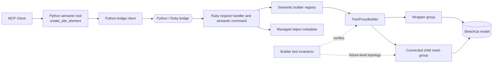

# Technical Plan: SEM-04 Align Tree Proxy Geometry With Accepted Volumetric Baseline
**Task ID**: `SEM-04`
**Title**: `Align Tree Proxy Geometry With Accepted Volumetric Baseline`
**Status**: `finalized`
**Date**: `2026-04-15`

## Source Task

- [Align Tree Proxy Geometry With Accepted Volumetric Baseline](./task.md)

## Problem Summary

The delivered `tree_proxy` semantic type now exists, but its geometry needs to be judged against an accepted SketchUp exemplar rather than only against the earlier low-poly clustered-canopy intent from `SEM-02`. The accepted exemplar is a connected volumetric tree proxy with a 12-sided trunk, stepped canopy tiers, and capped upper mass, while the earlier shipped implementation was still conceptually closer to disconnected trunk and canopy primitives.

The current retrospective implementation already moved the Ruby builder toward that accepted silhouette by replacing disconnected canopy groups with one connected child mesh that scales from the public `height`, `canopyDiameterX`, `canopyDiameterY`, and `trunkDiameter` fields. This plan captures that implementation path, records the current structural decisions, and leaves the task open for the remaining parity question: whether the accepted baseline requires exact mesh reproduction or only a parameter-driven structural match.

## Goals

- keep `tree_proxy` geometry owned by Ruby while aligning its silhouette and topology more closely with the accepted volumetric baseline
- preserve the existing public semantic sizing contract and dynamic scaling behavior
- define the remaining gap between the current builder output and the accepted exemplar in a way that can be verified later

## Non-Goals

- redesigning the public `create_site_element` request shape
- moving tree geometry policy into Python
- introducing asset-backed trees, species catalogs, or style presets
- treating the current implementation as exact exemplar parity without explicit proof

## Related Context

- [SEM-04 Task](./task.md)
- [Semantic Scene Modeling HLD](specifications/hlds/hld-semantic-scene-modeling.md)
- [Semantic Scene Modeling PRD](specifications/prds/prd-semantic-scene-modeling.md)
- [Domain Analysis](specifications/domain-analysis.md)
- [SEM-02 Task](specifications/tasks/semantic-scene-modeling/SEM-02-complete-first-wave-semantic-creation-vocabulary/task.md)
- [SEM-02 Technical Plan](specifications/tasks/semantic-scene-modeling/SEM-02-complete-first-wave-semantic-creation-vocabulary/plan.md)
- [Ruby Tree Proxy Builder](src/su_mcp/semantic/tree_proxy_builder.rb)
- [Ruby Tree Proxy Builder Test](test/tree_proxy_builder_test.rb)

## Research Summary

- The accepted baseline captured in `SEM-04` is explicitly volumetric, connected, trunk-to-canopy continuous, and tiered rather than billboard-like or made from disconnected canopy blobs.
- The live public contract for `tree_proxy` already exposes the right size-driving parameters: `height`, `canopyDiameterX`, `canopyDiameterY`, and `trunkDiameter`.
- The public MCP surface does not need to change for this refinement; the work belongs entirely in the Ruby builder and Ruby-owned verification.
- The current retrospective implementation replaced the old square-trunk plus three-extrusion layout with one connected child mesh built from ring definitions extracted from the accepted exemplar.
- The current builder test proves structural invariants of the refined proxy, but it does not prove exact face-for-face reproduction of the accepted 256-face exemplar.

## Technical Decisions

### Data Model

- `tree_proxy` continues to consume the existing semantic payload:
  - `position`
  - `canopyDiameterX`
  - optional `canopyDiameterY`
  - `height`
  - `trunkDiameter`
  - optional `speciesHint`
- No new public geometry fields are introduced in `SEM-04`.
- The accepted baseline is represented as builder-owned constants and structural invariants, not as raw public mesh data.
- The current Ruby builder derives all radii and elevations from the public size fields and a fixed ring-definition table.

### API and Interface Design

- Python remains unchanged. `create_site_element(elementType: "tree_proxy")` continues to forward the same request shape.
- Ruby continues to expose one `TreeProxyBuilder#build(model:, params:)` implementation behind the semantic builder registry.
- The refined builder returns one wrapper group with one connected child mesh group rather than multiple disconnected canopy groups.
- The current builder shape is:
  - `SEGMENTS = 12`
  - a rotated circular trunk ring
  - trunk base, anchor, and top rings
  - a fixed set of canopy ring definitions derived from exemplar ratios
  - quad connections between rings
  - triangle fan closure at the apex

### Error Handling

- `SEM-04` introduces no new refusal codes and no new public validation rules.
- Existing `tree_proxy` request validation from `SEM-02` continues to own numeric and shape input validation.
- Any remaining mismatch between the built geometry and the accepted exemplar is a verification gap, not a new runtime refusal family.

### State Management

- SketchUp remains the source of truth for created `tree_proxy` geometry.
- Managed Scene Object metadata and serialization remain unchanged from the semantic creation flow delivered earlier.
- The refined proxy remains deterministic: no randomness, no environment-dependent topology, and no Python-side state.

### Integration Points

- `create_site_element` -> Ruby semantic command -> builder registry -> `TreeProxyBuilder`
- `TreeProxyBuilder` remains the only owned seam for this geometry refinement.
- `test/tree_proxy_builder_test.rb` is the primary local regression seam for structural assertions outside live SketchUp.
- SketchUp-hosted visual verification remains necessary for confirming exemplar alignment beyond fixture-level topology counts.

### Configuration

- No new runtime configuration is introduced.
- The current topology recipe is builder-local and constant-driven.
- If later work needs style presets or alternate baseline recipes, that should be introduced as a separate task rather than ad hoc mutation of the current public payload.

## Architecture Context

## Key Relationships

- The public semantic contract stays stable while geometry fidelity changes behind the Ruby builder seam.
- Builder-local constants are the current representation of the accepted baseline, but they are still an approximation boundary until live exemplar parity is explicitly proven.
- The refined test surface proves dynamic scaling and structural topology, while live SketchUp verification is still required for visual and geometric parity claims.

## Acceptance Criteria

- The Ruby builder creates one wrapper group containing one connected child mesh group for the tree proxy body.
- The current builder preserves dynamic sizing from `height`, `canopyDiameterX`, `canopyDiameterY`, and `trunkDiameter`.
- The trunk is represented by 12-sided rings and remains connected to the canopy stack.
- The canopy is represented as stepped tier connections rather than one simple extrusion or three disconnected canopy blobs.
- The task is not treated as complete until the team explicitly decides whether exemplar success means exact 256-face parity or structural parametric conformance.

## Test Strategy

### TDD Approach

1. Replace the prior disconnected-proxy builder test with a failing structural-invariants test tied to the accepted baseline direction.
2. Refactor the Ruby builder from multiple grouped extrusions to one connected mesh implementation.
3. Re-run focused semantic builder and validation tests to ensure the refinement does not disturb the existing semantic contract.
4. Keep a manual SketchUp-hosted verification gap explicit until the accepted exemplar match is confirmed visually and geometrically in the live host.

### Required Test Coverage

- Ruby builder tests for:
  - one wrapper group and one connected child mesh group
  - 12-sided trunk caps
  - stepped canopy z-levels
  - deterministic face-type mix for the current topology
  - dynamic scaling from public size inputs
- Nearby Ruby regression checks for:
  - builder registry dispatch
  - request normalization
  - existing tree-proxy request validation behavior
- SketchUp-hosted or manual verification for:
  - silhouette comparison against the accepted exemplar
  - dimensional comparison for representative public size changes
  - decision on exact mesh parity versus structural conformance

## Instrumentation and Operational Signals

- Record whether the builder output remains one connected child mesh after future edits.
- Record whether representative size changes preserve canopy scaling and trunk connection.
- Record explicit evidence when the team decides whether exact face-count parity is required.

## Implementation Phases

1. Capture the accepted baseline and convert it into task-owned requirements.
2. Replace the disconnected tree proxy builder with a connected ring-based mesh implementation in Ruby.
3. Add builder-level regression tests for trunk topology, canopy tiers, and dynamic scaling.
4. Validate focused Ruby tests and linting, then document remaining live SketchUp verification gaps.
5. Revisit the accepted exemplar and decide whether further work is needed for exact parity.

## Rollout Approach

- Land as a Ruby-only internal geometry refinement behind the existing public semantic contract.
- Keep the current implementation active as the new default because no migration or compatibility shim is required at the MCP boundary.
- Treat any later exact-parity refinement as a follow-up on the same task or an explicit child task, depending on scope.

## Risks and Controls

- Exemplar drift remains ambiguous if structural similarity is treated as success without an explicit parity decision: keep the parity decision as a named remaining gap in the summary and plan.
- The builder could regress back into disconnected subgroups during future refactors: keep the one-wrapper-one-mesh invariant in the builder test.
- Fixed ring constants could be mistaken for a fixed-size-only proxy: keep dimension-scaling assertions tied to the public size fields.
- Live SketchUp appearance could differ from fixture-level expectations: require manual or host-backed verification before claiming full completion.

## Dependencies

- [SEM-02 Task](specifications/tasks/semantic-scene-modeling/SEM-02-complete-first-wave-semantic-creation-vocabulary/task.md)
- [Semantic Scene Modeling HLD](specifications/hlds/hld-semantic-scene-modeling.md)
- [Semantic Scene Modeling PRD](specifications/prds/prd-semantic-scene-modeling.md)
- The current Ruby semantic creation stack and builder-test fixture layer
- SketchUp runtime availability for final silhouette confirmation

## Premortem

### Intended Goal Under Test

Ship a `tree_proxy` that stays parameter-driven and workflow-lightweight while reading like the accepted connected volumetric exemplar rather than a simplified disconnected placeholder.

### Failure Paths and Mitigations

- **Base assumptions that could lead us astray**
  - Business-plan mismatch: the workflow needs an accepted-looking proxy, while the plan could optimize only for local topology assertions.
  - Root-cause failure path: the builder passes fixture tests but still looks materially wrong in live SketchUp compared with the accepted exemplar.
  - Why this misses the goal: the semantic tree remains technically valid but visually weak for baseline design workflows.
  - Likely cognitive bias: local-test substitution.
  - Classification: Requires implementation-time instrumentation or acceptance testing.
  - Mitigation now: keep live SketchUp verification explicit and do not mark the task done based only on fixture tests.
  - Required validation: manual or host-backed comparison against the accepted exemplar.
- **Shortcuts that could weaken the outcome**
  - Business-plan mismatch: the workflow needs dynamic public sizing, while the shortcut would hard-code one accepted specimen size.
  - Root-cause failure path: the builder copies exemplar dimensions directly instead of preserving parameter-driven radii and heights.
  - Why this misses the goal: the proxy would match one case but fail as a reusable semantic constructor.
  - Likely cognitive bias: exemplar anchoring.
  - Classification: Validate before implementation.
  - Mitigation now: keep all radii and elevations derived from public size inputs plus normalized exemplar ratios.
  - Required validation: vary `height`, `canopyDiameterX`, and `canopyDiameterY` in tests and visual checks.
- **Areas that could be weakly implemented**
  - Business-plan mismatch: the workflow needs one connected specimen mass, while a weak implementation could still rely on disconnected subgroups.
  - Root-cause failure path: future refactors reintroduce separate canopy groups or independent primitives under the wrapper.
  - Why this misses the goal: the proxy loses the accepted connected-mass character.
  - Likely cognitive bias: incremental patch bias.
  - Classification: Requires implementation-time instrumentation or acceptance testing.
  - Mitigation now: keep explicit builder assertions for one connected child mesh and no nested geometry groups.
  - Required validation: builder tests for wrapper and child-group topology.
- **Tests and evaluations needed to stay on track**
  - Business-plan mismatch: the workflow needs a known accepted baseline, while the plan could drift into taste-based geometry edits.
  - Root-cause failure path: the team changes tier definitions without a recorded conformance target.
  - Why this misses the goal: the task loses stable review criteria and becomes subjective.
  - Likely cognitive bias: recency bias.
  - Classification: Validate before implementation.
  - Mitigation now: keep the accepted exemplar signature in the task and summary artifacts.
  - Required validation: documentation review plus builder test alignment.
- **What must be true for the task to succeed**
  - Business-plan mismatch: the workflow needs clear completion semantics, while the plan could blur “closer to baseline” with “completed.”
  - Root-cause failure path: the task is closed before exact-parity versus structural-conformance criteria are decided.
  - Why this misses the goal: downstream work inherits an unresolved success definition.
  - Likely cognitive bias: premature closure.
  - Classification: Underspecified task/spec/success criteria.
  - Mitigation now: keep the task status open and name the parity decision as an explicit remaining gap.
  - Required validation: explicit team decision recorded in the task or follow-up.
- **Second-order and third-order effects**
  - Business-plan mismatch: the workflow needs future tree refinements to stay evolvable, while an overfit implementation could make later style variation harder.
  - Root-cause failure path: the current exemplar ratios become tangled with public contract semantics or Python logic.
  - Why this misses the goal: later tree-style or asset-upgrade work becomes harder and riskier than necessary.
  - Likely cognitive bias: solution lock-in.
  - Classification: Validate before implementation.
  - Mitigation now: keep all exemplar-specific topology local to the Ruby builder and out of the public payload.
  - Required validation: code review of ownership boundaries.
