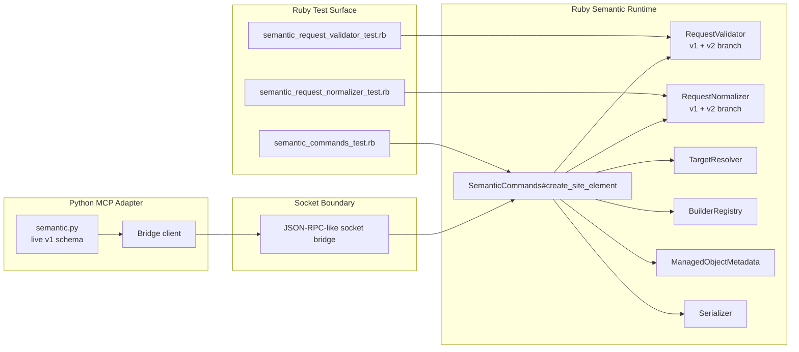

# Technical Plan: SEM-05 Validate V2 Semantic Contract Via Ruby Normalizer Spike
**Task ID**: `SEM-05`
**Title**: `Validate V2 Semantic Contract Via Ruby Normalizer Spike`
**Status**: `finalized`
**Date**: `2026-04-16`

## Source Task

- [Validate V2 Semantic Contract Via Ruby Normalizer Spike](./task.md)

## Problem Summary

The current semantic signal has converged on a plausible `v2` contract shape, but that shape is still only decision-grade if it survives the real Ruby semantic path instead of collapsing into cross-section special cases. The key proof gap is not whether the `v2` envelope is elegant on paper. It is whether Ruby can normalize and operationalize the hardest atomic scenarios while keeping section ownership disciplined, Python thin, refusals structured, and lifecycle-heavy behavior coherent.

## Goals

- Validate a `contractVersion: 2` spike path inside the existing Ruby semantic command seam.
- Prove or falsify the `v2` shape against three hard atomic scenarios:
  retained structure adoption, terrain-following path, and `replace_preserve_identity` under hierarchy.
- Produce evidence about section ownership, refusal behavior, and lifecycle viability that can be fed back into the signal.

## Non-Goals

- Adopting `v2` as the live public MCP contract.
- Changing Python tool schemas or the shared bridge contract artifact.
- Delivering the full composition layer or next-wave semantic families.
- Solving broader vegetation richness, `sceneProperties`, or migration/cutover mechanics in this task.

## Related Context

- [Semantic Scene Modeling HLD](specifications/hlds/hld-semantic-scene-modeling.md)
- [PRD: Semantic Scene Modeling](specifications/prds/prd-semantic-scene-modeling.md)
- [Platform Architecture and Repo Structure HLD](specifications/hlds/hld-platform-architecture-and-repo-structure.md)
- [Pressure-Test A Potential V2 Semantic Contract Before The PRD Surface Expands](specifications/signals/2026-04-15-semantic-contract-v2-pressure-test-signal.md)
- [Request normalizer](src/su_mcp/semantic/request_normalizer.rb)
- [Request validator](src/su_mcp/semantic/request_validator.rb)
- [Semantic commands](src/su_mcp/semantic_commands.rb)
- [Target resolver](src/su_mcp/semantic/target_resolver.rb)
- [Semantic command tests](test/semantic_commands_test.rb)

## Research Summary

- The live semantic path is already the right proof seam:
  `SemanticCommands -> RequestValidator -> RequestNormalizer -> BuilderRegistry -> metadata writer -> serializer`.
- The repo already has command-level tests, a fake SketchUp model, and target-resolution seams that can support a meaningful spike without Python changes.
- Model debate converged on extending the existing Ruby seam with a `contractVersion: 2` branch rather than introducing a separate proof runtime.
- Normalization-only proof is too weak. The spike must include target resolution, structured refusals, and minimal command-level execution proof.
- `replace_preserve_identity` is the highest-risk proof point and must be validated beyond canonical hash shaping.

## Technical Decisions

### Data Model

- The spike introduces a candidate `v2` request path identified by `contractVersion: 2`.
- The `v2` request is normalized into one canonical Ruby hash with these sections when relevant:
  - `metadata`
  - `definition`
  - `hosting`
  - `placement`
  - `representation`
  - `lifecycle`
- The normalized hash may retain preserved public request data for metadata or serializer needs, following the current `__public_params__` pattern where useful.
- `sceneProperties` stay out of the spike unless one of the three hard scenarios proves they are necessary for meaningful validation.

### API and Interface Design

- No public MCP interface changes are made in this task.
- `SemanticCommands#create_site_element` remains the top-level orchestration seam.
- `RequestValidator#refusal_for` and `RequestNormalizer#normalize_create_site_element_params` branch on `contractVersion`.
- The spike should prefer small private `v2_*` helper methods inside the existing classes over new public runtime abstractions.
- `BuilderRegistry` remains keyed by semantic element family; the spike must not explode it into lifecycle- or hosting-specific registries.

### Error Handling

- `v2` validation failures return the existing structured refusal envelope:
  `success: true`, `outcome: 'refused'`, plus structured `refusal` data.
- The spike must validate representative refusals for:
  - unresolved or ambiguous lifecycle/adopt targets
  - unresolved or invalid hosting targets
  - invalid lifecycle and placement combinations where applicable
- Refusal details should make section attribution visible where possible without inventing a new public error taxonomy.
- Refusals must happen before builder execution or partial mutation.

### State Management

- Ruby remains the owner of semantic interpretation, target resolution, normalization, and refusal behavior.
- Python remains unchanged and unaware of the candidate `v2` section split.
- The spike must preserve one-operation command behavior:
  successful flows commit once; failures abort cleanly.
- `replace_preserve_identity` proof must keep lifecycle target context distinct from placement or parent context.

### Integration Points

- Reuse the live Ruby collaborators:
  - [SemanticCommands](src/su_mcp/semantic_commands.rb)
  - [RequestValidator](src/su_mcp/semantic/request_validator.rb)
  - [RequestNormalizer](src/su_mcp/semantic/request_normalizer.rb)
  - [TargetResolver](src/su_mcp/semantic/target_resolver.rb)
  - [BuilderRegistry](src/su_mcp/semantic/builder_registry.rb)
  - [ManagedObjectMetadata](src/su_mcp/semantic/managed_object_metadata.rb)
  - [Serializer](src/su_mcp/semantic/serializer.rb)
- Do not change:
  - [Python semantic tool module](python/src/sketchup_mcp_server/tools/semantic.py)
  - [Shared bridge contract artifact](contracts/bridge/bridge_contract.json)
- The spike should be proven primarily through Ruby tests and fakes rather than cross-runtime integration changes.

### Configuration

- No new runtime configuration is required.
- `contractVersion: 2` is test-owned spike input, not a rollout flag or public feature toggle.

## Architecture Context

## Key Relationships

- The spike must validate the real Ruby semantic seam, not a parallel proof runtime.
- `TargetResolver` is the main reuse point for adopt and replace target proof.
- `ManagedObjectMetadata` and `Serializer` are downstream consumers that help verify whether the normalized shape stays compatible with the current command posture.
- Python and the bridge contract are explicit non-participants in this spike so runtime ownership stays clear.

## Acceptance Criteria

- A `contractVersion: 2` spike path exists inside the current Ruby semantic command seam without changing Python tool schemas or shared bridge contract artifacts.
- One retained-structure adoption flow succeeds through the `v2` path with canonical normalization and target resolution.
- One terrain-following path flow succeeds through the `v2` path with hosting-related normalization and resolved target context.
- One `replace_preserve_identity` flow succeeds through the `v2` path at minimal command level using doubles or fakes while keeping lifecycle and placement contexts distinct.
- The three spike scenarios normalize into one canonical Ruby request shape without adding new public top-level contract fields beyond the candidate `v2` envelope.
- Representative invalid requests for the spike scenarios return structured refusals before partial execution.
- Successful `v2` flows still execute inside one model operation boundary and abort cleanly on failure.
- The signal is updated with explicit findings about section ownership, refusals, and remaining overlap or weakness.

## Test Strategy

### TDD Approach

- Start with failing command-level tests in [semantic_commands_test.rb](test/semantic_commands_test.rb) for the three hard scenarios and their representative refusal paths.
- Add supporting validator and normalizer tests only as needed to clarify section ownership or normalization behavior.
- Use the existing fake model and fake entity support in [semantic_test_support.rb](test/support/semantic_test_support.rb) to keep the spike deterministic and Ruby-local.
- Implement the smallest private `v2` branching needed to satisfy one scenario at a time.
- For the highest-risk flow, prefer a hybrid proof shape:
  use the real command, validator, normalizer, and target-resolution path where practical, and double only the terminal builder or replacement mechanics that would otherwise force a broader SketchUp-hosted implementation.

### Required Test Coverage

- Command tests:
  - successful retained structure adoption via `contractVersion: 2`
  - successful terrain-following path via `contractVersion: 2`
  - successful `replace_preserve_identity` under parent context via `contractVersion: 2`
  - refusal for missing or ambiguous lifecycle target
  - refusal for invalid or unresolved hosting target
  - refusal for invalid lifecycle or placement combination where applicable
  - at least one high-risk flow proven through the real Ruby seam with only builder or replacement mechanics doubled
- Validator tests:
  - `v2` section ownership checks for the hard scenarios
  - representative `v2` refusal mapping
- Normalizer tests:
  - canonical shape generation for the three hard scenarios
  - length normalization and preserved public request handling for `v2`

## Instrumentation and Operational Signals

- Task-owned evidence is the main signal:
  test results, normalized shape assertions, refusal assertions, and command-operation assertions.
- The spike must also update [the contract pressure-test signal](specifications/signals/2026-04-15-semantic-contract-v2-pressure-test-signal.md) with:
  - where section boundaries held
  - where they overlapped
  - whether refusals stayed deterministic
  - whether the spike strengthens or weakens the candidate `v2` direction

## Implementation Phases

1. Add failing command tests for the three hard `v2` scenarios and representative refusals.
2. Add `contractVersion: 2` validation helpers inside [request_validator.rb](src/su_mcp/semantic/request_validator.rb).
3. Add `contractVersion: 2` normalization helpers inside [request_normalizer.rb](src/su_mcp/semantic/request_normalizer.rb).
4. Extend [semantic_commands.rb](src/su_mcp/semantic_commands.rb) minimally to route the `v2` proof cases through the live command seam with reused collaborators.
5. Add one hybrid high-risk proof test that uses the real validator, normalizer, and target-resolution stack with only terminal mechanics doubled.
6. Add supporting unit tests for validator and normalizer edge behavior revealed by the command tests.
7. Update the signal with findings and classify the candidate `v2` shape as strengthened, weakened, or still mixed.

## Rollout Approach

- No public rollout is part of this task.
- The spike remains an internal Ruby proof path.
- If the spike fails, the `contractVersion: 2` branch and its tests can be removed cleanly without MCP-surface fallout.
- If the spike succeeds, the result becomes design evidence for later HLD or contract work, not automatic adoption.

## Risks and Controls

- Section overlap reappears in Ruby execution:
  drive implementation from command tests that assert distinct lifecycle, placement, and hosting handling.
- Hash-only proof would create a false positive:
  require minimal command-level `replace_preserve_identity` proof instead of canonical-shape-only validation.
- Scope creeps into migration or composition work:
  keep Python, bridge contract, `sceneProperties`, and composition tools explicitly out of scope.
- `v2` branch pollutes live `v1` behavior:
  keep branching private, narrow, and fully test-covered in the existing seam.
- Lifecycle proof becomes too realistic and balloons:
  use doubles and fakes for replacement semantics rather than full SketchUp-hosted lifecycle implementation.
- Doubles hide the exact overlap this spike is meant to expose:
  require at least one hybrid proof that uses the real Ruby seam and real target-resolution path with only terminal mechanics doubled.

## Dependencies

- [SEM-02 task](specifications/tasks/semantic-scene-modeling/SEM-02-complete-first-wave-semantic-creation-vocabulary/task.md)
- [SEM-03 task](specifications/tasks/semantic-scene-modeling/SEM-03-add-metadata-mutation-for-managed-scene-objects/task.md)
- [Pressure-test signal](specifications/signals/2026-04-15-semantic-contract-v2-pressure-test-signal.md)
- [Semantic command tests](test/semantic_commands_test.rb)
- [Semantic request validator tests](test/semantic_request_validator_test.rb)
- [Semantic request normalizer tests](test/semantic_request_normalizer_test.rb)
- [Semantic test support](test/support/semantic_test_support.rb)

## Premortem

### Intended Goal Under Test

Prove or falsify the candidate semantic `v2` contract shape through the real Ruby semantic seam before any public contract or HLD direction depends on it.

### Failure Paths and Mitigations

- **Base assumptions that could lead us astray**
  - Business-plan mismatch: The repo needs trustworthy evidence about contract durability, while the plan might optimize only for a tidy internal hash.
  - Root-cause failure path: The `v2` branch normalizes requests cleanly but still merges section semantics during execution.
  - Why this misses the goal: The spike would certify the wrong boundary and carry false confidence into later design work.
  - Likely cognitive bias: abstraction bias.
  - Classification: `Validate before implementation`
  - Mitigation now: command-level tests lead the spike, not helper-only tests.
  - Required validation: successful and refused command cases for all three hard scenarios.
- **Shortcuts that could weaken the outcome**
  - Business-plan mismatch: The repo needs lifecycle proof, while the plan could optimize for speed by stopping at canonical hash shaping.
  - Root-cause failure path: `replace_preserve_identity` is validated only as normalized data, not as command behavior.
  - Why this misses the goal: The highest-risk scenario stays unproven and the spike becomes a fake proof.
  - Likely cognitive bias: optimism bias.
  - Classification: `Validate before implementation`
  - Mitigation now: require minimal command-level lifecycle proof with doubles or fakes.
  - Required validation: replacement-flow command test that distinguishes lifecycle target and placement context.
- **Areas that could be weakly implemented**
  - Business-plan mismatch: The repo needs a reversible spike, while the plan could accidentally create migration debt in live classes.
  - Root-cause failure path: `v2` branching spreads across the seam without tight isolation or tests.
  - Why this misses the goal: Even a rejected spike would leave noisy code in the live path.
  - Likely cognitive bias: sunk-cost bias.
  - Classification: `Requires implementation-time instrumentation or acceptance testing`
  - Mitigation now: keep private helpers small and phase implementation one scenario at a time.
  - Required validation: targeted unit coverage around each new `v2` helper plus command-level regression coverage.
- **Tests and evaluations needed to stay on track**
  - Business-plan mismatch: The repo needs decision-grade evidence, while the plan could over-rely on unit tests disconnected from command orchestration.
  - Root-cause failure path: validator and normalizer tests pass, but command behavior still hides overlap or partial execution.
  - Why this misses the goal: The spike would not validate the actual Ruby-owned path.
  - Likely cognitive bias: local optimization bias.
  - Classification: `Validate before implementation`
  - Mitigation now: require command tests as the primary proof boundary.
  - Required validation: command tests asserting operation boundaries, refusal timing, and collaborator usage.
- **What must be true for the task to succeed**
  - Business-plan mismatch: The repo needs Ruby-owned proof, while the plan could force implicit Python orchestration or public-surface changes.
  - Root-cause failure path: target or lifecycle interpretation leaks across the runtime boundary.
  - Why this misses the goal: The spike would violate the core platform boundary and weaken its evidence.
  - Likely cognitive bias: boundary neglect.
  - Classification: `Underspecified task/spec/success criteria`
  - Mitigation now: keep Python and bridge contract explicitly unchanged.
  - Required validation: no Python file or bridge artifact changes required for spike completion.
- **Second-order and third-order effects**
  - Business-plan mismatch: The repo needs a scoped spike, while the plan could reopen broader `v2` questions like composition or `sceneProperties`.
  - Root-cause failure path: implementation broadens to adjacent unresolved concerns because they are nearby in the signal.
  - Why this misses the goal: The spike result becomes slower, noisier, and harder to interpret.
  - Likely cognitive bias: scope creep.
  - Classification: `Requires implementation-time instrumentation or acceptance testing`
  - Mitigation now: preserve explicit exclusions and reject new scope unless a hard scenario proves it necessary.
  - Required validation: implementation review against stated non-goals before finalizing the task.
- **Runtime realism that could still be faked away**
  - Business-plan mismatch: The repo needs evidence about the real Ruby seam, while the plan could rely too heavily on doubles that never expose actual section overlap.
  - Root-cause failure path: lifecycle, placement, and hosting appear distinct in fake-only tests but collapse when real validator, normalizer, and target-resolution behavior interact.
  - Why this misses the goal: The spike would over-certify the contract and mislead later HLD or contract decisions.
  - Likely cognitive bias: simulation bias.
  - Classification: `Validate before implementation`
  - Mitigation now: require one hybrid proof test that uses the real command, validator, normalizer, and target-resolution path with only terminal mechanics doubled.
  - Required validation: one high-risk command test demonstrating distinct lifecycle and placement handling through the real Ruby seam.

## Quality Checks

- [x] All required inputs validated
- [x] Problem statement documented
- [x] Goals and non-goals documented
- [x] Research summary documented
- [x] Technical decisions included
- [x] Architecture context included
- [x] Acceptance criteria included
- [x] Test requirements specified
- [x] Instrumentation and operational signals defined when needed
- [x] Risks and dependencies documented
- [x] Rollout approach documented when needed
- [x] Small reversible phases defined
- [x] Premortem completed with falsifiable failure paths and mitigations
