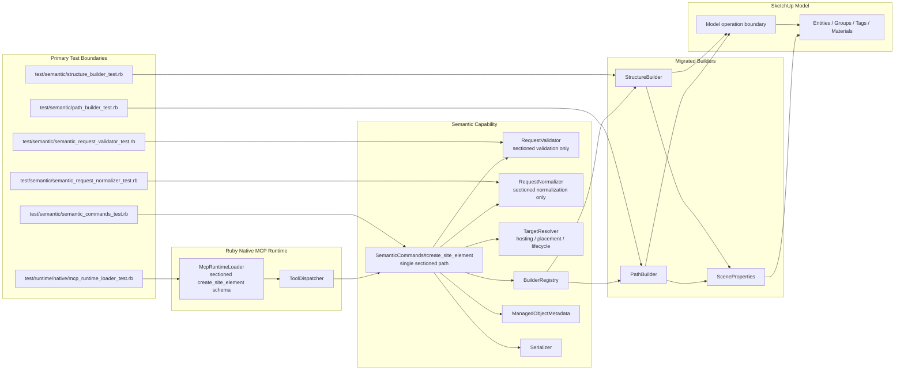

# Technical Plan: SEM-06 Cut Over Create Site Element To The Sectioned Contract And Adopt Builder-Native V2 Input For Path And Structure
**Task ID**: `SEM-06`
**Title**: `Cut Over Create Site Element To The Sectioned Contract And Adopt Builder-Native V2 Input For Path And Structure`
**Status**: `implemented`
**Date**: `2026-04-17`

## Source Task

- [Cut Over Create Site Element To The Sectioned Contract And Adopt Builder-Native V2 Input For Path And Structure](./task.md)

## Problem Summary

`SEM-05` proved that the sectioned semantic contract can survive the live Ruby semantic seam for hard `path` and `structure` scenarios, but the repo still exposes a mixed create posture. The native runtime loader publishes the old flat `create_site_element` schema, the semantic seam still branches on `contractVersion`, and `path` / `structure` still rely on command-level translation back into legacy builder payloads.

`SEM-06` removes that dual posture in one hard cut. The public `create_site_element` contract becomes sectioned-only, `contractVersion` is removed, and `path` plus `structure` become the first builders to consume sectioned input directly while preserving the hosting, lifecycle, and parent-context behavior already proven in `SEM-05`.

## Goals

- Replace the flat public `create_site_element` schema with one sectioned contract in the native runtime loader.
- Remove `contractVersion` branching from the semantic create path.
- Migrate `path` and `structure` to builder-native sectioned input.
- Move scene-facing wrapper inputs to `sceneProperties` and `representation`.
- Preserve proven adopt, hosting-aware create, and replace-preserve-identity behavior for the migrated families.
- Align runtime, semantic tests, and task-facing docs on one public baseline.

## Non-Goals

- Migrating `pad`, `retaining_edge`, `planting_mass`, or `tree_proxy`
- Adding hierarchy-maintenance primitives from `SEM-07`
- Introducing composition or multipart feature assembly behavior
- Redesigning `set_entity_metadata` to mutate scene-facing wrapper properties
- Adding a shared parent-aware builder helper in this task

## Related Context

- [SEM-06 task](./task.md)
- [Semantic Scene Modeling HLD](specifications/hlds/hld-semantic-scene-modeling.md)
- [PRD: Semantic Scene Modeling](specifications/prds/prd-semantic-scene-modeling.md)
- [SEM-05 task](specifications/tasks/semantic-scene-modeling/SEM-05-validate-v2-semantic-contract-via-ruby-normalizer-spike/task.md)
- [SEM-05 technical plan](specifications/tasks/semantic-scene-modeling/SEM-05-validate-v2-semantic-contract-via-ruby-normalizer-spike/plan.md)
- [Semantic contract pressure-test signal](specifications/signals/2026-04-15-semantic-contract-v2-pressure-test-signal.md)
- [Temporary V2 contract migration findings](tmp/v2-contract-migration-findings.md)
- [Native runtime loader](src/su_mcp/runtime/native/mcp_runtime_loader.rb)
- [Semantic commands](src/su_mcp/semantic/semantic_commands.rb)
- [Request validator](src/su_mcp/semantic/request_validator.rb)
- [Request normalizer](src/su_mcp/semantic/request_normalizer.rb)
- [Scene properties helper](src/su_mcp/semantic/scene_properties.rb)
- [Path builder](src/su_mcp/semantic/path_builder.rb)
- [Structure builder](src/su_mcp/semantic/structure_builder.rb)

## Research Summary

- `SEM-05` is implemented, not merely planned. The validator, normalizer, command seam, and tests already prove a sectioned path for adopt, terrain-hosted path creation, and replace-preserve-identity.
- The live public runtime schema is still flat and is the main source of contract inconsistency.
- The strongest remaining blend is command-level translation from sectioned input into legacy builder payloads, with `path` and `structure` as the first builder-native migration targets.
- `SceneProperties` already centralizes wrapper `name`, `tag`, and `material` application, but only from flat params.
- The repo does not currently need to optimize for external client migration risk. A hard cut is acceptable.
- `set_entity_metadata` should remain focused on durable semantic metadata, while `sceneProperties` remains create-time scene organization.
- `sceneProperties.tag` values should stay open-ended and should not be rejected because the tag name is unknown.
- The public hard cut cannot silently drop support for `pad`, `retaining_edge`, `planting_mass`, or `tree_proxy`; those families need sectioned public input plus a narrow internal translation path until `SEM-08`.
- Public meter-valued metadata must remain meter-valued even after `__public_params__` is removed from normalized request flow.

## Technical Decisions

### Data Model

- `create_site_element` will accept one sectioned request shape with:
  - `elementType`
  - `metadata`
  - `sceneProperties`
  - `definition`
  - `hosting`
  - `placement`
  - `representation`
  - `lifecycle`
- Required sections:
  - `metadata`
  - `definition`
  - `hosting`
  - `placement`
  - `representation`
  - `lifecycle`
- Optional section:
  - `sceneProperties`
- Section ownership:
  - `metadata` owns durable semantic identity and status
  - `sceneProperties` owns wrapper-facing `name` and `tag`
  - `definition` owns family geometry and family-specific qualifiers
  - `hosting` owns terrain, surface, edge, or boundary conformity
  - `placement` owns scene insertion and parent context
  - `representation` owns realization mode and material
  - `lifecycle` owns create, adopt, and replace intent plus target identity
- `material` moves under `representation.material`.
- `name` and `tag` move under `sceneProperties.name` and `sceneProperties.tag`.
- Unknown tag names are accepted as normal scene-organization input.
- The public sectioned contract remains available for all currently supported first-wave families, even though only `path` and `structure` become builder-native in `SEM-06`.
- `SCHEMA_VERSION` remains `1` in `SEM-06` because the persisted Managed Scene Object metadata shape does not change in this task; the cutover changes request contract shape, not the attribute-dictionary contract.
- Unit boundary rule:
  - client-supplied geometric dimensions are expressed in public meters
  - normalization converts those geometry inputs into SketchUp internal inches before builder execution
  - builders and SketchUp-facing geometry code consume internal-inch values only
  - persisted or returned semantic values must not inherit normalized inch values by accident; each such field must have an explicit unit decision

### API and Interface Design

- The public tool name remains `create_site_element`.
- `McpRuntimeLoader#create_site_element_schema` becomes sectioned-only.
- The public contract no longer documents or accepts:
  - `contractVersion`
  - flat top-level geometry fields such as `footprint`, `height`, or `path`
  - flat top-level scene-facing fields such as `name`, `tag`, or `material`
- `RequestValidator#refusal_for` validates only the sectioned contract for semantic creation.
- `RequestNormalizer#normalize_create_site_element_params` normalizes only the sectioned contract for semantic creation.
- `SemanticCommands#create_site_element` routes all semantic create calls through one sectioned path and no longer branches on `contractVersion`.
- `PathBuilder` consumes sectioned input directly from:
  - `definition`
  - `sceneProperties`
  - `representation`
  - `placement`
  - `hosting`
- `StructureBuilder` consumes sectioned input directly from:
  - `definition`
  - `sceneProperties`
  - `representation`
  - `placement`
- The remaining families keep one narrow internal translation path from the sectioned public request into legacy builder payloads:
  - `pad`
  - `retaining_edge`
  - `planting_mass`
  - `tree_proxy`
- `SceneProperties#apply!` is updated to support:
  - sectioned inputs for migrated builders
  - legacy flat inputs for non-migrated builders still behind the narrow internal translation path
- `SceneProperties#apply!` should read `sceneProperties.name`, `sceneProperties.tag`, and `representation.material` when sectioned inputs are present, and fall back to legacy flat keys only for the explicitly retained internal transition path.

### Error Handling

- The existing structured refusal envelope remains unchanged:
  - `success: true`
  - `outcome: 'refused'`
  - `refusal.code`
  - `refusal.message`
  - `refusal.details` when relevant
- Missing required sections and fields continue to produce `missing_required_field` refusals.
- Missing or ambiguous hosting, placement, and lifecycle targets continue to produce section-attributed refusals where already supported.
- Replace requests with overlapping lifecycle and placement targets continue to return `invalid_section_combination`.
- Unknown tag names in `sceneProperties.tag` are not semantic refusal cases.
- Unknown keys under `sceneProperties` should be blocked by the runtime schema rather than by ad hoc semantic refusal logic.

### State Management

- Ruby remains the sole owner of:
  - semantic interpretation
  - target resolution
  - lifecycle routing
  - metadata writes
  - serializer output
- `ManagedObjectMetadata` continues to persist durable metadata on created or adopted entities.
- `set_entity_metadata` remains metadata-only and is not extended to mutate scene-facing wrapper properties.
- `__public_params__` is removed from semantic create normalization output and is not carried through normalized builder params.
- `SemanticCommands#create_site_element` retains the original unnormalized sectioned request only as a command-local source of truth for metadata derivation where public meter values must be preserved.
- Metadata attribute derivation is updated to consume the original unnormalized sectioned request, not the normalized inch-based request, for any persisted values that must remain in public units.
- Normalized builder params are therefore the source of truth for geometry execution, while the original unnormalized request remains the source of truth for public-unit semantic metadata when those concerns differ.

### Integration Points

- `McpRuntimeLoader` is the public schema boundary for the hard cutover.
- `ToolDispatcher` remains a thin call-through layer and should not gain semantic contract logic.
- `SemanticCommands` remains the orchestration seam for:
  - validation
  - normalization
  - target resolution
  - lifecycle routing
  - one-operation execution
  - metadata handoff
  - serialization
- `SemanticCommands` also owns the narrow internal transition path for non-migrated families so the hard public cutover does not disable existing family support.
- Parent target resolution stays in `SemanticCommands` for `SEM-06`.
- Builders receive resolved parent context through `placement.resolved_parent` when needed.
- A shared parent-aware builder helper is deferred until repetition across later family migrations justifies it.

### Configuration

- No new runtime configuration is introduced.
- No compatibility flag or migration toggle is introduced.
- The task is a hard cut with one public baseline.

## Architecture Context

## Key Relationships

- `McpRuntimeLoader` owns the public `create_site_element` schema and must be the first layer to stop advertising the flat contract.
- `SemanticCommands` remains the seam that binds validation, normalization, target resolution, lifecycle handling, metadata, and serialization.
- `PathBuilder` and `StructureBuilder` become the first builders to consume sectioned input directly.
- `SceneProperties` remains the shared wrapper-property helper but changes its input section ownership.
- `ManagedObjectMetadata` remains separate from wrapper naming, tagging, and material application.
- Parent target resolution stays seam-owned for `SEM-06`; builders consume resolved context but do not perform lookup.

## Implementation Notes

- `McpRuntimeLoader#create_site_element_schema` now advertises only the sectioned public request shape with required `metadata`, `definition`, `hosting`, `placement`, `representation`, and `lifecycle`, plus optional `sceneProperties`.
- `RequestValidator` and `RequestNormalizer` now operate on one sectioned contract path for all currently supported families and no longer branch on `contractVersion`.
- `PathBuilder` and `StructureBuilder` consume sectioned `definition` input natively, while `SceneProperties` reads `sceneProperties.name`, `sceneProperties.tag`, and `representation.material`, with legacy flat fallback retained only for non-migrated builders.
- `SemanticCommands#create_site_element` now routes all create flows through one sectioned path, derives persisted metadata from the original public request, and retains only the narrow internal sectioned-to-legacy bridge for `pad`, `retaining_edge`, `planting_mass`, and `tree_proxy`.

## Validation Results

- Focused tests passed for builders, validator, normalizer, semantic commands, and runtime loader.
- `bundle exec rake ruby:test` passed.
- `bundle exec rake ruby:lint` passed.
- `bundle exec rake package:verify` passed.
- Manual SketchUp-hosted verification was not run in this task and remains the primary follow-up gap for host-runtime confirmation.

## Acceptance Criteria

- `create_site_element` publishes exactly one public request shape in the native runtime schema, and that shape is sectioned rather than flat.
- The public `create_site_element` contract no longer accepts or documents `contractVersion`.
- The public `create_site_element` contract no longer accepts flat top-level semantic create fields such as `footprint`, `height`, `path`, `name`, `tag`, or `material`.
- The public sectioned request supports required `metadata`, `definition`, `hosting`, `placement`, `representation`, and `lifecycle`, with optional `sceneProperties`.
- `sceneProperties.name` and `sceneProperties.tag` are accepted as scene-facing wrapper inputs for migrated families.
- `representation.material` is accepted as the material input for migrated families.
- Unknown tag names in `sceneProperties.tag` do not cause semantic validation failure.
- `PathBuilder` accepts sectioned input directly without relying on a synthesized legacy `path` payload.
- `StructureBuilder` accepts sectioned input directly without relying on synthesized top-level legacy fields.
- `pad`, `retaining_edge`, `planting_mass`, and `tree_proxy` still execute successfully through the new public sectioned contract, using only the narrow internal translation path retained for non-migrated families.
- `SemanticCommands#create_site_element`, `RequestValidator#refusal_for`, and `RequestNormalizer#normalize_create_site_element_params` no longer branch on `contractVersion`.
- Scene-facing wrapper properties from `sceneProperties` and `representation.material` survive a full command-level create flow for migrated families rather than only isolated builder tests.
- Persisted metadata that represents public measurement semantics remains in public meter units after `__public_params__` is removed from normalized request handling.
- Adopt-existing `structure`, terrain-hosted `path`, and replace-preserve-identity `structure` flows still succeed through the single sectioned path.
- Parented create flows for migrated families still pass resolved placement context into the builder path without flattening or losing the intended parent.
- Missing required sections or required section fields still return structured refusals before builder execution.
- Missing, ambiguous, or conflicting hosting, placement, and lifecycle targets still return structured refusals with section attribution where already supported.
- Successful migrated create flows still execute inside one SketchUp operation boundary and abort cleanly on failure.

## Test Strategy

### TDD Approach

- Start with failing runtime schema tests that assert the new sectioned-only public contract.
- Add or rewrite validator and normalizer tests next so the single sectioned baseline is enforced before command execution changes.
- Rewrite command-level tests for adopt, terrain-hosted create, and replace flows so they run through the single sectioned path without `contractVersion`.
- Rewrite builder tests for `path` and `structure` so they prove section-native input consumption before deleting translation helpers.
- Remove legacy translation and compatibility code only after the new tests pass.

### Required Test Coverage

- Runtime loader tests:
  - sectioned-only `create_site_element` schema
  - no flat required fields or flat public create properties remain
- Validator tests:
  - missing required sections and fields
  - replace target overlap refusal
  - open-ended `sceneProperties.tag` handling
- Normalizer tests:
  - sectioned geometry normalization for `path` and `structure`
  - sectioned geometry normalization for representative non-migrated family requests
  - no `__public_params__` preservation in normalized create payloads
  - explicit proof that client meter inputs become internal-inch builder inputs
- Command tests:
  - create-new flow that proves `sceneProperties.name`, open-ended `sceneProperties.tag`, and `representation.material` survive the full command path for a migrated family
  - adopt-existing `structure`
  - terrain-following `path`
  - parented create flow for a migrated family with resolved placement context
  - replace-preserve-identity `structure`
  - representative create flow for a non-migrated footprint family such as `pad`
  - representative create flow for a non-migrated nested-payload family such as `retaining_edge`, `planting_mass`, or `tree_proxy`
  - metadata assertions proving persisted public-unit fields are still derived from meter-valued request input rather than normalized inch-based builder input
  - refusal cases for missing or ambiguous hosting, placement, and lifecycle targets
- Builder tests:
  - `PathBuilder` reads `definition`, `sceneProperties`, and `representation`
  - `StructureBuilder` reads `definition`, `sceneProperties`, and `representation`
  - wrapper naming, tagging, and material assignment still work for migrated families

## Instrumentation and Operational Signals

- The primary proof remains deterministic test evidence rather than runtime telemetry.
- The key implementation signals are:
  - runtime schema assertions
  - section-level refusal assertions
  - command-operation assertions
  - builder-input-shape assertions
  - wrapper property assertions for `sceneProperties` and `representation.material`

## Implementation Phases

1. Replace the native runtime `create_site_element` schema and update runtime schema tests to the sectioned-only baseline.
2. Rewrite validator and normalizer tests to the sectioned-only baseline and remove `contractVersion`-dependent expectations.
3. Refactor validator and normalizer to operate on a single sectioned input path and remove `contractVersion` branching.
4. Rewrite semantic command tests for adopt, hosting-aware create, and replace flows without `contractVersion`.
5. Refactor `SemanticCommands` to one sectioned create path, update metadata attribute derivation to use the original unnormalized request, and remove `__public_params__` from normalized flow.
6. Add the narrow internal sectioned-to-legacy translation path for `pad`, `retaining_edge`, `planting_mass`, and `tree_proxy`.
7. Adapt `SceneProperties` to support sectioned inputs plus the explicitly retained internal legacy transition path, then migrate `PathBuilder` and `StructureBuilder` to builder-native sectioned params.
8. Remove `v2_builder_payload`, `path_builder_payload`, and `structure_builder_payload` plus any stale flat-contract assumptions for migrated families, while keeping the non-migrated translation path explicitly scoped to `SEM-08`.

## Rollout Approach

- Treat `SEM-06` as a hard cutover with no compatibility window.
- Remove flat public schema acceptance and `contractVersion` support in the same task that lands the new sectioned baseline.
- Do not keep dormant compatibility code for migrated families after the cutover.
- Keep only the narrow internal translation path required so non-migrated families remain functional under the new public sectioned contract until `SEM-08`.
- Leave remaining family migration to `SEM-08` after the first two families establish the stable builder-native pattern.

## Risks and Controls

- Metadata-writing logic regresses from public meters to internal inches:
  refactor metadata attribute derivation to use the original unnormalized command input before removing `__public_params__` from normalized flow, and prove the new behavior in command tests.
- Wrapper scene properties regress during section relocation:
  migrate `SceneProperties` and migrated builder tests together so `name`, open-ended `tag`, and `representation.material` remain covered, while retaining explicit flat-key support only for the non-migrated internal transition path.
- Hidden flat-contract assumptions survive in the runtime suite:
  start with runtime loader tests and remove flat assertions before command refactors.
- Parent-context handling regresses in replace flows:
  preserve command-level replace tests and keep parent resolution in the semantic seam for this task.
- Scene-facing fields pass builder tests but are dropped in the real command path:
  add a full command-level create-new test that asserts wrapper naming, tag creation, and material application after schema and seam refactors.
- Non-migrated families break under the hard public cutover:
  keep one explicitly scoped internal translation path for `pad`, `retaining_edge`, `planting_mass`, and `tree_proxy`, and add representative command coverage before deleting old public flat handling.
- Builder-native migration accidentally leaves translation debt in place:
  explicitly delete family translation helpers for `path` and `structure` after section-native builder tests pass, while naming the remaining-family transition path as temporary follow-on debt owned by `SEM-08`.

## Premortem

### Intended Goal Under Test

Land a true hard cutover for `create_site_element` so the repo stops exposing a dual contract posture, while `path` and `structure` become genuinely section-native without losing proven lifecycle, hosting, parent-context, or scene-facing wrapper behavior.

### Failure Paths and Mitigations

- **Base assumptions that could lead us astray**
  - Business-plan mismatch: the task needs a real end-state cutover, but the plan could still optimize for internal transition comfort.
  - Root-cause failure path: `contractVersion` or legacy translation survives in a hidden normal execution path for migrated families.
  - Why this misses the goal: the public contract may look clean while the implementation still behaves as a mixed posture.
  - Likely cognitive bias: sunk-cost bias around the `SEM-05` spike path.
  - Classification: `can be validated before implementation`
  - Mitigation now: explicitly delete `contractVersion` branching and family translation helpers for `path` and `structure` in the same task while keeping the non-migrated translation path named and scoped as temporary `SEM-08` debt.
  - Required validation: code-level assertions and tests proving no normal create flow for migrated families depends on `contractVersion`, `v2_builder_payload`, `path_builder_payload`, or `structure_builder_payload`.

- **Shortcuts that could weaken the outcome**
  - Business-plan mismatch: the task needs one sectioned truth, but the plan could shortcut metadata handling by leaning on preserved request state.
  - Root-cause failure path: `__public_params__` removal is handled by reading normalized inch-based values during metadata derivation or is deferred because metadata derivation is not refactored first.
  - Why this misses the goal: the implementation keeps an internal transitional crutch and risks breaking metadata handoff later under pressure.
  - Likely cognitive bias: loss aversion toward touching working metadata code.
  - Classification: `can be validated before implementation`
  - Mitigation now: sequence metadata-attribute refactoring ahead of `__public_params__` removal, keep the original unnormalized command input available locally in `SemanticCommands`, and treat `__public_params__` removal as in-scope rather than optional cleanup.
  - Required validation: command tests for create, adopt, and replace that still assert correct managed-object metadata and public-unit persistence after `__public_params__` is gone.

- **Areas that could be weakly implemented**
  - Business-plan mismatch: the task needs scene-facing fields to remain usable after relocation, but the plan could prove them only in isolated builder tests.
  - Root-cause failure path: `sceneProperties` and `representation.material` are wired into builders but are dropped or misrouted in the full command path.
  - Why this misses the goal: the public sectioned contract would be technically accepted but functionally incomplete for normal create flows.
  - Likely cognitive bias: unit-test substitution, where builder tests are mistaken for end-to-end proof.
  - Classification: `requires implementation-time instrumentation or acceptance testing`
  - Mitigation now: require at least one full command-level create-new scenario that asserts wrapper name, open-ended tag, and material survive the whole path.
  - Required validation: command test using the real seam plus builder execution for a migrated family, not only doubles.

- **Tests and evaluations needed to stay on track**
  - Business-plan mismatch: the task needs the hard cut to remain stable under hierarchy-aware behavior, but the plan could over-focus on replace flows only.
  - Root-cause failure path: parented create flows are not exercised after builder-native migration, so resolved placement context silently regresses.
  - Why this misses the goal: migrated builders would appear section-native but fail one of the core placement responsibilities of the new contract.
  - Likely cognitive bias: proof by representative case, assuming replace-under-parent covers create-under-parent.
  - Classification: `can be validated before implementation`
  - Mitigation now: add one parented create scenario for a migrated family to required command coverage.
  - Required validation: command-level test asserting resolved parent context reaches the builder path and the result is created under the intended parent.

- **What must be true for the task to succeed**
  - Business-plan mismatch: the task needs `sceneProperties` and semantic metadata to remain distinct, but the implementation could blur them under deadline pressure.
  - Root-cause failure path: wrapper-facing fields start leaking into `ManagedObjectMetadata` or `set_entity_metadata` because they are easier to persist there.
  - Why this misses the goal: the capability loses the ownership boundary that the sectioned contract is meant to clarify.
  - Likely cognitive bias: local optimization, favoring one writable path over correct ownership.
  - Classification: `can be validated before implementation`
  - Mitigation now: keep `set_entity_metadata` untouched in scope and state explicitly that wrapper properties remain outside the metadata namespace.
  - Required validation: code review plus unchanged `set_entity_metadata` schema/tests and absence of wrapper fields in `ManagedObjectMetadata`.

- **Second-order and third-order effects**
  - Business-plan mismatch: the task needs to establish a reusable pattern for `SEM-08`, but the implementation could entrench a `path`/`structure`-specific one-off.
  - Root-cause failure path: migrated builders rely on ad hoc section reading patterns that are too family-specific to extend cleanly.
  - Why this misses the goal: `SEM-08` would reopen core interface choices instead of reusing a stable pattern.
  - Likely cognitive bias: short-horizon bias, optimizing only for the two immediate families.
  - Classification: `requires implementation-time instrumentation or acceptance testing`
  - Mitigation now: make the section ownership explicit in the plan, keep parent resolution seam-owned while builders consume the same high-level sections, and keep the non-migrated translation path narrow enough that `SEM-08` clearly owns its retirement.
  - Required validation: implementation review against this plan plus confirmation that `SEM-08` can follow the same section ownership while deleting the remaining-family translation path instead of deepening it.

## Dependencies

- [SEM-02 task](specifications/tasks/semantic-scene-modeling/SEM-02-complete-first-wave-semantic-creation-vocabulary/task.md)
- [SEM-05 task](specifications/tasks/semantic-scene-modeling/SEM-05-validate-v2-semantic-contract-via-ruby-normalizer-spike/task.md)
- [Native runtime loader tests](test/runtime/native/mcp_runtime_loader_test.rb)
- [Semantic command tests](test/semantic/semantic_commands_test.rb)
- [Semantic request validator tests](test/semantic/semantic_request_validator_test.rb)
- [Semantic request normalizer tests](test/semantic/semantic_request_normalizer_test.rb)
- [Path builder tests](test/semantic/path_builder_test.rb)
- [Structure builder tests](test/semantic/structure_builder_test.rb)

## Quality Checks

- [x] All required inputs validated
- [x] Problem statement documented
- [x] Goals and non-goals documented
- [x] Research summary documented
- [x] Technical decisions included
- [x] Architecture context included
- [x] Acceptance criteria included
- [x] Test requirements specified
- [x] Instrumentation and operational signals defined when needed
- [x] Risks and dependencies documented
- [x] Rollout approach documented when needed
- [x] Small reversible phases defined
- [x] Premortem completed with falsifiable failure paths and mitigations
