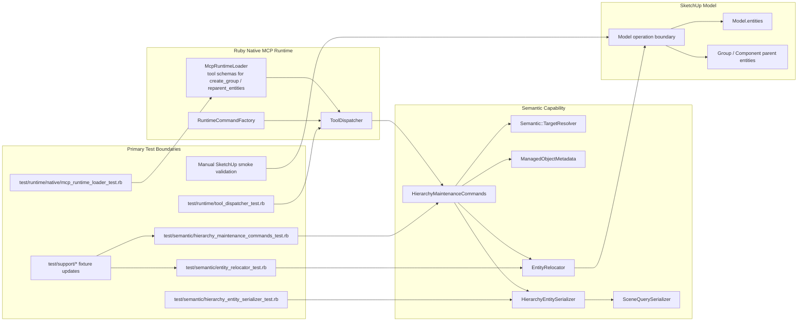

# Technical Plan: SEM-07 Add Limited Hierarchy Maintenance Primitives
**Task ID**: `SEM-07`
**Title**: `Add Limited Hierarchy Maintenance Primitives`
**Status**: `finalized`
**Date**: `2026-04-17`

## Source Task

- [Add Limited Hierarchy Maintenance Primitives](./task.md)

## Problem Summary

`SEM-07` adds the first explicit hierarchy-maintenance slice for semantic scene work after `SEM-03` and `SEM-06`. The semantic capability can already create and mutate Managed Scene Objects with explicit target resolution and parent-aware create flows, but it still lacks first-class target-based organization operations for accepted-scene repair and composition.

This task should add the smallest useful public surface for explicit hierarchy maintenance:

- `create_group`
- `reparent_entities`

The slice must stay Ruby-owned, JSON-safe, and explicit about parent targets. It must preserve managed business identity and metadata for supported child objects without widening into duplicate, replace, edit-context, or broad scene-orchestration behavior.

## Goals

- Add `create_group` and `reparent_entities` as explicit target-based hierarchy-maintenance tools.
- Keep parent resolution, operation bracketing, and serialization inside the Ruby semantic/runtime seam.
- Preserve managed-object business identity and metadata during supported grouping and reparenting flows.
- Return structured post-operation summaries with current runtime identifiers and any preserved `sourceElementId`.
- Land the slice with runtime, command, and relocation-path validation plus manual hosted verification where SketchUp API behavior cannot be safely assumed from mocks alone.

## Non-Goals

- Reintroducing `get_active_edit_context` or adding edit-context control tools.
- Delivering duplicate-into-parent, identity-preserving replacement, or broader lifecycle orchestration.
- Turning container groups created by this task into Managed Scene Objects by default.
- Accepting broad query inputs, raw SketchUp ids outside the compact target-reference posture, or scene-wide hierarchy traversal.
- Supporting raw geometry reparenting for edges, faces, or mixed arbitrary entities.

## Related Context

- [SEM-07 task](./task.md)
- [Semantic Scene Modeling HLD](specifications/hlds/hld-semantic-scene-modeling.md)
- [PRD: Semantic Scene Modeling](specifications/prds/prd-semantic-scene-modeling.md)
- [Domain Analysis](specifications/domain-analysis.md)
- [Semantic lifecycle gap signal](specifications/signals/2026-04-15-semantic-lifecycle-and-eval-ruby-gap-signal.md)
- [Semantic contract pressure-test signal](specifications/signals/2026-04-15-semantic-contract-v2-pressure-test-signal.md)
- [SEM-03 plan](specifications/tasks/semantic-scene-modeling/SEM-03-add-metadata-mutation-for-managed-scene-objects/plan.md)
- [SEM-06 plan](specifications/tasks/semantic-scene-modeling/SEM-06-adopt-builder-native-v2-input-for-path-and-structure/plan.md)
- [Runtime loader](src/su_mcp/runtime/native/mcp_runtime_loader.rb)
- [Tool dispatcher](src/su_mcp/runtime/tool_dispatcher.rb)
- [Runtime command factory](src/su_mcp/runtime/runtime_command_factory.rb)
- [Semantic commands](src/su_mcp/semantic/semantic_commands.rb)
- [Managed object metadata](src/su_mcp/semantic/managed_object_metadata.rb)
- [Semantic target resolver](src/su_mcp/semantic/target_resolver.rb)
- [Semantic serializer](src/su_mcp/semantic/serializer.rb)
- [Scene query serializer](src/su_mcp/scene_query/scene_query_serializer.rb)
- [Semantic test support](test/support/semantic_test_support.rb)
- [Runtime contract cases](test/support/native_runtime_contract_cases.json)

## Research Summary

- The original lifecycle signals mixed edit-context inspection with explicit hierarchy control, but the corrected `SEM-07` task now intentionally keeps only explicit target-based operations.
- `SEM-06` already establishes the right posture for this task: parent resolution stays seam-owned and explicit, while builders or lower-level helpers consume resolved parent context instead of discovering it themselves.
- The existing semantic slice already has the core reusable building blocks:
  - compact target-reference resolution through `Semantic::TargetResolver`
  - managed-object identity and metadata policy through `ManagedObjectMetadata`
  - thin runtime dispatch through `ToolDispatcher`
  - JSON-safe serialization patterns in the semantic and scene-query slices
- The pressure-test signal preferred a lean composition surface where `create_group` can optionally group supplied children and `reparent_entities` remains separate from duplicate or replace flows.
- Official SketchUp Ruby docs clearly support:
  - `Entities#add_group`
  - `Entities#add_group(*entities)`
  - `Entities#add_instance`
  - bulk erase operations
  but they do not expose a simple direct “move this existing group/component instance into another entities collection” primitive. The plan must therefore treat relocation mechanics as an explicit implementation seam and not assume runtime identifiers will remain stable across every supported reparent path.
- The HLD already allows business identity preservation even when SketchUp runtime identifiers change, which gives this task room to preserve `sourceElementId` and `su_mcp` metadata even if a supported relocation path must recreate a wrapper instance.

## Technical Decisions

### Data Model

- `SEM-07` adds one new semantic-owned command target:
  - `HierarchyMaintenanceCommands`
- `create_group` uses one compact public request shape:
  - optional `parent`
  - optional `children`
- `reparent_entities` uses one compact public request shape:
  - required `entities`
  - optional `parent`
- `parent`, `children[*]`, and `entities[*]` all use the compact target-reference contract already established by the semantic slice:
  - `sourceElementId`
  - `persistentId`
  - compatibility `entityId`
- Omitted `parent` means model root. The task will not depend on current SketchUp edit context.
- `create_group` creates a plain SketchUp group container. It does not attach `su_mcp` managed-object metadata by default in this task.
- `create_group` with supplied `children` is defined as “create a container, then relocate the resolved children into it atomically” rather than as a separate public workflow.
- Supported child entity types for both tools are limited to:
  - `Sketchup::Group`
  - `Sketchup::ComponentInstance`
- Raw geometry entities such as edges and faces are explicitly out of scope and must be refused.
- Managed identity preservation for moved children means:
  - preserve `sourceElementId`
  - preserve the `su_mcp` dictionary contents
  - preserve wrapper scene properties such as name, tag/layer, and material where the relocation path recreates the wrapper instance
  - do not promise stable `entityId` or `persistentId` across every relocation path
- Tool outputs use a new generic hierarchy summary shape, not the managed-object serializer payload:
  - `sourceElementId` when present
  - `persistentId`
  - `entityId`
  - `type`
  - `name`
  - `tag`
  - `material`
  - `childrenCount` for groups and components
- Recommended success envelopes:

```json
{
  "success": true,
  "outcome": "created",
  "group": {
    "persistentId": "1001",
    "entityId": "42",
    "type": "group",
    "childrenCount": 2
  },
  "children": [
    {
      "sourceElementId": "tree-001",
      "persistentId": "2001",
      "entityId": "77",
      "type": "group"
    }
  ]
}
```

```json
{
  "success": true,
  "outcome": "reparented",
  "parent": {
    "persistentId": "1002",
    "entityId": "43",
    "type": "group",
    "childrenCount": 3
  },
  "entities": [
    {
      "sourceElementId": "house-extension-001",
      "persistentId": "2002",
      "entityId": "78",
      "type": "group"
    }
  ]
}
```

### API and Interface Design

- Add two new public tools in [src/su_mcp/runtime/native/mcp_runtime_loader.rb](src/su_mcp/runtime/native/mcp_runtime_loader.rb):
  - `create_group`
  - `reparent_entities`
- Add stable dispatcher mappings in [src/su_mcp/runtime/tool_dispatcher.rb](src/su_mcp/runtime/tool_dispatcher.rb).
- Register the new command target in [src/su_mcp/runtime/runtime_command_factory.rb](src/su_mcp/runtime/runtime_command_factory.rb).
- Add a new semantic-owned command file:
  - [src/su_mcp/semantic/hierarchy_maintenance_commands.rb](src/su_mcp/semantic/hierarchy_maintenance_commands.rb)
- Add one internal relocation helper to isolate the SketchUp-specific move/copy/erase complexity:
  - recommended path: [src/su_mcp/semantic/entity_relocator.rb](src/su_mcp/semantic/entity_relocator.rb)
- Add one serializer dedicated to hierarchy summaries:
  - recommended path: [src/su_mcp/semantic/hierarchy_entity_serializer.rb](src/su_mcp/semantic/hierarchy_entity_serializer.rb)
- `HierarchyMaintenanceCommands` owns:
  - request-level validation after runtime schema validation
  - compact target resolution consumption
  - operation boundaries
  - refusal translation
  - post-operation serialization
- `EntityRelocator` owns:
  - determining whether a supported child can be moved directly or must be recreated under the target parent
  - metadata and wrapper-property handoff when recreation is required
  - cycle-prevention checks against parent/child relationships
  - returning post-relocation entity objects in input order
- `HierarchyEntitySerializer` should reuse `SceneQuerySerializer` style outputs instead of pretending every container is a Managed Scene Object.
- Recommended runtime schemas:
  - `create_group`
    - `parent`: optional `target_reference_schema`
    - `children`: optional array of `target_reference_schema`
  - `reparent_entities`
    - `parent`: optional `target_reference_schema`
    - `entities`: required non-empty array of `target_reference_schema`
- The task should keep compact references only. It should not add raw top-level string ids or broad query criteria.

### Error Handling

- Keep semantic-domain outcomes in-band in the standard semantic refusal envelope:
  - `success: true`
  - `outcome: 'refused'`
  - `refusal.code`
  - `refusal.message`
  - `refusal.details` when relevant
- Use runtime schema validation for malformed shapes such as non-array `entities`, invalid nested object types, or extra fields.
- Use semantic refusals for domain-valid but unsupported or unsafe hierarchy requests.
- Required refusal cases:
  - `target_not_found`
  - `ambiguous_target`
  - `unsupported_entity_type`
  - `invalid_parent_type`
  - `duplicate_target_reference`
  - `cyclic_reparent`
  - `missing_entities`
  - `unsupported_operation`
- `unsupported_operation` should be used when SketchUp runtime behavior blocks a requested relocation path in a way that is within public contract shape but outside the supported current-phase slice:
  - locked instances
  - active-path-sensitive erase restrictions
  - relocation paths that cannot preserve supported invariants safely
- Use refusal details to identify which field failed:
  - `parent`
  - `children[index]`
  - `entities[index]`
- Preserve Ruby exception behavior for true runtime/programming faults rather than collapsing all exceptions into semantic refusals.

### State Management

- The SketchUp model remains the source of truth for scene hierarchy.
- `HierarchyMaintenanceCommands` should start one SketchUp operation per successful mutating call:
  - `Create Group`
  - `Reparent Entities`
- If the relocation path must recreate an entity under a different parent collection, the command must treat the operation as one coherent handoff:
  - create the replacement wrapper instance
  - copy managed metadata when present
  - preserve name, tag/layer, material, and transform intent
  - erase the superseded source wrapper only after the target wrapper is ready
- Because supported relocation may recreate wrapper instances, post-operation returned identifiers are authoritative. Clients should treat the returned `entityId` and `persistentId` as current state and `sourceElementId` as durable business identity when present.
- `create_group` does not mutate child business identity. When children are grouped into a new container, the container relationship changes but the child semantic identity must not be rewritten.
- No separate in-memory registry or hierarchy cache should be introduced.

### Integration Points

- Native runtime tool schema and registration in `McpRuntimeLoader`
- Stable name-to-method dispatch in `ToolDispatcher`
- Command-target wiring in `RuntimeCommandFactory`
- Compact target resolution through `Semantic::TargetResolver`
- Managed metadata read/write through `ManagedObjectMetadata`
- Generic scene-facing summary fields through `SceneQuerySerializer` patterns
- SketchUp wrapper relocation inside the new `EntityRelocator`
- Test-support expansion in:
  - [test/support/semantic_test_support.rb](test/support/semantic_test_support.rb)
  - [test/support/scene_query_test_support.rb](test/support/scene_query_test_support.rb)

### Configuration

- No new runtime configuration or feature flags are required.
- The task adds net-new tools, so there is no compatibility migration window.
- The live tool metadata should describe this as a narrow current-phase hierarchy-maintenance slice that supports explicit group creation and explicit reparenting of supported entities only.

## Architecture Context



## Key Relationships

- `HierarchyMaintenanceCommands` is semantic-owned but separate from `SemanticCommands`, which keeps semantic hierarchy work out of the existing create/mutate hotspot.
- `TargetResolver` remains the only compact target lookup seam consumed by the new hierarchy commands.
- `EntityRelocator` is the critical internal seam because SketchUp relocation mechanics are not trivial and may require metadata handoff plus wrapper recreation.
- `HierarchyEntitySerializer` should summarize both managed and unmanaged containers without pretending that every group is a Managed Scene Object.
- Real SketchUp-hosted validation is required for relocation semantics because current test doubles do not yet prove move/copy/erase behavior across parent collections.

## Acceptance Criteria

- The native runtime exposes `create_group` and `reparent_entities` as distinct public tools with compact target-reference inputs and no dependency on current edit context.
- `create_group` can create an empty group at model root or under an explicit supported parent in one SketchUp operation.
- `create_group` can also create a group and atomically group supplied supported child entities into it in the same operation.
- `reparent_entities` can relocate one or more supported child groups/components under an explicit supported parent or to model root in one coherent operation.
- Managed children retain `sourceElementId` and their `su_mcp` metadata after supported grouping or reparenting flows.
- Tool responses return structured post-operation summaries for the created parent group and any moved children, including current runtime identifiers and `sourceElementId` when present.
- Unsupported raw geometry inputs, invalid parent types, ambiguous or missing target references, duplicate child references, cyclic parent relationships, and unsupported runtime relocation cases return structured refusals.
- The implementation does not introduce duplicate, replace, edit-context, or broad hierarchy-query behavior as part of this task.

## Test Strategy

### TDD Approach

- Start with failing runtime loader tests for the new public tool schemas before adding any command logic.
- Add failing dispatcher and command-target wiring tests next so tool ownership is explicit before behavior implementation.
- Add or extend fixture support to model nested groups/components, parent relationships, relocation outputs, and erase behavior before implementing real relocation logic.
- Write command-level refusal tests before happy-path relocation tests so unsupported cases are pinned down early.
- Implement `create_group` empty-container behavior first, then `create_group` with children, then `reparent_entities`.
- Keep relocation mechanics in `EntityRelocator` so the hardest logic can be tested in isolation and reused by both public tools.

### Required Test Coverage

- Runtime loader tests:
  - tool registration includes `create_group` and `reparent_entities`
  - schema shape uses compact target refs only
  - no edit-context fields are present
- Dispatcher tests:
  - both tools dispatch to the new semantic-owned command target
- Command tests:
  - empty `create_group` at model root
  - parented `create_group`
  - `create_group` with supplied children
  - `reparent_entities` to explicit parent
  - `reparent_entities` to model root
  - managed child metadata preserved after grouping/reparenting
  - duplicate references refused
  - unsupported raw geometry refused
  - invalid or ambiguous parent/child refs refused
  - cyclic reparent refused
  - one-operation success and abort-on-failure behavior
- Relocation helper tests:
  - supported group relocation path
  - supported component relocation path
  - wrapper property handoff when recreation is required
  - post-operation entity ordering matches request ordering
  - runtime-id refresh handling does not lose `sourceElementId`
- Serializer tests:
  - managed and unmanaged group/component summaries
  - `childrenCount`
  - `sourceElementId` omitted when absent
- Native contract coverage:
  - add representative success and refusal cases to the native runtime contract artifacts where this repo already tracks public tool examples
- Manual SketchUp-hosted smoke validation:
  - group an existing managed child into a new container
  - reparent a managed child under an existing target group
  - verify post-operation metadata, scene placement, and returned identifiers

## Instrumentation and Operational Signals

- Deterministic automated tests remain the primary proof.
- The critical implementation signals are:
  - operation boundary assertions
  - post-operation summary assertions for current `entityId` and `persistentId`
  - managed metadata persistence assertions for `sourceElementId`
  - refusal-code assertions for unsupported hierarchy requests
  - manual hosted verification that relocation semantics match the plan under real SketchUp runtime behavior

## Implementation Phases

1. Add the new native runtime schemas, tool metadata, dispatcher mappings, and command-target registration with failing tests.
2. Expand semantic and scene-query test support so nested parent/child relationships, wrapper recreation, and erase behavior can be exercised deterministically.
3. Implement `HierarchyEntitySerializer` and `HierarchyMaintenanceCommands#create_group` for empty containers and explicit parent handling.
4. Add the shared `EntityRelocator`, then implement `create_group` with children and `reparent_entities`, including metadata/wrapper handoff and structured refusals.
5. Add contract cases, finish command and helper coverage, and run manual SketchUp smoke validation for representative managed-child grouping and reparenting flows.

## Rollout Approach

- Ship `create_group` and `reparent_entities` in the same change so the first hierarchy-maintenance slice is coherent.
- Do not add a compatibility flag or migration toggle; these are net-new tools.
- Keep the user-facing tool descriptions narrow and current-phase.
- Document in the plan and task-facing artifacts that returned runtime identifiers after supported relocation are the authoritative current identifiers, while `sourceElementId` remains the durable business identity when present.

## Risks and Controls

- SketchUp relocation mechanics may require wrapper recreation rather than a true in-place move:
  isolate that logic in `EntityRelocator`, preserve metadata and wrapper properties explicitly, and verify it under real SketchUp runtime behavior.
- Existing test doubles do not yet model parent changes or cross-parent relocation:
  expand fixture support before implementing relocation behavior so tests do not encode false assumptions.
- Managed metadata could be lost during relocation handoff:
  reuse `ManagedObjectMetadata` as the single namespace owner and assert dictionary preservation in relocation tests.
- The tool surface could drift into broad hierarchy control:
  keep compact refs only, support groups/components only, and refuse raw geometry plus duplicate/replace-heavy flows.
- Omitted parent defaults could cause accidental moves to root:
  keep the default explicit in tool docs and test both omitted-parent root flows and explicit parent flows.

## Dependencies

- [SEM-03 task](specifications/tasks/semantic-scene-modeling/SEM-03-add-metadata-mutation-for-managed-scene-objects/task.md)
- [SEM-03 plan](specifications/tasks/semantic-scene-modeling/SEM-03-add-metadata-mutation-for-managed-scene-objects/plan.md)
- [SEM-06 plan](specifications/tasks/semantic-scene-modeling/SEM-06-adopt-builder-native-v2-input-for-path-and-structure/plan.md)
- [Semantic Scene Modeling HLD](specifications/hlds/hld-semantic-scene-modeling.md)
- [PRD: Semantic Scene Modeling](specifications/prds/prd-semantic-scene-modeling.md)
- [Runtime loader](src/su_mcp/runtime/native/mcp_runtime_loader.rb)
- [Tool dispatcher](src/su_mcp/runtime/tool_dispatcher.rb)
- [Runtime command factory](src/su_mcp/runtime/runtime_command_factory.rb)
- [Semantic target resolver](src/su_mcp/semantic/target_resolver.rb)
- [Managed object metadata](src/su_mcp/semantic/managed_object_metadata.rb)
- [Semantic and scene-query fixture support](test/support/semantic_test_support.rb), [test/support/scene_query_test_support.rb](test/support/scene_query_test_support.rb)

## Premortem

### Intended Goal Under Test

Add a narrow first-class hierarchy-maintenance slice that lets agents create container groups and reparent supported entities through explicit target-based tools, while preserving managed business identity and avoiding fallback Ruby for normal explicit organization changes.

### Failure Paths and Mitigations

- **Base assumptions that could lead us astray**
  - Business-plan mismatch: the business goal needs reliable hierarchy maintenance for managed scene work, but the plan could accidentally optimize for neat command boundaries while assuming SketchUp has a direct in-place cross-parent move API.
  - Root-cause failure path: the implementation assumes existing wrapper instances can simply be moved between entities collections without recreation or identity handoff.
  - Why this misses the goal: grouping or reparenting would either fail at runtime or silently lose metadata and scene properties.
  - Likely cognitive bias: API mirage, assuming a convenient primitive exists because the product concept is simple.
  - Classification: `can be validated before implementation`
  - Mitigation now: make relocation an explicit helper seam and explicitly allow returned runtime identifiers to refresh after supported relocation.
  - Required validation: relocation helper tests plus manual SketchUp-hosted proof for managed groups and components.
- **Shortcuts that could weaken the outcome**
  - Business-plan mismatch: the task needs the first slice to stay lean and explicit, but the implementation could shortcut by accepting raw ids, broad entity types, or edit-context-derived behavior.
  - Root-cause failure path: convenience inputs and broad type handling creep in to avoid writing explicit validation and compact-target plumbing.
  - Why this misses the goal: the task would widen into a second targeting posture and broad hierarchy-control surface.
  - Likely cognitive bias: scope laundering through convenience.
  - Classification: `can be validated before implementation`
  - Mitigation now: keep compact target refs only, support groups/components only, and remove edit-context behavior from the contract entirely.
  - Required validation: runtime schema tests, dispatcher tests, and refusal tests for unsupported input shapes and entity types.
- **Areas that could be weakly implemented**
  - Business-plan mismatch: the task needs managed child identity to survive hierarchy edits, but the implementation could treat metadata preservation as a side effect instead of a first-class requirement.
  - Root-cause failure path: relocation recreates wrappers or groups children successfully but drops `su_mcp` metadata, source identity, or wrapper scene properties.
  - Why this misses the goal: downstream semantic targeting and workflow continuity would break even though the hierarchy visually looks correct.
  - Likely cognitive bias: visual-success bias.
  - Classification: `requires implementation-time instrumentation or acceptance testing`
  - Mitigation now: define metadata and wrapper-property handoff as explicit relocation responsibilities and return post-operation summaries for moved children.
  - Required validation: command and relocation-helper tests plus hosted verification of metadata continuity after grouping and reparenting.
- **Tests and evaluations needed to stay on track**
  - Business-plan mismatch: the task needs real SketchUp relocation behavior to be correct, but the implementation could rely on mocks that do not model parent collections or erase restrictions accurately.
  - Root-cause failure path: the automated suite passes while real SketchUp runtime behavior fails under nested-parent or active-path-sensitive conditions.
  - Why this misses the goal: the shipped tools would still force fallback Ruby in real authoring sessions.
  - Likely cognitive bias: mock-completeness bias.
  - Classification: `requires implementation-time instrumentation or acceptance testing`
  - Mitigation now: upgrade fixture support and require manual SketchUp smoke validation before closing the task.
  - Required validation: fixture-support changes, isolated helper tests, and documented hosted smoke coverage.
- **What must be true for the task to succeed**
  - Business-plan mismatch: the task needs explicit organization tools that are still useful in mixed accepted-scene states, but the implementation could overrestrict reparenting to only already-managed objects.
  - Root-cause failure path: the slice lands as technically safe but too weak to cover the accepted-scene repair cases that motivated the task.
  - Why this misses the goal: operators still need fallback Ruby whenever existing accepted groups/components are not fully backfilled with managed metadata.
  - Likely cognitive bias: local safety optimization.
  - Classification: `indicates the task, spec, or success criteria are underspecified`
  - Mitigation now: keep the public slice open to supported unmanaged groups/components, but make refusal rules strict and return current identifiers after relocation.
  - Required validation: command tests covering unmanaged supported groups/components and plan review against the motivating lifecycle signal.
- **Second-order and third-order effects**
  - Business-plan mismatch: the task needs a stable base for later duplicate/replace flows, but the implementation could let `create_group` and `reparent_entities` diverge into separate relocation paths with inconsistent identity behavior.
  - Root-cause failure path: grouping-with-children and reparenting are implemented separately, so one preserves metadata while the other refreshes or drops it differently.
  - Why this misses the goal: future lifecycle work would inherit inconsistent relocation semantics and reopen the same identity questions.
  - Likely cognitive bias: short-horizon implementation bias.
  - Classification: `can be validated before implementation`
  - Mitigation now: route both public tools through the same relocation helper and one generic hierarchy serializer.
  - Required validation: code review plus shared helper coverage proving both tools return consistent post-operation summaries and metadata behavior.

## Quality Checks

- [x] All required inputs validated
- [x] Problem statement documented
- [x] Goals and non-goals documented
- [x] Research summary documented
- [x] Technical decisions included
- [x] Architecture context included
- [x] Acceptance criteria included
- [x] Test requirements specified
- [x] Instrumentation and operational signals defined when needed
- [x] Risks and dependencies documented
- [x] Rollout approach documented when needed
- [x] Small reversible phases defined
- [x] Premortem completed with falsifiable failure paths and mitigations
