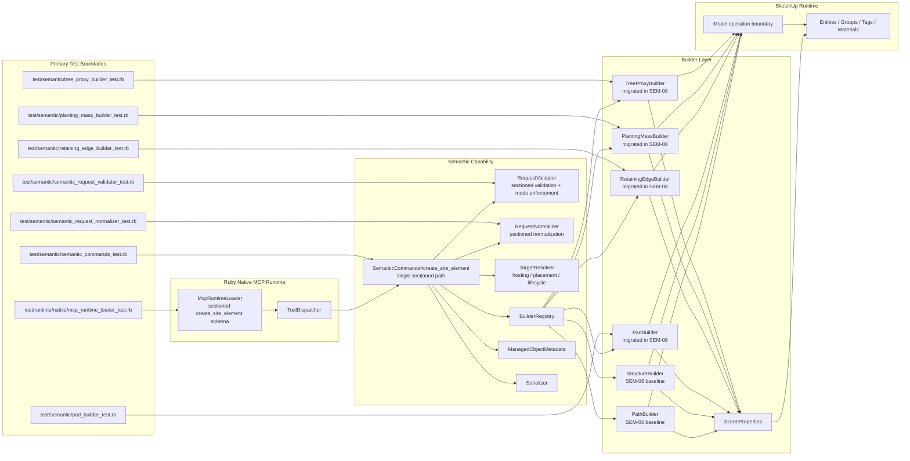

# Technical Plan: SEM-08 Adopt Builder-Native V2 Input for the Remaining First-Wave Families
**Task ID**: `SEM-08`
**Title**: `Adopt Builder-Native V2 Input for the Remaining First-Wave Families`
**Status**: `finalized`
**Date**: `2026-04-17`

## Source Task

- [Adopt Builder-Native V2 Input for the Remaining First-Wave Families](./task.md)

## Problem Summary

`SEM-06` establishes the public sectioned `create_site_element` baseline and migrates `path` plus `structure` to builder-native sectioned input, but the remaining first-wave families still sit behind narrow command-level translation:

- `pad`
- `retaining_edge`
- `planting_mass`
- `tree_proxy`

`SEM-08` completes that first-wave migration. It removes the remaining family-specific translation path, moves those families to builder-native sectioned input, and tightens the remaining-family `definition.mode` vocabulary so transitional names carried during `SEM-06` do not become accidental public commitments.

## Goals

- Migrate `pad`, `retaining_edge`, `planting_mass`, and `tree_proxy` to builder-native sectioned input.
- Define and enforce one explicit supported `definition.mode` vocabulary for those remaining families.
- Preserve family semantics, structured refusals, and scene-facing wrapper behavior under the sectioned contract.
- Remove the remaining command-level family translation path after `SEM-06`.

## Non-Goals

- Reopening the public sectioned-contract decision made by `SEM-06`
- Redesigning `path` or `structure` vocabulary already established by `SEM-06`
- Promoting richer exploratory pressure-matrix modes such as `leveled_plane`, `closed_polyline`, or `band_profile`
- Adding composition primitives, grouped semantic features, or later-wave semantic families
- Extending `set_entity_metadata` to mutate wrapper-facing scene properties

## Related Context

- [SEM-08 task](./task.md)
- [Semantic Scene Modeling HLD](specifications/hlds/hld-semantic-scene-modeling.md)
- [SEM-06 task](specifications/tasks/semantic-scene-modeling/SEM-06-adopt-builder-native-v2-input-for-path-and-structure/task.md)
- [SEM-06 technical plan](specifications/tasks/semantic-scene-modeling/SEM-06-adopt-builder-native-v2-input-for-path-and-structure/plan.md)
- [SEM-05 summary](specifications/tasks/semantic-scene-modeling/SEM-05-validate-v2-semantic-contract-via-ruby-normalizer-spike/summary.md)
- [SEM-02 technical plan](specifications/tasks/semantic-scene-modeling/SEM-02-complete-first-wave-semantic-creation-vocabulary/plan.md)
- [Semantic contract pressure-test signal](specifications/signals/2026-04-15-semantic-contract-v2-pressure-test-signal.md)
- [SEM-08 interim findings](tmp/sem-08-planning-interim-findings.md)

## Research Summary

- `SEM-05` already proved the Ruby sectioned seam for adopt, hosting-aware create, and replace-preserve-identity flows.
- The active `SEM-06` worktree cross-check shows the sectioned contract baseline, section-owned validation and normalization, and builder-native `path` / `structure` migration are now in place.
- The pressure-test signal is reliable for section-boundary reasoning and scenario pressure, but its mode columns remain exploratory and should not be copied directly into the production contract.
- Current `SEM-06` tests still show transitional remaining-family mode names such as `footprint_surface`, `wall_profile`, `boundary_mass`, and `proxy_tree`; those should be treated as bridge vocabulary, not stable public commitments.
- Full Ruby test coverage for the current `SEM-06` slice passed locally via `bundle exec rake ruby:test`; lint still reported cleanup-level RuboCop issues in the active worktree during the cross-check.

## Technical Decisions

### Data Model

- `create_site_element` remains one sectioned request surface with:
  - `elementType`
  - `metadata`
  - `sceneProperties`
  - `definition`
  - `hosting`
  - `placement`
  - `representation`
  - `lifecycle`
- Section ownership remains:
  - `metadata`: durable semantic identity and status
  - `sceneProperties`: wrapper-facing `name` and `tag`
  - `definition`: family geometry and family-specific semantic qualifiers
  - `hosting`: site-conformity intent
  - `placement`: parent and insertion context
  - `representation`: realization mode and material
  - `lifecycle`: create, adopt, and replace intent
- Supported remaining-family `definition.mode` vocabulary is explicitly:
  - `pad`: `polygon`
  - `retaining_edge`: `polyline`
  - `planting_mass`: `mass_polygon`
  - `tree_proxy`: `generated_proxy`
- `path` and `structure` vocabulary from `SEM-06` remains unchanged:
  - `path`: `centerline`
  - `structure`: `footprint_mass`
  - `structure`: `adopt_reference`
- Transitional remaining-family names carried during `SEM-06` are not preserved as supported vocabulary:
  - `footprint_surface`
  - `wall_profile`
  - `boundary_mass`
  - `proxy_tree`
- Family-specific `definition` fields are:
  - `pad`: `footprint`, optional `elevation`, optional `thickness`
  - `retaining_edge`: `polyline`, `height`, `thickness`, optional `elevation`
  - `planting_mass`: `boundary`, `averageHeight`, optional `plantingCategory`, optional `elevation`
  - `tree_proxy`: `position`, `canopyDiameterX`, optional `canopyDiameterY`, `height`, `trunkDiameter`, optional `speciesHint`
- If `tree_proxy.definition.canopyDiameterY` is omitted, normalization fills it from `canopyDiameterX` so downstream metadata and builder behavior share one explicit circular-canopy default.
- Public numeric geometry stays meter-valued at the contract boundary and is normalized to SketchUp internal units before builder execution.

### API and Interface Design

- Public tool name remains `create_site_element`.
- The public runtime schema remains sectioned-only after `SEM-06`; `SEM-08` does not reintroduce flat compatibility fields.
- `RequestValidator` is the authoritative enforcement point for remaining-family mode vocabulary and for transitional-mode refusals.
- `McpRuntimeLoader` keeps structural schema ownership. It does not need to encode per-family mode enums if that would overcomplicate the single `definition` object; validator tests and task-facing docs become the explicit supported-vocabulary source of truth.
- `SemanticCommands` keeps:
  - validation
  - normalization
  - target resolution
  - lifecycle routing
  - one-operation execution
  - metadata writes
  - serialization
- `SceneProperties` remains the shared seam for:
  - `sceneProperties.name`
  - `sceneProperties.tag`
  - `representation.material`
- After `SEM-08`, `SemanticCommands` no longer synthesizes legacy builder payloads for:
  - `pad`
  - `retaining_edge`
  - `planting_mass`
  - `tree_proxy`
- Builders for the four remaining families consume section-native input directly from:
  - `definition`
  - `sceneProperties`
  - `representation`
  - resolved `hosting` / `placement` / `lifecycle` sections where relevant
- Builders remain geometry-oriented execution seams. They may keep defensive invariants, but they are not a second semantic-validation authority after `RequestValidator`.

### Error Handling

- Unsupported remaining-family `definition.mode` values return structured `unsupported_option` refusals on `definition.mode`.
- Transitional bridge names from `SEM-06` are explicitly refused after `SEM-08`, not silently coerced.
- Existing family geometry and numeric validations are preserved and remapped to `definition.*` field paths.
- Existing `pad` and `retaining_edge` behavior where `hosting` and explicit `definition.elevation` both influence placement must remain explicit and regression-tested rather than being reinterpreted implicitly during migration.
- Missing required sections and fields continue to use `missing_required_field`.
- Missing or ambiguous hosting, placement, and lifecycle targets continue to use section-attributed refusals.
- Unknown `sceneProperties.tag` values remain accepted as open-ended scene-organization input.

### State Management

- Ruby remains the only owner of semantic interpretation and runtime state transitions.
- `ManagedObjectMetadata` remains separate from wrapper name, tag, and material.
- Persisted metadata continues to be derived from the original public request rather than normalized builder params when public-unit values must remain meter-valued.
- `set_entity_metadata` remains unchanged in scope.
- No runtime compatibility flag or dual-contract toggle is introduced.

### Integration Points

- `McpRuntimeLoader` remains the MCP schema boundary.
- `ToolDispatcher` remains a thin runtime call-through layer.
- `SemanticCommands` remains the orchestration seam joining validation, normalization, target resolution, lifecycle handling, builders, metadata, and serialization.
- `BuilderRegistry` continues to route by `elementType`; `SEM-08` changes what the remaining-family builders consume, not how they are discovered.
- `SceneProperties` is the shared wrapper helper reused across all migrated families.
- Real integration confidence depends on command-level tests for remaining families, not builder tests alone.

### Configuration

- No new runtime configuration is introduced.
- No rollout flag or partial-mode switch is introduced.
- `SEM-08` lands as part of the one public sectioned baseline established by `SEM-06`.

## Architecture Context

## Key Relationships

- `SEM-08` extends the `SEM-06` sectioned baseline; it does not define a second baseline.
- `RequestValidator` becomes the explicit remaining-family vocabulary gate, so transitional `SEM-06` names cannot silently ossify into public contract commitments.
- `SceneProperties` remains the shared wrapper seam across all migrated families.
- Builder-native migration for the remaining families is complete only when `SemanticCommands` no longer builds legacy payloads for them.
- Command-level tests are the critical integration boundary because they prove validation, normalization, target resolution, wrapper-field handling, metadata, and builder routing together.

## Acceptance Criteria

- `pad`, `retaining_edge`, `planting_mass`, and `tree_proxy` complete through `create_site_element` using builder-native sectioned input without command-level legacy payload translation.
- The supported remaining-family `definition.mode` vocabulary is explicit and stable:
  - `pad`: `polygon`
  - `retaining_edge`: `polyline`
  - `planting_mass`: `mass_polygon`
  - `tree_proxy`: `generated_proxy`
- Requests using transitional remaining-family mode names from in-flight `SEM-06` scaffolding return structured refusals rather than being accepted as public contract commitments.
- Existing family geometry and numeric refusal behavior remains intact after remapping to `definition.*`.
- `sceneProperties.name`, `sceneProperties.tag`, and `representation.material` survive the full command path for the remaining families.
- Hosting, placement, and lifecycle routing continue to work through the same section boundaries without new family-specific escape fields.
- `pad` remains clearly separated from `structure` semantics; `SEM-08` does not reintroduce ambiguity between surface-first pads and clearly built forms.
- Runtime schema tests, semantic tests, and task-facing docs all align on the final remaining-family vocabulary and builder-native posture.

## Test Strategy

### TDD Approach

Implement `SEM-08` one family concern at a time from the public semantic seam downward:

1. write or update validator tests for supported and unsupported remaining-family modes
2. write command tests for representative successful flows and refusal cases
3. update builders and shared wrapper handling to satisfy those tests
4. remove the remaining translation path only after the section-native builder path is proven

### Required Test Coverage

- Validator coverage:
  - supported remaining-family mode values
  - unsupported transitional names
  - retained geometry and numeric refusal cases on `definition.*`
- Normalizer coverage:
  - meter-to-internal conversion for the four remaining families under `definition.*`
- Command coverage:
  - representative create flow for each remaining family
  - wrapper-field survival through `sceneProperties` / `representation`
  - refusal behavior for unsupported remaining-family modes
  - explicit `hosting` versus `definition.elevation` precedence coverage for `pad` and `retaining_edge`
- Builder coverage:
  - direct section-native `definition` consumption for each remaining family
  - geometry invariants for existing family behavior
- Defaulting coverage:
  - `tree_proxy.definition.canopyDiameterY` omission normalizes to `canopyDiameterX` before builder execution
- Runtime loader coverage:
  - sectioned-only public contract remains intact after `SEM-08`
  - no docs or tests imply the retired transitional vocabulary is the public baseline
- Manual verification:
  - SketchUp-hosted smoke confirmation for representative `pad`, `retaining_edge`, `planting_mass`, and `tree_proxy` geometry

## Instrumentation and Operational Signals

- No new production runtime instrumentation is introduced by `SEM-08`.
- The operative correctness signals are:
  - `bundle exec rake ruby:test`
  - `bundle exec rake ruby:lint`
  - command-level remaining-family scenario coverage
  - runtime loader schema coverage
  - manual SketchUp smoke confirmation for representative geometry-heavy cases

## Implementation Phases

1. Lock the remaining-family vocabulary and refusal behavior.
   - Add validator and command tests for supported modes and explicit refusal of transitional names.
2. Migrate remaining-family builders to section-native input.
   - Update `PadBuilder`, `RetainingEdgeBuilder`, `PlantingMassBuilder`, and `TreeProxyBuilder` plus shared wrapper handling.
3. Remove the remaining translation bridge from `SemanticCommands`.
   - Delete legacy payload construction for the four remaining families and prove command-level green paths.
4. Align docs, task artifacts, and final verification.
   - Update task-facing docs and record remaining SketchUp-hosted gaps if any remain.

## Rollout Approach

- `SEM-08` is gated on merged and stable `SEM-06`.
- No feature flag or compatibility mode is introduced.
- Land `SEM-08` only when the remaining-family translation path is actually gone and the full Ruby suite is green.
- If `SEM-06` changes the shared section seam materially before merge, pause and realign the remaining-family migration rather than embedding a second interpretation into `SEM-08`.

## Risks and Controls

- `SEM-06` baseline drift: re-check merged loader, validator, normalizer, and `SemanticCommands` before starting code changes; stop if the shared seam changed materially.
- Transitional mode names leak into the public contract: add explicit refusal tests for `footprint_surface`, `wall_profile`, `boundary_mass`, and `proxy_tree`.
- Builder migration leaves wrapper behavior behind: require command-level assertions for `sceneProperties.name`, `sceneProperties.tag`, and `representation.material` on remaining families.
- Hard migration is only partial and leaves translation debt in `SemanticCommands`: add tests that inspect builder-facing params and remove remaining-family legacy payload construction in the same task.
- Pressure-matrix scope bleed widens the task: explicitly refuse richer undeclared modes and record them as deferred follow-on work instead of implementing them ad hoc.

## Dependencies

- `SEM-05`
- `SEM-06`
- [Semantic Scene Modeling HLD](specifications/hlds/hld-semantic-scene-modeling.md)
- [Semantic contract pressure-test signal](specifications/signals/2026-04-15-semantic-contract-v2-pressure-test-signal.md)
- Current builder implementations under `src/su_mcp/semantic/`
- SketchUp-hosted manual verification for final geometry confidence

## Premortem

### Intended Goal Under Test

Ship a complete first-wave builder-native migration under one sectioned `create_site_element` baseline, where the remaining families no longer depend on command-level translation and where their explicit supported vocabulary is clear enough that `SEM-06` transitional names do not become accidental public contract commitments.

### Failure Paths and Mitigations

- **Base assumptions that could lead us astray**
  - Business-plan mismatch: the task needs explicit stable remaining-family vocabulary, but the plan could accidentally inherit whatever transitional names `SEM-06` happened to use while bridging non-migrated families.
  - Root-cause failure path: we assume active fixture names are already contract truth.
  - Why this misses the goal: the public sectioned baseline stays semantically ambiguous even after migration.
  - Likely cognitive bias: status quo bias toward currently visible test fixtures.
  - Classification: `can be validated before implementation`
  - Mitigation now: explicitly define the supported remaining-family vocabulary in this plan and refuse transitional names after migration.
  - Required validation: validator and command tests asserting `unsupported_option` on retired transitional names.

- **Shortcuts that could weaken the outcome**
  - Business-plan mismatch: the task needs to remove remaining-family translation debt, but implementation could keep a “temporary” legacy payload bridge in `SemanticCommands`.
  - Root-cause failure path: translation survives because removing it feels riskier than leaving one more adapter.
  - Why this misses the goal: `SEM-08` would ship without actually completing the builder-native migration.
  - Likely cognitive bias: loss aversion toward deleting working compatibility code.
  - Classification: `can be validated before implementation`
  - Mitigation now: make removal of the remaining-family bridge in-scope and phase it after section-native builder tests are green.
  - Required validation: command tests and code review showing no remaining-family legacy payload construction remains in `SemanticCommands`.

- **Areas that could be weakly implemented**
  - Business-plan mismatch: the task needs the full section posture to survive for remaining families, but implementation could migrate only geometry while dropping wrapper-field support.
  - Root-cause failure path: `sceneProperties` and `representation.material` are assumed to “just work” because the shared helper exists.
  - Why this misses the goal: the remaining families would still behave as second-class citizens under the sectioned contract.
  - Likely cognitive bias: overgeneralization from `path` / `structure` support.
  - Classification: `can be validated before implementation`
  - Mitigation now: require representative command-level assertions for wrapper fields on the remaining families.
  - Required validation: command tests for each remaining family or representative families proving `name`, `tag`, and `material` survive the full path.

- **Tests and evaluations needed to stay on track**
  - Business-plan mismatch: the business goal is one coherent migrated contract, but the test plan could rely too heavily on builder tests and miss seam-level failures.
  - Root-cause failure path: builder tests pass while validator, command routing, metadata, or wrapper behavior still diverge at the public seam.
  - Why this misses the goal: the migration looks complete locally but is incomplete where users actually interact with it.
  - Likely cognitive bias: substitution bias where easy local tests replace end-to-end semantic coverage.
  - Classification: `can be validated before implementation`
  - Mitigation now: sequence validator tests and command tests ahead of builder migration work.
  - Required validation: command-level create and refusal scenarios for all four remaining families plus full Ruby suite execution.

- **What must be true for the task to succeed**
  - Business-plan mismatch: the task needs a stable `SEM-06` baseline, but the implementation plan could proceed against a moving shared seam.
  - Root-cause failure path: merged `SEM-06` differs materially from the worktree cross-check assumptions.
  - Why this misses the goal: `SEM-08` could encode a second interpretation of section ownership or vocabulary handling.
  - Likely cognitive bias: planning fallacy about upstream stability.
  - Classification: `can be validated before implementation`
  - Mitigation now: make a fresh `SEM-06` seam audit the first implementation step before changing remaining-family code.
  - Required validation: compare merged `SEM-06` loader, validator, normalizer, and `SemanticCommands` against this plan before coding.

- **Second-order and third-order effects**
  - Business-plan mismatch: the task needs to finish the first-wave migration cleanly, but the plan could let exploratory richer modes from the pressure matrix leak into delivery scope.
  - Root-cause failure path: mode-rich follow-on ideas get implemented under deadline pressure because they seem adjacent.
  - Why this misses the goal: delivery slows, contract surface expands, and the task stops being migration-completion work.
  - Likely cognitive bias: scope creep masked as future-proofing.
  - Classification: `can be validated before implementation`
  - Mitigation now: explicitly defer richer modes and treat unsupported ones as structured refusals.
  - Required validation: acceptance criteria, docs, and validator tests all align on the narrowed mode set only.

## Quality Checks

- [x] All required inputs validated
- [x] Problem statement documented
- [x] Goals and non-goals documented
- [x] Research summary documented
- [x] Technical decisions included
- [x] Architecture context included
- [x] Acceptance criteria included
- [x] Test requirements specified
- [x] Instrumentation and operational signals defined when needed
- [x] Risks and dependencies documented
- [x] Rollout approach documented when needed
- [x] Small reversible phases defined
- [x] Premortem completed with falsifiable failure paths and mitigations

## Implementation Notes

- `RequestValidator` now enforces explicit `definition.mode` support for the remaining first-wave families and refuses the transitional bridge names from `SEM-06`.
- `RequestNormalizer` now fills `tree_proxy.definition.canopyDiameterY` from `canopyDiameterX` when it is omitted or `nil`.
- `PadBuilder`, `RetainingEdgeBuilder`, `PlantingMassBuilder`, and `TreeProxyBuilder` now consume section-native `definition` input directly while continuing to use shared `sceneProperties` and `representation` handling.
- `RequestValidator` now rejects non-finite `pad.definition.elevation` values with `invalid_numeric_value` rather than allowing them to reach normalization or builder execution.
- The migrated builders no longer keep the remaining-family legacy payload fallback branches; they now require section-native `definition` input.
- `SemanticCommands` no longer synthesizes legacy builder payloads for `pad`, `retaining_edge`, `planting_mass`, or `tree_proxy`.
- Task-facing tests now cover:
  - remaining-family supported versus transitional mode handling
  - tree canopy defaulting
  - section-native builder inputs for all four remaining families
  - command-level hosting/elevation and wrapper-field behavior for the migrated families

## Final Validation

- `bundle exec ruby -Itest test/semantic/semantic_request_validator_test.rb`
- `bundle exec ruby -Itest test/semantic/semantic_request_normalizer_test.rb`
- `bundle exec ruby -Itest test/semantic/pad_builder_test.rb`
- `bundle exec ruby -Itest test/semantic/retaining_edge_builder_test.rb`
- `bundle exec ruby -Itest test/semantic/planting_mass_builder_test.rb`
- `bundle exec ruby -Itest test/semantic/tree_proxy_builder_test.rb`
- `bundle exec ruby -Itest test/semantic/semantic_commands_test.rb`
- `bundle exec rake ruby:test`
- `bundle exec rake ruby:lint`
- `bundle exec rake package:verify`
