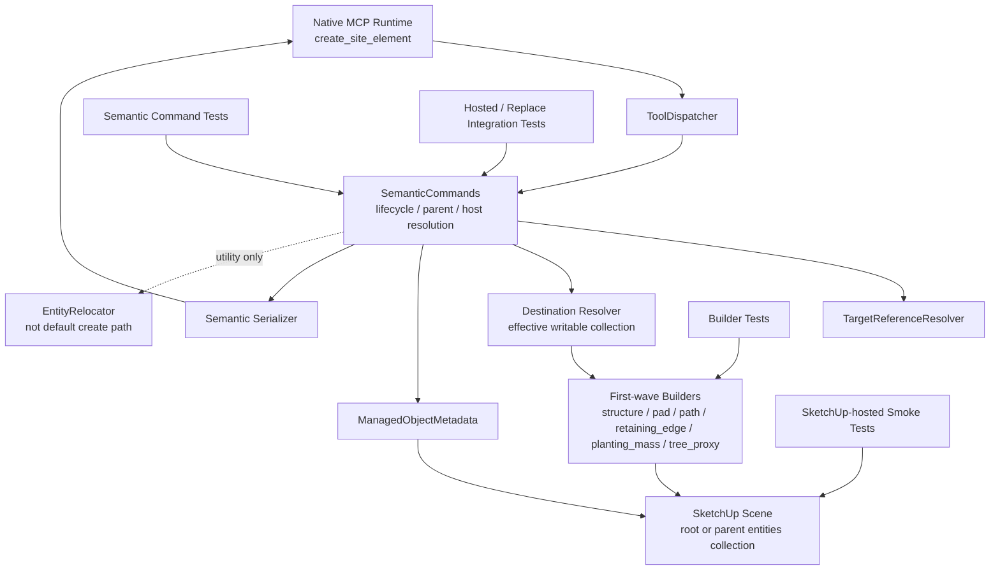

# Technical Plan: SEM-09 Realize Lifecycle Primitives Needed for Richer Built-Form Authoring
**Task ID**: `SEM-09`
**Title**: `Realize Lifecycle Primitives Needed for Richer Built-Form Authoring`
**Status**: `finalized`
**Date**: `2026-04-19`

## Source Task

- [Realize Lifecycle Primitives Needed for Richer Built-Form Authoring](./task.md)

## Problem Summary

The runtime already validates, normalizes, and resolves sectioned `hosting`, `placement`, and `lifecycle` inputs for `create_site_element`, but those semantics are still only partially real at scene-mutation time. First-wave builders still create under `model.active_entities`, and `replace_preserve_identity` currently preserves metadata without performing a true replacement handoff. `SEM-09` closes that gap only to the extent needed for the next richer built-form authoring slice: make parent-aware insertion real across first-wave builders, make `structure` replacement a true create-and-swap flow, and realize a very small hosted-execution matrix while refusing other validated-but-unsupported hosted combinations.

## Goals

- realize a shared destination-collection insertion seam so parent-aware placement is real for first-wave builders
- implement a true `replace_preserve_identity` scene handoff for `structure`
- support only a bounded hosted-execution matrix needed by the next built-form slice and refuse the rest explicitly
- preserve undo safety, managed-object identity invariants, and JSON-safe results throughout the delivered lifecycle flows

## Non-Goals

- terrain-authoring or grading behavior
- universal replacement support across all first-wave families
- broad hosting realization across every validated family and mode
- managed-object maintenance alignment for `transform_entities` or `set_material`
- duplication, governed deletion, or multipart composition policy

## Related Context

- [SEM-09 task](./task.md)
- [Semantic Scene Modeling HLD](specifications/hlds/hld-semantic-scene-modeling.md)
- [Semantic Scene Modeling PRD](specifications/prds/prd-semantic-scene-modeling.md)
- [SEM-05 summary](specifications/tasks/semantic-scene-modeling/SEM-05-validate-v2-semantic-contract-via-ruby-normalizer-spike/summary.md)
- [SEM-06 summary](specifications/tasks/semantic-scene-modeling/SEM-06-adopt-builder-native-v2-input-for-path-and-structure/summary.md)
- [SEM-07 summary](specifications/tasks/semantic-scene-modeling/SEM-07-add-minimal-composition-primitives/summary.md)
- [SEM-08 summary](specifications/tasks/semantic-scene-modeling/SEM-08-adopt-builder-native-v2-input-for-pad-and-retaining-edge/summary.md)
- [semantic_commands.rb](src/su_mcp/semantic/semantic_commands.rb)
- [entity_relocator.rb](src/su_mcp/semantic/entity_relocator.rb)
- [semantic_commands_test.rb](test/semantic/semantic_commands_test.rb)

## Research Summary

- `SEM-05` proved the sectioned lifecycle shape is viable through the Ruby seam for adoption, hosted path resolution, and replacement-under-hierarchy, but explicitly stopped short of full replacement semantics.
- `SEM-06` and `SEM-08` completed the public contract cutover and builder-native sectioned input for first-wave families, so `SEM-09` is a runtime-behavior task rather than a contract-migration task.
- `SEM-07` introduced `EntityRelocator`, which is useful as a hierarchy-maintenance utility but too heavy for the normal create path because it clones wrappers and nested contents.
- The current code confirms the main gap:
  - `SemanticCommands` resolves `resolved_parent` and `resolved_target`
  - builders still create directly under `model.active_entities`
  - `replace_preserve_identity` writes replacement metadata but does not erase the prior entity
- The existing tests mostly verify parameter threading and metadata handoff. They do not yet prove actual parented insertion, old-entity removal, or live hosted scene effects.

## Technical Decisions

### Data Model

- No public contract changes are introduced in `SEM-09`.
- Introduce an internal builder execution seam that carries an explicit writable destination collection or equivalent destination context derived by `SemanticCommands`.
- Treat the effective destination as one of:
  - model root `active_entities`
  - `Group#entities`
  - `ComponentInstance#definition.entities`
- Define the replacement fallback parent context as the lifecycle target's current immediate writable `Entities` collection:
  - the owning `Group#entities` when the target currently lives under a group
  - the owning `ComponentDefinition#entities` when the target currently lives in a component definition used by a `ComponentInstance`
  - `model.active_entities` when the target currently lives at model root
  - explicit `placement.parent` always overrides that fallback context
- Preserve current managed-object metadata ownership in `ManagedObjectMetadata`; `SEM-09` does not add new metadata fields.
- For `replace_preserve_identity`, preserve the previous object's `sourceElementId` and existing managed invariants on the new entity and remove the old entity inside the same operation.

### API and Interface Design

- Keep `create_site_element` as the only public semantic entrypoint.
- Extend the internal builder call contract so builders can create into an explicit destination instead of inferring insertion from `model.active_entities`.
- Introduce a small internal `DestinationResolver`-style helper or equivalent private semantic seam to keep destination and writable-collection logic out of the geometry builders and to avoid over-concentrating placement logic inside one growing `SemanticCommands` method cluster.
- Keep `SemanticCommands#create_site_element` responsible for:
  - resolving lifecycle, parent, and host targets
  - choosing the effective destination collection
  - routing the bounded hosted-execution matrix
  - coordinating replacement handoff for `structure`
- Keep builder public family inputs unchanged; only internal execution parameters expand.
- Keep `EntityRelocator` out of the normal create and replace execution paths for `SEM-09`.

### Error Handling

- Preserve the existing section-scoped refusal posture:
  - `hosting`
  - `placement`
  - `lifecycle`
- Validate destination writability and replacement target editability before any builder mutation begins.
- Add explicit execution-time refusals for:
  - unsupported parent destination types
  - resolved parent contexts that do not expose a writable destination collection
  - validated-but-unsupported hosted family/mode combinations
  - replacement targets that are not editable or cannot be safely swapped in the current SketchUp context
  - replacement targets that cannot be swapped safely under the delivered `structure`-only replacement posture
- Keep unsupported hosted combinations as structured refusals rather than silent unhosted fallback behavior.
- Preserve one-operation rollback semantics on create, replace, and hosted execution failures.

### State Management

- The SketchUp scene remains the source of truth.
- `SemanticCommands` owns transient resolution state for one request only:
  - resolved parent
  - resolved hosting target
  - resolved lifecycle target
  - effective destination collection
- Builders remain stateless and geometry-focused once given a destination.
- Hosted execution in `SEM-09` composes with parent-aware placement by applying the delivered hosted behavior only inside the resolved effective destination context chosen before builder execution starts.
- Hosted execution must not silently override placement. If a hosted family/mode combination would require moving the result outside the resolved destination, changing the resolved parent ownership, or performing a second insertion strategy, the command must return a structured `hosting` refusal instead of falling back.
- Replacement state transitions for delivered `structure` replacement are:
  - old managed structure resolved
  - replacement structure built in effective destination
  - replacement metadata written with preserved identity
  - old structure erased
  - new structure serialized and returned

### Integration Points

- [RuntimeCommandFactory](src/su_mcp/runtime/runtime_command_factory.rb) and [ToolDispatcher](src/su_mcp/runtime/tool_dispatcher.rb) remain unchanged structurally; they continue to route `create_site_element` to `SemanticCommands`.
- [SemanticCommands](src/su_mcp/semantic/semantic_commands.rb) is the main coordination seam for:
  - destination resolution
  - hosted-execution routing
  - replacement swap behavior
- A dedicated destination-resolution helper seam should absorb the writable-collection and fallback-parent rules so `SemanticCommands` remains the lifecycle coordinator rather than becoming a monolithic container for every placement rule.
- First-wave builders under `src/su_mcp/semantic/` must adopt the destination seam even though replacement support remains bounded to `structure`.
- [Serializer](src/su_mcp/semantic/serializer.rb) remains the success-output seam and should not require contract changes.
- `EntityRelocator` remains a reusable hierarchy-maintenance seam for `SEM-07` behavior but is not used as the default insertion mechanism in this task.

### Configuration

- No new runtime configuration or feature flags are introduced.
- The hosted-execution support matrix is hard-coded behavior for this task and documented in the implementation plan:
  - `path` + `surface_drape`
  - `pad` + `surface_snap`
  - `retaining_edge` + `edge_clamp`
- All other hosted combinations are explicitly refused during execution in `SEM-09`.

## Architecture Context

## Key Relationships

- `SemanticCommands` remains the owning lifecycle seam and now must choose the effective destination collection instead of leaving insertion entirely implicit.
- Destination and fallback-parent rules should live in a dedicated helper seam so `SemanticCommands` coordinates lifecycle behavior without accumulating every placement edge case inline.
- Builders remain the geometry owners, but they stop deciding the parent collection themselves.
- `ManagedObjectMetadata` continues to own identity persistence and replacement metadata handoff.
- `EntityRelocator` is intentionally not part of the normal `SEM-09` create or replace path because clone-and-erase relocation is too heavy for the minimum lifecycle slice.
- Builder tests alone are insufficient; command-level integration and SketchUp-hosted smoke validation are both required to prove parented insertion and replacement scene behavior.

## Acceptance Criteria

- A parented `create_site_element` request inserts the created first-wave managed object under the resolved supported parent context rather than always under model root.
- The effective destination collection supports:
  - model root
  - `Sketchup::Group`
  - `Sketchup::ComponentInstance`
  and unsupported or non-writable parent contexts return a structured placement refusal.
- `replace_preserve_identity` performs a true replacement for `structure`: the new managed object preserves required business identity and the old entity is erased inside the same operation.
- When `placement.parent` is omitted during `structure` replacement, the runtime defaults to the current parent context of the replacement target; when explicit parent is supplied, it overrides that context.
- Hosted execution is delivered only for the bounded support matrix:
  - `path` + `surface_drape`
  - `pad` + `surface_snap`
  - `retaining_edge` + `edge_clamp`
  and other hosted combinations, or hosted requests that conflict with the resolved destination context, return structured section-scoped refusals.
- Successful lifecycle-enabled create and replace flows remain JSON-serializable and continue to expose managed-object identity, presentation fields, and bounds through the existing serializer posture.
- Failure in any delivered lifecycle-enabled flow aborts the SketchUp operation and does not leave partial replacement or partially moved scene state behind.

## Test Strategy

### TDD Approach

- Start with failing command-level tests that assert real scene-state outcomes rather than captured parameter threading.
- Add builder-level tests only to drive the destination seam and avoid regressions in insertion behavior.
- Add focused integration tests for replacement and hosted behavior once the destination seam exists.
- Keep the implementation sequence reversible:
  1. destination seam
  2. parented create
  3. `structure` replacement
  4. bounded hosted execution
  5. SketchUp-hosted smoke checks

### Required Test Coverage

- Builder tests proving each first-wave builder can create into a supplied destination collection.
- Semantic command tests proving parent-aware insertion lands under the resolved parent for delivered families.
- Semantic command tests proving `structure` replacement erases the old entity, preserves managed identity, and honors explicit-vs-fallback parent rules.
- Semantic command tests proving destination resolution refuses non-writable parent contexts before any builder mutation runs.
- Semantic command tests proving replacement refuses or rolls back cleanly when the target cannot be safely edited or erased.
- Refusal tests for unsupported parent destinations and unsupported hosted combinations.
- Integration-oriented semantic command tests for the bounded hosting matrix:
  - `path` + `surface_drape`
  - `pad` + `surface_snap`
  - `retaining_edge` + `edge_clamp`
- Integration-oriented tests proving hosted execution never overrides the resolved destination context and instead refuses conflicting combinations.
- Regression coverage that successful create and replace flows remain one-operation mutations with rollback on failure.
- Compound failure tests that simulate mid-operation errors during replacement or hosted execution and assert no partial replacement, duplicate managed object, or partial destination insertion remains.
- Test-support enhancements that make entity parentage, erase behavior, and post-operation existence directly assertable instead of relying only on captured builder params.
- SketchUp-hosted smoke validation for:
  - parented create under a real supported parent
  - `structure` replace-preserve-identity
  - one successful hosted execution from the delivered matrix
  - at least one larger-scene or host-stress variant for the delivered hosted matrix to detect SketchUp-host-only behavior drift

## Instrumentation and Operational Signals

- No new runtime telemetry is required for this bounded task.
- Required operational evidence is test and smoke-validation based:
  - command tests proving actual parent collection insertion
  - replacement tests proving old-entity removal
  - SketchUp-hosted smoke notes recording success or gaps for parented create, replacement, and one hosted matrix case

## Implementation Phases

1. **Destination seam**
   - introduce internal destination-collection resolution in `SemanticCommands`
   - extract writable destination and fallback-parent logic into a dedicated helper seam if `SemanticCommands` begins to bloat during implementation
   - update first-wave builders to create into an explicit destination collection
   - add failing and then passing builder/command tests for parent-aware insertion
   - treat phase completion as blocked until writable-destination validation and first-wave builder adoption are both green
2. **Parent-aware create**
   - wire `placement.mode: parented` through the destination seam
   - support root, `Group`, and `ComponentInstance` destinations
   - add explicit placement refusals for unsupported destinations
3. **Structure replacement**
   - implement `replace_preserve_identity` as create-and-erase swap for `structure`
   - support explicit parent override and fallback to target's current parent context
   - add replacement regression coverage for old-entity removal and preserved identity
4. **Bounded hosted execution**
   - implement execution behavior for the delivered hosting matrix
   - add explicit refusals for other validated hosted combinations
   - extend command tests with hosted success and refusal cases
5. **Live validation and cleanup**
   - run full Ruby tests, lint, and package verification
   - perform SketchUp-hosted smoke checks
   - document any remaining host-only gaps in task artifacts if they remain

### Phase Contingencies

- If the universal destination seam exposes builder-specific regressions, isolate those regressions with targeted builder fixes before advancing to replacement work rather than partially bypassing the seam for some families.
- Do not proceed to replacement or hosted execution work while any first-wave builder still falls back to implicit `model.active_entities` insertion.
- If one hosted matrix combination proves unstable in the live SketchUp host, keep the destination seam and replacement work intact and narrow the shipped hosted matrix to the verified combinations rather than silently preserving nominal support.
- If editability or erase constraints on replacement targets prove harder than expected, keep replacement support bounded to `structure` and ship explicit lifecycle refusals instead of widening compensating behavior into relocation or generic maintenance logic.

## Rollout Approach

- Ship `SEM-09` as one coherent lifecycle-enablement slice rather than partially enabling placement or replacement independently.
- Land the destination seam first behind tests so parent-aware create behavior can be proven before replacement work starts.
- Keep hosted execution bounded and explicit in the same change set rather than widening support opportunistically.
- Treat the universal destination seam as a hard prerequisite for the rest of the task, but allow targeted builder stabilization inside that phase before moving on instead of forcing a strictly linear pass/fail rollout.
- If live SketchUp smoke validation reveals host-only issues in one hosted mode, preserve the bounded matrix in code only for the combinations that are actually verified, rather than silently keeping broader nominal support.

## Risks and Controls

- **Universal destination seam touches all first-wave builders**: implement the seam first with builder-focused tests before changing replacement behavior.
- **Replacement may leave duplicate semantic objects if old-entity removal is missed**: require explicit tests that assert old entity removal and same-operation rollback.
- **Replacement may fail in edit contexts or on uneditable targets**: validate editability up front, refuse unsupported swap contexts structurally, and add tests that simulate erase or editability failures.
- **Hosted behavior may silently degrade into param-threading-only execution**: require execution-time success/refusal tests tied to the bounded matrix, not just captured params.
- **Hosted behavior may conflict with parent-aware destination rules**: treat hosting as subordinate to the resolved effective destination and refuse combinations that would require destination override.
- **Parent fallback on replacement may behave differently for root vs nested parents**: add explicit tests for both explicit-parent override and inherited-parent fallback.
- **Destination logic may bloat `SemanticCommands` into a hotspot**: extract or retain a dedicated destination-resolution helper seam once fallback and writability logic become non-trivial.
- **Existing test doubles may be too command-layer-oriented to prove scene behavior**: extend semantic test support so parent collection and erase behavior can be asserted directly.

## Dependencies

- `SEM-08`
- `PLAT-15`
- Existing targeting resolution in `TargetReferenceResolver`
- Existing semantic metadata ownership in `ManagedObjectMetadata`
- Existing semantic serialization in `Serializer`

## Premortem

### Intended Goal Under Test

Make the minimum lifecycle primitives materially real so the next richer built-form authoring slice builds on trustworthy parent-aware placement, real `structure` replacement, and explicit hosted behavior instead of command-layer placeholder semantics.

### Failure Paths and Mitigations

- **Base assumptions that could lead us astray**
  - Business-plan mismatch: the business needs scene-mutation semantics to become real, but the plan could still optimize for internal cleanliness over visible parent/replace behavior.
  - Root-cause failure path: the shared destination seam lands, yet builders or commands still leave some create paths on `model.active_entities`.
  - Why this misses the goal: `SEM-10` would still build on inconsistent parent semantics, so richer built-form authoring would inherit hidden placement bugs.
  - Likely cognitive bias: abstraction bias; preferring a neat seam over proving every delivered path uses it.
  - Classification: Validate before implementation
  - Mitigation now: require universal first-wave builder adoption of the destination seam in this task.
  - Required validation: builder-level and command-level tests that assert actual parent collection outcomes for delivered create paths.
- **Shortcuts that could weaken the outcome**
  - Business-plan mismatch: the task needs a true replacement flow, but the implementation could preserve metadata while leaving the old object in place.
  - Root-cause failure path: replacement is treated as metadata handoff plus new creation, not a swap.
  - Why this misses the goal: the repo would still produce duplicate semantic objects and violate revision-safe expectations.
  - Likely cognitive bias: sunk-cost bias toward the current partial implementation because it already passes command-layer tests.
  - Classification: Validate before implementation
  - Mitigation now: define `structure` replacement as create-and-erase swap inside one operation and keep it bounded to `structure`.
  - Required validation: tests that assert old-entity removal, preserved `sourceElementId`, and rollback on failure.
- **Areas that could be weakly implemented**
  - Business-plan mismatch: the task needs a bounded hosted-behavior slice, but the implementation could keep hosting broad in validation and weak in execution.
  - Root-cause failure path: validated-but-unsupported hosted combinations still appear nominally supported because execution silently ignores the host target.
  - Why this misses the goal: callers would continue to build on false hosting assumptions, causing rework in `SEM-10`.
  - Likely cognitive bias: optimism bias; assuming resolved targets imply real behavior.
  - Classification: Validate before implementation
  - Mitigation now: hard-code the delivered hosting matrix in the plan and require structured refusals outside it.
  - Required validation: explicit hosted success/refusal tests by family and mode.
- **Tests and evaluations needed to stay on track**
  - Business-plan mismatch: the business needs real scene behavior, but the current test suite mostly checks params and metadata.
  - Root-cause failure path: implementation passes updated command tests that still do not assert actual parent or replacement outcomes.
  - Why this misses the goal: false confidence would let placeholder lifecycle behavior ship again.
  - Likely cognitive bias: measurement substitution; taking param-threading assertions as proof of scene-state behavior.
  - Classification: Validate before implementation
  - Mitigation now: make scene-state assertions mandatory in the TDD path and extend test support where necessary.
  - Required validation: tests asserting actual destination collection, erase behavior, and bounded hosted execution effects.
- **SketchUp host behavior could still diverge from Ruby seam expectations**
  - Business-plan mismatch: the plan needs real lifecycle behavior in the SketchUp host, but it could still optimize for non-hosted Ruby confidence only.
  - Root-cause failure path: hosted execution and replacement pass fixture tests but fail or drift in larger real SketchUp scenes.
  - Why this misses the goal: `SEM-10` would still build on lifecycle behavior that is only locally convincing, not host-proven.
  - Likely cognitive bias: overconfidence in fixture realism.
  - Classification: Requires implementation-time instrumentation or acceptance testing
  - Mitigation now: require live SketchUp smoke coverage to include at least one larger-scene or host-stress hosted case in addition to the baseline checks.
  - Required validation: host-side smoke notes covering parented create, replacement, and a hosted matrix case under more realistic scene conditions.
- **What must be true for the task to succeed**
  - Business-plan mismatch: the goal is to unblock richer built-form authoring, but the task could sprawl into maintenance or terrain concerns.
  - Root-cause failure path: hosting or replacement support broadens beyond the bounded slice and consumes the task budget without finishing the core lifecycle primitives.
  - Why this misses the goal: the task would underdeliver the exact enabling behavior it was created to provide.
  - Likely cognitive bias: scope creep through completeness bias.
  - Classification: Validate before implementation
  - Mitigation now: keep replacement support `structure`-only and keep hosting to the explicit three-combination matrix.
  - Required validation: planning review and implementation review against the declared non-goals and acceptance criteria.
- **Second-order and third-order effects**
  - Business-plan mismatch: the business wants a stable base for richer built-form authoring, but the plan could introduce a second insertion strategy that future tasks must reconcile.
  - Root-cause failure path: `EntityRelocator` gets reused in the normal create or replace path because it seems convenient during implementation.
  - Why this misses the goal: future authoring and maintenance tasks would have to maintain both direct insertion and clone-and-relocate behavior with divergent semantics.
  - Likely cognitive bias: local optimization; reusing an available utility despite architectural mismatch.
  - Classification: Requires implementation-time instrumentation or acceptance testing
  - Mitigation now: explicitly forbid `EntityRelocator` as the normal create/replace mechanism in this task and keep it documented as a separate utility seam.
  - Required validation: implementation review plus command tests showing direct insertion and direct replacement behavior rather than relocation cloning.

## Implementation Outcome

- Delivered a dedicated `DestinationResolver` seam to keep writable-destination and replacement-fallback logic out of the builders.
- Updated all first-wave builders to accept an explicit internal `destination:` collection while preserving the public semantic contract.
- Realized parent-aware create for supported `Group` and `ComponentInstance` destinations.
- Implemented `structure` replacement as create-and-erase swap with:
  - explicit parent override
  - fallback to the lifecycle target's current writable collection
  - cleanup on erase failure before operation abort
- Bounded hosted execution to:
  - `path` + `surface_drape`
  - `pad` + `surface_snap`
  - `retaining_edge` + `edge_clamp`
  and refuse unsupported hosted combinations structurally.
- Relaxed replace validation so `placement.mode: "parented"` can omit `placement.parent` and use replacement fallback context.
- Added command and builder coverage for:
  - injected destination collections
  - parented create under groups and component instances
  - non-writable parent refusal
  - explicit and fallback replacement parent behavior
  - locked-target refusal
  - replacement cleanup on erase failure
  - bounded hosting success and refusal
- Final validation and remaining manual verification are recorded in [summary.md](./summary.md).

## Quality Checks

- [x] All required inputs validated
- [x] Problem statement documented
- [x] Goals and non-goals documented
- [x] Research summary documented
- [x] Technical decisions included
- [x] Architecture context included
- [x] Acceptance criteria included
- [x] Test requirements specified
- [x] Instrumentation and operational signals defined when needed
- [x] Risks and dependencies documented
- [x] Rollout approach documented when needed
- [x] Small reversible phases defined
- [x] Premortem completed with falsifiable failure paths and mitigations
