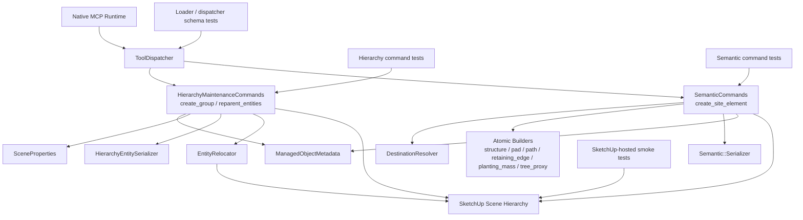

# Technical Plan: SEM-10 Add Richer Built-Form and Composed Feature Authoring
**Task ID**: `SEM-10`
**Title**: `Add Richer Built-Form and Composed Feature Authoring`
**Status**: `finalized`
**Date**: `2026-04-19`

## Source Task

- [Add Richer Built-Form and Composed Feature Authoring](./task.md)

## Problem Summary

The semantic runtime now supports atomic managed-object creation, parent-aware placement, bounded hosting, identity-preserving replacement for supported cases, and narrow hierarchy maintenance. What it still lacks is a first-class workflow for richer built-form authoring that spans more than one managed object without forcing clients back into primitive construction, ad hoc grouping, or `eval_ruby`. `SEM-10` must add that richer authoring slice while preserving the HLD rule that `create_site_element` stays atomic and terrain authoring stays out of scope.

## Goals

- add a documented richer built-form workflow that can produce managed composed features without redefining `create_site_element`
- preserve the atomic-versus-composite boundary by keeping child element creation on `create_site_element`
- make composed built-form results revision-friendly by giving the composition a managed container and keeping child managed identities intact
- reuse the existing targeting, placement, serializer, and hierarchy-maintenance posture instead of inventing a parallel subsystem
- keep the public surface narrow enough that the change is additive rather than a new broad composition platform

## Non-Goals

- terrain, grading, or terrain-patch authoring
- inline multipart child creation inside `create_site_element`
- a broad scene-orchestration or unrestricted hierarchy-control API
- full managed-object maintenance alignment for generic mutation tools
- next-wave semantic-family promotion such as `seat`, `water_feature_proxy`, or `tree_instance`

## Related Context

- [SEM-10 task](./task.md)
- [Semantic Scene Modeling HLD](specifications/hlds/hld-semantic-scene-modeling.md)
- [Semantic Scene Modeling PRD](specifications/prds/prd-semantic-scene-modeling.md)
- [Domain Analysis](specifications/domain-analysis.md)
- [SEM-07 summary](specifications/tasks/semantic-scene-modeling/SEM-07-add-minimal-composition-primitives/summary.md)
- [SEM-09 task](specifications/tasks/semantic-scene-modeling/SEM-09-realize-lifecycle-primitives-needed-for-richer-built-form-authoring/task.md)
- [SEM-09 plan](specifications/tasks/semantic-scene-modeling/SEM-09-realize-lifecycle-primitives-needed-for-richer-built-form-authoring/plan.md)
- [semantic_commands.rb](src/su_mcp/semantic/semantic_commands.rb)
- [hierarchy_maintenance_commands.rb](src/su_mcp/semantic/hierarchy_maintenance_commands.rb)
- [managed_object_metadata.rb](src/su_mcp/semantic/managed_object_metadata.rb)
- [serializer.rb](src/su_mcp/semantic/serializer.rb)
- [scene_properties.rb](src/su_mcp/semantic/scene_properties.rb)
- [mcp_runtime_loader.rb](src/su_mcp/runtime/native/mcp_runtime_loader.rb)

## Research Summary

- Search terms used for grounding: `SEM-10`, `create_group`, `reparent_entities`, `create_site_element`, `replace_preserve_identity`, `grouped feature`, `composition`, `attached feature`, `house extension`.
- Implemented baseline, not inferred from plans:
  - `SEM-07` is completed and shipped `create_group` plus `reparent_entities`.
  - `SEM-09` is completed and shipped parent-aware placement plus bounded lifecycle realization needed for richer authoring.
  - current code has no higher-level composed-feature command and no supported way to create a managed semantic container from `create_group`.
- Reusable implementation patterns already exist:
  - `ManagedObjectMetadata#write!` for managed identity persistence
  - `SceneProperties#apply!` for wrapper `name` and `tag`
  - `Semantic::Serializer` and `HierarchyEntitySerializer` for JSON-safe results
  - `DestinationResolver` plus `placement.parent` for child insertion under a chosen container
  - native MCP schema registration through `McpRuntimeLoader`, `ToolDispatcher`, and `RuntimeCommandFactory`
- Key gap confirmed by code:
  - `create_group` creates plain groups only
  - `set_entity_metadata` only mutates existing Managed Scene Objects
  - current public tools therefore cannot create a feature-level managed container in a supported way
- Related-work conclusion:
  - a large new orchestration command that creates child elements inline would duplicate `SemanticCommands` behavior and risk violating the atomic/composite boundary
  - a docs-only multi-call workflow is still incomplete because it lacks first-class managed container creation
  - the narrowest repo-aligned solution is to extend the hierarchy-maintenance surface so it can create a managed container, then use existing `create_site_element` and `reparent_entities` for child authoring and membership changes

## Technical Decisions

### Data Model

- Introduce a managed composition-container posture built on a normal SketchUp `Group`.
- The container remains a managed object by writing standard semantic metadata to the group:
  - `sourceElementId`
  - fixed `semanticType: "grouped_feature"`
  - `status`
  - `state: "Created"`
  - `schemaVersion: 1`
- Do not introduce a new child-membership registry. Membership truth remains the actual SketchUp hierarchy under the managed container group.
- Child elements remain ordinary managed semantic objects created through `create_site_element`; this task does not invent a second child metadata scheme.
- Do not add feature-specific subtype vocabularies in `SEM-10`. The fixed managed container semantic type is enough for this slice and avoids inventing unsupported product taxonomy.

### API and Interface Design

- Keep `create_site_element` unchanged as the only atomic semantic constructor.
- Extend `create_group` with optional semantic container authoring inputs:
  - `metadata` with required `sourceElementId` and `status` when managed-container mode is requested
  - `sceneProperties` with optional `name` and `tag`
- Do not expose arbitrary container `semanticType` input. Managed container mode always writes `semanticType: "grouped_feature"`.
- Keep `children` support on `create_group` so an initial managed container can group already-existing supported children in the same operation.
- Implement managed-container mode inside `HierarchyMaintenanceCommands#create_group` by:
  - creating the group first
  - writing managed metadata through `ManagedObjectMetadata#write!`
  - applying optional wrapper properties through `SceneProperties#apply!`
  - serializing the resulting group through the existing hierarchy serializer
- Use the documented richer workflow as:
  1. `create_group` in managed-container mode
  2. `create_site_element` with `placement.mode: "parented"` and `placement.parent` referencing the managed container for new children
  3. `reparent_entities` for adding existing supported children later
- Keep `reparent_entities` unchanged functionally except for test and documentation coverage of managed container use.
- Keep response shape additive and stable:
  - `create_group` continues to return `group` and optional `children`
  - the serialized `group` now includes managed metadata when managed-container mode is used

### Error Handling

- Preserve existing `create_group` refusals for invalid parent targets, unsupported child types, duplicate references, and cyclic reparent behavior.
- Add explicit refusals for managed-container mode when:
  - `metadata.sourceElementId` is missing
  - `metadata.status` is missing
  - unsupported metadata fields are supplied
- Keep the `create_group` MCP schema additive and exact:
  - `metadata` only allows `sourceElementId` and `status`
  - `sceneProperties` only allows `name` and `tag`
- Refuse attempts to create a managed container with raw geometry children; keep supported child types limited to groups and component instances.
- Keep child creation failures inside `create_site_element`; `SEM-10` does not absorb those errors into `create_group`.
- Keep one-operation rollback semantics for each individual command:
  - `create_group`
  - `create_site_element`
  - `reparent_entities`

### State Management

- The SketchUp model remains the source of truth for both the container and its child membership.
- Managed container state lives on the container group through the same `su_mcp` metadata dictionary used by other managed objects.
- Child placement state remains owned by the existing `create_site_element` placement and destination logic from `SEM-09`.
- Container lifecycle in this task is limited to creation plus later targeting and maintenance through existing tools; `SEM-10` does not add dedicated container replacement, duplication, or deletion policy.

### Integration Points

- [HierarchyMaintenanceCommands](src/su_mcp/semantic/hierarchy_maintenance_commands.rb) becomes the owning seam for managed container creation because `create_group` already owns group creation and grouping behavior.
- [ManagedObjectMetadata](src/su_mcp/semantic/managed_object_metadata.rb) is reused for container metadata writing; no parallel metadata writer is introduced.
- [SceneProperties](src/su_mcp/semantic/scene_properties.rb) should be reused so managed containers can set `name` and `tag` consistently with other semantic wrappers.
- [HierarchyEntitySerializer](src/su_mcp/semantic/hierarchy_entity_serializer.rb) remains the `create_group` output seam and should surface container metadata through its existing `serialize_target_match` behavior.
- [SemanticCommands](src/su_mcp/semantic/semantic_commands.rb) remains unchanged in ownership but gains stronger scenario coverage proving `placement.parent` works with managed containers created through `create_group`.
- [McpRuntimeLoader](src/su_mcp/runtime/native/mcp_runtime_loader.rb), [ToolDispatcher](src/su_mcp/runtime/tool_dispatcher.rb), and [RuntimeCommandFactory](src/su_mcp/runtime/runtime_command_factory.rb) require additive schema and dispatch coverage for the expanded `create_group` contract.

### Configuration

- No new runtime configuration, feature flags, or external lookup sources are required.
- The managed container semantic type is fixed behavior in code for this task rather than configurable vocabulary.

## Architecture Context

## Key Relationships

- `create_group` owns managed container creation because the container is a hierarchy concern first, not a new atomic semantic element.
- `create_site_element` remains the sole child-creation seam; children enter the container through existing parent-aware placement instead of inline orchestration.
- `reparent_entities` remains the path for adding existing supported entities into an already-managed container.
- The managed container uses the same metadata and wrapper-property rules as other managed objects, keeping serialization and targeting behavior consistent.
- Loader schema changes stay additive at the MCP boundary, so existing `create_group` callers are unaffected unless they opt into managed-container fields.

## Acceptance Criteria

- `create_group` can create a managed group container when `metadata.sourceElementId` and `metadata.status` are supplied, and the returned `group` result includes managed semantic identity fields.
- Managed containers can be created empty or with existing supported child groups or component instances in one undo-safe operation.
- New child semantic objects can be created directly under a managed container by calling `create_site_element` with `placement.parent` targeting that container.
- Existing supported entities can be added to a managed container through `reparent_entities` without rewriting child business identity.
- Managed containers and their child managed objects remain targetable through existing target-reference and metadata-query posture, including metadata selectors.
- Unsupported managed-container metadata or unsupported child entity types return structured refusals instead of silent fallback behavior.
- The richer built-form workflow remains built-form-only and does not widen `create_site_element` into multipart child creation or terrain behavior.
- README and guide examples document at least one representative richer workflow using managed container creation plus parented child creation.

## Test Strategy

### TDD Approach

- Start with failing hierarchy command tests for managed-container creation before changing runtime schemas or implementation.
- Add loader and dispatcher tests next so the additive `create_group` contract is locked before implementation.
- Add semantic command scenario tests that create child objects under managed containers after the hierarchy change is in place.
- Finish with guide and README example updates plus manual SketchUp smoke validation for hierarchy-heavy flows.

### Required Test Coverage

- `HierarchyMaintenanceCommandsTest` coverage for:
  - managed container creation with required metadata
  - managed container creation with `sceneProperties.name` and `sceneProperties.tag`
  - grouping existing children into a managed container
  - refusal for incomplete or unsupported managed metadata
- `McpRuntimeLoaderTest` and `tool_dispatcher_test` coverage for the additive `create_group` schema and dispatch path, including round-tripping `metadata` and `sceneProperties`.
- Serializer and scene-query coverage proving a managed container group is serialized and targetable like other managed objects, including `semanticType: "grouped_feature"`.
- `SemanticCommandsTest` scenario coverage proving `create_site_element` can create new managed children under a managed container created through `create_group`.
- `reparent_entities` coverage proving managed child identities survive movement into a managed container.
- End-to-end scenario coverage proving a managed container plus child workflow is queryable through the existing metadata selectors used by `find_entities` and `list_entities`.
- Contract-case updates for any changed native MCP request examples involving `create_group`.
- SketchUp-hosted smoke validation for:
  - create managed container at root
  - create managed container under an explicit parent
  - create a `structure` child under that container
  - create a `pad` child under that container
  - reparent an existing supported child into that container

## Instrumentation and Operational Signals

- No new telemetry system is needed for `SEM-10`.
- Required evidence is validation-oriented:
  - command tests proving managed container identity and child placement
  - updated guide examples demonstrating the intended workflow without `eval_ruby`
  - manual SketchUp smoke notes for hierarchy-heavy built-form authoring

## Implementation Phases

1. **Managed container support in `create_group`**
   - extend the public schema for optional `metadata` and `sceneProperties`
   - update `HierarchyMaintenanceCommands` to write managed metadata and apply wrapper properties when managed-container mode is requested
   - add command, loader, and serializer tests for the new behavior
2. **Richer built-form workflow coverage**
   - add semantic command tests proving parented child creation under managed containers
   - add reparent scenario coverage for existing supported children
   - verify the workflow preserves child identities and JSON-safe results
3. **Docs and validation**
   - update `README.md` and `sketchup_mcp_guide.md` with representative richer built-form workflows
   - run Ruby tests, lint, and package verification
   - record remaining SketchUp-hosted validation gaps if full live verification is not available

## Rollout Approach

- Ship the `create_group` enhancement as an additive contract change; existing callers that only use `parent` and `children` keep working unchanged.
- Keep the richer workflow documented as a composition sequence rather than marketing it as a new monolithic constructor.
- If future work proves the multi-call workflow still too weak, evaluate a follow-on dedicated managed-container helper or broader composition surface in a separate task rather than expanding `SEM-10` beyond its current boundary.

## Risks and Controls

- `create_group` could drift into a broad semantic-orchestration tool: keep the contract limited to optional managed metadata plus wrapper properties; no inline child creation, lifecycle, or hosting sections.
- Managed container semantics could invent unsupported taxonomy: fix the container `semanticType` to `grouped_feature` and avoid new subtype vocabularies in this task.
- Child placement under containers could regress if parent-resolution behavior is assumed rather than tested: add command-level scenario tests using real managed containers.
- The MCP boundary could reject the planned workflow if the `create_group` schema changes are incomplete: lock the exact additive schema in loader and contract tests before command implementation.
- Serialization and query behavior could diverge for managed containers: add explicit serializer and targeting coverage for container groups.
- Documentation could over-promise full feature assembly semantics: keep examples limited to the supported workflow and call out remaining maintenance follow-ons such as `SEM-11`.

## Dependencies

- `SEM-09` completed lifecycle and destination behavior
- [Semantic Scene Modeling HLD](specifications/hlds/hld-semantic-scene-modeling.md)
- [Semantic Scene Modeling PRD](specifications/prds/prd-semantic-scene-modeling.md)
- [Domain Analysis](specifications/domain-analysis.md)
- [HierarchyMaintenanceCommands](src/su_mcp/semantic/hierarchy_maintenance_commands.rb)
- [ManagedObjectMetadata](src/su_mcp/semantic/managed_object_metadata.rb)
- [SceneProperties](src/su_mcp/semantic/scene_properties.rb)
- [SemanticCommands](src/su_mcp/semantic/semantic_commands.rb)
- Ruby tests, RuboCop, and package verification
- SketchUp-hosted smoke validation for hierarchy-heavy workflows

## Quality Checks

- [x] All required inputs validated
- [x] Problem statement documented
- [x] Goals and non-goals documented
- [x] Research summary documented
- [x] Technical decisions included
- [x] Architecture context included
- [x] Acceptance criteria included
- [x] Test requirements specified
- [x] Instrumentation and operational signals defined when needed
- [x] Risks and dependencies documented
- [x] Rollout approach documented when needed
- [x] Small reversible phases defined
- [x] Premortem completed with falsifiable failure paths and mitigations

## Premortem

### Intended Goal Under Test

Enable richer built-form authoring through a supported semantic workflow that stays out of terrain scope, preserves the atomic/composite boundary, and produces revision-friendly managed results instead of ad hoc grouped geometry or fallback Ruby.

### Failure Paths and Mitigations

- **Base assumptions that could lead us astray**
  - Business-plan mismatch: the task needs richer authoring that stays semantic, but the plan would fail if it assumed plain groups are enough without first-class managed container identity.
  - Root-cause failure path: `create_group` is enhanced only cosmetically and never writes managed metadata to the container.
  - Why this misses the goal: the workflow would still create unlabeled containers that are weak targets for later revision and validation.
  - Likely cognitive bias: satisficing around existing primitives because they already group geometry.
  - Classification: Validate before implementation
  - Mitigation now: require managed-container mode to write `sourceElementId`, fixed `semanticType`, `status`, `state`, and `schemaVersion` through `ManagedObjectMetadata#write!`.
  - Required validation: hierarchy command tests asserting the returned container is a managed object with the expected serialized identity fields.
- **Shortcuts that could weaken the outcome**
  - Business-plan mismatch: the task needs a credible richer workflow, but a schema shortcut at the MCP boundary would make the documented contract unusable.
  - Root-cause failure path: `create_group` implementation changes land without matching `McpRuntimeLoader` schema updates for `metadata` and `sceneProperties`.
  - Why this misses the goal: callers would be blocked or forced into unsupported argument shapes even if the Ruby command code works locally.
  - Likely cognitive bias: assuming internal command changes automatically imply external contract readiness.
  - Classification: Validate before implementation
  - Mitigation now: lock the exact additive schema in the loader and schema tests before command implementation is considered complete.
  - Required validation: loader and dispatcher tests exercising managed-container request payloads end to end.
- **Areas that could be weakly implemented**
  - Business-plan mismatch: the task needs richer built-form composition, but the plan would underdeliver if parent-aware child insertion were only assumed, not proven with managed containers.
  - Root-cause failure path: `create_site_element` is never exercised against a container created through the new `create_group` path.
  - Why this misses the goal: the workflow could silently place children at model root or fail on container references, leaving the richer workflow broken in practice.
  - Likely cognitive bias: assuming `SEM-09` parent behavior covers every new container source automatically.
  - Classification: Requires implementation-time instrumentation or acceptance testing
  - Mitigation now: add command-level scenarios that first create a managed container and then create `structure` and `pad` children beneath it.
  - Required validation: semantic command tests plus SketchUp-hosted smoke validation for container-targeted child creation.
- **Tests and evaluations needed to stay on track**
  - Business-plan mismatch: the task needs revision-friendly semantic results, but the plan would miss if it never proves targeting and query behavior for the container after creation.
  - Root-cause failure path: the workflow is validated only by creation responses, not by downstream targeting through existing metadata selectors.
  - Why this misses the goal: created compositions may look valid at creation time but remain unusable for later lifecycle and maintenance flows.
  - Likely cognitive bias: success-path fixation on creation instead of downstream operability.
  - Classification: Validate before implementation
  - Mitigation now: require serializer and scene-query coverage showing managed containers are discoverable through existing metadata-based targeting.
  - Required validation: tests using `find_entities`/`list_entities`-style metadata selectors against the managed container and its children.
- **What must be true for the task to succeed**
  - Business-plan mismatch: the task needs a narrow additive change, but it would drift if `create_group` became a new orchestration surface with inline child creation or lifecycle sections.
  - Root-cause failure path: implementation expands the grouping command beyond managed-container metadata and wrapper properties.
  - Why this misses the goal: the task would erode the HLD boundary and increase rollback cost by introducing a second semantic constructor.
  - Likely cognitive bias: solution creep driven by convenience once the first schema expansion is in place.
  - Classification: Validate before implementation
  - Mitigation now: explicitly keep `create_group` limited to managed-container creation plus existing grouping behavior.
  - Required validation: schema review and refusal tests proving no inline child creation or arbitrary semantic-type inputs are accepted.
- **Second-order and third-order effects**
  - Business-plan mismatch: the task needs a workflow that remains trustworthy after shipment, but it will underperform if docs and examples imply more composition support than the runtime actually guarantees.
  - Root-cause failure path: README and guide examples advertise generic composed-feature authoring instead of the narrower managed-container workflow.
  - Why this misses the goal: clients would overreach into unsupported patterns, increasing fallback Ruby usage and support noise.
  - Likely cognitive bias: optimism bias in public examples and documentation.
  - Classification: Requires implementation-time instrumentation or acceptance testing
  - Mitigation now: keep documentation examples bounded to the supported sequence and call out remaining follow-on work such as `SEM-11`.
  - Required validation: documentation review against the implemented schema and smoke-tested example workflows.

## Implementation Outcome

- Status: shipped on `2026-04-19`
- Final delivered direction matched the approved plan:
  - `create_group` now supports optional managed-container creation through `metadata.sourceElementId`, `metadata.status`, and optional `sceneProperties`
  - managed-container mode writes fixed `semanticType: "grouped_feature"` and `state: "Created"`
  - multipart assembly remains a documented multi-call workflow using `create_group`, `create_site_element` with `placement.parent`, and `reparent_entities`
- Runtime ownership stayed inside the Ruby semantic and native-runtime layers:
  - [HierarchyMaintenanceCommands](../../../../src/su_mcp/semantic/hierarchy_maintenance_commands.rb)
  - [McpRuntimeLoader](../../../../src/su_mcp/runtime/native/mcp_runtime_loader.rb)
- Final validation completed:
  - `bundle exec rake ruby:test`
  - `RUBOCOP_CACHE_ROOT=/tmp/rubocop-cache bundle exec rake ruby:lint`
  - `bundle exec rake package:verify`
- External review completed with `grok-4.20`; no medium-or-higher issues were identified. Remaining risk is limited to live SketchUp-hosted smoke validation of the managed-container workflow.
