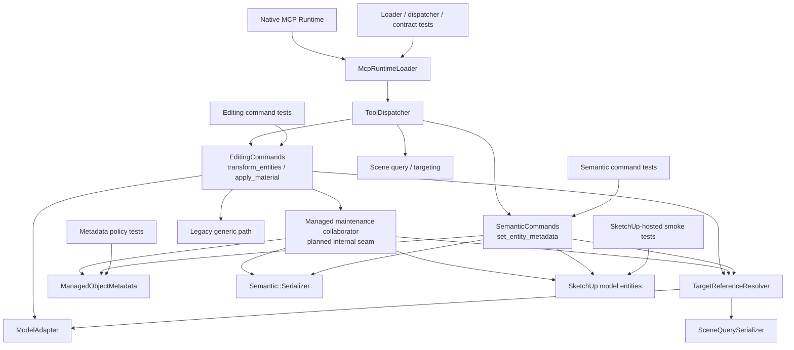

# Technical Plan: SEM-11 Align Managed-Object Maintenance Surface
**Task ID**: `SEM-11`
**Title**: `Align Managed-Object Maintenance Surface`
**Status**: `finalized`
**Date**: `2026-04-20`

## Source Task

- [Align Managed-Object Maintenance Surface](./task.md)

## Problem Summary

The semantic runtime now has a real create surface, bounded metadata mutation, hierarchy maintenance, and richer composed built-form authoring. What it still lacks is a coherent post-create maintenance posture for Managed Scene Objects. `set_entity_metadata` is already semantic-owned, compact-target-based, invariant-checked, and returns serialized managed objects, while `transform_entities` and `set_material` are still generic editing tools that accept raw `id` input and return primitive success payloads.

That split weakens revision workflows. `SEM-11` must align non-destructive managed-object maintenance without inventing a second mutation surface, weakening identity invariants, or expanding into duplication and deletion policy. The task should preserve current public tool names where practical, make managed-target behavior explicit, and keep managed results structured and JSON-safe.

## Goals

- align metadata mutation, transforms, and material updates under one explicit managed-object maintenance posture
- widen `set_entity_metadata` only for approved soft semantic fields that remain compatible with managed-object invariants
- make `transform_entities` and `set_material` managed-aware for managed targets while preserving backward compatibility for unmanaged callers
- reuse compact target-reference resolution and semantic serialization for managed maintenance outcomes
- keep the maintenance surface limited to non-destructive revision behavior and leave duplication and deletion policy to `SEM-12`

## Non-Goals

- duplication behavior or identity-derivation rules
- destructive deletion protections or governed erase policy
- terrain or grading maintenance behavior
- next-wave semantic-family promotion
- broad wrapper-property mutation through `set_entity_metadata`
- a new parallel public transform/material tool family for managed objects

## Related Context

- [SEM-11 task](./task.md)
- [Semantic Scene Modeling HLD](specifications/hlds/hld-semantic-scene-modeling.md)
- [Semantic Scene Modeling PRD](specifications/prds/prd-semantic-scene-modeling.md)
- [Domain Analysis](specifications/domain-analysis.md)
- [SEM-03 summary](specifications/tasks/semantic-scene-modeling/SEM-03-add-metadata-mutation-for-managed-scene-objects/summary.md)
- [SEM-09 summary](specifications/tasks/semantic-scene-modeling/SEM-09-realize-lifecycle-primitives-needed-for-richer-built-form-authoring/summary.md)
- [SEM-10 summary](specifications/tasks/semantic-scene-modeling/SEM-10-add-richer-built-form-and-composed-feature-authoring/summary.md)
- [managed_object_metadata.rb](src/su_mcp/semantic/managed_object_metadata.rb)
- [semantic_commands.rb](src/su_mcp/semantic/semantic_commands.rb)
- [serializer.rb](src/su_mcp/semantic/serializer.rb)
- [editing_commands.rb](src/su_mcp/editing/editing_commands.rb)
- [target_reference_resolver.rb](src/su_mcp/scene_query/target_reference_resolver.rb)
- [mcp_runtime_loader.rb](src/su_mcp/runtime/native/mcp_runtime_loader.rb)
- [tool_dispatcher.rb](src/su_mcp/runtime/tool_dispatcher.rb)
- [runtime_command_factory.rb](src/su_mcp/runtime/runtime_command_factory.rb)

## Research Summary

- Search terms used for grounding: `SEM-11`, `set_entity_metadata`, `transform_entities`, `set_material`, `Managed Scene Object`, `generic mutation compatibility`, `maintenance`, `grouped_feature`.
- Implemented baseline, not inferred from plans:
  - `SEM-03` is completed and shipped `set_entity_metadata` as the first semantic maintenance path.
  - `SEM-09` is completed and shipped hierarchy-aware lifecycle behavior needed for revision-safe parent placement.
  - `SEM-10` is completed and shipped managed `grouped_feature` containers through `create_group`.
- Current runtime reality:
  - `set_entity_metadata` is semantic-owned, uses compact target references, enforces invariants through `ManagedObjectMetadata`, and returns structured `managedObject` results.
  - `transform_entities` and `set_material` live in `EditingCommands`, still accept raw `id`, and currently return only `{ success, id }`.
- Reusable patterns already exist:
  - `ManagedObjectMetadata` owns managed-object detection and mutation policy
  - `Semantic::Serializer` already exposes identity, semantic type, status, bounds, name, tag, and material
  - `TargetReferenceResolver` already resolves nested targets through compact references
  - `ToolResponse` already provides shared structured success and refusal envelopes
- Repo constraints confirmed by current code and prior tasks:
  - wrapper-facing scene properties such as `name` and `tag` were intentionally kept out of `set_entity_metadata`
  - the HLD explicitly calls for a generic mutation compatibility boundary rather than leaving generic tools ambiguous around managed objects
  - `SEM-12` is still draft, so duplication and deletion policy are not implemented and must stay out of this task
- Grok review of the refinement loop confirmed the coarse direction but exposed one key planning risk:
  - the plan must be explicit about mixed managed/unmanaged tool behavior and avoid leaving success-shape or targeting precedence to implementation-time guesswork

## Technical Decisions

### Data Model

- Managed Scene Object truth remains on the SketchUp entity through the existing `su_mcp` metadata namespace; no registry or shadow state is introduced.
- `ManagedObjectMetadata` remains the owner of hard invariants and approved soft mutable fields.
- The mutable field policy should be implemented as a declarative semantic-type-aware map rather than ad hoc conditionals:
  - all managed objects: `status`
  - `structure`: `structureCategory`
  - `planting_mass`: `plantingCategory`
  - `tree_proxy`: `speciesHint`
  - `grouped_feature`, `pad`, `path`, and `retaining_edge`: `status` only in this task
- Protected fields remain unchanged:
  - `managedSceneObject`
  - `sourceElementId`
  - `semanticType`
  - `schemaVersion`
  - `state`
- Wrapper-facing properties remain outside metadata mutation in this task:
  - `name`
  - `tag`
  - direct material representation ownership beyond the managed-aware `set_material` command path

### API and Interface Design

- Keep `set_entity_metadata` as the semantic-owned metadata mutation entrypoint.
- Widen `set_entity_metadata` only by expanding the approved soft-field matrix inside `ManagedObjectMetadata`; do not redesign the public request shape.
- Keep the public tool names `transform_entities` and `set_material`.
- Extend `transform_entities` and `set_material` additively so callers may supply exactly one of:
  - `id`
  - `targetReference`
- `targetReference` uses the existing compact reference contract:
  - `sourceElementId`
  - `persistentId`
  - `entityId`
- Do not add a new top-level `target` union field in this task. The logical target-selection rule will be documented, but the MCP contract remains additive with `id` plus `targetReference`.
- Keep the transform/material mutation payloads otherwise unchanged:
  - `transform_entities`: `position`, `rotation`, `scale`
  - `set_material`: `material`
- Normalize transform/material success payloads additively for both managed and unmanaged callers:
  - `transform_entities` returns `success: true`, `outcome: "transformed"`, `id`, and `managedObject`
  - `set_material` returns `success: true`, `outcome: "material_applied"`, `id`, and `managedObject`
  - for managed targets, `managedObject` is the serialized updated managed object
  - for unmanaged targets, `managedObject` is `nil`
- This keeps old `id`-based callers compatible while removing success-shape branching between managed and unmanaged outcomes.

### Error Handling

- `set_entity_metadata` keeps the existing refusal envelope and adds new refusal cases only through the widened soft-field policy.
- `structureCategory` keeps its current governed enum validation.
- `plantingCategory` and `speciesHint` become approved mutable fields only if present; `SEM-11` does not invent new controlled vocabularies for them.
- `transform_entities` and `set_material` add structured refusal behavior for target selection:
  - `missing_target` when neither `id` nor `targetReference` is supplied
  - `conflicting_target_selectors` when both are supplied
  - `target_not_found` when `targetReference` resolves to no entity
  - `ambiguous_target` when `targetReference` resolves ambiguously
  - `unsupported_target_type` when a target resolves to an unsupported entity for these mutation paths
- Managed-target mutation must never silently bypass invariant checks or degrade to primitive-only success results.
- Operation-bound failures must roll back coherently where a SketchUp operation has started.

### State Management

- Managed state remains on the entity and is re-read after mutation for serialization.
- `EditingCommands` remains the public owner of transform/material entrypoints, but managed-aware branching should be isolated behind a dedicated semantic-maintenance collaborator rather than spreading semantic policy throughout the class.
- The collaborator should reuse:
  - `ManagedObjectMetadata` for managed detection and mutable-field policy
  - `Semantic::Serializer` for managed success payloads
  - `TargetReferenceResolver` for compact target references
- The collaborator should own:
  - target selection normalization for the managed-aware path
  - operation-bracketed mutation execution
  - normalized post-mutation success envelopes for managed and unmanaged targets
- The collaborator must not become a second public command surface and must not call back into semantic creation flows.
- Parent placement and hierarchy membership remain unchanged for this task; transform/material maintenance is in-place only.
- Managed `grouped_feature` maintenance applies only to the targeted container object. This task does not introduce implicit child propagation rules for transforms, materials, or metadata updates.

### Integration Points

- [EditingCommands](src/su_mcp/editing/editing_commands.rb) remains the owning seam for `transform_entities` and `set_material`.
- [ManagedObjectMetadata](src/su_mcp/semantic/managed_object_metadata.rb) must be widened carefully so semantic-type-specific mutable fields remain explicit, declarative, and testable.
- [Semantic::Serializer](src/su_mcp/semantic/serializer.rb) is reused for structured managed success results rather than inventing an editing-specific serializer.
- [TargetReferenceResolver](src/su_mcp/scene_query/target_reference_resolver.rb) is reused for additive compact targeting on transform/material tools.
- [McpRuntimeLoader](src/su_mcp/runtime/native/mcp_runtime_loader.rb) must expose additive `targetReference` support and updated tool descriptions for the managed-aware behavior.
- [ToolDispatcher](src/su_mcp/runtime/tool_dispatcher.rb) and [RuntimeCommandFactory](src/su_mcp/runtime/runtime_command_factory.rb) must keep wiring stable while supporting any new helper injection into `EditingCommands`.
- A dedicated semantic-maintenance collaborator should live in the Ruby runtime as an internal seam owned by the editing layer integration, not as a second public tool surface.
- Native contract cases must be updated for managed transform/material success and new refusal cases.

### Configuration

- No feature flags, external systems, or runtime configuration changes are required.
- The managed-aware compatibility behavior is fixed runtime behavior for this task, not configurable policy.

## Architecture Context

## Key Relationships

- `set_entity_metadata` remains the semantic metadata mutation path and continues to own metadata-specific result shaping.
- `transform_entities` and `set_material` remain editing tools, but they must no longer be semantically unaware when the target is managed.
- Compact targeting for managed maintenance should reuse `TargetReferenceResolver` rather than adding editing-specific lookup behavior.
- Managed-aware transform/material behavior must stay additive and backward-compatible for unmanaged callers.
- Semantic knowledge should be localized in one collaborator so `EditingCommands` does not become a second semantic command hub.
- Transform/material success envelopes should be normalized enough that callers do not have to branch on different success shapes for managed vs unmanaged targets.
- Managed `grouped_feature` results describe the targeted container only; child propagation is explicitly out of scope for this task.

## Acceptance Criteria

- `set_entity_metadata` supports the approved widened soft-field matrix without allowing updates to protected managed-object identity fields.
- Metadata mutation remains hierarchy-safe for nested managed objects and managed `grouped_feature` containers, preserving parent placement and scene context.
- `transform_entities` and `set_material` accept either `id` or `targetReference`, but refuse requests that provide both or neither.
- `targetReference`-based transform/material requests resolve nested managed objects through the existing compact targeting posture.
- Transform/material success returns a normalized additive envelope that always includes `success`, `outcome`, `id`, and `managedObject`.
- Managed transform/material success includes the updated serialized `managedObject`; unmanaged success uses `managedObject: nil`.
- Existing unmanaged callers using raw `id` remain compatible because `id` is preserved and the contract change is additive.
- Managed transform/material paths do not silently degrade to primitive-only success results or bypass invariant enforcement.
- New refusal paths for missing/conflicting target selectors and none/ambiguous compact target resolution are structured and JSON-serializable.
- The managed maintenance posture applies coherently to managed `grouped_feature` containers created through `SEM-10`, at least for supported `status`, transform, and material flows on the targeted container itself.
- User-facing docs and native contract assets describe the new managed-aware maintenance behavior without implying duplication or deletion policy that belongs to `SEM-12`.

## Test Strategy

### TDD Approach

- Start with failing metadata policy tests for the widened soft-field matrix before touching editing commands.
- Add failing semantic command tests next so the widened `set_entity_metadata` behavior is locked before generic tool work begins.
- Add failing loader, dispatcher, and contract tests for additive `targetReference` support before changing runtime schemas and editing implementations.
- Add failing editing command tests for managed-target transform/material behavior, normalized additive success payloads, unmanaged backward compatibility, and new structured refusals.
- Finish with documentation updates and SketchUp-hosted smoke validation for the managed-aware maintenance paths.

### Required Test Coverage

- `ManagedObjectMetadata` coverage for:
  - approved updates to `status`
  - approved updates to `structureCategory`
  - approved updates to `plantingCategory`
  - approved updates to `speciesHint`
  - refusal for protected fields
  - refusal for required clears
  - refusal for unsupported semantic-type/field combinations
- `SemanticCommandsTest` coverage for widened `set_entity_metadata` success and refusal behavior across the approved field matrix.
- `EditingCommandsTest` coverage for:
  - managed transform by `id`
  - managed transform by `targetReference`
  - managed material update by `id`
  - managed material update by `targetReference`
  - unmanaged compatibility behavior with additive normalized success payloads
  - missing target refusal
  - conflicting target selector refusal
  - none/ambiguous targetReference refusal
- `McpRuntimeLoaderTest` and `ToolDispatcherTest` coverage for additive `targetReference` schema and passthrough on `transform_entities` and `set_material`.
- Native contract case updates for:
  - managed transform success
  - managed material success
  - conflicting selector refusal
  - target-not-found or ambiguous-target refusal on the new compact-target path
- Serializer/scene-query coverage proving managed targets remain serialized and targetable after approved maintenance updates.
- SketchUp-hosted smoke validation for:
  - nested managed transform
  - nested managed material update
  - managed `grouped_feature` status update
  - managed `grouped_feature` transform/material update where supported

## Instrumentation and Operational Signals

- Normalized transform/material success payloads should provide enough post-mutation information to verify state without extra lookup calls.
- Refusal payloads should continue to carry field-level details where policy is violated so maintenance failures remain machine-actionable.
- No new telemetry system is required; correctness is primarily proven through test coverage, structured payloads, and manual SketchUp-hosted smoke checks.

## Implementation Phases

1. Widen metadata policy and `set_entity_metadata` coverage for the approved soft-field matrix.
2. Add additive loader schema and contract support for `targetReference` on `transform_entities` and `set_material`.
3. Implement managed-aware transform/material branching behind a small helper while preserving unmanaged compatibility.
4. Update docs, contract assets, and final validation coverage for the managed-aware maintenance posture.

## Rollout Approach

- Ship the change as an additive maintenance-alignment release:
  - existing `set_entity_metadata` callers keep working
  - existing unmanaged `transform_entities` and `set_material` callers using `id` keep working
  - new managed-aware behavior activates when a managed target is mutated, especially through `targetReference`
- Do not gate the feature behind a flag.
- Keep the contract narrow and explicit so follow-on deletion and duplication policy in `SEM-12` can build on it without undoing the mutation surface.

## Risks and Controls

- Mixed managed/unmanaged tool behavior could become confusing:
  - control: document and test the compatibility matrix explicitly; preserve unmanaged backward compatibility and normalize success payloads additively for both branches.
- Compact target support could introduce selector ambiguity or precedence bugs:
  - control: require exactly one selector path and add structured refusals for conflict, none, and ambiguity.
- Metadata widening could weaken invariants by becoming broadly permissive:
  - control: keep a strict semantic-type-aware allowlist and reuse existing refusal patterns.
- Semantic knowledge could leak broadly into `EditingCommands`:
  - control: isolate managed-aware branching in one dedicated collaborator and keep the editing entrypoints thin.
- Managed `grouped_feature` containers could be forgotten during implementation:
  - control: include explicit coverage and smoke checks for managed containers in both metadata and transform/material paths, and document that child propagation is not part of this task.

## Dependencies

- `SEM-03`
- `SEM-09`
- `SEM-10`
- [Semantic Scene Modeling HLD](specifications/hlds/hld-semantic-scene-modeling.md)
- native Ruby runtime test and contract suites
- SketchUp-hosted manual validation for hierarchy-heavy mutation flows

## Quality Checks

- [x] All required inputs validated
- [x] Problem statement documented
- [x] Goals and non-goals documented
- [x] Research summary documented
- [x] Technical decisions included
- [x] Architecture context included
- [x] Acceptance criteria included
- [x] Test requirements specified
- [x] Instrumentation and operational signals defined when needed
- [x] Risks and dependencies documented
- [x] Rollout approach documented when needed
- [x] Small reversible phases defined
- [x] Premortem completed with falsifiable failure paths and mitigations

## Premortem

### Intended Goal Under Test

Align non-destructive managed-object maintenance so Managed Scene Objects can be revised through one coherent, invariant-safe posture across metadata updates, transforms, and material changes without fallback Ruby, while preserving backward compatibility for existing generic callers and staying out of duplication/deletion policy.

### Failure Paths and Mitigations

- **Base assumptions that could lead us astray**
  - Business-plan mismatch: the business needs one coherent maintenance posture, but the plan could optimize only for additive delivery and leave callers with divergent managed vs unmanaged success semantics.
  - Root-cause failure path: transform/material tools return materially different success shapes for managed and unmanaged targets, forcing caller-side shape sniffing.
  - Why this misses the goal: the public surface remains operationally ambiguous even if the underlying mutation logic works.
  - Likely cognitive bias: compatibility bias that overprotects old shapes at the cost of coherent new behavior.
  - Classification: Validate before implementation
  - Mitigation now: normalize transform/material success additively so both branches return `success`, `outcome`, `id`, and `managedObject`.
  - Required validation: contract cases and command tests for managed and unmanaged success payloads.
- **Shortcuts that could weaken the outcome**
  - Business-plan mismatch: the business needs explicit maintenance targeting, but the plan could shortcut selector handling and leave ambiguous precedence between `id` and `targetReference`.
  - Root-cause failure path: implementation quietly prefers one selector when both are provided instead of refusing the request.
  - Why this misses the goal: clients would get inconsistent maintenance behavior and hard-to-debug target mismatches.
  - Likely cognitive bias: convenience bias around minimizing validation paths.
  - Classification: Validate before implementation
  - Mitigation now: require exactly one selector and add explicit `missing_target` / `conflicting_target_selectors` refusals.
  - Required validation: schema tests, editing command tests, and contract cases for selector conflict and absence.
- **Areas that could be weakly implemented**
  - Business-plan mismatch: the business needs explicit managed-object behavior, but the plan could still let semantic logic sprawl through generic editing code and become hard to evolve safely.
  - Root-cause failure path: managed-aware behavior is implemented inline inside `EditingCommands` without a dedicated collaborator boundary.
  - Why this misses the goal: future maintenance slices such as `SEM-12` would inherit a bloated editing layer with fragile semantic branching.
  - Likely cognitive bias: local-optimization bias that treats one file change as simpler than a clean seam.
  - Classification: Validate before implementation
  - Mitigation now: introduce one dedicated semantic-maintenance collaborator owned by the editing integration path.
  - Required validation: implementation review plus focused tests showing the collaborator owns managed detection, result shaping, and target normalization.
- **Tests and evaluations needed to stay on track**
  - Business-plan mismatch: the business needs reliable nested managed maintenance, but the plan could be validated only on top-level or raw-id flows.
  - Root-cause failure path: compact target-reference support is added without nested managed-object scenarios in tests and hosted smoke validation.
  - Why this misses the goal: the task would appear complete while still failing in real hierarchy-heavy scenes.
  - Likely cognitive bias: happy-path fixation on the simpler raw-id path.
  - Classification: Requires implementation-time instrumentation or acceptance testing
  - Mitigation now: require nested targetReference tests and SketchUp-hosted smoke checks for nested managed objects and managed containers.
  - Required validation: editing command tests plus hosted validation for nested transform/material flows.
- **What must be true for the task to succeed**
  - Business-plan mismatch: the business needs governed maintenance, but the plan fails if metadata widening becomes effectively open-ended as new semantic types appear.
  - Root-cause failure path: mutable-field policy is expressed as scattered conditionals instead of an explicit semantic-type-aware map.
  - Why this misses the goal: invariant policy becomes harder to audit, extend, and test as the semantic vocabulary grows.
  - Likely cognitive bias: incrementalism that treats one more conditional as harmless.
  - Classification: Validate before implementation
  - Mitigation now: implement the mutable-field policy as a declarative map with explicit per-type allowances.
  - Required validation: metadata policy tests covering every approved semantic-type/field combination in this task.
- **Second-order and third-order effects**
  - Business-plan mismatch: the business needs coherent container maintenance, but the plan could imply broader composed-feature propagation than the runtime actually supports.
  - Root-cause failure path: docs or results imply that mutating a managed `grouped_feature` also propagates to children.
  - Why this misses the goal: clients would over-trust container updates and build workflows on behavior the runtime does not own.
  - Likely cognitive bias: representational drift from treating grouped features as fully composite maintenance units.
  - Classification: Requires implementation-time instrumentation or acceptance testing
  - Mitigation now: state explicitly that `SEM-11` applies only to the targeted container object and does not add child propagation rules.
  - Required validation: documentation review, contract examples, and hosted smoke checks on managed `grouped_feature` containers.

## Implementation Outcome

- Completed as planned on `2026-04-20`.
- `ManagedObjectMetadata` now enforces an explicit semantic-type-aware soft-field matrix instead of allowing arbitrary unknown metadata writes.
- `transform_entities` and `set_material` now accept additive compact `targetReference` input alongside legacy `id`, refuse conflicting or missing target selectors, and return normalized success envelopes with `outcome`, `id`, and `managedObject`.
- Managed-aware editing behavior is isolated behind dedicated collaborators in:
  - [managed_mutation_helper.rb](../../../../src/su_mcp/editing/managed_mutation_helper.rb)
  - [mutation_target_resolver.rb](../../../../src/su_mcp/editing/mutation_target_resolver.rb)
- Runtime schemas, dispatcher coverage, shared contract cases, and user-facing docs were updated in the same change.
- Final local validation completed with:
  - `bundle exec rake ruby:test`
  - `RUBOCOP_CACHE_ROOT=/tmp/rubocop-cache bundle exec rake ruby:lint`
  - `bundle exec rake package:verify`
- Live SketchUp-hosted validation completed for the managed-maintenance flows that depended on `SEM-10` and `SEM-11` together:
  - approved `set_entity_metadata` widening, including `tree_proxy.speciesHint`
  - managed `transform_entities` by compact `targetReference`
  - managed `set_material` by compact `targetReference`
  - managed-container status mutation without implicit child-status propagation
- Final implementation also corrected a public-contract miss discovered during hosted validation:
  - `set_entity_metadata` loader schema now explicitly advertises `plantingCategory` and `speciesHint`
- Host-driven fixes that materially affected the SEM-11 slice:
  - `transform_entities.position` now converts public meters to SketchUp internal units correctly
  - managed metadata reads now avoid host-sensitive `attribute_dictionary.each_pair.with_object` assumptions
- External review with `grok-4.20` was rerun on the final code state after hosted-feedback fixes; no code-level blockers remained.
