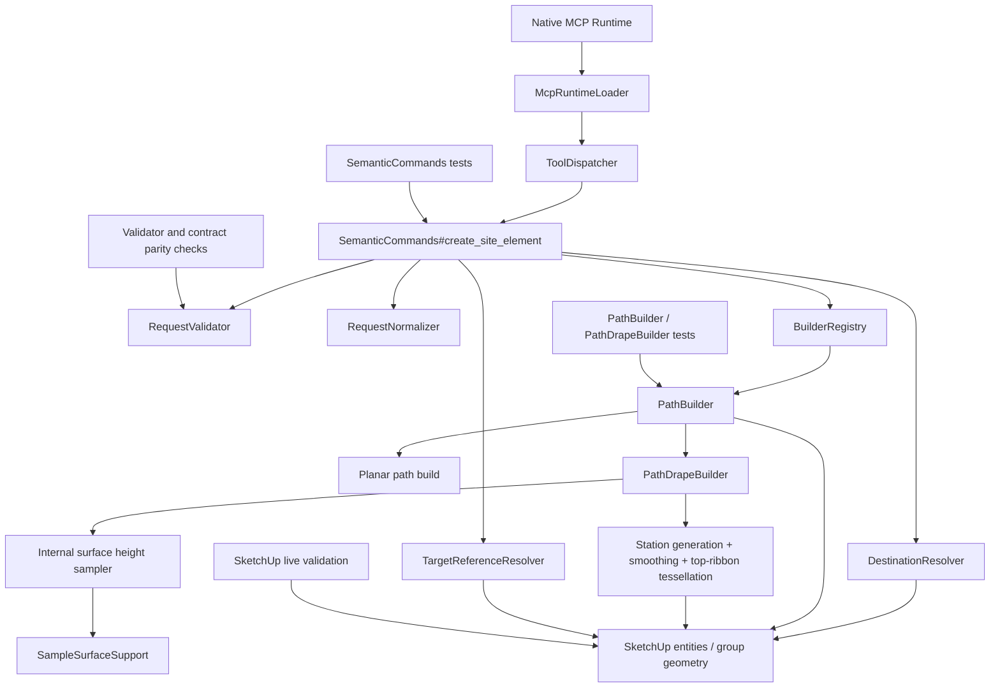

# Technical Plan: SEM-13 Realize Horizontal Cross-Section Terrain Drape for Paths
**Task ID**: `SEM-13`
**Title**: `Realize Horizontal Cross-Section Terrain Drape for Paths`
**Status**: `finalized`
**Date**: `2026-04-20`

## Source Task

- [Realize Horizontal Cross-Section Terrain Drape for Paths](./task.md)

## Problem Summary

The semantic path surface already accepts `hosting.mode: "surface_drape"` through the sectioned `create_site_element` contract, but the runtime still risks treating that mode as a weakly realized hosting branch instead of real terrain-following geometry behavior. `SEM-13` closes that gap for `path` only by making hosted drape creation materially true: the created top path surface follows terrain longitudinally, remains level across width at each station, stays above sampled terrain with a small clearance, and refuses unsupported or unsatisfied requests instead of silently degrading to a planar corridor.

## Goals

- realize `path + surface_drape` as a true hosted semantic creation path through `create_site_element`
- keep each delivered cross-section level across width while following terrain along the centerline direction
- include smoothing in the first shipped slice without violating the top-surface clearance invariant
- preserve structured refusal behavior for unsupported or unsatisfied drape requests

## Non-Goals

- full terrain authoring, grading, or `terrain_patch` behavior
- terrain-cutting, projected-edge, or terrain-modifying drape behavior
- new public request fields for spacing, clearance, smoothing, or sampling density
- widening terrain-aware drape behavior beyond `path`

## Related Context

- [Semantic Scene Modeling HLD](specifications/hlds/hld-semantic-scene-modeling.md)
- [PRD: Semantic Scene Modeling](specifications/prds/prd-semantic-scene-modeling.md)
- [SEM-06 task](specifications/tasks/semantic-scene-modeling/SEM-06-adopt-builder-native-v2-input-for-path-and-structure/task.md)
- [SEM-09 task](specifications/tasks/semantic-scene-modeling/SEM-09-realize-lifecycle-primitives-needed-for-richer-built-form-authoring/task.md)
- [SEM-13 task](./task.md)

## Research Summary

- `path` is already a builder-native family under the sectioned `create_site_element` contract.
- `SEM-09` already delivered `path + surface_drape` as part of the bounded hosting matrix, so the remaining gap is runtime realization rather than contract invention.
- The runtime already resolves hosting targets in `SemanticCommands`, and `path` already advertises `surface_drape` as a supported hosted mode.
- The repo already contains reusable surface traversal and face sampling support through `SampleSurfaceSupport`; the plan should reuse that seam through an internal semantic sampler rather than routing through the public `sample_surface_z` tool.
- The currently present `PathDrapeBuilder` slice is partial and not planning truth. It shows the right seam direction but still has unfinished logic and stale tests, so the implementation plan must treat it as a refactor-or-rewrite candidate, not as settled baseline.
- Recent SEM-10/11 work showed that public-surface drift and host-sensitive assumptions must be planned explicitly. Even when request shape does not change, behavior wording, tests, and examples must move in the same change.

## Technical Decisions

### Data Model

- `PathBuilder` remains the family owner for semantic `path` creation.
- A dedicated `PathDrapeBuilder` collaborator owns:
  - station generation
  - terrain/surface sampling consumption
  - raw section elevation selection
  - smoothing
  - post-smoothing invariant enforcement
  - ribbon tessellation
- The drape builder operates on normalized internal units only. Public meters are converted at the existing semantic normalization boundary.
- Each delivered station produces one top cross-section represented by:
  - center XY on the resampled centerline
  - left/right XY offsets from the local XY tangent
  - one shared top elevation for the section
- Centerline resampling preserves caller-provided vertices and inserts additional intermediate stations as needed to satisfy the internal spacing target.
- `SEM-13` does not decimate caller-provided vertices. High-resolution input remains valid author intent; pathological density is controlled through the tessellation cap rather than by silently removing vertices.
- Resampling uses chord-length subdivision of each input polyline segment in XY:
  - keep every caller-provided vertex as a station
  - insert intermediate stations at the internal spacing target along each segment
  - preserve both endpoints
- Local XY tangent rule:
  - interior stations use the centered difference between adjacent stations
  - the first station uses the forward difference
  - the last station uses the backward difference
- The terrain-clearance guarantee applies to the realized top path surface only.
- If `thickness` is present, it is applied downward from the realized top surface for visual grounding. Downward thickness may extend below the terrain surface and is not part of the terrain-clearance invariant.
- Top-surface elevation pipeline:
  - `raw_z[i] = max(cross_slope_samples[i]) + clearance`
  - `smoothed_z[i] = moving_average(raw_z, window: 3, endpoints: :raw)`
  - `final_z[i] = max(smoothed_z[i], raw_z[i])`

### API and Interface Design

- Public entrypoint remains `create_site_element`.
- Public request shape remains the existing sectioned path contract:
  - `elementType`
  - `metadata`
  - `definition`
  - `hosting`
  - `placement`
  - `representation`
  - `lifecycle`
  - optional `sceneProperties`
- `PathBuilder#build` remains the public family build seam.
- `PathBuilder` branches internally:
  - planar path behavior for non-hosted or other existing path modes
  - drape behavior when `hosting.mode == "surface_drape"`
- `SemanticCommands` continues to:
  - validate and normalize the request
  - resolve the hosting target
  - pass the resolved host entity to the path builder
  - surface builder-owned refusals as structured tool refusals

### Public Contract Updates

- No request-shape delta is planned for `SEM-13`.
- No new public schema fields for:
  - clearance
  - smoothing
  - station spacing
  - cross-slope sample density
  - thickness-specific drape behavior
- Loader schema review is still required to ensure docs/examples remain aligned with the actual sectioned `create_site_element` surface and the realized drape semantics.
- User-facing docs and examples must be updated to state:
  - drape mode follows terrain along the path length
  - each cross-section remains level across width
  - smoothing is present in the delivered longitudinal profile
  - the top path surface is guaranteed to stay above terrain with a small clearance
  - thickness, when present, extends downward from the top surface and is not itself a terrain-clearance guarantee
- Public parity updates must explicitly include:
  - `README.md`
  - semantic command tests and any contract/example fixtures that describe hosted path behavior

### Error Handling

- Contract-validity errors remain in `RequestValidator`.
- Drape feasibility failures remain builder-owned structured refusals surfaced through `SemanticCommands`.
- Planned refusal set:
  - `invalid_hosting_target`
  - `terrain_sample_miss`
  - `invalid_geometry` for post-normalization drape geometry impossibility
  - `path_tessellation_limit_exceeded` for geometry-cap refusal
- Drape failures must not degrade to planar path creation.
- Partial geometry must not be left behind after refusal.

### State Management

- No new persistent semantic metadata fields are introduced for drape tuning.
- Managed-object creation remains unchanged:
  - semantic metadata is written after successful geometry creation
  - result shaping remains serializer-owned
- Drape-specific constants remain internal implementation details.

### Integration Points

- `SemanticCommands` remains responsible for hosting-target resolution and destination resolution.
- `PathBuilder` remains responsible for family dispatch and scene-facing group creation.
- `PathDrapeBuilder` integrates with an internal semantic sampler that reuses `SampleSurfaceSupport`.
- Hosted path creation must continue to respect resolved parent destination ownership when `placement.mode` is parented.
- Drape sampling must occur before top-surface geometry creation so the builder never samples its own generated geometry.

### Configuration

- The following values remain internal-only defaults in the first shipped slice:
  - station spacing: `1.0 m`
  - top-surface clearance: `0.02 m`
  - cross-slope sample fractions: `[-0.5, -0.25, 0.0, 0.25, 0.5]`
  - smoothing kernel: 3-station moving average
- Smoothing endpoint rule:
  - interior stations use the 3-station moving average
  - first and last stations keep their raw section elevations
  - if only two stations exist, smoothing is skipped entirely and the invariant still applies
- No public override mechanism is planned in `SEM-13`.
- The implementation must define an internal maximum station count or equivalent tessellation cap and refuse requests that exceed it.
- Default tessellation cap for the first shipped slice: `1000` generated stations.

## Architecture Context

## Key Relationships

- `SemanticCommands` owns sectioned request handling, target resolution, refusal/result shaping, and operation bracketing.
- `PathBuilder` remains the semantic family entrypoint and should not absorb full terrain-sampling logic inline.
- `PathDrapeBuilder` owns the terrain-following algorithm and should remain testable independently of the command layer.
- `SampleSurfaceSupport` is a reusable traversal seam for sampleable faces and should be consumed through an internal semantic sampler, not via the public `sample_surface_z` tool surface.
- Request validation should remain focused on contract-valid inputs; drape feasibility belongs in the builder-owned refusal path.

## Acceptance Criteria

- A valid `create_site_element` request for `elementType: "path"` with `hosting.mode: "surface_drape"` and a sampleable host target produces a managed path result through the normal semantic creation surface.
- The realized top path surface varies longitudinally with the host terrain instead of remaining a planar unhosted corridor.
- At representative stations, the left and right top-edge points of each generated cross-section share the same elevation.
- The final top-surface elevation at each delivered station is at or above the maximum sampled terrain elevation for that station plus the internal clearance.
- Longitudinal smoothing is present in the delivered top-surface profile and does not violate the top-surface clearance invariant.
- The terrain-clearance guarantee applies to the top draped surface; downward thickness is allowed to extend below that surface and is not required to remain above terrain.
- Hosted drape creation remains non-destructive to the host surface and does not cut, boolean, or otherwise modify the terrain geometry.
- Hosted drape creation still respects resolved destination ownership, including parented placement when both hosting and placement are present.
- If the host target does not expose sampleable surface geometry, the request returns a structured refusal and does not fall back to planar path creation.
- If required terrain samples cannot be resolved at one or more stations, the request returns a structured refusal and does not create partial path geometry.
- If the centerline is degenerate after required geometric validation, the request returns a structured refusal before creating geometry.
- If the generated drape would exceed the internal tessellation/station cap, the request returns a structured refusal instead of creating excessive geometry.
- Public runtime behavior, docs, tests, and examples remain aligned with the delivered sectioned `create_site_element` surface and realized drape semantics.

## Test Strategy

### TDD Approach

Implement through a builder-first TDD loop:

1. establish deterministic `PathDrapeBuilder` failures and invariant tests
2. make `PathBuilder` route correctly into the drape collaborator
3. verify `SemanticCommands` hosting/destination integration and refusal shaping
4. update docs/examples only after behavior is green

The builder seam is the lowest safe place to prove the algorithm before broad command integration.

### Required Test Coverage

- Builder-level tests for:
  - fixed station resampling with preserved endpoints and vertices
  - no-decimation behavior for caller-provided vertices
  - cross-section horizontality
  - top-surface clearance on longitudinal slope
  - top-surface clearance on cross slope
  - smoothing with post-smoothing invariant re-clamp
  - endpoint behavior for smoothing
  - refusal on unsampleable host
  - refusal on terrain sample miss
  - refusal on tessellation cap
  - thickness applied downward without changing the top-surface guarantee
- PathBuilder integration tests for:
  - routing hosted path requests to drape behavior
  - retaining planar path behavior for non-drape requests
- SemanticCommands tests for:
  - host target resolution
  - structured refusal instead of planar fallback
  - hosted drape creation under parented placement
- Contract and parity checks for:
  - no sectioned request-shape drift
  - doc/example alignment with actual request requirements and delivered behavior
- SketchUp-hosted validation for:
  - sloped terrain
  - cross-sloped terrain
  - irregular or curved terrain
  - nested transformed host target
  - long-path geometry cap behavior

## Instrumentation and Operational Signals

- Count or infer generated stations/faces during tests so the tessellation-cap refusal can be validated deterministically.
- Verify post-build scene state on refusal paths to ensure no partial path geometry is left behind.
- In live SketchUp validation, record:
  - resulting child/entity counts
  - visible path/terrain relationship at multiple stations
  - whether the top surface remains visually above terrain while thickness grounds the path acceptably

## Implementation Phases

1. **Stabilize the drape seam**
   - finalize the drape collaborator contract
   - add or correct builder-level failing tests for station generation, smoothing, and top-surface clearance
   - remove stale assumptions from the interrupted partial implementation
2. **Implement top-surface drape generation**
   - implement resampling
   - implement cross-slope terrain sampling
   - implement raw section elevation selection
   - implement smoothing plus invariant re-clamp
   - tessellate the top ribbon safely for SketchUp faces
3. **Integrate hosted semantic creation**
   - wire `PathBuilder` and `SemanticCommands`
   - preserve parented destination behavior
   - add builder-owned refusal handling for unsampleable hosts and terrain sample misses
4. **Add safety limits and finalize public parity**
   - add tessellation/station cap and refusal
   - update docs/examples
   - run live SketchUp validation for the hosted drape scenarios

## Rollout Approach

- Ship as a narrow realization of an already-documented hosted mode, not as a broader terrain feature launch.
- Do not expose new public tuning knobs in this task.
- Treat live SketchUp validation as a completion gate because host behavior is part of the correctness claim.
- If live validation shows the fixed spacing or clearance defaults are visibly poor, adjust internal constants before final completion rather than widening the contract.

## Premortem

### Intended Goal Under Test

Ship a terrain-aware semantic `path + surface_drape` mode that is actually trustworthy in SketchUp: the top path surface follows terrain along its length, stays level across width, remains above terrain with slight clearance, smooths longitudinally, and refuses unfulfillable requests instead of silently degrading to planar creation.

### Failure Paths and Mitigations

- **Base assumptions that could lead us astray**
  - Business-plan mismatch: the business goal needs a materially real hosted path mode, but the plan could still optimize for passing local builder tests only.
  - Root-cause failure path: we assume linear fake surfaces prove real SketchUp hosted terrain behavior.
  - Why this misses the goal: the feature would ship as another nominally supported but weakly realized hosted mode.
  - Likely cognitive bias: test-substitute bias; mistaking doubles for host truth.
  - Classification: requires implementation-time instrumentation or acceptance testing
  - Mitigation now: keep SketchUp live validation as a completion gate and require transformed-host and irregular-terrain cases.
  - Required validation: live SketchUp runs against sloped, cross-sloped, irregular, and nested transformed hosts.
- **Shortcuts that could weaken the outcome**
  - Business-plan mismatch: the goal needs top-surface clearance after smoothing, but a shortcut could smooth elevations without reasserting the invariant.
  - Root-cause failure path: smoothing is treated as cosmetic post-processing instead of a geometry-affecting step that must be re-clamped.
  - Why this misses the goal: the terrain can poke through the draped top surface after smoothing.
  - Likely cognitive bias: local optimization bias; assuming one correct pass remains correct after transformation.
  - Classification: can be validated before implementation
  - Mitigation now: make the re-clamp formula explicit in the plan and test it directly.
  - Required validation: builder-level tests where a local terrain high point forces the post-smoothing top surface upward.
- **Areas that could be weakly implemented**
  - Business-plan mismatch: the goal needs predictable SketchUp-safe geometry, but the implementation could overproduce faces or rely on nonplanar face creation.
  - Root-cause failure path: tessellation is left open-ended or built from invalid quad assumptions.
  - Why this misses the goal: long paths hang SketchUp or create unstable geometry.
  - Likely cognitive bias: abstraction bias; assuming a ruled ribbon can be represented cheaply without respecting SketchUp face rules.
  - Classification: can be validated before implementation
  - Mitigation now: require explicit per-interval triangulation and lock a default cap of `1000` stations.
  - Required validation: deterministic cap-refusal tests and builder tests asserting triangulated interval strips.
- **Tests and evaluations needed to stay on track**
  - Business-plan mismatch: the goal needs refusal-not-fallback integrity, but implementation could quietly fall back to planar path creation to salvage failures.
  - Root-cause failure path: the builder or command path keeps legacy planar behavior reachable after drape failure.
  - Why this misses the goal: callers would believe they got hosted drape geometry when they did not.
  - Likely cognitive bias: graceful-degradation bias; preferring some geometry over truthful refusal.
  - Classification: can be validated before implementation
  - Mitigation now: keep refusal codes explicit and test that no fallback geometry is created on drape failure.
  - Required validation: semantic-command tests asserting structured refusal and zero created path geometry for unsampleable host, sample miss, and tessellation-cap cases.
- **What must be true for the task to succeed**
  - Business-plan mismatch: the goal needs stable author intent, but the implementation could silently rewrite dense input geometry.
  - Root-cause failure path: resampling is allowed to decimate caller-provided vertices in the name of geometric efficiency.
  - Why this misses the goal: the resulting path can ignore intended bends or detailed local shape.
  - Likely cognitive bias: performance-first bias; optimizing geometry count before proving correctness.
  - Classification: can be validated before implementation
  - Mitigation now: explicitly state no-decimation behavior in the plan and control pathological cases through the cap instead.
  - Required validation: builder tests that preserve caller vertices while inserting intermediate stations as needed.
- **Second-order and third-order effects**
  - Business-plan mismatch: the goal needs a trustworthy public semantic surface, but unchanged request shape can still drift behaviorally if public docs and examples stay stale.
  - Root-cause failure path: implementation lands without updating `README.md` and contract-facing examples to describe the actual top-surface guarantee and downward thickness rule.
  - Why this misses the goal: clients will use the feature with the wrong mental model and misdiagnose visually grounded thickness as a bug.
  - Likely cognitive bias: interface-shape bias; assuming no schema delta means no public-surface update is needed.
  - Classification: can be validated before implementation
  - Mitigation now: explicitly name contract-facing docs/examples in the public parity work and treat example updates as part of completion.
  - Required validation: doc/example review against the finalized runtime behavior and sectioned request shape.

## Risks and Controls

- **Host-sampling mismatch**: Reuse the existing surface traversal seam through a narrow internal sampler; require live SketchUp validation on real hosted terrain targets.
- **Top-surface invariant drift after smoothing**: Explicitly re-clamp the smoothed elevation at each station to `max(smoothed_z, raw_station_max + clearance)` and test that invariant directly.
- **Unit-boundary mistakes**: Keep public-to-internal conversion at the existing semantic normalization boundary and use internal-only constants in the drape builder.
- **Excessive tessellation**: Add a hard station/geometry cap with structured refusal and a deterministic test.
- **Geometry self-interaction during build**: Perform sampling before geometry creation or explicitly exclude the in-progress group from sampling.
- **Public contract and example drift**: Update docs/examples in the same change even without a request-shape delta, and verify behavior wording against the live sectioned contract.
- **SketchUp face-creation edge cases**: Use explicit triangulation per interval instead of relying on nonplanar quads or pushpull-based reuse.

## Dependencies

- `SEM-06`
- `SEM-09`
- sectioned `create_site_element` runtime path
- internal sample-surface traversal support
- SketchUp-hosted live validation for hosted terrain behavior

## Quality Checks

- [x] All required inputs validated
- [x] Problem statement documented
- [x] Goals and non-goals documented
- [x] Research summary documented
- [x] Technical decisions included
- [x] Architecture context included
- [x] Acceptance criteria included
- [x] Test requirements specified
- [x] Instrumentation and operational signals defined when needed
- [x] Risks and dependencies documented
- [x] Rollout approach documented when needed
- [x] Small reversible phases defined
- [x] Premortem completed with falsifiable failure paths and mitigations

## Implementation Outcome

- Implemented the planned dedicated drape seam through:
  - [path_builder.rb](../../../../src/su_mcp/semantic/path_builder.rb)
  - [path_drape_builder.rb](../../../../src/su_mcp/semantic/path_drape_builder.rb)
  - [surface_height_sampler.rb](../../../../src/su_mcp/semantic/surface_height_sampler.rb)
  - [builder_refusal.rb](../../../../src/su_mcp/semantic/builder_refusal.rb)
- The shipped runtime behavior matches the finalized plan on the local validation bar:
  - preserved caller vertices with chord-length subdivision
  - `1.0 m` station spacing
  - `0.02 m` top-surface clearance
  - 5-point cross-slope sampling
  - 3-station smoothing with raw endpoints
  - `final_z = max(smoothed_z, raw_z)` invariant enforcement
  - `1000`-station cap with structured refusal
  - top-surface clearance guarantee with downward-applied thickness
- Live follow-up and optimization work completed the final runtime shape:
  - exact station-boundary paths no longer duplicate the terminal station
  - thickness uses a coherent bottom ribbon plus perimeter shell instead of per-triangle pushpull
  - draped face emission now prefers `entities.build { |builder| ... }` when available to reduce main-thread geometry creation cost
  - host sampling now prepares and reuses a per-build sampling context instead of recollecting and recomputing sampleable face data for every station sample
  - prepared sampling caches sampleable face entries plus world-space face data needed for repeated elevation queries
- Local validation completed successfully:
  - `bundle exec rake ruby:test`
  - `RUBOCOP_CACHE_ROOT=/tmp/rubocop-cache bundle exec rake ruby:lint`
  - `bundle exec rake package:verify`
- Live SketchUp validation completed successfully for:
  - sloped host surfaces
  - cross-slope terrain
  - ridge / smoothing behavior
  - exact `1.0 m` station-boundary paths
  - thick draped paths on complex multi-hill / multi-valley terrain
- Final live timing on the complex drape scenario improved from an earlier `38.24s` average to `2.40s` average after the prepared-sampling-context optimization, a measured improvement of about `15.9x`.
- No further optimization work is planned in this task; the shipped performance and live correctness outcomes were accepted as sufficient for closeout.
  - ridge smoothing / local-peak preservation
  - dense input vertices
  - thickness-downward shell output
  - exact 1m station-boundary paths
  - complex multi-hill terrain
  - unsampleable host, terrain miss, and tessellation-cap refusal cases
