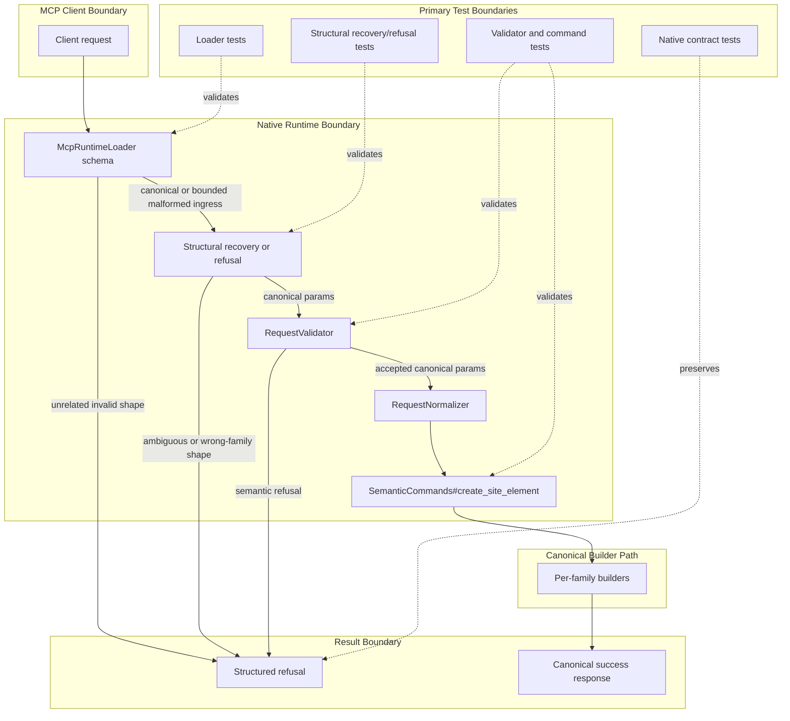

# Technical Plan: SEM-14 Harden Create Site Element Request Recovery and Definition Boundaries
**Task ID**: `SEM-14`
**Title**: `Harden Create Site Element Request Recovery and Definition Boundaries`
**Status**: `finalized`
**Date**: `2026-04-23`

## Source Task

- [SEM-14 Harden Create Site Element Request Recovery and Definition Boundaries](./task.md)

## Problem Summary

`create_site_element` is the canonical public semantic constructor, but the live MCP boundary is still too brittle. Common malformed-but-recognizable request shapes die at schema validation as raw MCP `-32602` invalid-params errors before Ruby can recover intent or return a structured refusal, and the inner `definition` surface is still broad enough that clients infer wrong-family fields as if they were global create inputs.

## Goals

- harden `create_site_element` so bounded malformed request shapes are handled in-band instead of failing only as raw MCP `-32602` errors
- preserve one canonical sectioned public create contract while keeping malformed-shape handling explicitly compatibility-scoped
- make family-specific `definition` field and mode ownership materially clearer across supported first-wave families
- ship schema, runtime behavior, contract tests, and user-facing guidance together

## Non-Goals

- restoring the older flat public create contract as an equal public alternative
- adding a new semantic creation tool outside `create_site_element`
- widening the supported semantic family vocabulary beyond the current first wave
- refactoring unrelated metadata, hierarchy-maintenance, lifecycle, or builder behavior

## Related Context

- [PRD: Semantic Scene Modeling](specifications/prds/prd-semantic-scene-modeling.md)
- [HLD: Semantic Scene Modeling](specifications/hlds/hld-semantic-scene-modeling.md)
- [SEM-06](specifications/tasks/semantic-scene-modeling/SEM-06-adopt-builder-native-v2-input-for-path-and-structure/task.md)
- [SEM-08](specifications/tasks/semantic-scene-modeling/SEM-08-adopt-builder-native-v2-input-for-pad-and-retaining-edge/task.md)

## Research Summary

- `SEM-06` intentionally made the sectioned create shape the only public baseline and rejected a dual flat-plus-sectioned contract.
- `SEM-08` completed remaining-family builder-native adoption, so the current issue is not a leftover family migration gap.
- The live runtime still validates MCP params before `SemanticCommands`, so malformed request shapes never reach Ruby today.
- `RequestNormalizer` currently handles value normalization after validation; it is the wrong layer for structural request recovery.
- The published inner `definition` surface remains broad enough to advertise wrong-family fields together, which increases misuse across more than one `elementType`.

## Technical Decisions

### Data Model

- Keep one canonical sectioned request shape with these top-level sections:
  - `elementType`
  - `metadata`
  - `hosting`
  - `placement`
  - `representation`
  - `lifecycle`
  - `definition`
  - optional `sceneProperties`
- Introduce a bounded malformed-shape matrix for compatibility ingress:
  - whole canonical sectioned payload accidentally nested under top-level `definition`
  - family-owned geometry leaf fields lifted to top level while the non-geometry canonical sections remain at top level
- Introduce one Ruby-owned per-family `definition` boundary source that defines, per supported `elementType`:
  - allowed `definition` fields
  - required `definition` fields when applicable
  - allowed `definition.mode` values when applicable
  - which top-level leaf fields are eligible for one-pass relocation into `definition`
- The family boundary source is shared by loader shaping where practical, structural recovery/refusal, validator behavior, and tests.

### API and Interface Design

- The public tool remains `create_site_element`.
- The canonical documented request shape remains the sectioned top-level shape. Compatibility handling is recovery-only and must not be presented as a second supported contract.
- Add a dedicated structural recovery/refusal seam before strict semantic validation. Its responsibilities are:
  - inspect raw loader-admitted params
  - recover only the bounded malformed-shape classes that are unambiguous
  - refuse ambiguous or wrong-family malformed shapes with structured correction guidance
  - emit canonical sectioned params for the downstream semantic path
- `RequestNormalizer` remains responsible for value normalization only. It must receive canonical sectioned params, not malformed raw shapes.
- Builders remain canonical-only consumers. They must not gain malformed-shape special cases.

### Public Contract Updates

- Exact request-shape deltas:
  - no new canonical top-level fields are introduced
  - loader compatibility ingress is widened only for:
    - whole-payload-under-`definition`
    - top-level family-owned geometry leafs that can be unambiguously relocated into `definition`
  - unrelated broad flat payloads remain invalid
- Exact response-shape deltas:
  - successful responses remain unchanged whether the request was canonical or recovered
  - malformed-shape failures move from raw MCP param errors to structured semantic refusals when the request enters the bounded compatibility path but cannot be safely recovered
- Exact refusal-shape requirements:
  - use a small structured refusal family rather than a large new taxonomy
  - refusal details must include the information needed for correction, such as:
    - `expectedTopLevelSections`
    - `misnestedFields` when geometry leafs were found outside `definition`
    - `elementType` when known
    - `allowedDefinitionFields` for the chosen family when relevant
    - a compact correction hint such as `suggestedCorrection`
- Exact schema and registration updates:
  - `McpRuntimeLoader#create_site_element_schema` must admit only the bounded malformed-shape matrix above
  - the shipped schema must continue to present the sectioned contract as canonical
  - schema shaping should reduce wrong-family affordances where this can be done cleanly without a full discriminated-union redesign
- Exact routing updates:
  - `SemanticCommands#create_site_element` or an adjacent semantic boundary must call the structural recovery/refusal seam before strict semantic validation
  - downstream routing into existing validators, normalizers, and builders stays canonical-only
- Exact contract test updates:
  - loader tests for bounded ingress and continued rejection of unrelated flat shapes
  - structural recovery/refusal tests
  - validator/command tests for wrong-family misuse and canonicalized execution
  - native contract preservation for touched refusal shapes
- Exact docs/example updates:
  - keep canonical examples sectioned
  - add a short guidance note explaining top-level sections versus inner `definition`
  - do not add malformed-shape examples as equal public usage patterns

### Error Handling

- Safe malformed-shape recovery is allowed only for unambiguous cases:
  - top-level `definition` containing the full canonical section set
  - top-level geometry leafs that belong to the chosen family and do not conflict with an existing nested `definition`
- The runtime must refuse instead of recovering when:
  - nested `definition` content conflicts with top-level geometry leafs
  - the chosen family does not own the misplaced fields
  - the request still does not identify a stable canonical shape after one bounded recovery pass
- Wrong-family `definition` fields must not silently survive to builder execution.

### State Management

- No persistent state migration is required.
- Recovery bookkeeping, if any is needed for debugging, stays request-local and does not enter managed-object metadata.

### Integration Points

- [src/su_mcp/runtime/native/mcp_runtime_loader.rb](src/su_mcp/runtime/native/mcp_runtime_loader.rb)
- [src/su_mcp/semantic/semantic_commands.rb](src/su_mcp/semantic/semantic_commands.rb)
- [src/su_mcp/semantic/request_validator.rb](src/su_mcp/semantic/request_validator.rb)
- [src/su_mcp/semantic/request_normalizer.rb](src/su_mcp/semantic/request_normalizer.rb)
- any new structural recovery/refusal seam introduced under `src/su_mcp/semantic/`
- native runtime contract tests
- semantic recovery, validator, and command tests
- user-facing `create_site_element` guidance in repo docs

### Configuration

- No new configuration surface is needed.

## Architecture Context

## Key Relationships

- Loader compatibility must stop at bounded ingress. It exists only to let Ruby recover or refuse the known malformed-shape classes.
- The structural recovery/refusal seam owns topology correction. Validation, normalization, and builders only see canonical sectioned params.
- The shared family boundary source is the anti-drift control between schema shaping, recovery, validator behavior, and tests.
- Real integration must be proven at the runtime boundary, not only inside semantic unit tests, because the current failure happens before Ruby sees the request.

## Acceptance Criteria

- `create_site_element` still exposes one canonical sectioned request shape with top-level sections and inner family-owned `definition` payloads.
- Whole-payload-under-`definition` requests no longer fail only as raw MCP missing-required-arguments errors when the nested payload clearly contains the canonical section set.
- Top-level geometry leaf misnesting no longer fails only as raw MCP missing-required-arguments errors when the chosen `elementType` and field ownership make relocation into `definition` unambiguous.
- Mixed or ambiguous malformed shapes are refused in-band with structured correction details rather than silently reinterpreted.
- Wrong-family `definition` fields are rejected with family-specific guidance and do not reach builder execution as if they were valid global create fields.
- Representative malformed-shape coverage exists across more than one supported `elementType`, including at least one geometry-diverse family beyond `tree_proxy`.
- Canonical successful responses are unchanged for already-correct requests and for recovered requests.
- Loader schema, semantic runtime behavior, contract tests, and shipped docs move together in the same change.

## Test Strategy

### TDD Approach

- Start from failing tests that reproduce the observed malformed request classes before changing the loader or semantic flow.
- Add seam-owning tests before implementation so each new layer has one clear behavioral owner.
- Preserve existing canonical create coverage to prove the hardening does not widen or break the intended public contract.

### Required Test Coverage

- Loader tests for:
  - canonical sectioned create shape remains accepted
  - bounded malformed ingress reaches Ruby for the two supported malformed-shape classes
  - unrelated broad flat payloads still fail at the loader boundary
- Structural recovery/refusal tests for:
  - whole-payload-under-`definition` recovery
  - top-level geometry leaf relocation into `definition` when ownership is unambiguous
  - refusal for mixed nested-plus-top-level geometry conflicts
  - refusal for wrong-family fields with `allowedDefinitionFields`
- Validator and command tests for:
  - recovered requests execute through the canonical path
  - builders receive canonical sectioned params only
  - wrong-family or unrecoverable malformed shapes refuse before builder execution
- Native contract tests for:
  - touched refusal payloads remain JSON-stable
  - known malformed requests no longer surface only as raw MCP `-32602` when they enter the bounded compatibility path
- Documentation parity checks for:
  - canonical section ownership guidance
  - compatibility handling described as recovery-only, not as a second public contract

## Instrumentation and Operational Signals

- Preserve reproducible malformed request fixtures for the known failure classes so regressions are easy to replay.
- If local debug logging is touched, keep it request-scoped and recovery-oriented; no new persistent telemetry surface is required.

## Implementation Phases

1. Pin the bounded malformed-shape matrix and representative cross-family misuse cases in failing tests.
2. Introduce the shared family `definition` boundary source and the structural recovery/refusal seam.
3. Widen loader ingress only for the bounded malformed-shape classes and route those requests through the new seam.
4. Tighten validator/refusal behavior and pragmatic schema shaping so wrong-family fields stop reading as global where supportable.
5. Update docs, contract fixtures, and full touched validation.

## Rollout Approach

- Ship under the existing `create_site_element` tool name with no contract version split.
- Keep the canonical documented request shape unchanged.
- Treat malformed-shape handling as bounded compatibility recovery rather than a new public create style.

## Risks and Controls

- Stealth second contract risk: keep loader widening finite, recovery-only, and absent from canonical examples and primary tool descriptions.
- Loader-widening drift risk: derive accepted malformed shapes from an explicit matrix rather than broad permissiveness.
- Schema-versus-runtime drift risk: reuse one family boundary source and require loader, runtime, tests, and docs to move together.
- Wrong-family field persistence risk: refuse when family ownership is unclear and prove in tests that builders only receive canonical params.
- False confidence from semantic-only tests: require at least one runtime-boundary validation path because the current bug originates before Ruby semantic code runs.
- Host-sensitive risk is low, but builder execution still needs regression coverage to prove recovered requests do not alter downstream SketchUp-facing behavior.

## Dependencies

- [SEM-06](specifications/tasks/semantic-scene-modeling/SEM-06-adopt-builder-native-v2-input-for-path-and-structure/task.md)
- [SEM-08](specifications/tasks/semantic-scene-modeling/SEM-08-adopt-builder-native-v2-input-for-pad-and-retaining-edge/task.md)
- [HLD: Semantic Scene Modeling](specifications/hlds/hld-semantic-scene-modeling.md)
- [PRD: Semantic Scene Modeling](specifications/prds/prd-semantic-scene-modeling.md)

## Premortem

### Intended Goal Under Test

Make `create_site_element` materially easier for MCP clients to use by converting common malformed-but-recognizable requests into canonical execution or structured correction guidance, without reopening a second public create contract.

### Failure Paths and Mitigations

- **Base assumptions that could lead us astray**
  - Business-plan mismatch: the product goal is in-band correction or teaching, but the plan could still optimize mainly for semantic-layer elegance.
  - Root-cause failure path: the loader remains too strict, so known malformed requests still die as raw `-32602` before Ruby sees them.
  - Why this misses the goal: callers keep experiencing the same opaque failure that triggered the task.
  - Likely cognitive bias: local optimization around semantic internals instead of the actual public failure seam.
  - Classification: Validate before implementation
  - Mitigation now: make loader ingress widening for the bounded malformed-shape matrix an explicit non-optional plan step.
  - Required validation: runtime-boundary tests proving the known malformed shapes reach recovery/refusal instead of failing only at param parsing.
- **Shortcuts that could weaken the outcome**
  - Business-plan mismatch: the goal is one canonical contract plus bounded recovery, but the shortcut would effectively support multiple public shapes.
  - Root-cause failure path: compatibility ingress becomes broad enough that malformed shapes behave like a second contract.
  - Why this misses the goal: clients keep learning the wrong shape and the public surface becomes harder to reason about.
  - Likely cognitive bias: convenience bias toward permissive parsing.
  - Classification: Validate before implementation
  - Mitigation now: constrain compatibility to two explicit malformed-shape classes and keep canonical examples sectioned-only.
  - Required validation: loader tests for continued rejection of unrelated flat payloads and doc review showing only the sectioned shape as canonical.
- **Areas that could be weakly implemented**
  - Business-plan mismatch: the goal is cross-family hardening, but the implementation could accidentally patch only the latest observed family.
  - Root-cause failure path: recovery/refusal logic and tests are built around `tree_proxy` specifics instead of a shared family boundary source.
  - Why this misses the goal: the underlying contract confusion persists on other families.
  - Likely cognitive bias: recency bias from the latest failing example.
  - Classification: Validate before implementation
  - Mitigation now: require one shared family boundary source and representative cross-family tests.
  - Required validation: tests that cover more than one `elementType` and prove wrong-family misuse is caught predictably.
- **Tests and evaluations needed to stay on track**
  - Business-plan mismatch: the goal is shipped MCP behavior, but the plan could pass with only semantic-level tests.
  - Root-cause failure path: implementation looks correct locally while the runtime boundary still emits raw MCP param failures or unstable refusal shapes.
  - Why this misses the goal: the bug survives in the real client path.
  - Likely cognitive bias: proxy-testing bias from trusting lower-level tests too much.
  - Classification: Validate before implementation
  - Mitigation now: include loader and native contract preservation suites in the required coverage, not as optional follow-up.
  - Required validation: touched runtime tests plus native refusal-shape preservation for the new correction/refusal paths.
- **What must be true for the task to succeed**
  - Business-plan mismatch: the goal is safe assistance, but the implementation could optimize for silent recovery too aggressively.
  - Root-cause failure path: the structural seam recovers ambiguous requests instead of refusing them.
  - Why this misses the goal: callers may create the wrong semantic object while believing the runtime understood them correctly.
  - Likely cognitive bias: overconfidence in inferred intent.
  - Classification: Requires implementation-time instrumentation or acceptance testing
  - Mitigation now: define explicit refusal-first rules for nested-plus-top-level conflicts and wrong-family fields.
  - Required validation: tests proving ambiguous shapes refuse and that builders only see canonical params after successful recovery.
- **Second-order and third-order effects**
  - Business-plan mismatch: the goal is a clearer public contract, but the plan could improve runtime behavior while leaving schema or docs misleading.
  - Root-cause failure path: runtime refusals improve, yet the loader schema and examples still imply broad cross-family `definition` affordances.
  - Why this misses the goal: clients continue generating malformed requests from the published contract itself.
  - Likely cognitive bias: implementation bias that treats docs and schema as secondary cleanup.
  - Classification: Validate before implementation
  - Mitigation now: make schema shaping and docs/example updates part of the same required contract section in the plan.
  - Required validation: artifact review and contract tests confirming shipped guidance and runtime behavior stay aligned.

## Quality Checks

- [x] All required inputs validated
- [x] Problem statement documented
- [x] Goals and non-goals documented
- [x] Research summary documented
- [x] Technical decisions included
- [x] Architecture context included
- [x] Acceptance criteria included
- [x] Test requirements specified
- [x] Instrumentation and operational signals defined when needed
- [x] Risks and dependencies documented
- [x] Rollout approach documented when needed
- [x] Small reversible phases defined
- [x] Premortem completed with falsifiable failure paths and mitigations
