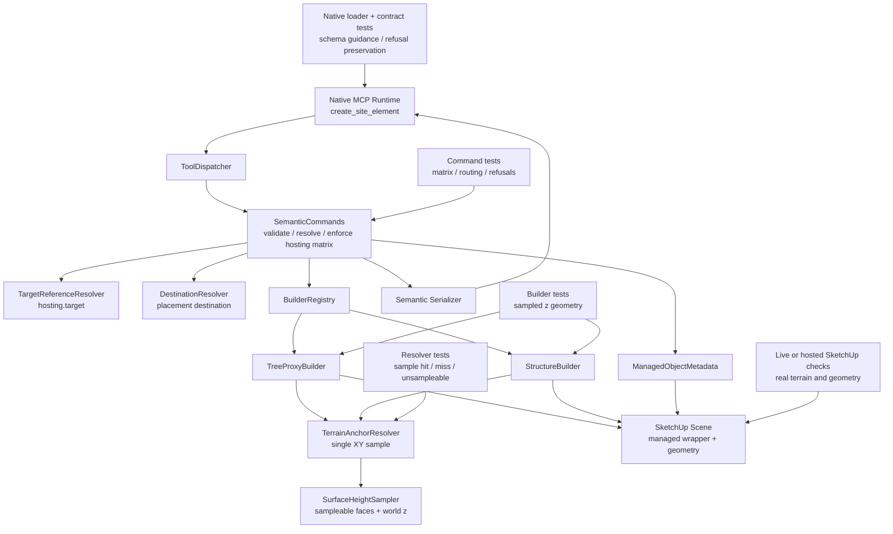

# Technical Plan: SEM-15 Add Terrain-Anchored Hosting for Tree Proxy and Structure
**Task ID**: `SEM-15`
**Title**: `Add Terrain-Anchored Hosting for Tree Proxy and Structure`
**Status**: `implemented_pending_live_verification`
**Date**: `2026-04-24`

## Source Task

- [Add Terrain-Anchored Hosting for Tree Proxy and Structure](./task.md)

## Problem Summary

`create_site_element` already exposes `hosting.mode: "terrain_anchored"` as a valid hosting enum and validates that hosted modes require a target, but the runtime execution matrix does not support `terrain_anchored` for any element family. `tree_proxy` still relies on caller-provided `definition.position.z`, and `structure` still relies on caller-provided `definition.elevation`. This task makes `terrain_anchored` real for those two families only, without adding terrain authoring, draped structures, or new public tools.

## Goals

- Support `tree_proxy + hosting.mode: "terrain_anchored"` through the existing `create_site_element` path.
- Support `structure + hosting.mode: "terrain_anchored"` through the existing `create_site_element` path.
- Keep `structure` terrain anchoring planar by sampling one base elevation for the whole footprint.
- Return structured hosting refusals when a terrain host is missing, unresolved, ambiguous, unsampleable, or misses the required sample point.
- Keep runtime behavior, loader guidance, tests, README guidance, and live or hosted SketchUp verification aligned.

## Non-Goals

- Do not add per-vertex drape, warp, cut, fill, or terrain conformance for `structure`.
- Do not add terrain anchoring to `pad`, `path`, `retaining_edge`, `planting_mass`, or new semantic families.
- Do not implement `planting_mass + surface_drape`; that is a separate follow-up candidate.
- Do not introduce a new terrain-specific creation tool outside `create_site_element`.
- Do not change existing `surface_drape`, `surface_snap`, or `edge_clamp` behavior.

## Related Context

- [Semantic Scene Modeling HLD](specifications/hlds/hld-semantic-scene-modeling.md)
- [Semantic Scene Modeling PRD](specifications/prds/prd-semantic-scene-modeling.md)
- [Scene Targeting and Interrogation PRD](specifications/prds/prd-scene-targeting-and-interrogation.md)
- [Ruby Coding Guidelines](specifications/guidelines/ryby-coding-guidelines.md)
- [MCP Tool Authoring for SketchUp](specifications/guidelines/mcp-tool-authoring-sketchup.md)
- [SEM-09 Summary](specifications/tasks/semantic-scene-modeling/SEM-09-realize-lifecycle-primitives-needed-for-richer-built-form-authoring/summary.md)
- [SEM-13 Summary](specifications/tasks/semantic-scene-modeling/SEM-13-realize-horizontal-cross-section-terrain-drape-for-paths/summary.md)
- [SEM-14 Task](specifications/tasks/semantic-scene-modeling/SEM-14-harden-create-site-element-request-recovery-and-definition-boundaries/task.md)

## Research Summary

- `SEM-09` shipped command-level hosting target resolution, destination resolution, and the bounded supported-hosting matrix currently limited to `path -> surface_drape`, `pad -> surface_snap`, and `retaining_edge -> edge_clamp`.
- `SEM-13` made `path + surface_drape` real and added `SurfaceHeightSampler` plus `BuilderRefusal` as reusable internal patterns for terrain sampling and builder-owned structured refusals.
- `SEM-14` completed create-contract hardening, so this task should not reopen request shape or public contract structure.
- `TreeProxyBuilder` currently uses `definition.position.z` as the base z for all tree rings.
- `StructureBuilder` currently maps all footprint points to `definition.elevation`.
- `PlantingMassBuilder` exists but remains planar; draping it has different geometry semantics and should not be folded into this task.

## Technical Decisions

### Data Model

No public data model changes are introduced.

Internally, terrain anchoring uses the existing builder params shape:

- `params["hosting"]["mode"] == "terrain_anchored"`
- `params["hosting"]["resolved_target"]` contains the resolved SketchUp host entity supplied by `SemanticCommands`
- `params["definition"]` remains the element-specific geometry payload

For `tree_proxy`, terrain anchoring replaces `definition.position.z` with the sampled terrain height. The caller-provided `position.z` is not treated as an offset in hosted mode.

For `structure`, terrain anchoring replaces `definition.elevation` with one sampled base elevation. The sample point is the arithmetic mean of the footprint vertices passed to `StructureBuilder`, not the bounds center and not an area-weighted centroid. This keeps the behavior order-independent enough for normal footprints without adding concave-polygon geometry policy to this task.

### API and Interface Design

The public API remains `create_site_element`.

Add a small internal semantic helper, `SU_MCP::Semantic::TerrainAnchorResolver`, with a public entrypoint shaped like:

```ruby
resolve(host_target:, anchor_xy:, role:)
```

The helper should:

- use `SurfaceHeightSampler#prepare_context` once for the host target
- refuse with `BuilderRefusal(code: "invalid_hosting_target")` when the resolved host has no sampleable faces
- sample one XY point through `SurfaceHeightSampler#sample_z_from_context`
- refuse with `BuilderRefusal(code: "terrain_sample_miss")` when the XY point cannot be sampled
- include `section: "hosting"` and a `role` such as `tree_base` or `structure_centroid` in refusal details
- be injected into builders through constructors for focused tests, matching the collaborator-injection style used by `PathDrapeBuilder`

### Public Contract Updates

Request shape delta: none.

Response shape delta: none.

Schema enum delta: none; `terrain_anchored` is already in the public enum.

Behavioral contract updates:

- `SemanticCommands::SUPPORTED_HOSTING_MODES` must add:
  - `tree_proxy => ["terrain_anchored"]`
  - `structure => ["terrain_anchored"]`
- unsupported-hosting `allowedValues` changes for `tree_proxy` and `structure`
- `replace_preserve_identity` requests that include supported terrain anchoring resolve and pass the hosting target consistently with `create_new`
- loader descriptions or examples should make the contextual hosting matrix discoverable
- README hosting guidance must list the two new supported pairs
- native contract fixtures and tests should be updated where they assert supported hosting pairs or refusal detail preservation

Dispatcher changes are not expected because `create_site_element` already routes through `SemanticCommands`.

### Error Handling

Failure ownership stays layered:

- Missing `hosting.target`: `RequestValidator` returns the existing missing-required-field refusal.
- Unresolved or ambiguous `hosting.target`: `SemanticCommands` returns `target_not_found` or `ambiguous_target` with `section: "hosting"`.
- Unsupported family/mode combination: `SemanticCommands` returns `unsupported_hosting_mode` with contextual `allowedValues`.
- Resolved but unsampleable host: `TerrainAnchorResolver` raises `BuilderRefusal` with `code: "invalid_hosting_target"`, `section: "hosting"`, and the sample role.
- Terrain sample miss: `TerrainAnchorResolver` raises `BuilderRefusal` with `code: "terrain_sample_miss"`, `section: "hosting"`, and the sample role.

No terrain-anchored request may fall back to caller-provided `position.z` or `elevation` after terrain sampling fails.

### State Management

This task does not introduce persisted state beyond normal Managed Scene Object metadata already written after successful creation.

All geometry creation still runs inside the existing `run_v2_operation` transaction path. Terrain-anchor refusals must occur before geometry is created or must be raised in a way that causes the operation to abort without leaving partial wrapper groups.

### Integration Points

- `McpRuntimeLoader` owns public schema descriptions and examples.
- `ToolDispatcher` remains unchanged.
- `SemanticCommands` owns request recovery, validation, target resolution, supported-hosting enforcement, destination resolution, operation boundaries, metadata writing, and serialization.
- `TargetReferenceResolver` resolves the explicit host target.
- `TerrainAnchorResolver` owns single-point terrain-height extraction for terrain anchoring.
- `SurfaceHeightSampler` owns sampleable-face traversal and world-space z sampling.
- `TreeProxyBuilder` and `StructureBuilder` own geometry construction using the sampled base height.
- `BuilderRefusal` remains the boundary for builder-owned structured refusal conditions.

### Configuration

No runtime configuration, feature flag, or user-tunable sampling policy is introduced.

## Architecture Context



## Key Relationships

- `SemanticCommands` remains the orchestration seam; it should not learn terrain-height math.
- `TerrainAnchorResolver` should not construct tool responses; it raises `BuilderRefusal` and lets the existing command boundary translate it.
- Builders consume sampled elevation only when `hosting.mode == "terrain_anchored"`; unhosted behavior remains unchanged.
- `SurfaceHeightSampler` remains internal support. This task does not call the public `sample_surface_z` tool from semantic creation.
- Public docs must describe the contextual matrix instead of implying `terrain_anchored` is globally supported.

## Acceptance Criteria

- A valid `tree_proxy` request with `hosting.mode: "terrain_anchored"` and a sampleable host creates a managed tree proxy whose base z is the sampled terrain height at `definition.position.x/y`.
- `tree_proxy + terrain_anchored` ignores caller-provided `definition.position.z` as an offset and does not add it to the sampled terrain height.
- A valid `structure` request with `hosting.mode: "terrain_anchored"` and a sampleable host creates a managed planar structure whose whole footprint uses the sampled z at the arithmetic-mean footprint centroid.
- `structure + terrain_anchored` remains a planar extruded built form and does not drape, warp, or per-vertex sample the footprint.
- Missing, unresolved, ambiguous, unsupported, unsampleable, and sample-miss hosting cases return structured refusals attributed to `hosting`.
- Terrain-anchored sampling failure never falls back to caller-provided z/elevation and does not leave partial managed geometry behind.
- Unsupported families still return `unsupported_hosting_mode` with contextual `allowedValues`; only `tree_proxy` and `structure` gain `terrain_anchored`.
- Parent/destination placement still works when a supported terrain-anchored request is also created under a valid parent destination.
- README, loader guidance, tests, and contract fixtures describe the delivered hosting matrix consistently.
- Live or hosted SketchUp verification demonstrates tree anchoring on sloped terrain, structure centroid anchoring on sloped terrain, unsampleable host refusal, sample-miss refusal, and unsupported-family refusal.

## Test Strategy

### TDD Approach

Start with command-level failing tests for the supported-hosting matrix and resolved-target propagation, then add focused helper and builder tests to drive the terrain anchor behavior. Keep each phase reversible: command matrix, helper, tree builder, structure builder, docs/loader parity, then live validation.

### Required Test Coverage

- Command tests for:
  - `tree_proxy + terrain_anchored` accepted and passed to the builder with `hosting.resolved_target`
  - `structure + terrain_anchored` accepted and passed to the builder with `hosting.resolved_target`
  - `replace_preserve_identity + terrain_anchored` resolves and passes `hosting.resolved_target`
  - unsupported families still refused with narrowed `allowedValues`
  - missing/unresolved/ambiguous hosting targets still refuse from the existing layers
  - terrain-anchored creation still respects parent destination context
- `TerrainAnchorResolver` tests for:
  - sampleable host single-point hit
  - unsampleable host refusal
  - sample miss refusal
  - refusal details include `section: "hosting"` and the supplied role
- `TreeProxyBuilder` tests for:
  - hosted mode uses sampled z at tree XY
  - caller `position.z` is not applied as offset
  - unsampleable/miss failures do not create wrapper groups or tree geometry
  - unhosted behavior remains unchanged
- `StructureBuilder` tests for:
  - hosted mode samples the arithmetic-mean footprint centroid
  - all footprint vertices use one sampled base z
  - caller `elevation` is not used after hosted sampling succeeds
  - unsampleable/miss failures do not create wrapper groups or structure geometry
  - unhosted behavior remains unchanged
- Native loader and contract tests for:
  - public guidance around contextual hosting support
  - refusal envelope preservation for hosted failures where fixture coverage is appropriate
- Documentation review for README hosting matrix and examples.
- Live or hosted SketchUp checks after Grok review findings are addressed.

## Instrumentation and Operational Signals

- No persistent telemetry is added.
- Validation evidence should record exact hosted requests, expected sample points, sampled terrain heights where observable, resulting geometry base elevations, and refusal payloads.
- Live verification notes must explicitly say whether SketchUp verification was run or intentionally skipped.

## Implementation Phases

1. Add command-level failing tests for the new supported-hosting rows, unsupported-row preservation, and resolved host propagation.
2. Add `TerrainAnchorResolver` with focused tests for sample hit, unsampleable host, and sample miss.
3. Wire `TreeProxyBuilder` to use terrain anchoring in hosted mode and add builder tests proving sampled z replaces caller z.
4. Wire `StructureBuilder` to use terrain anchoring in hosted mode and add builder tests proving centroid sampling and planar output.
5. Update `SemanticCommands::SUPPORTED_HOSTING_MODES`, README hosting guidance, loader descriptions/examples, and contract fixtures/tests as needed.
6. Run focused Ruby semantic tests and native loader/contract tests.
7. Run full Ruby test, lint, and package verification.
8. Run required Grok-backed review, address findings, rerun focused checks.
9. Run live or hosted SketchUp verification and record outcomes.

### Implementation Notes

- Grok-4.20 pre-implementation review added explicit hosted-replace coverage and stronger no-wrapper-created failure assertions to the queue.
- The delivered resolver uses `anchor_xy` for clarity and prepares the surface sampling context once per terrain-anchor resolve.
- Terrain anchoring is performed before wrapper group creation in both builders, so builder-owned sampling refusals do not leave partial wrapper groups in the fake test harness.

## Rollout Approach

- Ship under the existing `create_site_element` tool with no feature flag.
- Existing unhosted `tree_proxy` and `structure` requests remain unchanged.
- Unsupported hosted combinations continue to refuse explicitly.
- If live SketchUp validation finds host-only sampling or geometry issues, hold completion rather than documenting behavior that only works in fake tests.

## Risks and Controls

- Centroid sampling may be surprising for highly concave structure footprints: document arithmetic-mean centroid scope and validate normal representative footprints; defer richer anchor policy to a later task if needed.
- Caller z/elevation could accidentally remain as an offset: add tests with intentionally nonzero caller z/elevation that would fail if added to sampled height.
- Sampling failures could leave empty wrapper groups: test failure paths and rely on operation abort cleanup; live-check at least one failure case.
- Nested transforms or real SketchUp face classification could differ from fake test support: include live or hosted checks on actual terrain geometry.
- Public contract drift could make clients think `terrain_anchored` is globally supported: update README/loader guidance and preserve contextual `allowedValues`.
- `planting_mass + surface_drape` scope pressure could blur this task: keep it as a follow-up candidate and do not add planting behavior here.

## Dependencies

- `SEM-09` hosted matrix and destination-resolution behavior
- `SEM-13` `SurfaceHeightSampler`, `BuilderRefusal`, and hosted terrain sampling patterns
- `SEM-14` canonical sectioned `create_site_element` hardening
- SketchUp runtime behavior for face sampling, transforms, group creation, face orientation, pushpull, and operation aborts
- Ruby semantic tests and native runtime contract tests
- Live or hosted SketchUp verification access

## Premortem

### Intended Goal Under Test

Make `terrain_anchored` genuinely useful and trustworthy for `tree_proxy` and `structure` creation through `create_site_element`, while preserving bounded contextual hosting behavior, structured refusals, and real SketchUp correctness.

### Failure Paths and Mitigations

- **Base assumptions that could lead us astray**
  - Business-plan mismatch: The business goal is reliable terrain-aware placement; the plan could over-optimize for reusing `SurfaceHeightSampler` without proving it fits single-point anchoring in real SketchUp.
  - Root-cause failure path: The sampled z returned by the helper is correct in fake tests but wrong for nested or transformed terrain hosts.
  - Why this misses the goal: Trees or structures appear anchored in tests but land visibly above, below, or away from real terrain.
  - Likely cognitive bias: Reuse bias from SEM-13.
  - Classification: Requires implementation-time instrumentation or acceptance testing.
  - Mitigation now: Keep live or hosted SketchUp checks as required closeout evidence, including transformed or grouped terrain where practical.
  - Required validation: Live/hosted request evidence showing expected sample XY, sampled terrain height, and resulting tree/structure base elevation.
- **Shortcuts that could weaken the outcome**
  - Business-plan mismatch: The business goal is clear client behavior; a shortcut could update runtime support while leaving README/loader guidance stale.
  - Root-cause failure path: `terrain_anchored` appears globally available because docs or examples do not explain the contextual matrix.
  - Why this misses the goal: Clients attempt unsupported families and interpret refusals as product inconsistency rather than intended bounded behavior.
  - Likely cognitive bias: Local-code completion bias.
  - Classification: Can be validated before implementation.
  - Mitigation now: Treat README, loader guidance, and contract fixtures as part of the implementation phases.
  - Required validation: Tests or review evidence proving the public matrix lists only delivered supported pairs.
- **Areas that could be weakly implemented**
  - Business-plan mismatch: The business goal is terrain-derived placement; weak implementation could preserve caller z/elevation as an implicit offset.
  - Root-cause failure path: Builders sample terrain but add or retain `position.z` / `elevation`, causing double-height placement.
  - Why this misses the goal: Callers still need to reason about z values, defeating terrain anchoring ergonomics.
  - Likely cognitive bias: Backward-compatibility overreach.
  - Classification: Can be validated before implementation.
  - Mitigation now: Require tests with nonzero caller z/elevation that fail if an offset is applied.
  - Required validation: Builder tests proving sampled z fully replaces caller z/elevation in hosted mode.
- **Tests and evaluations needed to stay on track**
  - Business-plan mismatch: The business goal includes refusal safety; relying only on success cases could miss partial geometry on failure.
  - Root-cause failure path: Unsampleable or miss cases raise after wrapper creation and leave empty groups or partial managed objects.
  - Why this misses the goal: Failed requests mutate the scene despite returning structured refusals.
  - Likely cognitive bias: Happy-path testing bias.
  - Classification: Requires implementation-time instrumentation or acceptance testing.
  - Mitigation now: Keep failure-path tests and live failure checks in required coverage.
  - Required validation: Automated failure tests plus live/hosted refusal checks confirming no partial geometry remains.
- **What must be true for the task to succeed**
  - Business-plan mismatch: The business goal is planar structure anchoring; if centroid semantics are too vague, implementation may drift into bounds center, first vertex, or accidental per-vertex behavior.
  - Root-cause failure path: Different implementers choose different sample points or evolve the builder toward drape-like behavior.
  - Why this misses the goal: Planar structures no longer have predictable terrain anchoring semantics.
  - Likely cognitive bias: Ambiguity tolerance.
  - Classification: Can be validated before implementation.
  - Mitigation now: Define centroid as arithmetic mean of footprint vertices and test with a footprint where centroid differs from first vertex and bounds center where practical.
  - Required validation: Structure tests asserting the sampled XY point and one base z across all footprint vertices.
- **Second-order and third-order effects**
  - Business-plan mismatch: The business goal is a bounded hosting expansion; adjacent terrain requests could pressure the task into planting drape or richer structure anchoring.
  - Root-cause failure path: During implementation, planting or draped-structure behavior is added opportunistically because the same sampler exists.
  - Why this misses the goal: Scope expands into unplanned geometry semantics and validation burden, weakening completion confidence.
  - Likely cognitive bias: Scope adjacency bias.
  - Classification: Underspecified task/spec/success criteria for the follow-up behavior, but not for SEM-15.
  - Mitigation now: Keep `planting_mass + surface_drape` as a named follow-up candidate and explicitly exclude it from SEM-15 validation.
  - Required validation: Review final diff and docs for absence of planting drape or per-vertex structure drape behavior.

## Quality Checks

- [x] All required inputs validated
- [x] Problem statement documented
- [x] Goals and non-goals documented
- [x] Research summary documented
- [x] Technical decisions included
- [x] Architecture context included
- [x] Acceptance criteria included
- [x] Test requirements specified
- [x] Instrumentation and operational signals defined when needed
- [x] Risks and dependencies documented
- [x] Rollout approach documented when needed
- [x] Small reversible phases defined
- [x] Premortem completed with falsifiable failure paths and mitigations
- [x] Planning-stage size estimate considered before premortem finalization
