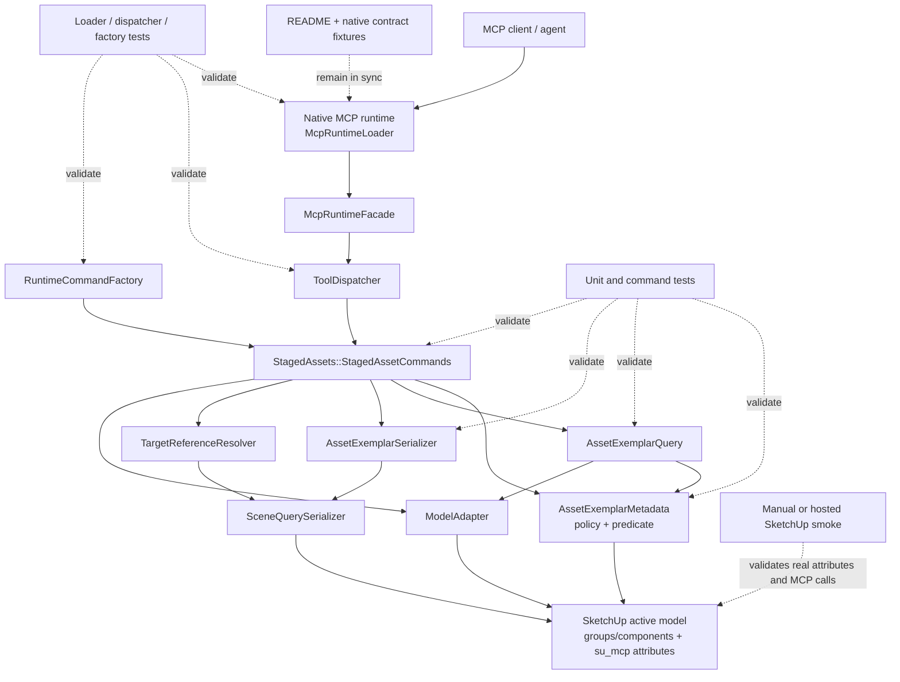

# Technical Plan: SAR-01 Curate And Discover Approved Asset Exemplars
**Task ID**: `SAR-01`
**Title**: `Curate And Discover Approved Asset Exemplars`
**Status**: `implemented`
**Date**: `2026-04-26`

## Source Task

- [Curate And Discover Approved Asset Exemplars](./task.md)

## Problem Summary

The staged-asset reuse capability needs a supported Ruby runtime path for turning an existing in-model SketchUp group or component instance into an approved Asset Exemplar and then discovering approved exemplars through a stable MCP tool. The first slice must establish the exemplar metadata and approval contract, keep exemplars distinct from editable Managed Scene Objects and future Asset Instances, and return JSON-safe curation and discovery evidence without relying on `eval_ruby`, live asset search, or external ingestion.

## Goals

- Add a supported `curate_staged_asset` MCP tool for marking an existing in-model group or component instance as an approved Asset Exemplar.
- Add `list_staged_assets` for approved-exemplar discovery with deterministic, JSON-safe summaries.
- Define and persist the minimum Asset Exemplar metadata contract.
- Use a metadata-backed library convention for SAR-01 without moving, wrapping, reparenting, tagging, or locking source geometry.
- Keep Asset Exemplars separate from Managed Scene Objects in runtime classification and serialization.
- Install a reusable approved-exemplar predicate for later guardrail and instantiation tasks.
- Update public tool registration, dispatcher wiring, tests, docs, and contract fixtures together.

## Non-Goals

- Do not import, download, search, or rank external assets.
- Do not instantiate editable Asset Instances.
- Do not replace tree proxies or other lower-fidelity objects.
- Do not implement full mutation guardrails for protected exemplars.
- Do not create a rich curation UI.
- Do not implement versioning, deprecation, category-library partitioning, or broad asset integrity validation.
- Do not physically reorganize scene geometry through reparenting, wrapping, moving, tag creation, layer assignment, or SketchUp locking in SAR-01.

## Related Context

- [Asset Exemplar Reuse HLD](specifications/hlds/hld-asset-exemplar-reuse.md)
- [PRD: Staged Asset Reuse](specifications/prds/prd-staged-asset-reuse.md)
- [Domain Analysis](specifications/domain-analysis.md)
- [MCP Tool Authoring Standard](specifications/guidelines/mcp-tool-authoring-sketchup.md)
- [Ruby Coding Guidelines](specifications/guidelines/ryby-coding-guidelines.md)
- [SketchUp Extension Development Guidance](specifications/guidelines/sketchup-extension-development-guidance.md)
- [Staged Asset Reuse Task Set](specifications/tasks/staged-asset-reuse/README.md)

## Research Summary

- Existing public tools are registered in [mcp_runtime_loader.rb](src/su_mcp/runtime/native/mcp_runtime_loader.rb), routed through [tool_dispatcher.rb](src/su_mcp/runtime/tool_dispatcher.rb), and composed through [runtime_command_factory.rb](src/su_mcp/runtime/runtime_command_factory.rb). SAR-01 must follow that same public surface path.
- Existing compact target references support `sourceElementId`, `persistentId`, and `entityId` through [target_reference_resolver.rb](src/su_mcp/scene_query/target_reference_resolver.rb). Curation should reuse that resolver rather than add a parallel selector language.
- Existing JSON-safe bounds and identity helpers live in [scene_query_serializer.rb](src/su_mcp/scene_query/scene_query_serializer.rb). Staged-asset serialization should reuse primitive helpers while owning asset-specific policy.
- Existing `SceneQuerySerializer#managed_scene_object?` treats any entity with `sourceElementId` as managed. Because exemplars also need stable identity, implementation must update classification so `assetExemplar: true` entities are not reported as Managed Scene Objects.
- Calibrated public-tool analogs show validation burden is driven by loader schema, dispatcher/factory wiring, command behavior, contract fixtures, README examples, and hosted or manual SketchUp checks, even when the feature scope is bounded.
- Grok 4.20 review agreed with the direction and identified required refinements: make the metadata-backed staging convention explicit, fix managed-object misclassification, add list caps, strengthen no-partial-write tests, and keep locking out of SAR-01.

## Technical Decisions

### Data Model

Asset Exemplar metadata is stored in the existing `su_mcp` attribute dictionary on the curated group or component instance.

Required exemplar metadata:

- `assetExemplar`: `true`
- `assetExemplarSchemaVersion`: `1`
- `assetRole`: `"exemplar"`
- `approvalState`: `"approved"`
- `sourceElementId`: stable exemplar identity
- `assetCategory`: string category
- `assetDisplayName`: string display name
- `assetTags`: array of strings
- `assetAttributes`: JSON-safe object for first-slice filterable attributes
- `stagingMode`: `"metadata_only"`

The approved-exemplar predicate must require at least:

- `assetExemplar == true`
- `assetExemplarSchemaVersion == 1`
- `assetRole == "exemplar"`
- `approvalState == "approved"`
- required identity/category/display fields present

Asset Exemplars must not set `managedSceneObject`, `semanticType`, `status`, `state`, or Managed Scene Object lifecycle fields during SAR-01 curation.

For SAR-01, metadata attaches to the curated entity instance only. Definition-level exemplar metadata is deferred because it can unintentionally classify every instance of a shared component definition as a protected exemplar.

### API and Interface Design

Add `SU_MCP::StagedAssets` support classes:

- `StagedAssetCommands`: public command entrypoints for curation and listing.
- `AssetExemplarMetadata`: metadata normalization, validation, writes, reads, and predicates.
- `AssetExemplarQuery`: approved-first traversal and filtering.
- `AssetExemplarSerializer`: JSON-safe asset summaries.

Add public MCP tools:

- `curate_staged_asset`: mutating metadata curation command.
- `list_staged_assets`: read-only approved-exemplar discovery command.

`curate_staged_asset` canonical request:

```json
{
  "targetReference": { "sourceElementId": "tree-import-001" },
  "metadata": {
    "sourceElementId": "asset-tree-oak-001",
    "category": "tree",
    "displayName": "Oak Tree Exemplar",
    "tags": ["tree", "deciduous"],
    "attributes": {
      "species": "oak",
      "style": "natural",
      "detailLevel": "high"
    }
  },
  "approval": { "state": "approved" },
  "staging": { "mode": "metadata_only" },
  "outputOptions": { "includeBounds": true }
}
```

`list_staged_assets` canonical request:

```json
{
  "filters": {
    "category": "tree",
    "tags": ["deciduous"],
    "attributes": {
      "species": "oak",
      "detailLevel": "high"
    },
    "approvalState": "approved"
  },
  "outputOptions": {
    "limit": 25,
    "includeBounds": true
  }
}
```

Listing defaults:

- `filters.approvalState` defaults to `"approved"`.
- SAR-01 refuses any approval-state override other than `"approved"`.
- `outputOptions.limit` defaults to `25`.
- list limit is capped at `100`.
- `includeBounds` defaults to `true` unless implementation chooses a stricter default and documents it in README and loader descriptions.

### Public Contract Updates

Request deltas:

- Add `curate_staged_asset` with top-level `targetReference`, `metadata`, `approval`, `staging`, and `outputOptions`.
- Add `list_staged_assets` with top-level `filters` and `outputOptions`.
- Use provider-compatible top-level schemas: no root `oneOf`, `anyOf`, `allOf`, `not`, or root enum.

Response deltas:

- `curate_staged_asset` returns `success: true`, `outcome: "curated"`, and one JSON-safe `asset` summary.
- `list_staged_assets` returns `success: true`, `count`, and `assets`.
- Refusals use `ToolResponse.refusal` with `success: true`, `outcome: "refused"`, and `refusal`.

Representative asset summary shape:

```json
{
  "sourceElementId": "asset-tree-oak-001",
  "persistentId": "1234",
  "entityId": "567",
  "type": "group",
  "displayName": "Oak Tree Exemplar",
  "category": "tree",
  "approvalState": "approved",
  "tags": ["tree", "deciduous"],
  "metadata": {
    "assetRole": "exemplar",
    "stagingMode": "metadata_only",
    "schemaVersion": 1,
    "attributes": {
      "species": "oak"
    }
  },
  "bounds": {
    "min": [0.0, 0.0, 0.0],
    "max": [1.0, 1.0, 1.0],
    "center": [0.5, 0.5, 0.5],
    "size": [1.0, 1.0, 1.0]
  }
}
```

Schema and registration updates:

- Add both tools to `McpRuntimeLoader#tool_catalog` with titles, descriptions, annotations, handler keys, classifications, and input schemas.
- Add `curate_staged_asset` and `list_staged_assets` to `ToolDispatcher::TOOL_METHODS`.
- Add staged-asset command target construction to `RuntimeCommandFactory`.
- Confirm `McpRuntimeFacade::TOOL_NAMES` exposes both through dispatcher names.

Docs and examples:

- Update [README.md](README.md) current tool surface.
- Add concise usage examples for curation and listing.
- Document metadata-backed staging and explicit non-support for lock/reparent/tag behavior in SAR-01.
- Update task artifacts and later summary/size evidence when implementation completes.

Contract and integration tests:

- Update [native_runtime_contract_cases.json](test/support/native_runtime_contract_cases.json) with representative curation/listing success and refusal cases if the current native contract convention requires fixture-backed coverage for new public tools.
- Update loader tests for tool inventory, schema, annotations, descriptions, and finite enum/default behavior.

### Error Handling

Use structured refusals for expected user/request failures:

- `missing_target`: curation request lacks a usable target reference.
- `target_not_found`: target reference resolves to no entity.
- `ambiguous_target`: target reference resolves to multiple entities.
- `unsupported_target_type`: target is not a group or component instance.
- `missing_required_metadata`: required curation metadata is absent or blank.
- `unsupported_approval_state`: SAR-01 receives anything except `"approved"`.
- `unsupported_staging_mode`: SAR-01 receives anything except `"metadata_only"`.
- `unsupported_filter`: listing includes an unsupported filter key.
- `invalid_filter`: listing filter has the wrong shape or value type.
- `incomplete_exemplar_metadata`: curation detects an incomplete exemplar record or listing excludes an incomplete record in diagnostic internals.

Curation must validate all required input before writing attributes. Refusal paths must not leave partial approved-exemplar metadata behind.

### State Management

SAR-01 adds metadata state only. It does not mutate geometry placement, parentage, tags, layers, component definitions, or lock state.

State transition:

1. Existing in-model group/component instance has no complete Asset Exemplar metadata.
2. `curate_staged_asset` validates target, metadata, approval, and staging mode.
3. Runtime writes all required exemplar metadata in one coherent operation.
4. Entity becomes an approved Asset Exemplar discoverable by `list_staged_assets`.

### Integration Points

- Native MCP ingress: `McpRuntimeLoader` exposes tool definitions and calls handlers.
- Runtime facade/dispatcher: public tool names route to staged-asset command methods.
- Command factory: staged-asset commands are included in runtime command targets.
- Target resolution: curation uses compact target references.
- Model traversal: listing scans model entities through the shared adapter.
- Serialization: asset summaries reuse bounds/identity primitives but own asset policy.
- Scene query serializer: managed-object classification must exclude `assetExemplar: true` entities.
- Docs/contracts: README, loader tests, and fixture-backed native contracts move with the public surface.

### Configuration

No external configuration is added in SAR-01.

Internal constants:

- `ASSET_EXEMPLAR_SCHEMA_VERSION = 1`
- `SUPPORTED_APPROVAL_STATES = ["approved"]`
- `SUPPORTED_STAGING_MODES = ["metadata_only"]`
- `DEFAULT_LIST_LIMIT = 25`
- `MAX_LIST_LIMIT = 100`

## Architecture Context



## Key Relationships

- `StagedAssetCommands` owns use-case orchestration; it does not become a generic scene-query or semantic metadata bucket.
- `AssetExemplarMetadata` owns the metadata contract and approved-exemplar predicate consumed now by listing and later by SAR-02/SAR-03.
- `AssetExemplarQuery` filters by approved-exemplar predicate before applying category, tags, and attributes.
- `AssetExemplarSerializer` returns selection-friendly JSON-safe summaries and never returns SketchUp objects.
- `SceneQuerySerializer` remains the shared primitive serializer but must stop equating `sourceElementId` with Managed Scene Object when `assetExemplar: true` is present.
- Runtime loader, dispatcher, factory, docs, and contract fixtures are one public-surface change set.

## Acceptance Criteria

- `curate_staged_asset` can mark one existing group or component instance as an approved Asset Exemplar using compact target reference input.
- Successful curation writes the required Asset Exemplar metadata and returns a JSON-safe `asset` summary.
- Successful curation makes the metadata-backed library convention observable through `stagingMode: "metadata_only"` in stored metadata and serialized results.
- Successful curation does not set Managed Scene Object lifecycle/classification metadata.
- Successful curation does not move, wrap, reparent, tag, layer, lock, delete, duplicate, or otherwise geometrically mutate the source entity.
- `list_staged_assets` returns only approved, complete Asset Exemplars by default.
- `list_staged_assets` supports category, tags, and asset-attribute filters for the first slice.
- `list_staged_assets` refuses unsupported approval-state overrides rather than returning unapproved assets.
- Listed assets include selection-friendly identity, display name, category, approval state, tags, metadata summary, and optional bounds.
- Unapproved, incomplete, or malformed exemplar metadata is excluded from normal discovery.
- Existing scene query serialization does not report Asset Exemplars as Managed Scene Objects merely because they have `sourceElementId`.
- Curation refusals cover missing target, not found, ambiguous target, unsupported target type, missing metadata, unsupported approval state, and unsupported staging mode.
- Discovery refusals cover unsupported filters and invalid filter values.
- Refused curation leaves no partial approved-exemplar metadata.
- Public tool catalog, dispatcher routing, command factory composition, native schema tests, contract fixtures, and README docs are updated together.
- Focused automated tests pass for metadata policy, query filtering, serializer shape, command behavior, runtime wiring, and public schema exposure.
- A manual or hosted SketchUp smoke validates representative curate-and-list behavior if practical; otherwise the implementation closeout records the gap.

## Test Strategy

### TDD Approach

Implement tests from the lowest-risk internal policy outward:

1. Write failing metadata policy tests.
2. Write failing serializer/query tests.
3. Write failing command tests for curation and listing.
4. Write failing runtime wiring tests for dispatcher/factory/loader catalog.
5. Write failing public contract/README parity tests where existing test structure supports them.
6. Implement one thin slice at a time until each layer is green.

### Required Test Coverage

- Metadata policy:
  - required metadata validation
  - approved-exemplar predicate
  - unsupported approval/staging values
  - managed-scene metadata exclusion
  - no partial writes on refusal
- Query and serialization:
  - approved-only default listing
  - category/tag/attribute filters
  - incomplete/unapproved exclusion
  - limit default and max cap
  - JSON-safe summary with optional bounds
  - serialized `stagingMode` evidence for the metadata-backed library convention
  - no raw SketchUp objects
  - Asset Exemplars with `sourceElementId` are not serialized as Managed Scene Objects
- Command behavior:
  - curation success
  - curate-to-list round trip
  - missing target
  - target not found
  - ambiguous target
  - unsupported target type
  - unsupported filters and invalid filter shape
- Runtime integration:
  - `ToolDispatcher` routes both new tools
  - `RuntimeCommandFactory` includes staged-asset commands
  - `McpRuntimeLoader` exposes tool names, metadata, annotations, and schemas
  - `McpRuntimeFacade` exposes both dispatcher-backed methods through `TOOL_NAMES`
- Contract/docs:
- representative native contract cases for success and refusal if required
  - representative public result confirms `stagingMode` and approved-only discovery behavior
  - README current tool list and usage examples updated
  - schema remains provider-compatible
- Hosted/manual validation:
- representative group/component curation
- discovery through MCP
- serializer isolation from Managed Scene Object classification
- refusal leaves no partial metadata

## Instrumentation and Operational Signals

- Command results include `outcome` values: `"curated"` for curation and normal success for listing.
- Listing returns `count` equal to the number of returned assets after filtering and limit application.
- Refusal payloads include actionable `details` for unsupported values, missing fields, and filter errors.
- Manual or hosted validation should record the curated entity type, identifier used, list result count, and whether managed-object classification remained false.
- Public result evidence should record `stagingMode: "metadata_only"` so the library convention is inspectable without scene reorganization.

## Implementation Phases

1. Add staged-asset metadata policy and serializer isolation tests, then implement `AssetExemplarMetadata` and the `SceneQuerySerializer` classification fix.
2. Add query and serializer tests, then implement `AssetExemplarQuery` and `AssetExemplarSerializer`.
3. Add command tests, then implement `StagedAssetCommands` for curation/listing with all refusal paths and no-partial-write behavior.
4. Add runtime wiring tests, then update `RuntimeCommandFactory`, `ToolDispatcher`, and `McpRuntimeLoader`.
5. Add contract fixtures and docs, then update README and native contract cases.
6. Run focused tests, broader Ruby test/lint/package checks as practical, and hosted/manual smoke if available.

## Rollout Approach

- Ship both tools together because discovery needs a supported curation path for the first vertical slice.
- Keep SAR-01 metadata-only to minimize host geometry risk and allow rollback by clearing attributes.
- Do not expose unapproved listing modes in SAR-01.
- Do not change mutation tools in SAR-01; SAR-03 consumes the predicate later.
- Document hosted/manual verification gaps explicitly if SketchUp-hosted validation cannot be completed.

## Risks and Controls

- Managed-object misclassification: update `SceneQuerySerializer` so Asset Exemplars with `sourceElementId` are not reported as Managed Scene Objects; add regression tests.
- Public contract drift: update loader schema, dispatcher, factory, native contract fixtures, and README in one change; add catalog/schema tests.
- Incomplete metadata becomes discoverable: query must apply the approved-exemplar predicate before filters; add incomplete/unapproved exclusion tests.
- Refusal leaves partial metadata: validate before writing and test refusal cases for unchanged attributes.
- Metadata-only staging is misunderstood as no organization: document `stagingMode: "metadata_only"` as the SAR-01 library convention and test discovery through that convention.
- Component definition ambiguity: attach SAR-01 metadata to the curated instance only and defer definition-level policy; document the decision for SAR-02.
- Host persistent ID or entity ID differences: use existing target resolver and serialize identifiers as strings for public summaries.
- Hidden performance cost from broad traversal: apply default/max list limits and keep query filtering simple; add limit behavior tests.
- Locking side effects: do not set `entity.locked = true` in SAR-01; SAR-03 owns mutation guardrails.

## Premortem Gate

Status: PASS

### Unresolved Tigers

- None.

### Plan Changes Caused By Premortem

- Tightened acceptance and test coverage so metadata-backed staging must be observable through stored metadata and serialized `stagingMode`, not only implied by implementation.
- Tightened serializer/query tests so Asset Exemplars with `sourceElementId` must be proven not to serialize as Managed Scene Objects.
- Added public result evidence for approved-only discovery and metadata-backed staging to contract/docs expectations.

### Accepted Residual Risks

- Risk: Metadata-only staging may feel less visible than a SketchUp tag, layer, parent group, or locked source object.
  - Class: Paper Tiger
  - Why accepted: The task permits an equivalent library convention, and metadata-backed staging is deterministic, reversible, and sufficient for SAR-01 discovery without host-side scene churn.
  - Required validation: README/tool descriptions and serialized results must make `stagingMode: "metadata_only"` explicit.
- Risk: Component definition-level exemplar policy is deferred.
  - Class: Paper Tiger
  - Why accepted: Instance-level metadata avoids accidentally classifying every shared component instance as protected; SAR-02 can consume the curated instance as source.
  - Required validation: curation and listing tests must include component instances and document that definition-level policy is out of scope.
- Risk: Full mutation protection is not enforced in SAR-01.
  - Class: Elephant
  - Why accepted: SAR-03 explicitly owns guardrail hardening; SAR-01 only installs the reusable predicate and must not overclaim edit blocking.
  - Required validation: implementation must not set `entity.locked = true` or wire mutation refusals beyond predicate availability.

### Carried Validation Items

- Verify curate-to-list round trip through command tests and, if practical, a hosted/manual MCP smoke.
- Verify refusal paths leave no partial approved-exemplar metadata.
- Verify `SceneQuerySerializer` no longer reports `assetExemplar: true` entities as Managed Scene Objects.
- Verify public loader schemas, annotations, README examples, and representative native contract fixtures stay in sync.
- Verify list default and max cap behavior.

### Implementation Guardrails

- Do not move, wrap, reparent, tag, layer, lock, duplicate, or delete curated source geometry in SAR-01.
- Do not expose unapproved or incomplete exemplars through normal `list_staged_assets`.
- Do not set Managed Scene Object metadata during exemplar curation.
- Do not attach SAR-01 exemplar metadata to component definitions by default.
- Do not widen listing filters, approval states, staging modes, or mutation behavior without updating public schema, README, tests, and task scope.

## Dependencies

- Existing Ruby-native MCP runtime and tool catalog.
- Existing target-reference resolver.
- Existing model adapter recursive traversal.
- Existing scene-query bounds and identity serialization helpers.
- Existing `ToolResponse` envelope.
- PRD/HLD/domain staged-asset definitions.
- Follow-on SAR-02 for instantiation and SAR-03 for mutation guardrails.

## Quality Checks

- [x] All required inputs validated
- [x] Problem statement documented
- [x] Goals and non-goals documented
- [x] Research summary documented
- [x] Technical decisions included
- [x] Architecture context included
- [x] Acceptance criteria included
- [x] Test requirements specified
- [x] Instrumentation and operational signals defined when needed
- [x] Risks and dependencies documented
- [x] Rollout approach documented when needed
- [x] Small reversible phases defined
- [x] Premortem completed with falsifiable failure paths and mitigations
- [x] Planning-stage size estimate considered before premortem finalization

## Implementation Closeout

- Implemented `curate_staged_asset` and `list_staged_assets` as the SAR-01 public MCP surface.
- Kept staging metadata-only: no move, wrap, reparent, tag, layer, lock, duplicate, delete, or source-geometry mutation.
- Stored structured `assetAttributes` as JSON text in the SketchUp attribute dictionary and decoded it on read so live SketchUp persistence supports discovery and filtering.
- Validated through focused staged-asset tests, full Ruby tests, lint, package verification, Grok-4.20 review, and post-fix live MCP smoke in `TestGround.skp`.
- Recorded final evidence in [summary.md](./summary.md) and calibrated actual size in [size.md](./size.md).
