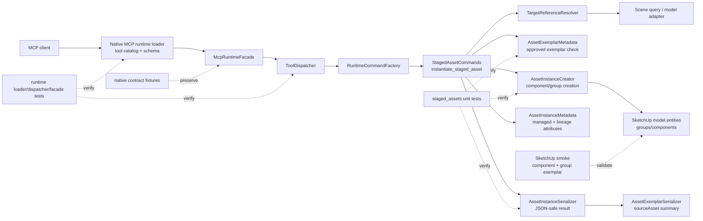

# Technical Plan: SAR-02 Instantiate Editable Asset Instances
**Task ID**: `SAR-02`
**Title**: `Instantiate Editable Asset Instances`
**Status**: `implemented`
**Date**: `2026-05-15`

## Source Task

- [Instantiate Editable Asset Instances](./task.md)

## Problem Summary

Approved Asset Exemplars can be curated and listed, but there is no controlled runtime path that creates a separate editable Asset Instance from an approved source. SAR-02 adds `instantiate_staged_asset` so agents can create model-root Asset Instances from approved component-instance or group exemplars without mutating the source library object.

The slice must support grouped in-model project asset sets such as the low-poly vegetation library, while keeping metadata category-specific and avoiding hard-coded group names, hierarchy assumptions, or vegetation-only schemas.

## Goals

- Expose `instantiate_staged_asset` as a first-class native MCP tool.
- Instantiate approved component-instance exemplars and group exemplars into separate editable model-root Asset Instances.
- Require caller-supplied `metadata.sourceElementId` for the created instance.
- Preserve source lineage with a lean `sourceAssetElementId`.
- Mark created instances as Managed Scene Objects with `semanticType: "asset_instance"`.
- Support required position-only placement and optional scalar direct scale variation.
- Return JSON-safe instance, source asset, lineage, placement, and optional bounds evidence.
- Keep runtime schema, dispatcher, facade, contract fixtures, docs, and examples synchronized.

## Non-Goals

- Curating or approving new Asset Exemplars.
- Replacing proxies or lower-fidelity objects.
- Parent/collection placement, reparenting, tagging, or lifecycle status assignment.
- Target-height fitting or automatic resizing from vegetation metadata.
- Definition-level exemplar classification.
- Broad asset recommendation, ranking, or external asset search.
- A universal `assetAttributes` schema across asset categories.

## Related Context

- [PRD: Staged Asset Reuse](specifications/prds/prd-staged-asset-reuse.md)
- [HLD: Asset Exemplar Reuse](specifications/hlds/hld-asset-exemplar-reuse.md)
- [Low-Poly Garden Vegetation Inventory](specifications/research/asset-reuse/low_poly_garden_vegetation_inventory.md)
- [MCP Tool Authoring Standard for SketchUp Modeling](specifications/guidelines/mcp-tool-authoring-sketchup.md)
- [Ruby Coding Guidelines](specifications/guidelines/ryby-coding-guidelines.md)
- [SketchUp Extension Development Guidance](specifications/guidelines/sketchup-extension-development-guidance.md)
- [SAR-01 task summary](specifications/tasks/staged-asset-reuse/SAR-01-list-and-filter-staged-asset-exemplars/summary.md)

## Research Summary

- SAR-01 is the direct baseline: it added `curate_staged_asset`, `list_staged_assets`, approved-exemplar metadata, JSON-backed `assetAttributes`, runtime wiring, docs, and live smoke evidence.
- SAR-01 intentionally keeps exemplar metadata instance-scoped and metadata-only. SAR-02 should not introduce definition-level exemplar policy.
- Live SketchUp did not reliably preserve structured Ruby hash values in attributes, so structured staged-asset metadata must remain JSON-backed when written to SketchUp attributes.
- Existing public tools use camelCase public field names, provider-compatible root object schemas, shared `targetReference`, and `outputOptions`.
- The MCP authoring guide requires the subtle usage rules to appear in field descriptions, not only in docs.
- Official SketchUp API research confirms `Entities#add_instance` can instantiate a component definition into a target entities collection, `Group#copy` creates group copies, `Model#entities` is the model-root collection, and model mutations should be operation-wrapped.
- The low-poly vegetation inventory is representative evidence that `assetAttributes` must carry category-specific selection data. Vegetation fields are examples, not a universal schema.

## Technical Decisions

### Data Model

- Created instances write `managedSceneObject: true`.
- Created instances write `semanticType: "asset_instance"`.
- Created instances write `assetRole: "instance"`.
- Created instances write `assetInstanceSchemaVersion: 1`.
- Created instances write their own `sourceElementId` from `metadata.sourceElementId`.
- Created instances write lean lineage as `sourceAssetElementId`.
- Created instances must not retain `assetExemplar: true`, `approvalState`, or `stagingMode`.
- `assetAttributes` remains a JSON-safe category-specific bag on the source asset evidence. SAR-02 does not promote vegetation fields into universal instance metadata.

### API and Interface Design

`instantiate_staged_asset` accepts these top-level sections:

- `targetReference`: required compact reference to the approved Asset Exemplar source.
- `placement`: required placement section.
- `metadata`: required created-instance identity section.
- `outputOptions`: optional response verbosity section.

Minimal request:

```json
{
  "targetReference": { "sourceElementId": "asset-low-poly-hedge-001" },
  "placement": {
    "position": [1.0, 2.0, 0.0]
  },
  "metadata": {
    "sourceElementId": "placed-asset-001"
  },
  "outputOptions": {
    "includeBounds": true
  }
}
```

Optional scalar scale:

```json
{
  "placement": {
    "position": [1.0, 2.0, 0.0],
    "scale": 1.1
  }
}
```

`placement.position` is a model-root insertion/origin intent in public meters. `placement.scale` is a positive scalar for direct uniform variation only; it is not target-height fitting.

### Public Contract Updates

- Add `instantiate_staged_asset` beside `curate_staged_asset` and `list_staged_assets`.
- Add native schema helpers for instance metadata and placement.
- Require `targetReference`, `placement`, and `metadata`.
- Keep root schema provider-compatible: root `type: "object"`, root `properties`, optional root `required`, no root composition.
- Add thorough field descriptions for:
  - `targetReference`
  - `placement`
  - `placement.position`
  - `placement.scale`
  - `metadata`
  - `metadata.sourceElementId`
  - `outputOptions.includeBounds`
- Update `test/support/public_mcp_contract_sweep.json`.
- Add success and targeted refusal cases to `test/support/native_runtime_contract_cases.json`, including `missing_required_metadata` and `unapproved_exemplar`.
- Update [docs/mcp-tool-reference.md](docs/mcp-tool-reference.md) with usage boundaries and examples.

Success response shape:

```json
{
  "success": true,
  "outcome": "instantiated",
  "instance": {
    "sourceElementId": "placed-asset-001",
    "persistentId": "9001",
    "entityId": "901",
    "type": "component_instance",
    "semanticType": "asset_instance",
    "assetRole": "instance"
  },
  "sourceAsset": {
    "sourceElementId": "asset-low-poly-hedge-001"
  },
  "lineage": {
    "sourceAssetElementId": "asset-low-poly-hedge-001"
  },
  "placement": {
    "position": [1.0, 2.0, 0.0],
    "scale": 1.0
  }
}
```

### Error Handling

Structured refusals use the shared `ToolResponse.refusal` envelope with `success: true`, `outcome: "refused"`, and `refusal`.

Required refusal families:

- `missing_target`
- `target_not_found`
- `ambiguous_target`
- `unsupported_target_type`
- `unapproved_exemplar`
- `invalid_placement`
- `invalid_scale`
- `missing_required_metadata`

Validation must happen before scene mutation where possible. Creation, placement, metadata writes, and serialization must be wrapped in one SketchUp operation and abort on exceptions where supported.

### State Management

- Asset Exemplars remain source library objects.
- Asset Instances become editable Managed Scene Objects.
- Model changes occur in one operation named for staged asset instantiation.
- The implementation creates at `model.entities`, not `active_entities`.
- Reparenting and tagging remain separate workflows.

### Integration Points

- `src/su_mcp/runtime/native/native_tool_catalog.rb`
- `src/su_mcp/runtime/tool_dispatcher.rb`
- `src/su_mcp/runtime/native/mcp_runtime_facade.rb`
- `src/su_mcp/runtime/runtime_command_factory.rb`
- `src/su_mcp/staged_assets/staged_asset_commands.rb`
- `src/su_mcp/staged_assets/asset_exemplar_metadata.rb`
- `src/su_mcp/staged_assets/asset_exemplar_serializer.rb`
- `src/su_mcp/scene_query/target_reference_resolver.rb`
- `docs/mcp-tool-reference.md`
- `test/support/public_mcp_contract_sweep.json`
- `test/support/native_runtime_contract_cases.json`

### Configuration

No runtime configuration is added. Defaults:

- `outputOptions.includeBounds` defaults to `true`.
- `placement.scale` defaults to `1.0` when omitted.

## Architecture Context



## Key Relationships

- `NativeToolCatalog` owns schema, descriptions, annotations, and tool registration. It must not perform staged asset behavior.
- `McpRuntimeFacade`, `ToolDispatcher`, and `RuntimeCommandFactory` remain thin routing seams.
- `StagedAssetCommands` owns orchestration, validation, and operation bracketing.
- New staged-assets collaborators own instance metadata, host creation, and result serialization.
- `TargetReferenceResolver` remains the selector seam.
- `AssetExemplarMetadata` remains the source-exemplar policy seam.
- `AssetInstanceCreator` isolates SketchUp API-heavy creation behavior.

## Acceptance Criteria

- `instantiate_staged_asset` is exposed as a first-class native MCP tool with `readOnlyHint: false`, `destructiveHint: false`, provider-compatible root object schema, and required `targetReference`, `placement`, and `metadata` sections.
- The public schema uses existing camelCase vocabulary and includes thorough field descriptions for `targetReference`, `placement`, `placement.position`, `placement.scale`, `metadata`, `metadata.sourceElementId`, and `outputOptions.includeBounds`.
- `metadata.sourceElementId` is documented and validated as the created Asset Instance identity, not the source exemplar identity.
- A valid request with an approved component-instance exemplar, `placement.position`, and caller-supplied `metadata.sourceElementId` creates a separate editable Asset Instance at model root and returns `outcome: "instantiated"`.
- A valid request with an approved group exemplar creates a separate editable Asset Instance at model root without erasing, moving, renaming, or reclassifying the source exemplar.
- Created Asset Instances are Managed Scene Objects with `managedSceneObject: true`, `semanticType: "asset_instance"`, `assetRole: "instance"`, `assetInstanceSchemaVersion: 1`, their own `sourceElementId`, and lean lineage via `sourceAssetElementId`.
- Created Asset Instances are not discoverable as Asset Exemplars.
- `placement.position` is interpreted as model-root insertion/origin intent in public meters, and the response reports applied placement evidence in public meters.
- Optional `placement.scale` accepts only a positive scalar number and applies direct uniform scale variation.
- Missing or blank `metadata.sourceElementId` refuses before scene mutation.
- SAR-02 does not accept `metadata.status`, parent/collection placement, tag assignment, replacement targets, or target-height fitting fields.
- Category-specific exemplar `assetAttributes` remain JSON-safe and are surfaced through the source asset summary without becoming a universal instance schema.
- The source asset summary carries enough JSON-safe source evidence for downstream replacement planning, including source identity, category/display fields, and category-specific attributes when present, while persisted instance lineage remains lean.
- The success response is JSON-safe and includes `success`, `outcome`, `instance`, `sourceAsset`, `lineage`, `placement`, and requested `bounds`.
- Representative refusals use the shared structured refusal envelope and avoid partial expected instance state.
- Mutating behavior is wrapped in one coherent SketchUp operation and aborts on creation or metadata write failure where supported.
- Runtime routing is updated through native catalog, dispatcher, facade, command factory target exposure, public contract sweep, and native contract fixtures.
- `docs/mcp-tool-reference.md` documents boundaries, required fields, optional scalar scale, model-root placement, and a minimal valid example.
- Focused unit/runtime tests and a normal SketchUp smoke cover component exemplar instantiation, group exemplar instantiation, source exemplar stability, instance metadata cleanup, and scalar scale behavior.

## Test Strategy

### TDD Approach

Work from narrow unit tests outward:

1. Metadata and serializer tests for the intended instance contract.
2. Creator and command tests for component/group behavior and refusals.
3. Runtime schema/routing/contract tests after command behavior stabilizes.
4. Docs and smoke validation last.

### Required Test Coverage

- Metadata tests for managed instance attributes, lean lineage, and exemplar-field cleanup.
- Serializer tests for `instance`, `sourceAsset`, `lineage`, `placement`, and optional `bounds`.
- Command tests for component exemplar success, group exemplar success, source non-mutation, non-exemplar instance classification, scalar scale, missing identity, invalid placement, invalid scale, unapproved exemplar, unsupported target, ambiguous target, and operation abort.
- Native loader tests for tool registration, annotations, schema required fields, field descriptions, and canonical tool ordering.
- Dispatcher tests for `instantiate_staged_asset`.
- Runtime facade tests for command factory dispatch.
- Runtime command factory tests proving the staged asset command target responds to the new method.
- Native contract fixtures for one success plus targeted `missing_required_metadata` and `unapproved_exemplar` refusals.
- Public contract sweep update.
- Docs example update.
- Normal SketchUp smoke for one component exemplar and one group exemplar.

## Instrumentation and Operational Signals

- Success responses include created instance identity, source lineage, placement evidence, and optional bounds.
- Refusal responses include structured codes and actionable details.
- Smoke validation should record that source exemplar identity, parent context, and exemplar classification remain stable after instantiation.
- Smoke validation should record that copied group instances are rewritten as Asset Instances and are not returned by exemplar listing.

## Implementation Phases

1. Metadata and result shape
   - Add staged-assets-owned Asset Instance metadata and serializer helpers.
   - Write failing tests for lean lineage, non-exemplar classification, managed-object identity, scalar placement evidence, and optional bounds.
2. Creation behavior
   - Add `AssetInstanceCreator` for component-definition instantiation and group-copy/root-placement.
   - Extend `StagedAssetCommands` with `instantiate_staged_asset` orchestration, validation, operation bracketing, and structured refusals.
3. Runtime public surface
   - Add native catalog schema/tool entry with thorough descriptions.
   - Add dispatcher, facade, factory, public sweep, and native contract fixture coverage.
4. Docs and smoke validation
   - Update `docs/mcp-tool-reference.md`.
   - Run focused unit/runtime tests and normal SketchUp smoke for component and group exemplars.

## Rollout Approach

- Additive public tool; no existing tool behavior changes are intended.
- Keep `curate_staged_asset` and `list_staged_assets` response shapes stable.
- If group root placement needs internal adjustment after smoke, change the internal creator while preserving the public contract.
- Do not start SAR-04 replacement work until SAR-02 lineage and instance/exemplar separation pass.

## Risks and Controls

- Public contract drift: implement schema, dispatcher, facade, docs, public sweep, and native contract fixtures in one phase.
- Source identity confusion: validate that `metadata.sourceElementId` is always the new instance identity and `targetReference` is always the approved source selector.
- Exemplar metadata leakage: assert created instances are not approved exemplars and do not retain exemplar approval/staging fields.
- Partial scene state: validate before mutation and operation-wrap creation/metadata writes.
- Wrong placement semantics: assert response placement evidence and document model-root insertion/origin semantics in schema descriptions and docs.
- Unit conversion mistakes: assert public meter request/response values.
- Group copy host behavior: cover with normal SketchUp smoke and adjust only the internal creator if needed.
- Definition sharing confusion: assert component instance metadata is written to the created wrapper, not the shared definition or source wrapper.
- Over-generalized `assetAttributes`: keep category-specific metadata open and only surface it through `sourceAsset`.
- Downstream lineage thinness: assert `sourceAssetElementId` plus `sourceAsset` response evidence is enough for SAR-04 planning before replacement work starts.

## Dependencies

- `SAR-01`
- SketchUp Ruby API host behavior for groups, components, transformations, and operations
- Existing target resolution, staged asset metadata, managed-object metadata, runtime dispatch, native contract, and docs infrastructure

## Premortem Gate

Status: PASS

### Unresolved Tigers

- None.

### Plan Changes Caused By Premortem

- Strengthened native contract coverage from a single representative refusal to targeted `missing_required_metadata` and `unapproved_exemplar` refusals, because identity and approval are the two easiest public contract paths to drift.
- Added an explicit schema and validation guardrail that `metadata.sourceElementId` belongs to the created Asset Instance, while `targetReference` selects the source Asset Exemplar.
- Added smoke validation that copied group instances are rewritten as Asset Instances and are not rediscovered as exemplars.
- Added a downstream lineage check before SAR-04 starts so lean persisted lineage does not silently become insufficient for replacement workflows.

### Accepted Residual Risks

- Risk: Group copy/root placement semantics differ between local fakes and live SketchUp.
  - Class: Paper Tiger
  - Why accepted: The public contract can remain stable while the staged-assets-owned creator absorbs host-specific mechanics.
  - Required validation: Normal SketchUp smoke for group exemplar instantiation, root placement, source stability, and copied metadata rewrite.
- Risk: Lean lineage may need additional read-time source evidence for SAR-04.
  - Class: Paper Tiger
  - Why accepted: SAR-02 persists the stable source key and returns `sourceAsset` evidence; broader replacement planning is explicitly downstream.
  - Required validation: Confirm SAR-04 can resolve replacement candidates from `sourceAssetElementId` plus existing staged-asset listing before adding replacement behavior.

### Carried Validation Items

- Hosted smoke must cover both approved component-instance exemplars and approved group exemplars.
- Tests must prove created instances are not listed as Asset Exemplars after instantiation.
- Tests must prove component metadata is written to the created wrapper, not the shared definition or source wrapper.
- Contract tests must check field descriptions for the identity, placement, scale, and bounds semantics, not only schema shape.
- Operation failure tests must prove expected partial instance state is avoided when creation or metadata writing fails.

### Implementation Guardrails

- Do not add target-height fitting, parent placement, tagging, replacement, vector scale, generated identity, or workflow status to SAR-02.
- Do not hard-code the common vegetation group name, hierarchy depth, SketchUp tag/layer, or vegetation-specific `assetAttributes`.
- Do not persist broad source snapshots on every instance; persist `sourceAssetElementId` and return source evidence through `sourceAsset`.
- Do not write exemplar approval/staging fields onto created Asset Instances.
- Create in `model.entities`, not `active_entities`.

## Quality Checks

- [x] All required inputs validated
- [x] Problem statement documented
- [x] Goals and non-goals documented
- [x] Research summary documented
- [x] Technical decisions included
- [x] Architecture context included
- [x] Acceptance criteria included
- [x] Test requirements specified
- [x] Instrumentation and operational signals defined when needed
- [x] Risks and dependencies documented
- [x] Rollout approach documented when needed
- [x] Small reversible phases defined
- [x] Premortem completed with falsifiable failure paths and mitigations
- [x] Planning-stage size estimate considered before premortem finalization
