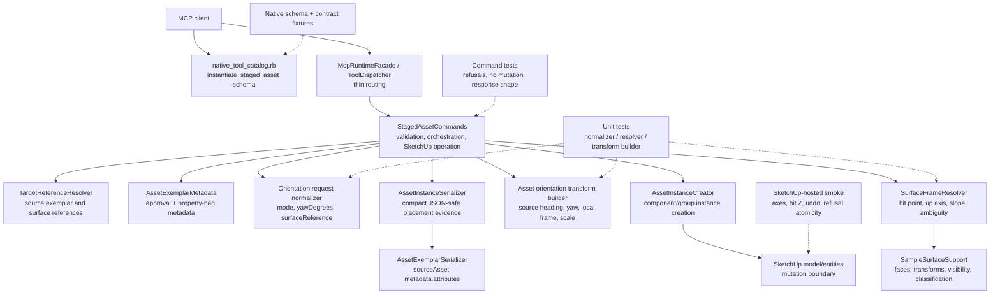

# Technical Plan: SAR-05 Orientation-Aware Asset Placement
**Task ID**: `SAR-05`
**Title**: `Orientation-Aware Asset Placement`
**Status**: `implemented`
**Date**: `2026-05-16`

## Source Task

- [Orientation-Aware Asset Placement](./task.md)

## Problem Summary

`SAR-02` can instantiate approved staged assets, but placement is still position/scale-first and does not expose controlled heading or surface-aligned orientation. `SAR-05` extends the existing `instantiate_staged_asset` tool with request-driven orientation for one rigid Asset Instance while preserving backward compatibility, source heading, SketchUp operation safety, and compact JSON-safe response evidence.

The contract must not depend on curated asset metadata policy. Staged asset metadata is an abstract property bag: SAR-05 may preserve orientation-like hints for discoverability, but explicit `placement.orientation` input is the only behavior driver and metadata cannot veto placement.

## Goals

- Add optional `placement.orientation` input to `instantiate_staged_asset`.
- Support `upright` and `surface_aligned` modes only.
- Support optional finite `yawDegrees`, applied around model up for `upright` and derived local up for `surface_aligned`.
- Preserve source heading when `yawDegrees` is omitted.
- Resolve `surface_aligned` frames from an explicit `surfaceReference` and request `placement.position` XY.
- Refuse invalid orientation requests and unresolved or ambiguous surface frames before mutation.
- Return compact applied placement/orientation evidence.
- Keep schema, dispatcher/facade routing, contract fixtures, docs, examples, and tests synchronized.

## Non-Goals

- Scatter painting, density, random yaw/pitch, jitter, brush behavior, or area coverage.
- Tiled groundcover placement or region coverage. That belongs to `SAR-06`.
- Arbitrary transform matrices, Euler triples, or a second transform tool contract.
- Surface offset, slope vetoes, metadata-gated placement, or category-derived auto-tilting.
- Replacement/proxy consumption of orientation behavior.
- Reworking the curated garden vegetation inventory or normalizing all metadata.

## Related Context

- [PRD: Staged Asset Reuse](specifications/prds/prd-staged-asset-reuse.md)
- [HLD: Asset Exemplar Reuse](specifications/hlds/hld-asset-exemplar-reuse.md)
- [Domain Analysis](specifications/domain-analysis.md)
- [MCP Tool Authoring Standard for SketchUp Modeling](specifications/guidelines/mcp-tool-authoring-sketchup.md)
- [Ruby Coding Guidelines](specifications/guidelines/ryby-coding-guidelines.md)
- [SketchUp Extension Development Guidance](specifications/guidelines/sketchup-extension-development-guidance.md)
- [Low-Poly Garden Vegetation Inventory](specifications/research/asset-reuse/low_poly_garden_vegetation_inventory.md)
- [SAR-02 task summary](specifications/tasks/staged-asset-reuse/SAR-02-instantiate-editable-asset-instances/summary.md)
- [STI-03 task summary](specifications/tasks/scene-targeting-and-interrogation/STI-03-extend-sample-surface-z-with-profile-and-section-sampling/summary.md)

## Research Summary

- `SAR-02` is the implementation baseline for `instantiate_staged_asset`: it established approved-exemplar validation, source transform preservation, model-root creation, scalar scale, lineage metadata, operation wrapping, public schema, docs, contract fixtures, and hosted smoke evidence.
- `SAR-02` also proved that component/group creation is host-sensitive. Group copying required a production-safe reconstruction path after unsafe live-copy behavior crashed SketchUp.
- `STI-02` and `STI-03` established explicit target surface sampling, transformed/nested target handling, hit/miss/ambiguous evidence, and the need for hosted validation beyond mocks.
- `SEM-15` is the closest anchor-resolution analog: resolve placement anchors before mutation to preserve refusal atomicity.
- The MCP tool authoring guidance favors extending the existing tool, preserving shallow top-level sections, nesting transform intent under `placement`, reusing shared reference shapes, and documenting conditional field rules in schema descriptions and examples.
- Existing staged asset input shape is `targetReference`, `placement`, `metadata`, and `outputOptions`; success output already includes `instance`, `sourceAsset`, `lineage`, `placement`, and optional `bounds`.
- `TargetReferenceResolver` already supports direct references by `sourceElementId`, `persistentId`, and `entityId`.
- `SampleSurfaceSupport` can collect transformed group/component/face entries and is the right internal support seam for deriving surface frames, but the public `sample_surface_z` response should not become the mutation-time API because it lacks local frame evidence.

## Technical Decisions

### Data Model

- Do not add a normalized staged-asset orientation policy model in SAR-05.
- Preserve orientation-like staged asset metadata only through existing JSON-safe `assetAttributes` exposure under `sourceAsset.metadata.attributes`.
- Represent applied orientation evidence under `placement.orientation` in the success response.
- For `surface_aligned`, response `placement.position` is the applied position, including hit-derived Z. Request Z is not authoritative.

### API and Interface Design

`instantiate_staged_asset` keeps its existing top-level request sections:

- `targetReference`: existing approved staged asset selector.
- `placement`: existing placement section, now with optional `orientation`.
- `metadata`: existing created-instance metadata.
- `outputOptions`: existing response options.

Orientation request shape:

```json
{
  "placement": {
    "position": [1.0, 2.0, 0.0],
    "scale": 1.0,
    "orientation": {
      "mode": "surface_aligned",
      "yawDegrees": 30,
      "surfaceReference": {
        "sourceElementId": "terrain-surface-001"
      }
    }
  }
}
```

Rules:

- `placement.orientation` is optional.
- If `placement.orientation` is present, `mode` is required.
- `mode` accepts only `upright` and `surface_aligned`.
- `yawDegrees` is optional and must be finite when present.
- `surfaceReference` is required only for `surface_aligned`.
- There is no separate `surfacePoint`; sample XY comes from `placement.position`.
- There is no top-level `orientation`, no top-level `hosting`, and no `surfaceOffset` in SAR-05.
- `sourceHeadingPreserved` is `true` only when `yawDegrees` is omitted; explicit yaw makes it `false`.
- Resolved surface references that cannot produce a supported sampleable surface must refuse clearly; the implementation must not fall back to broad scene probing.

Compact success evidence:

```json
{
  "placement": {
    "position": [1.0, 2.0, 0.42],
    "scale": 1.0,
    "orientation": {
      "mode": "surface_aligned",
      "yawDegrees": 30,
      "sourceHeadingPreserved": false,
      "surface": {
        "hitPoint": [1.0, 2.0, 0.42],
        "slopeDegrees": 11.5
      }
    }
  }
}
```

### Public Contract Updates

- Update `src/su_mcp/runtime/native/native_tool_catalog.rb` for `placement.orientation`, `mode`, `yawDegrees`, and conditional `surfaceReference` descriptions.
- Keep dispatcher/facade routing shape-agnostic unless existing argument forwarding requires a test adjustment.
- Update `test/support/public_mcp_contract_sweep.json` and `test/support/native_runtime_contract_cases.json`.
- Add success fixtures for backward-compatible no-orientation, upright yaw, and surface-aligned placement.
- Add refusal fixtures for unknown mode, invalid yaw, missing surface reference, unresolved surface reference, surface miss, and ambiguous surface frame.
- Update [docs/mcp-tool-reference.md](docs/mcp-tool-reference.md) with compact examples and explicit metadata non-veto behavior.

### Error Handling

- Use the existing structured refusal envelope with `success: true`, `outcome: "refused"`, and `refusal.details`.
- Refusals must include the refused field, requested value, allowed values or bounds when applicable, and a human-readable reason.
- Refuse before mutation for invalid request shape, missing/invalid `surfaceReference`, unsupported or unsampleable targets, surface miss, conflicting local frames, and degenerate transform frames.
- Define same-hit clustering, normal equivalence, and degenerate-frame tolerances in the surface-frame resolver and cover them with focused tests.
- Do not add metadata-policy or slope-limit refusal families in SAR-05.

### State Management

- Source Asset Exemplars remain unchanged.
- Created Asset Instances keep existing SAR-02 managed-scene metadata and lineage behavior.
- Model mutation remains in one SketchUp operation.
- Preflight validation must complete before `AssetInstanceCreator` creates entities.
- Operation abort or preflight refusal must leave no created instance or partial wrapper state.

### Integration Points

- `src/su_mcp/runtime/native/native_tool_catalog.rb`
- `src/su_mcp/runtime/tool_dispatcher.rb`
- `src/su_mcp/runtime/native/mcp_runtime_facade.rb`
- `src/su_mcp/runtime/runtime_command_factory.rb`
- `src/su_mcp/staged_assets/staged_asset_commands.rb`
- `src/su_mcp/staged_assets/asset_instance_creator.rb`
- `src/su_mcp/staged_assets/asset_instance_serializer.rb`
- `src/su_mcp/staged_assets/asset_exemplar_serializer.rb`
- New staged-assets-owned request normalizer, transform builder, and surface-frame resolver helpers.
- `src/su_mcp/scene_query/target_reference_resolver.rb`
- `src/su_mcp/scene_query/sample_surface_support.rb`
- `docs/mcp-tool-reference.md`
- `test/support/public_mcp_contract_sweep.json`
- `test/support/native_runtime_contract_cases.json`

### Configuration

No runtime configuration is added. Defaults:

- Omitted `placement.orientation` preserves existing SAR-02 placement behavior.
- Omitted `yawDegrees` preserves source heading.
- Omitted `placement.scale` continues to default as in SAR-02.

## Architecture Context



## Key Relationships

- Public tool ownership stays in `native_tool_catalog.rb`; runtime routing should remain thin.
- `StagedAssetCommands` owns validation order, refusal envelopes, operation bracketing, and orchestration.
- The orientation normalizer owns public field parsing and finite option validation.
- The surface-frame resolver is staged-assets-owned, but reuses direct reference and surface support internals instead of calling the public `sample_surface_z` tool.
- The transform builder owns matrix/axis composition and must be testable without live SketchUp mutation where practical.
- `AssetInstanceCreator` remains the SketchUp mutation boundary.
- Serializers return compact applied evidence and never expose raw SketchUp objects.

## Acceptance Criteria

- Existing `instantiate_staged_asset` requests with `targetReference`, `placement.position`, optional `placement.scale`, `metadata`, and `outputOptions` continue to succeed without requiring `placement.orientation`.
- `placement.orientation.mode` accepts only `upright` and `surface_aligned`; malformed objects, unknown modes, non-finite `yawDegrees`, or misplaced orientation fields produce structured refusals before mutation.
- `upright` mode applies explicit `yawDegrees` around model vertical and preserves the source asset heading when `yawDegrees` is omitted.
- `surface_aligned` requires `placement.orientation.surfaceReference` using the existing direct-reference vocabulary and samples the referenced surface at request `placement.position` XY.
- For successful `surface_aligned` placement, request Z is not authoritative: the created instance and response `placement.position` use the resolved surface hit Z.
- Surface alignment derives one local up/frame from the referenced surface, normalizes face direction for upward placement evidence, applies optional yaw around local up, and preserves source heading when yaw is omitted.
- Surface-aligned placement refuses before mutation when the surface reference is missing, invalid, unsupported, unresolved, unsampleable, misses the request XY, resolves to conflicting same-hit frames, or produces a degenerate transform frame.
- Successful responses include compact JSON-safe applied evidence under `placement.orientation`, including `mode`, yaw behavior, `sourceHeadingPreserved`, and for `surface_aligned` a compact `surface.hitPoint` plus `surface.slopeDegrees`.
- Refusal responses include the refused field, requested value, allowed values or bounds where applicable, and a human-readable reason without exposing raw SketchUp objects.
- Staged asset metadata remains JSON-safe property-bag data exposed through existing metadata serialization; metadata hints do not allow, forbid, slope-limit, or otherwise veto explicit SAR-05 placement.
- SketchUp mutations remain wrapped in a single undoable operation, and all validation refusals leave no created instance or partial wrapper state.
- Native tool schema, dispatcher/facade tests, contract fixtures, docs, and examples all describe the same `placement.orientation` request and compact response shape.
- Hosted validation proves at least one component/group exemplar preserves source heading, one upright-yaw placement has expected axes, one sloped surface-aligned placement has expected hit Z/local up, and at least one surface refusal leaves the model unchanged.

## Test Strategy

### TDD Approach

Start with contract and request-normalization failures so the public shape is pinned before mutation work. Then build the transform helper and surface-frame resolver independently, integrate them into command preflight, and only then alter `AssetInstanceCreator`/serializer behavior. Hosted SketchUp validation is a closeout gate, not a substitute for unit and runtime coverage.

Likely first failing target: native contract/schema fixture for `placement.orientation.mode`, followed by a focused orientation request normalizer test.

### Required Test Coverage

| Provisional queue order | AC / requirement | Behavior or risk | Candidate implementation slice | Likely owner | Unit/core coverage | Integration/runtime coverage | Contract/schema coverage | Error/refusal coverage | Hosted/manual validation | Likely fixtures/helpers | Integration points | Suggested focused command | Suggested broader command | Blocker or explicit gap |
|---|---|---|---|---|---|---|---|---|---|---|---|---|---|---|
| 1 | Public shape | `placement.orientation` fields are accepted and documented consistently | Native schema + contract fixtures | `native_tool_catalog.rb` | n/a | dispatcher/facade passthrough if needed | public sweep and native runtime cases | unknown mode, invalid yaw, missing surfaceReference | n/a | contract JSON fixtures | native catalog, dispatcher | `bundle exec ruby -Itest test/runtime/public_mcp_contract_posture_test.rb` | `bundle exec ruby -Itest test/runtime/*_test.rb` | none |
| 2 | Request validation | Strict modes, finite yaw, conditional surfaceReference | Orientation request normalizer | staged-assets helper | mode/yaw/conditional field tests | command refusal tests | fixture expected refusal shape | malformed object, misplaced field, invalid mode/yaw | n/a | request payload helpers | command preflight | `bundle exec ruby -Itest test/staged_assets/*orientation*_test.rb` | `bundle exec ruby -Itest test/staged_assets/*_test.rb` | exact file name created during implementation |
| 3 | Backward compatibility | Existing no-orientation request keeps SAR-02 behavior | Command path | `StagedAssetCommands` | normalizer default tests | existing instantiation tests extended | backward-compatible success fixture | n/a | smoke one existing exemplar | SAR-02 test helpers | creator, serializer | `bundle exec ruby -Itest test/staged_assets/staged_asset_commands_test.rb` | `bundle exec ruby -Itest test/staged_assets/*_test.rb` | hosted exemplar availability |
| 4 | Upright yaw | Yaw around model Z and source heading preservation | Transform builder + creator integration | transform helper, `AssetInstanceCreator` | axis/origin/scale matrix tests | command response evidence | upright-yaw success fixture | invalid finite bounds if applicable | inspect wrapper axes | numeric vector fixtures | creator transform input | `bundle exec ruby -Itest test/staged_assets/asset_instance_creator_test.rb` | `bundle exec ruby -Itest test/staged_assets/*_test.rb` | fake SketchUp transform fidelity may be limited |
| 5 | Omitted yaw | Source heading is not reset | Transform builder + creator integration | transform helper | no-yaw source-axis tests | command success evidence | no-yaw fixture if useful | n/a | inspect curated exemplar heading | source transform fixture | creator, serializer | `bundle exec ruby -Itest test/staged_assets/asset_instance_creator_test.rb` | `bundle exec ruby -Itest test/staged_assets/*_test.rb` | hosted proof required |
| 6 | Surface frame success | Direct surface reference yields hit point, up axis, slope, and local frame | SurfaceFrameResolver | new staged-assets helper | face/group/component, transformed target, upward normal, slope tests | command surface success | surface-aligned success fixture | n/a | sloped-face placement | scene-query support fixtures | TargetReferenceResolver, SampleSurfaceSupport | `bundle exec ruby -Itest test/staged_assets/*surface_frame*_test.rb` | `bundle exec ruby -Itest test/scene_query/*_test.rb test/staged_assets/*_test.rb` | tolerance choices finalized in implementation |
| 7 | Surface failures | Miss, ambiguity, unsupported target, degenerate frame refuse before mutation | SurfaceFrameResolver + command preflight | resolver, commands | miss/ambiguous/degenerate tests | no mutation command tests | refusal fixtures | missing/invalid/unresolved/miss/ambiguous/degenerate | no created instance on refusal | ambiguous face fixture | operation boundary | `bundle exec ruby -Itest test/staged_assets/staged_asset_commands_test.rb` | `bundle exec ruby -Itest test/staged_assets/*_test.rb` | hosted proof required for at least one refusal |
| 8 | Compact response | Applied position/orientation evidence only, JSON-safe | Serializer integration | `AssetInstanceSerializer` | serializer evidence tests | command success payload tests | response-shape fixtures | n/a | compare hosted response to entity transform | serializer fixtures | source serializer | `bundle exec ruby -Itest test/staged_assets/*serializer*_test.rb` | `bundle exec ruby -Itest test/runtime/*_test.rb test/staged_assets/*_test.rb` | none |
| 9 | Metadata non-veto | Metadata hints are preserved but never enforce behavior | Metadata/serializer path | `AssetExemplarSerializer`, metadata tests | property-bag preservation tests | command ignores metadata veto-like hints | docs/fixtures state non-veto behavior | no metadata-policy refusal | n/a | assetAttributes fixture | sourceAsset metadata | `bundle exec ruby -Itest test/staged_assets/asset_exemplar_metadata_test.rb test/staged_assets/*serializer*_test.rb` | `bundle exec ruby -Itest test/staged_assets/*_test.rb` | none |
| 10 | Operation safety | Refusals and exceptions leave no partial instance; undo works | Command operation integration | `StagedAssetCommands`, creator | n/a | operation abort/no partial tests | refusal fixture consistency | all preflight refusal families | undo and refusal atomicity smoke | model entity count helper | SketchUp operation boundary | `bundle exec ruby -Itest test/staged_assets/staged_asset_commands_test.rb` | `bundle exec ruby -Itest test/staged_assets/*_test.rb` | hosted proof required |
| 11 | Docs parity | Users see same fields and examples as schema | Docs/examples | docs + contract | n/a | contract posture docs checks | public contract posture | n/a | n/a | docs snippets | catalog/docs | `bundle exec ruby -Itest test/runtime/public_mcp_contract_posture_test.rb` | `bundle exec ruby -Itest test/runtime/*_test.rb` | none |

## Instrumentation and Operational Signals

- Success response evidence must be sufficient to compare applied `placement.position`, `placement.orientation.mode`, `yawDegrees`, `sourceHeadingPreserved`, `surface.hitPoint`, and `surface.slopeDegrees`.
- Hosted smoke should record transform axes or equivalent vector evidence, not only visual placement or bounds.
- Refusal smoke should record model entity counts before and after the refused call.
- Surface-frame tests should record which target shapes are supported in the first implementation and prove unsupported resolved entities refuse instead of silently degrading.

## Implementation Phases

1. Public contract skeleton: update native schema descriptions, public contract fixtures, and docs examples for `placement.orientation`.
2. Request normalization: add staged-assets-owned orientation request parsing and refusal detail generation, with strict mode/yaw/surfaceReference validation.
3. Transform builder: test and implement source-heading preservation, upright yaw, local-up yaw, origin replacement, and scalar scale interaction.
4. Surface-frame resolver: derive hit point, upward normal/local frame, slope evidence, miss/ambiguity refusals, and direct-reference handling using scene-query support.
5. Command integration: run preflight orientation/surface validation before operation mutation, feed resolved transform/evidence to creation, and preserve no-partial-state behavior.
6. Serializer integration: return compact applied evidence and preserve metadata property-bag discoverability without policy enforcement.
7. Contract/docs parity and hosted validation: complete runtime fixtures, docs, examples, and SketchUp-hosted smoke for axes, hit Z, undo, and refusal atomicity.

## Rollout Approach

- Ship as an additive change to `instantiate_staged_asset`.
- Existing requests remain valid and do not need migration.
- Do not add new public tool names.
- Do not change staged asset metadata requirements.
- Treat hosted smoke as a release gate for this task because visually plausible orientation can still be mathematically wrong.

## Risks and Controls

- Transform order risk: isolate matrix construction in a helper, assert axes/origin/scale numerically, and verify in hosted SketchUp.
- Surface frame risk: reuse existing target/surface support, refuse ambiguous same-hit frames, name frame tolerances, orient normals upward, and test transformed/nested targets.
- Atomicity risk: complete request and surface preflight before mutation, keep one operation, and test no partial instance on refusals.
- Contract drift risk: update schema, dispatcher/facade tests, contract fixtures, docs, and examples in one phase.
- Metadata risk: add tests where veto-like metadata is present but explicit orientation still controls behavior.
- Host API risk: preserve SAR-02 creator path and require hosted smoke for component/group behavior.

## Premortem Gate

Status: PASS

### Unresolved Tigers

- None.

### Plan Changes Caused By Premortem

- Added an explicit rule that unsupported resolved surface references must refuse rather than falling back to broad scene probing.
- Added an explicit `sourceHeadingPreserved` response rule for omitted versus explicit yaw.
- Added a requirement to name and test same-hit clustering, normal equivalence, and degenerate-frame tolerances in the surface-frame resolver.
- Strengthened operational signals so hosted validation must record transform-axis evidence and surface target support/refusal evidence, not only visual placement or bounds.

### Accepted Residual Risks

- Risk: First implementation may support fewer resolved surface entity shapes than the direct-reference vocabulary can identify.
  - Class: Paper Tiger
  - Why accepted: The public vocabulary remains stable and unsupported resolved targets can refuse before mutation.
  - Required validation: Resolver tests and docs must identify supported target behavior and unsupported-target refusal.
- Risk: Live SketchUp transform behavior may still diverge from local transform-helper tests.
  - Class: Paper Tiger
  - Why accepted: SAR-02 already provides the creator seam, and the plan requires hosted axis evidence before closeout.
  - Required validation: Hosted smoke must inspect source heading, upright yaw axes, local-up surface alignment, undo, and refusal atomicity.

### Carried Validation Items

- Native schema, contract fixture, and docs parity for `placement.orientation`.
- Unit tests for orientation normalization, transform composition, and surface-frame tolerances.
- Command tests for no-mutation refusals and compact response evidence.
- Hosted SketchUp smoke for component/group axes, sloped hit Z, undo, and refusal entity counts.

### Implementation Guardrails

- Do not add metadata gating, slope vetoes, `surfaceOffset`, replacement consumption, top-level `orientation`, or top-level `hosting` in SAR-05.
- Do not call the public `sample_surface_z` tool as the placement API.
- Do not choose max Z or any arbitrary face when surface frames conflict.
- Do not treat bounds-only evidence as sufficient for orientation correctness.
- Do not mutate the model until orientation request and surface-frame preflight have passed.

## Dependencies

- `SAR-01` and `SAR-02` implemented staged asset discovery and instantiation.
- Existing direct-reference behavior from `TargetReferenceResolver`.
- Existing transformed surface collection/classification behavior from `SampleSurfaceSupport`.
- Native runtime contract test infrastructure and docs posture tests.
- Live SketchUp or hosted smoke environment for final validation.

## Quality Checks

- [x] All required inputs validated
- [x] Problem statement documented
- [x] Goals and non-goals documented
- [x] Research summary documented
- [x] Technical decisions included
- [x] Architecture context included
- [x] Acceptance criteria included
- [x] Test requirements specified as a provisional coverage-matrix seed
- [x] Instrumentation and operational signals defined when needed
- [x] Risks and dependencies documented
- [x] Rollout approach documented when needed
- [x] Small reversible phases defined
- [x] Premortem completed with falsifiable failure paths and mitigations
- [x] Planning-stage size estimate considered before premortem finalization
